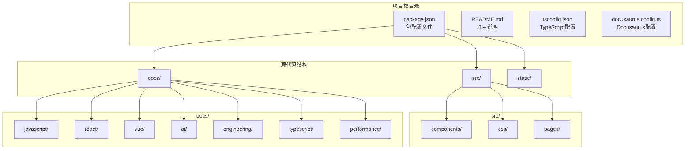
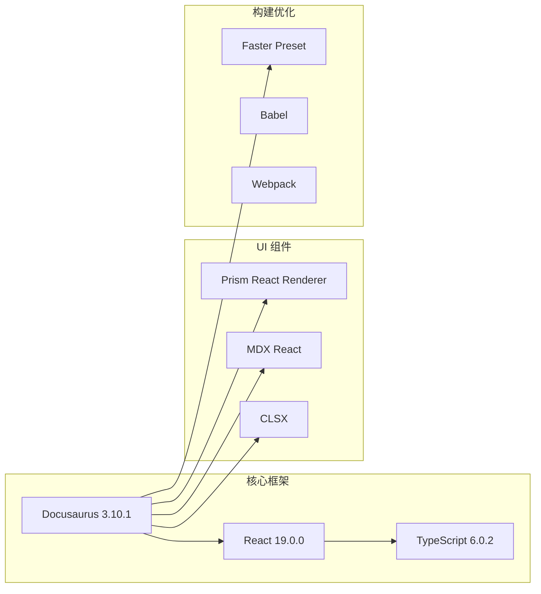

# 快速开始

<cite>
**本文引用的文件**
- [package.json](file://package.json)
- [README.md](file://README.md)
- [tsconfig.json](file://tsconfig.json)
- [docusaurus.config.ts](file://docusaurus.config.ts)
- [src/pages/index.module.css](file://src/pages/index.module.css)
- [src/css/custom.css](file://src/css/custom.css)
- [src/components/HomepageFeatures/styles.module.css](file://src/components/HomepageFeatures/styles.module.css)
- [docs/intro.md](file://docs/intro.md)
- [docs/javascript/index.md](file://docs/javascript/index.md)
- [docs/react/index.md](file://docs/react/index.md)
- [docs/vue/index.md](file://docs/vue/index.md)
</cite>

## 目录
1. [简介](#简介)
2. [项目结构](#项目结构)
3. [环境要求](#环境要求)
4. [安装步骤](#安装步骤)
5. [本地开发](#本地开发)
6. [常用命令](#常用命令)
7. [访问本地站点](#访问本地站点)
8. [项目特色](#项目特色)
9. [故障排除](#故障排除)
10. [结语](#结语)

## 简介

前端面试知识库是一个基于 Docusaurus 3.10.1 构建的现代化静态网站，专门用于整理和展示前端开发面试相关的知识体系。该项目采用 React 19.0.0 和 TypeScript 6.0.2 技术栈，提供了完整的前端面试知识库，涵盖 JavaScript 基础、TypeScript、React、Vue、AI 应用开发和工程化等多个技术领域。

## 项目结构



**图表来源**
- [package.json:1-50](file://package.json#L1-L50)
- [docusaurus.config.ts:1-8](file://docusaurus.config.ts#L1-L8)

**章节来源**
- [package.json:1-50](file://package.json#L1-L50)
- [docusaurus.config.ts:1-8](file://docusaurus.config.ts#L1-L8)

## 环境要求

### Node.js 版本要求

项目对 Node.js 版本有明确要求：

- **最低版本**: Node.js 20.0 或更高版本
- **推荐版本**: 最新 LTS 版本

### 包管理器选择

项目支持两种包管理器：

- **npm** (Node Package Manager)
- **yarn** (推荐)

### 浏览器兼容性

项目针对现代浏览器进行了优化，支持以下浏览器版本：

- Chrome 最近 3 个版本
- Firefox 最近 3 个版本
- Safari 最近 5 个版本
- 不支持 IE 浏览器

**章节来源**
- [package.json:46-48](file://package.json#L46-L48)
- [package.json:34-45](file://package.json#L34-L45)

## 安装步骤

### 步骤 1：克隆项目

```bash
# 使用 HTTPS 克隆
git clone https://github.com/your-username/knowledge-base.git

# 或使用 SSH 克隆
git clone git@github.com:your-username/knowledge-base.git
```

### 步骤 2：进入项目目录

```bash
cd knowledge-base
```

### 步骤 3：安装依赖

```bash
# 使用 yarn 安装（推荐）
yarn install

# 或使用 npm 安装
npm install
```

### 步骤 4：验证安装

```bash
# 检查 Node.js 版本
node --version

# 检查 yarn 版本
yarn --version

# 验证依赖安装
yarn list @docusaurus/core
```

**章节来源**
- [README.md:5-15](file://README.md#L5-L15)
- [package.json:17-33](file://package.json#L17-L33)

## 本地开发

### 启动开发服务器

```bash
# 启动本地开发服务器
yarn start
```

**预期输出**：
- 启动成功后会显示类似 `Ready!` 的提示
- 自动打开浏览器窗口到 `http://localhost:3000`
- 支持热重载，修改文件后自动刷新

### 开发服务器特性

- **热重载**: 修改文件后自动重新加载
- **实时预览**: 实时查看更改效果
- **错误提示**: 显示详细的构建错误信息
- **多页面支持**: 支持多个文档页面的开发

### 常见开发场景

```bash
# 添加新的文档
touch docs/new-topic.md

# 创建新的页面组件
mkdir src/components/NewComponent
touch src/components/NewComponent/index.tsx
```

**章节来源**
- [README.md:11-17](file://README.md#L11-L17)

## 常用命令

### 开发相关命令

| 命令 | 作用 | 详细说明 |
|------|------|----------|
| `yarn start` | 启动开发服务器 | 启动本地开发环境，支持热重载 |
| `yarn typecheck` | TypeScript 类型检查 | 运行 TypeScript 类型检查 |
| `yarn swizzle` | 组件定制 | 自定义 Docusaurus 内置组件 |

### 构建相关命令

| 命令 | 作用 | 详细说明 |
|------|------|----------|
| `yarn build` | 生成静态内容 | 生成生产环境的静态文件到 `build` 目录 |
| `yarn serve` | 本地预览构建结果 | 在本地预览构建后的网站 |
| `yarn clear` | 清理缓存 | 清理 Docusaurus 缓存和构建产物 |

### 部署相关命令

| 命令 | 作用 | 详细说明 |
|------|------|----------|
| `yarn deploy` | 部署到 GitHub Pages | 使用 SSH 方式部署 |
| `USE_SSH=true yarn deploy` | SSH 部署 | 使用 SSH 密钥进行安全部署 |
| `GIT_USER=your-username yarn deploy` | 用户名部署 | 指定 GitHub 用户名进行部署 |

### 开发辅助命令

| 命令 | 作用 | 详细说明 |
|------|------|----------|
| `yarn write-translations` | 生成翻译文件 | 生成多语言支持所需的翻译文件 |
| `yarn write-heading-ids` | 生成标题 ID | 为文档标题生成唯一标识符 |

**章节来源**
- [package.json:5-16](file://package.json#L5-L16)
- [README.md:19-42](file://README.md#L19-L42)

## 访问本地站点

### 默认访问地址

开发服务器启动后，默认访问地址为：

```
http://localhost:3000
```

### 浏览器兼容性

项目在以下浏览器中经过测试：

- **Chrome**: 最新稳定版
- **Firefox**: 最新稳定版  
- **Safari**: 最新稳定版
- **Edge**: 最新稳定版

### 端口冲突处理

如果 3000 端口被占用：

```bash
# 指定其他端口
yarn start --port 3001

# 或者使用环境变量
PORT=3001 yarn start
```

### 网络访问

如需在局域网内访问：

```bash
# 绑定到所有网络接口
yarn start --host 0.0.0.0
```

**章节来源**
- [README.md:17](file://README.md#L17)

## 项目特色

### 技术栈亮点



**图表来源**
- [package.json:17-26](file://package.json#L17-L26)
- [package.json:27-33](file://package.json#L27-L33)

### 内容组织结构

项目内容按技术领域进行分类：

| 技术领域 | 文档数量 | 主要内容 |
|----------|----------|----------|
| JavaScript 基础 | 6 篇 | 类型系统、闭包、异步、原型链、ES6+ 特性 |
| TypeScript | 4 篇 | 泛型、工具类型、类型体操 |
| React | 6 篇 | Hooks、Fiber 架构、状态管理、性能优化 |
| Vue | 12 篇 | 响应式系统、组合式 API、虚拟 DOM |
| AI 应用开发 | 6 篇 | LLM 集成、RAG、流式响应、AI SDK |
| 工程化 | 3 篇 | 构建工具、CI/CD |
| 性能优化 | 2 篇 | 加载优化、渲染优化 |

### 设计特色

项目采用了现代化的设计理念：

- **渐变色彩方案**: 使用蓝色、紫色渐变主题
- **毛玻璃效果**: 导航栏和卡片采用模糊背景
- **动画过渡**: 页面元素具有流畅的动画效果
- **响应式设计**: 完美适配各种屏幕尺寸
- **暗色模式**: 支持深色主题切换

**章节来源**
- [docs/intro.md:8-35](file://docs/intro.md#L8-L35)
- [src/css/custom.css:6-33](file://src/css/custom.css#L6-L33)

## 故障排除

### 常见安装问题

**问题 1: Node.js 版本过低**

```bash
# 检查当前版本
node --version

# 解决方案: 升级到 Node.js 20.0+
# 从 https://nodejs.org 下载最新 LTS 版本
```

**问题 2: Yarn 安装失败**

```bash
# 使用 npm 作为替代
npm install

# 或者升级 yarn
npm install -g yarn
```

**问题 3: 依赖安装缓慢**

```bash
# 使用淘宝镜像源
yarn config set registry https://registry.npmmirror.com/

# 或者使用 npm
npm config set registry https://registry.npmmirror.com/
```

### 开发服务器问题

**问题 4: 端口被占用**

```bash
# 查找占用端口的进程
lsof -i :3000

# 杀死进程或更换端口
yarn start --port 3001
```

**问题 5: 热重载不生效**

```bash
# 清理缓存
yarn clear

# 重新安装依赖
rm -rf node_modules
yarn install
```

**问题 6: 页面空白或样式丢失**

```bash
# 检查 TypeScript 编译
yarn typecheck

# 检查 CSS 文件
yarn build
```

### 构建问题

**问题 7: 构建失败**

```bash
# 检查 Node.js 版本
node --version

# 清理构建缓存
yarn clear

# 重新构建
yarn build
```

**问题 8: 部署失败**

```bash
# 检查 Git 配置
git config --global user.name "Your Name"
git config --global user.email "your.email@example.com"

# 检查 SSH 密钥
ssh-add -l
```

## 结语

前端面试知识库项目为前端开发者提供了一个完整的学习平台，涵盖了从基础到高级的各类面试知识点。通过本指南，您应该能够快速搭建开发环境并开始使用该项目。

### 下一步建议

1. **探索内容**: 浏览不同技术领域的文档
2. **贡献内容**: 添加新的面试题目或改进现有内容
3. **自定义主题**: 根据个人喜好调整样式和布局
4. **扩展功能**: 添加新的技术领域或功能模块

### 贡献指南

欢迎通过以下方式参与项目：

- 提交新的面试题目
- 改进现有文档的质量
- 修复发现的问题
- 提供改进建议

祝您学习愉快，面试顺利！