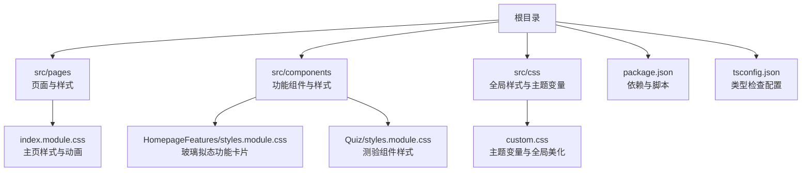
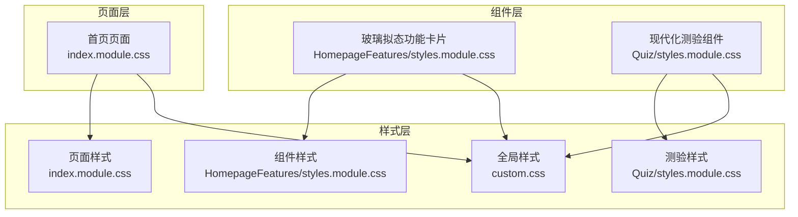
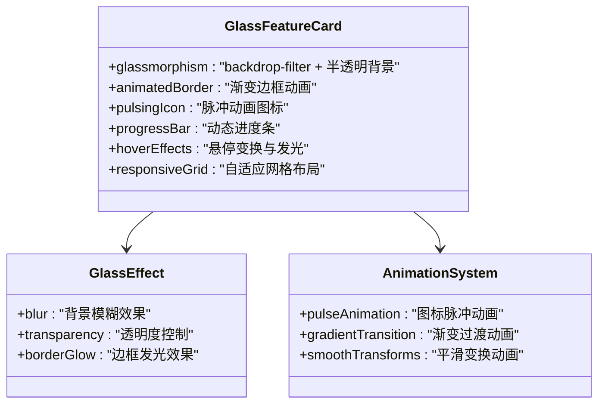
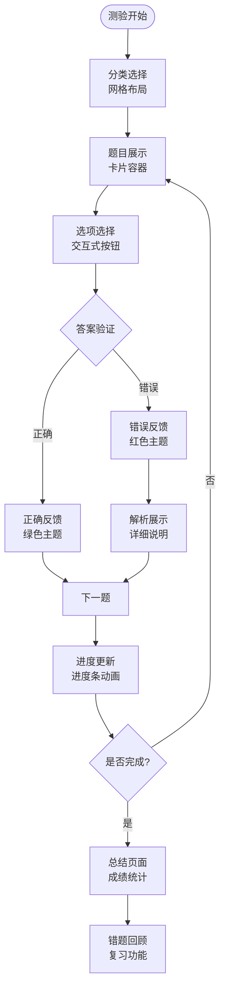
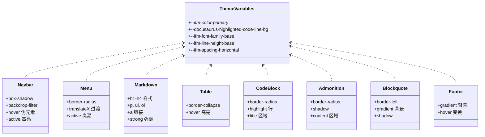
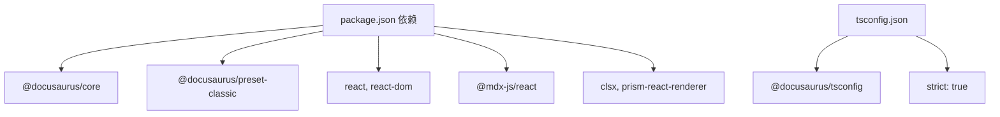

# 组件系统设计

<cite>
**本文引用的文件**
- [README.md](file://README.md)
- [package.json](file://package.json)
- [tsconfig.json](file://tsconfig.json)
- [src/components/HomepageFeatures/styles.module.css](file://src/components/HomepageFeatures/styles.module.css)
- [src/components/Quiz/styles.module.css](file://src/components/Quiz/styles.module.css)
- [src/pages/index.module.css](file://src/pages/index.module.css)
- [src/css/custom.css](file://src/css/custom.css)
</cite>

## 更新摘要
**变更内容**
- 更新了 HomepageFeatures 组件的玻璃拟态设计，包括模糊背景、渐变边框和发光效果
- 重构了 Quiz 组件的视觉系统，采用现代化的卡片设计和交互反馈
- 新增了脉冲动画图标系统和复杂的阴影层次结构
- 增强了响应式设计和暗色主题适配

## 目录
1. [引言](#引言)
2. [项目结构](#项目结构)
3. [核心组件](#核心组件)
4. [架构总览](#架构总览)
5. [组件详细分析](#组件详细分析)
6. [依赖关系分析](#依赖关系分析)
7. [性能考量](#性能考量)
8. [故障排查指南](#故障排查指南)
9. [结论](#结论)
10. [附录](#附录)

## 引言
本文件面向组件系统设计与实现，聚焦于 Docusaurus 3 静态站点中的组件架构与样式系统。文档从整体架构出发，系统阐述主页功能组件、样式组织与 CSS Modules 使用方法、组件设计模式、状态管理与事件处理等核心概念，并结合仓库中已有的样式文件与配置，给出可操作的实践建议与最佳实践，帮助开发者构建高质量、可维护的组件体系。

**更新** 本次更新重点反映了 HomepageFeatures 和 Quiz 组件的玻璃拟态美学重新设计，包括动画渐变边框、模糊效果、发光动画和增强的交互元素。

## 项目结构
该项目基于 Docusaurus 3，采用模块化的页面与组件组织方式：
- 页面级样式：通过 pages 下的 index.module.css 实现页面级布局与动画控制
- 组件级样式：通过 components 下的 styles.module.css 实现组件级样式隔离与复用
- 全局样式：通过 css/custom.css 定义主题变量与全局美化
- 页面内容：通过 MDX 页面承载文档内容

**图表来源**
- [src/pages/index.module.css:1-438](file://src/pages/index.module.css#L1-L438)
- [src/components/HomepageFeatures/styles.module.css:1-260](file://src/components/HomepageFeatures/styles.module.css#L1-L260)
- [src/components/Quiz/styles.module.css:1-1202](file://src/components/Quiz/styles.module.css#L1-L1202)
- [src/css/custom.css:1-644](file://src/css/custom.css#L1-L644)
- [package.json:1-50](file://package.json#L1-L50)
- [tsconfig.json:1-12](file://tsconfig.json#L1-L12)

章节来源
- [README.md:1-42](file://README.md#L1-L42)
- [package.json:1-50](file://package.json#L1-L50)
- [tsconfig.json:1-12](file://tsconfig.json#L1-L12)

## 核心组件
本节聚焦于仓库中已实现的组件与样式，重点说明组件结构设计、样式组织与交互行为。

### 主页功能组件（HomepageFeatures）
**更新** 组件现已采用玻璃拟态设计，具备以下特性：
- **玻璃拟态效果**：使用 `backdrop-filter: blur(10px)` 创建模糊背景，配合半透明背景色
- **动画渐变边框**：通过 `::before` 伪元素实现悬停时渐显的渐变边框效果
- **发光动画**：图标支持脉冲动画，卡片悬停时产生发光阴影
- **智能进度条**：动态进度条展示学习进度，支持平滑过渡动画
- **响应式网格**：自适应网格布局，在移动端自动调整列数

### 测验组件（Quiz）
**更新** 测验组件经过全面重新设计，包含：
- **现代化卡片设计**：统一的卡片风格，支持多种状态（选择、正确、错误）
- **交互式选项**：带有字母标识的选项按钮，支持键盘导航和焦点可见性
- **进度追踪**：带闪烁效果的进度条，实时显示答题进度
- **成绩可视化**：圆形成绩展示，根据得分显示不同颜色等级
- **错题回顾**：完整的错题记录和分析功能

章节来源
- [src/components/HomepageFeatures/styles.module.css:1-260](file://src/components/HomepageFeatures/styles.module.css#L1-L260)
- [src/components/Quiz/styles.module.css:1-1202](file://src/components/Quiz/styles.module.css#L1-L1202)
- [src/pages/index.module.css:1-438](file://src/pages/index.module.css#L1-L438)
- [src/css/custom.css:1-644](file://src/css/custom.css#L1-L644)

## 架构总览
Docusaurus 3 以页面为中心，结合 MDX 与 React 组件实现内容与样式的解耦。CSS Modules 在组件层提供样式隔离，全局样式负责主题与通用美化，页面样式承担布局与动画职责。

**图表来源**
- [src/pages/index.module.css:1-438](file://src/pages/index.module.css#L1-L438)
- [src/components/HomepageFeatures/styles.module.css:1-260](file://src/components/HomepageFeatures/styles.module.css#L1-L260)
- [src/components/Quiz/styles.module.css:1-1202](file://src/components/Quiz/styles.module.css#L1-L1202)
- [src/css/custom.css:1-644](file://src/css/custom.css#L1-L644)

## 组件详细分析

### 组件 A：玻璃拟态功能卡片（HomepageFeatures）
该组件实现了现代玻璃拟态设计语言，通过 CSS 高级特性创造深度感和层次感。

**图表来源**
- [src/components/HomepageFeatures/styles.module.css:48-135](file://src/components/HomepageFeatures/styles.module.css#L48-L135)

章节来源
- [src/components/HomepageFeatures/styles.module.css:1-260](file://src/components/HomepageFeatures/styles.module.css#L1-L260)

### 组件 B：现代化测验组件（Quiz）
测验组件提供了完整的学习评估体验，包含题目展示、答案选择、结果分析和历史记录等功能。

**图表来源**
- [src/components/Quiz/styles.module.css:206-500](file://src/components/Quiz/styles.module.css#L206-L500)

章节来源
- [src/components/Quiz/styles.module.css:1-1202](file://src/components/Quiz/styles.module.css#L1-L1202)

### 组件 C：全局样式与主题变量（custom.css）
全局样式集中定义主题变量与通用美化规则，支持明/暗两套配色，覆盖导航、菜单、文档内容、表格、代码块、提示框、引用块等组件的统一风格，并提供响应式与打印优化。

**图表来源**
- [src/css/custom.css:1-644](file://src/css/custom.css#L1-L644)

章节来源
- [src/css/custom.css:1-644](file://src/css/custom.css#L1-L644)

## 依赖关系分析
- 依赖管理：项目使用 Docusaurus 3 作为核心框架，React 19 作为运行时，TypeScript 提供类型检查
- 样式工具链：CSS Modules 通过构建工具自动处理类名作用域；全局样式与页面样式分别承担主题与布局职责
- 开发体验：tsconfig.json 继承 Docusaurus 的 TS 配置，启用严格模式，提升开发质量

**图表来源**
- [package.json:1-50](file://package.json#L1-L50)
- [tsconfig.json:1-12](file://tsconfig.json#L1-L12)

章节来源
- [package.json:1-50](file://package.json#L1-L50)
- [tsconfig.json:1-12](file://tsconfig.json#L1-L12)

## 性能考量
- **样式隔离与按需加载**：CSS Modules 将样式与组件绑定，减少全局冲突，有利于 Tree Shaking 与按需加载
- **动画性能优化**：合理使用 transform 与 opacity，避免频繁触发布局与重绘；为关键路径动画设置延迟序列，避免首屏阻塞
- **玻璃拟态性能**：backdrop-filter 在现代浏览器中性能良好，但在低端设备上可能需要降级处理
- **响应式策略**：在窄屏下降低动画强度与阴影复杂度，确保交互流畅
- **主题切换**：通过 CSS 变量与属性选择器实现主题切换，避免重复计算与样式回流

## 故障排查指南
- **样式未生效**
  - 检查 CSS Modules 类名拼写与导入路径是否正确
  - 确认组件是否正确引入样式模块
- **玻璃拟态效果异常**
  - 检查 backdrop-filter 浏览器兼容性
  - 确认背景元素是否有足够的对比度
- **动画异常**
  - 检查 keyframes 是否定义完整，动画时长与缓动函数是否合理
  - 确认元素层级与 z-index 是否影响动画显示
- **暗色主题不生效**
  - 检查 data-theme 属性是否正确设置
  - 确认自定义变量与选择器优先级是否覆盖默认样式
- **构建错误**
  - 查看 TypeScript 报错信息，确认类型定义与 strict 模式下的约束
  - 清理 node_modules 并重新安装依赖，确保版本兼容

## 结论
本项目以 Docusaurus 3 为基础，采用 CSS Modules 实现组件级样式隔离，结合全局样式与页面样式完成主题与布局的统一管理。通过合理的组件结构、清晰的样式组织与动画策略，能够有效提升页面的可维护性与用户体验。玻璃拟态设计的引入为组件带来了现代化的视觉体验，同时保持了良好的性能和可访问性。建议在后续迭代中持续完善组件抽象、补充测试与文档，并保持样式命名规范与主题变量的一致性。

## 附录
- **设计原则**
  - 单一职责：每个组件专注于单一功能，样式与逻辑分离
  - 可复用性：通过 CSS 变量与通用类名提升组件复用率
  - 可访问性：确保对比度与交互反馈满足无障碍要求
  - 现代美学：采用玻璃拟态、渐变边框等现代设计趋势
- **最佳实践**
  - 样式组织：组件样式使用 CSS Modules，页面样式负责布局与动画，全局样式负责主题与通用美化
  - 命名规范：采用语义化类名，如 featureCard、quizContainer、glassEffect，避免过深嵌套
  - 动画策略：关键路径动画优先，非关键路径动画降级，移动端适度简化
  - 主题适配：通过 CSS 变量与属性选择器实现明/暗主题无缝切换
  - 性能优化：合理使用 backdrop-filter，考虑低端设备降级方案