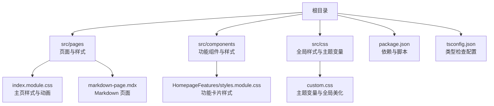
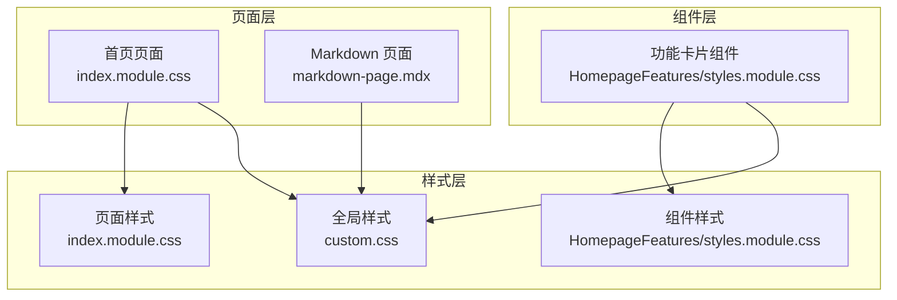
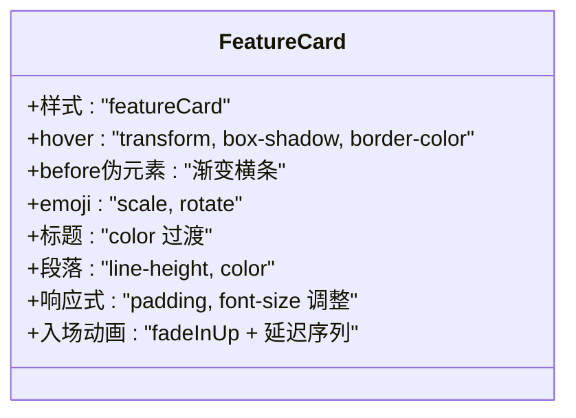
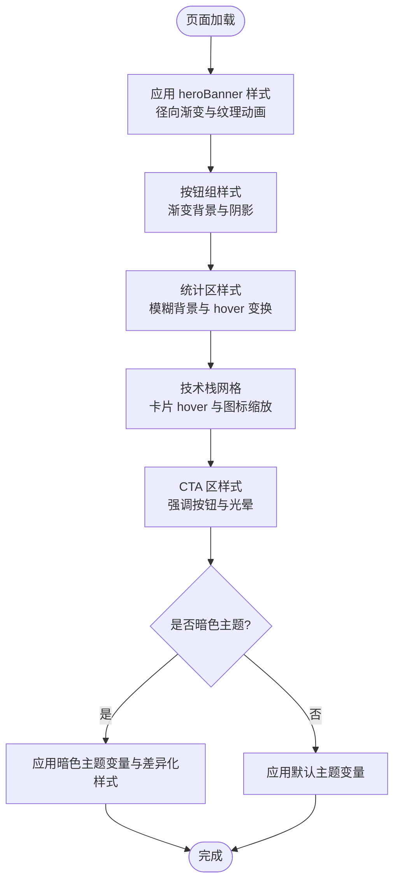
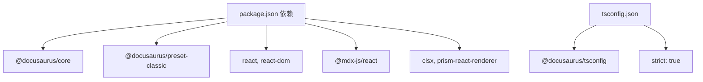

# 组件系统设计

<cite>
**本文引用的文件**
- [README.md](file://README.md)
- [package.json](file://package.json)
- [tsconfig.json](file://tsconfig.json)
- [src/components/HomepageFeatures/styles.module.css](file://src/components/HomepageFeatures/styles.module.css)
- [src/pages/index.module.css](file://src/pages/index.module.css)
- [src/css/custom.css](file://src/css/custom.css)
- [src/pages/markdown-page.mdx](file://src/pages/markdown-page.mdx)
</cite>

## 目录
1. [引言](#引言)
2. [项目结构](#项目结构)
3. [核心组件](#核心组件)
4. [架构总览](#架构总览)
5. [组件详细分析](#组件详细分析)
6. [依赖关系分析](#依赖关系分析)
7. [性能考量](#性能考量)
8. [故障排查指南](#故障排查指南)
9. [结论](#结论)
10. [附录](#附录)

## 引言
本文件面向组件系统设计与实现，聚焦于 Docusaurus 3 静态站点中的组件架构与样式系统。文档从整体架构出发，系统阐述主页功能组件、样式组织与 CSS Modules 使用方法、组件设计模式、状态管理与事件处理等核心概念，并结合仓库中已有的样式文件与配置，给出可操作的实践建议与最佳实践，帮助开发者构建高质量、可维护的组件体系。

## 项目结构
该项目基于 Docusaurus 3，采用模块化的页面与组件组织方式：
- 页面级样式：通过 pages 下的 index.module.css 实现页面级布局与动画控制
- 组件级样式：通过 components 下的 styles.module.css 实现组件级样式隔离与复用
- 全局样式：通过 css/custom.css 定义主题变量与全局美化
- 页面内容：通过 MDX 页面承载文档内容

图表来源
- [src/pages/index.module.css:1-438](file://src/pages/index.module.css#L1-L438)
- [src/components/HomepageFeatures/styles.module.css:1-119](file://src/components/HomepageFeatures/styles.module.css#L1-L119)
- [src/css/custom.css:1-644](file://src/css/custom.css#L1-L644)
- [package.json:1-50](file://package.json#L1-L50)
- [tsconfig.json:1-12](file://tsconfig.json#L1-L12)

章节来源
- [README.md:1-42](file://README.md#L1-L42)
- [package.json:1-50](file://package.json#L1-L50)
- [tsconfig.json:1-12](file://tsconfig.json#L1-L12)

## 核心组件
本节聚焦于仓库中已实现的组件与样式，重点说明组件结构设计、样式组织与交互行为。

- 主页功能组件（HomepageFeatures）
  - 结构：由一组卡片组成，支持悬停动画、渐变边框、阴影与位移动画
  - 样式：通过 CSS Modules 将类名作用域限定在组件内，避免全局污染
  - 交互：hover 触发变换与颜色过渡，emoji 支持缩放与旋转，标题与段落具备主题色过渡
  - 响应式：在窄屏下调整内边距、字号与间距，保证信息密度与可读性
  - 动画：卡片入场使用 keyframes 与延迟序列，增强视觉层次

- 主页页面样式（index.module.css）
  - 布局：hero 区域采用径向渐变背景与 SVG 纹理动画，按钮区与统计区使用弹性布局与动画
  - 技术栈网格：响应式网格布局，卡片 hover 效果与图标缩放
  - CTA 区：强调按钮与背景光晕，配合 hover 变换
  - 暗色主题适配：通过属性选择器对暗色主题进行差异化渲染

- 全局样式（custom.css）
  - 主题变量：定义主色系与字体、行高、间距等基础变量，支持明/暗两套配色
  - 导航与菜单：导航栏与侧边栏美化，活动态高亮与过渡
  - 文档内容：标题、段落、列表、链接、表格、代码块、引用块、提示框等统一风格
  - 响应式与打印：移动端与打印场景的样式优化

章节来源
- [src/components/HomepageFeatures/styles.module.css:1-119](file://src/components/HomepageFeatures/styles.module.css#L1-L119)
- [src/pages/index.module.css:1-438](file://src/pages/index.module.css#L1-L438)
- [src/css/custom.css:1-644](file://src/css/custom.css#L1-L644)

## 架构总览
Docusaurus 3 以页面为中心，结合 MDX 与 React 组件实现内容与样式的解耦。CSS Modules 在组件层提供样式隔离，全局样式负责主题与通用美化，页面样式承担布局与动画职责。

图表来源
- [src/pages/index.module.css:1-438](file://src/pages/index.module.css#L1-L438)
- [src/components/HomepageFeatures/styles.module.css:1-119](file://src/components/HomepageFeatures/styles.module.css#L1-L119)
- [src/css/custom.css:1-644](file://src/css/custom.css#L1-L644)
- [src/pages/markdown-page.mdx:5-8](file://src/pages/markdown-page.mdx#L5-L8)

## 组件详细分析

### 组件 A：功能卡片（HomepageFeatures）
该组件通过 CSS Modules 将样式与逻辑解耦，实现卡片的悬停动画、渐变边框与阴影提升，emoji 图标支持缩放与旋转，标题与段落具备主题色过渡，整体形成一致的交互反馈。

图表来源
- [src/components/HomepageFeatures/styles.module.css:1-119](file://src/components/HomepageFeatures/styles.module.css#L1-L119)

章节来源
- [src/components/HomepageFeatures/styles.module.css:1-119](file://src/components/HomepageFeatures/styles.module.css#L1-L119)

### 组件 B：主页页面（index.module.css）
主页页面通过多处 CSS Modules 类名组合实现复杂布局与动画，包括 hero 区域的背景动画、按钮区与统计区的弹性布局、技术栈网格与 CTA 区的强调样式，并针对暗色主题进行差异化渲染。

图表来源
- [src/pages/index.module.css:1-438](file://src/pages/index.module.css#L1-L438)

章节来源
- [src/pages/index.module.css:1-438](file://src/pages/index.module.css#L1-L438)

### 组件 C：全局样式与主题变量（custom.css）
全局样式集中定义主题变量与通用美化规则，支持明/暗两套配色，覆盖导航、菜单、文档内容、表格、代码块、提示框、引用块等组件的统一风格，并提供响应式与打印优化。

图表来源
- [src/css/custom.css:1-644](file://src/css/custom.css#L1-L644)

章节来源
- [src/css/custom.css:1-644](file://src/css/custom.css#L1-L644)

### 组件 D：页面内容（markdown-page.mdx）
MDX 页面用于承载纯 Markdown 内容，无需 React 组件即可实现静态页面渲染，适合文档类页面与简单内容页。

章节来源
- [src/pages/markdown-page.mdx:5-8](file://src/pages/markdown-page.mdx#L5-L8)

## 依赖关系分析
- 依赖管理：项目使用 Docusaurus 3 作为核心框架，React 19 作为运行时，TypeScript 提供类型检查
- 样式工具链：CSS Modules 通过构建工具自动处理类名作用域；全局样式与页面样式分别承担主题与布局职责
- 开发体验：tsconfig.json 继承 Docusaurus 的 TS 配置，启用严格模式，提升开发质量

图表来源
- [package.json:1-50](file://package.json#L1-L50)
- [tsconfig.json:1-12](file://tsconfig.json#L1-L12)

章节来源
- [package.json:1-50](file://package.json#L1-L50)
- [tsconfig.json:1-12](file://tsconfig.json#L1-L12)

## 性能考量
- 样式隔离与按需加载：CSS Modules 将样式与组件绑定，减少全局冲突，有利于 Tree Shaking 与按需加载
- 动画与过渡：合理使用 transform 与 opacity，避免频繁触发布局与重绘；为关键路径动画设置延迟序列，避免首屏阻塞
- 响应式策略：在窄屏下降低动画强度与阴影复杂度，确保交互流畅
- 主题切换：通过 CSS 变量与属性选择器实现主题切换，避免重复计算与样式回流

## 故障排查指南
- 样式未生效
  - 检查 CSS Modules 类名拼写与导入路径是否正确
  - 确认组件是否正确引入样式模块
- 动画异常
  - 检查 keyframes 是否定义完整，动画时长与缓动函数是否合理
  - 确认元素层级与 z-index 是否影响动画显示
- 暗色主题不生效
  - 检查 data-theme 属性是否正确设置
  - 确认自定义变量与选择器优先级是否覆盖默认样式
- 构建错误
  - 查看 TypeScript 报错信息，确认类型定义与 strict 模式下的约束
  - 清理 node_modules 并重新安装依赖，确保版本兼容

## 结论
本项目以 Docusaurus 3 为基础，采用 CSS Modules 实现组件级样式隔离，结合全局样式与页面样式完成主题与布局的统一管理。通过合理的组件结构、清晰的样式组织与动画策略，能够有效提升页面的可维护性与用户体验。建议在后续迭代中持续完善组件抽象、补充测试与文档，并保持样式命名规范与主题变量的一致性。

## 附录
- 设计原则
  - 单一职责：每个组件专注于单一功能，样式与逻辑分离
  - 可复用性：通过 CSS 变量与通用类名提升组件复用率
  - 可访问性：确保对比度与交互反馈满足无障碍要求
- 最佳实践
  - 样式组织：组件样式使用 CSS Modules，页面样式负责布局与动画，全局样式负责主题与通用美化
  - 命名规范：采用语义化类名，如 featureCard、heroBanner、ctaButtons，避免过深嵌套
  - 动画策略：关键路径动画优先，非关键路径动画降级，移动端适度简化
  - 主题适配：通过 CSS 变量与属性选择器实现明/暗主题无缝切换