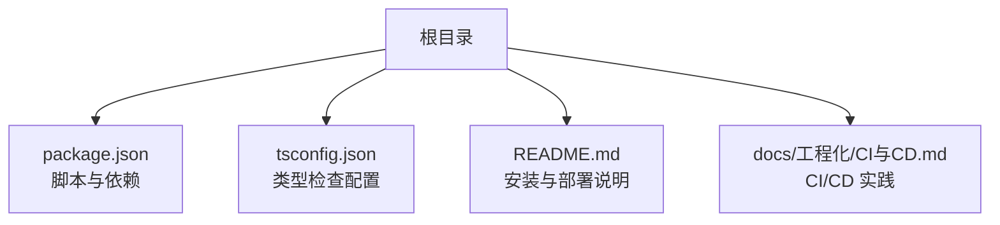
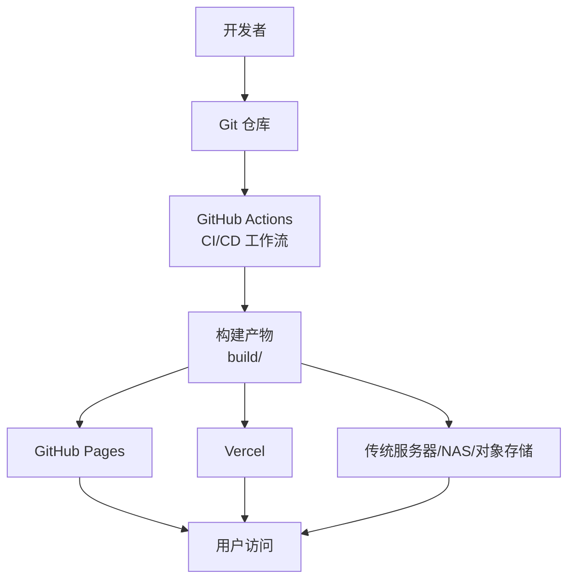
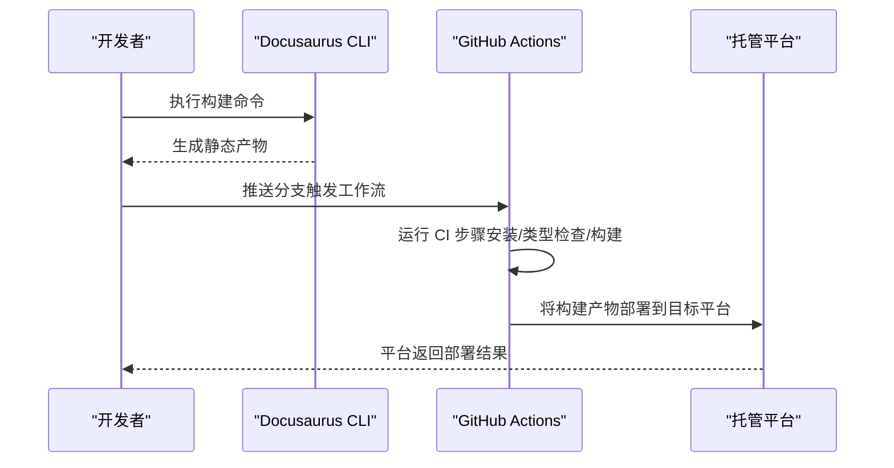
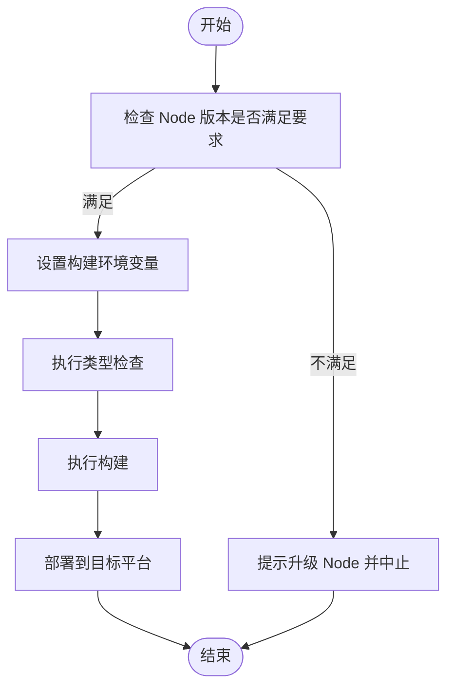
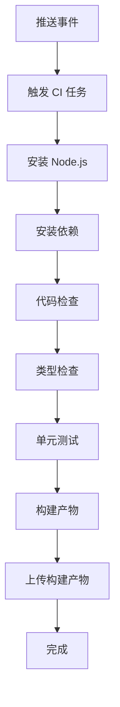
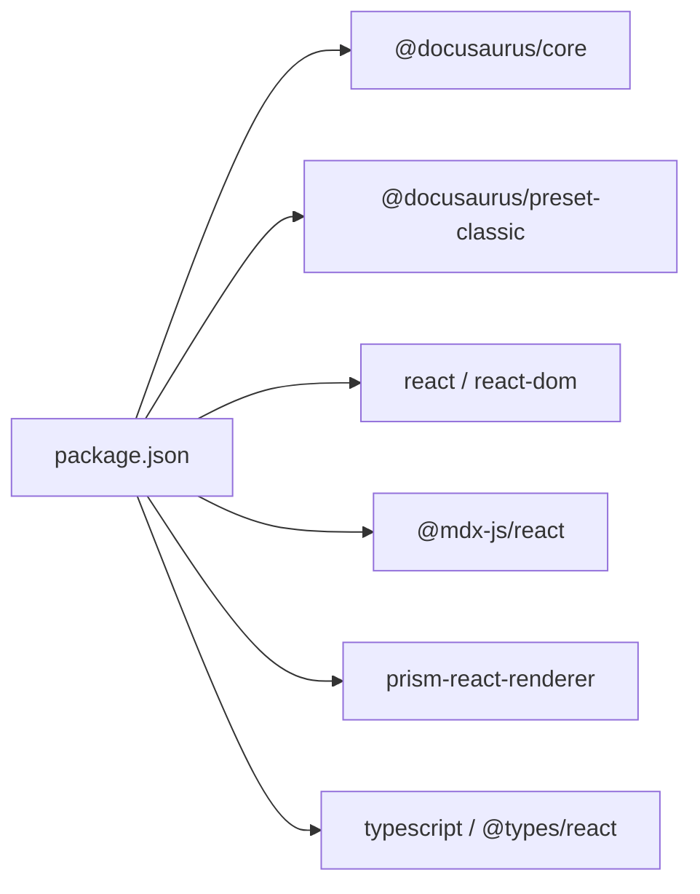

# 部署与运维

<cite>
**本文引用的文件**
- [package.json](file://package.json)
- [README.md](file://README.md)
- [tsconfig.json](file://tsconfig.json)
- [docs/工程化/CI与CD.md](file://docs/工程化/CI与CD.md)
</cite>

## 目录
1. [简介](#简介)
2. [项目结构](#项目结构)
3. [核心组件](#核心组件)
4. [架构总览](#架构总览)
5. [详细组件分析](#详细组件分析)
6. [依赖分析](#依赖分析)
7. [性能考虑](#性能考虑)
8. [故障排查指南](#故障排查指南)
9. [结论](#结论)
10. [附录](#附录)

## 简介
本指南面向部署与运维工程师及技术负责人，围绕静态站点的知识库项目提供可落地的部署与运维实践。内容覆盖构建配置、环境变量管理、性能监控、多平台部署（GitHub Pages、Vercel、传统服务器）、CI/CD流水线、以及常见问题排查。目标是帮助团队在不同环境下保持一致性、稳定性与可维护性。

## 项目结构
该项目基于 Docusaurus 3 静态站点生成器，采用现代化前端工程化实践。核心目录与文件如下：
- 根目录包含构建脚本、依赖声明、浏览器兼容策略与 Node 版本要求
- 文档目录包含工程化与 CI/CD 实践说明
- TypeScript 类型检查配置用于本地开发体验与类型校验

**章节来源**
- [package.json:1-50](file://package.json#L1-L50)
- [tsconfig.json:1-13](file://tsconfig.json#L1-L13)
- [README.md:1-42](file://README.md#L1-L42)
- [docs/工程化/CI与CD.md:1-101](file://docs/工程化/CI与CD.md#L1-L101)

## 核心组件
- 构建与启动脚本：通过 Docusaurus 提供的命令进行本地开发、构建与服务预览
- 依赖与工具链：React 19、TypeScript 6、Prism 语法高亮、MDX 支持等
- 浏览器兼容与引擎版本：明确 Node 最低版本要求与生产/开发环境的浏览器策略
- 类型检查配置：扩展 Docusaurus 默认 TS 配置，启用严格模式与 IDE 友好体验

**章节来源**
- [package.json:5-16](file://package.json#L5-L16)
- [package.json:17-33](file://package.json#L17-L33)
- [package.json:34-49](file://package.json#L34-L49)
- [tsconfig.json:4-12](file://tsconfig.json#L4-L12)

## 架构总览
下图展示了从源码到静态产物再到多平台发布的整体流程，以及 CI/CD 在其中的关键作用。

## 详细组件分析

### 构建与发布流程
- 本地开发：启动本地服务，支持热更新与实时预览
- 构建产物：生成静态内容至 build 目录，可直接部署到任意静态托管
- 部署方式：支持 SSH 或非 SSH 的 GitHub Pages 部署；亦可集成 Vercel 等平台自动化部署

**图表来源**
- [README.md:27-42](file://README.md#L27-L42)
- [docs/工程化/CI与CD.md:57-80](file://docs/工程化/CI与CD.md#L57-L80)

**章节来源**
- [README.md:11-25](file://README.md#L11-L25)
- [README.md:27-42](file://README.md#L27-L42)
- [docs/工程化/CI与CD.md:22-55](file://docs/工程化/CI与CD.md#L22-L55)

### 环境变量与配置管理
- Node 版本要求：确保 CI/CD 与本地开发一致
- 浏览器兼容策略：区分生产与开发环境的浏览器目标
- 类型检查：通过 tsconfig.json 启用严格模式，提升代码质量与 IDE 支持

**章节来源**
- [package.json:46-49](file://package.json#L46-L49)
- [package.json:34-45](file://package.json#L34-L45)
- [tsconfig.json:6-10](file://tsconfig.json#L6-L10)

### 多平台部署实践

#### GitHub Pages
- 支持 SSH 与非 SSH 两种部署方式
- 通过 Docusaurus 内置部署命令一键推送至 gh-pages 分支
- 适合开源项目与个人站点，零运维成本

**章节来源**
- [README.md:29-42](file://README.md#L29-L42)

#### Vercel
- 通过 GitHub Actions 集成 Vercel 部署动作
- 使用 secrets 传递令牌与项目标识，实现安全自动化
- 支持预览与生产环境分离，便于灰度与回滚

**章节来源**
- [docs/工程化/CI与CD.md:57-80](file://docs/工程化/CI与CD.md#L57-L80)

#### 传统服务器/对象存储/NAS
- 将构建产物上传至静态服务器或对象存储
- 配置 CDN 与缓存策略，提升全球访问速度
- 结合反向代理与 HTTPS，保障安全与可用性

[本节为通用实践说明，未直接分析具体文件，故无“章节来源”]

### CI/CD 流水线
- 触发条件：主分支推送与拉取请求
- 关键步骤：Node 环境准备、依赖安装、代码检查、类型检查、测试、构建、产物归档
- 缓存优化：复用 npm 缓存，缩短流水线时间
- 安全策略：使用 secrets 管理敏感信息，避免明文泄露

**图表来源**
- [docs/工程化/CI与CD.md:12-55](file://docs/工程化/CI与CD.md#L12-L55)

**章节来源**
- [docs/工程化/CI与CD.md:10-100](file://docs/工程化/CI与CD.md#L10-L100)

## 依赖分析
- 构建与运行时依赖：Docusaurus 核心、preset-classic、React 19、Prism、MDX 等
- 开发依赖：TypeScript、类型别名与类型定义，辅助开发体验
- 浏览器兼容：生产与开发环境分别指定目标浏览器范围
- 引擎版本：明确 Node 最低版本要求，避免跨环境差异

**图表来源**
- [package.json:17-33](file://package.json#L17-L33)

**章节来源**
- [package.json:17-33](file://package.json#L17-L33)
- [package.json:34-49](file://package.json#L34-L49)

## 性能考虑
- 构建产物体积控制：按需引入组件与样式，减少第三方依赖
- 资源加载优化：启用压缩与缓存，合理设置 CDN 与缓存头
- 首屏渲染：利用静态生成优势，配合骨架屏与懒加载策略
- 监控指标：关注页面加载时长、首屏时间、错误率与回源命中率

[本节为通用性能建议，未直接分析具体文件，故无“章节来源”]

## 故障排查指南
- 构建失败
  - 检查 Node 版本是否满足最低要求
  - 清理缓存后重试安装依赖
  - 查看类型检查与代码检查输出定位问题
- 部署异常
  - 确认 GitHub Pages 部署参数（用户名、SSH/非 SSH）正确
  - 检查 Vercel secrets 是否配置完整
  - 核对静态托管的路径与索引页配置
- CI/CD 失败
  - 查看工作流日志中的关键步骤输出
  - 确认缓存命中与依赖安装阶段无异常
  - 使用最小化复现步骤缩小问题范围

**章节来源**
- [README.md:27-42](file://README.md#L27-L42)
- [docs/工程化/CI与CD.md:82-100](file://docs/工程化/CI与CD.md#L82-L100)

## 结论
通过统一的构建配置、严格的类型检查、标准化的 CI/CD 流程与多平台部署策略，可以显著提升知识库项目的交付效率与运行稳定性。建议在团队内固化以下实践：统一 Node 版本、启用类型检查、使用 secrets 管理敏感信息、在 CI 中加入缓存与产物归档、并持续完善监控与告警机制。

## 附录
- 快速对照清单
  - Node 版本满足要求
  - 本地构建成功且产物可预览
  - CI 工作流通过（安装/类型检查/构建/测试）
  - 部署参数正确（GitHub Pages/Vercel/传统服务器）
  - CDN 与缓存策略已生效
  - 监控与日志接入完成

[本节为通用附录，未直接分析具体文件，故无“章节来源”]