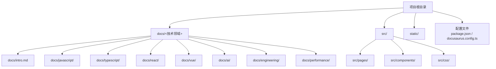
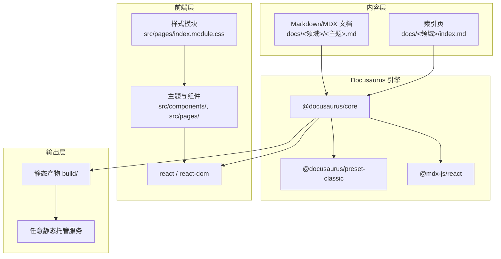
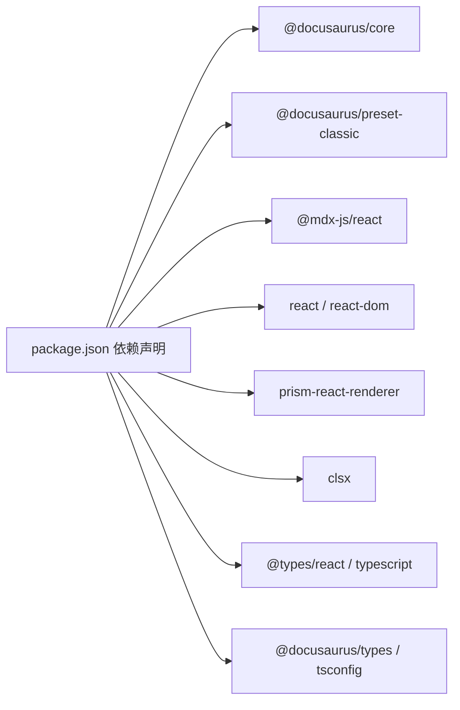

# 项目概述

<cite>
**本文档引用的文件**
- [README.md](file://README.md)
- [package.json](file://package.json)
- [docusaurus.config.ts](file://docusaurus.config.ts)
- [docs/intro.md](file://docs/intro.md)
- [docs/javascript/index.md](file://docs/javascript/index.md)
- [docs/react/index.md](file://docs/react/index.md)
- [docs/vue/index.md](file://docs/vue/index.md)
- [docs/typescript/index.md](file://docs/typescript/index.md)
- [docs/ai/index.md](file://docs/ai/index.md)
- [docs/javascript/type-system.md](file://docs/javascript/type-system.md)
- [docs/react/hooks-deep.md](file://docs/react/hooks-deep.md)
- [docs/vue/reactivity-system.md](file://docs/vue/reactivity-system.md)
- [docs/ai/llm-integration.md](file://docs/ai/llm-integration.md)
- [src/pages/index.module.css](file://src/pages/index.module.css)
</cite>

## 目录
1. [简介](#简介)
2. [项目结构](#项目结构)
3. [核心组件](#核心组件)
4. [架构总览](#架构总览)
5. [详细组件分析](#详细组件分析)
6. [依赖分析](#依赖分析)
7. [性能考虑](#性能考虑)
8. [故障排查指南](#故障排查指南)
9. [结论](#结论)
10. [附录](#附录)

## 简介
本项目是一个基于 Docusaurus 3.x 的静态网站生成器，专为前端面试知识的系统化整理与展示而构建。它覆盖 JavaScript、TypeScript、React、Vue、AI 应用开发等多个技术栈，并提供难度分级与标签体系，帮助不同层次的开发者高效准备面试。

- 项目目标：以结构化、可检索的方式沉淀前端面试高频知识点，支持快速浏览与深入学习。
- 核心价值：统一的知识入口、清晰的分类导航、可扩展的内容组织方式，兼顾初学者入门与资深工程师进阶。
- 技术特色：采用 Docusaurus 3.x 预设方案，结合 MDX 支持与主题组件，实现内容与交互的平衡；内置难度与标签便于筛选；支持暗色主题与现代化样式。

## 项目结构
仓库采用“文档驱动”的组织方式，核心目录如下：
- docs：按技术领域划分的面试知识文档，每个领域包含索引页与具体题目文章。
- src：Docusaurus 前端资源，包含页面样式与组件样式模块。
- static：静态资源（如图片），供文档与页面引用。
- 根目录配置：README、package.json、tsconfig.json 等，定义脚手架、依赖与构建参数。

图表来源
- [package.json:1-50](file://package.json#L1-L50)
- [docs/intro.md:1-35](file://docs/intro.md#L1-L35)

章节来源
- [README.md:1-42](file://README.md#L1-L42)
- [package.json:1-50](file://package.json#L1-L50)

## 核心组件
- 文档站点引擎：Docusaurus 3.x（preset-classic），提供开箱即用的路由、MDX 渲染、搜索、多语言与主题能力。
- 内容组织：每个技术领域以独立目录组织，首页使用 DocCardList 动态列出该领域的所有条目，形成“索引页 + 条目页”的结构。
- 面试维度：难度（Easy/Medium/Hard）、标签（如 javascript、react、vue、ai、type 等），便于按需筛选与复习。
- 主题与样式：内置暗色模式适配，首页样式模块提供动画与视觉效果，提升用户体验。

章节来源
- [docs/intro.md:1-35](file://docs/intro.md#L1-L35)
- [docs/javascript/index.md:1-16](file://docs/javascript/index.md#L1-L16)
- [docs/react/index.md:1-16](file://docs/react/index.md#L1-L16)
- [docs/vue/index.md:1-16](file://docs/vue/index.md#L1-L16)
- [docs/typescript/index.md:1-16](file://docs/typescript/index.md#L1-L16)
- [docs/ai/index.md:1-16](file://docs/ai/index.md#L1-L16)
- [src/pages/index.module.css:1-438](file://src/pages/index.module.css#L1-L438)

## 架构总览
整体架构围绕“内容即文档”的理念，通过 Docusaurus 将 Markdown/MDX 文档转化为静态页面，配合主题与插件实现导航、搜索、主题切换等功能。

图表来源
- [package.json:17-26](file://package.json#L17-L26)
- [package.json:27-33](file://package.json#L27-L33)
- [src/pages/index.module.css:1-438](file://src/pages/index.module.css#L1-L438)

## 详细组件分析

### 文档索引与卡片列表
- 每个技术领域的索引页通过 DocCardList 动态渲染该目录下的所有条目，形成“题目列表”视图，便于快速浏览。
- 示例路径参考：
  - [docs/javascript/index.md:1-16](file://docs/javascript/index.md#L1-L16)
  - [docs/react/index.md:1-16](file://docs/react/index.md#L1-L16)
  - [docs/vue/index.md:1-16](file://docs/vue/index.md#L1-L16)
  - [docs/typescript/index.md:1-16](file://docs/typescript/index.md#L1-L16)
  - [docs/ai/index.md:1-16](file://docs/ai/index.md#L1-L16)

章节来源
- [docs/javascript/index.md:1-16](file://docs/javascript/index.md#L1-L16)
- [docs/react/index.md:1-16](file://docs/react/index.md#L1-L16)
- [docs/vue/index.md:1-16](file://docs/vue/index.md#L1-L16)
- [docs/typescript/index.md:1-16](file://docs/typescript/index.md#L1-L16)
- [docs/ai/index.md:1-16](file://docs/ai/index.md#L1-L16)

### 面试内容示例与技术深度
- JavaScript 类型系统与类型判断：覆盖基础类型、typeof/instanceof 差异、Object.is 对比、严格相等与隐式转换等关键点。
  - 参考路径：[docs/javascript/type-system.md:1-68](file://docs/javascript/type-system.md#L1-L68)
- React Hooks 深入：useState 工作原理、useEffect 与 useLayoutEffect 差异、自定义 Hook 设计、useMemo/useCallback 缓存策略等。
  - 参考路径：[docs/react/hooks-deep.md:1-107](file://docs/react/hooks-deep.md#L1-L107)
- Vue 响应式系统：Vue 2/3 响应式差异、Proxy 与 defineProperty 的对比、依赖收集与触发机制、ref/reactive 的选择与转换。
  - 参考路径：[docs/vue/reactivity-system.md:1-109](file://docs/vue/reactivity-system.md#L1-L109)
- AI 应用开发：LLM 前端集成的安全实践、后端代理转发、Vercel AI SDK 使用、流式响应与成本控制。
  - 参考路径：[docs/ai/llm-integration.md:1-103](file://docs/ai/llm-integration.md#L1-L103)

章节来源
- [docs/javascript/type-system.md:1-68](file://docs/javascript/type-system.md#L1-L68)
- [docs/react/hooks-deep.md:1-107](file://docs/react/hooks-deep.md#L1-L107)
- [docs/vue/reactivity-system.md:1-109](file://docs/vue/reactivity-system.md#L1-L109)
- [docs/ai/llm-integration.md:1-103](file://docs/ai/llm-integration.md#L1-L103)

### 首页样式与交互
- 首页样式模块提供渐变背景、动画、统计卡片与技术栈展示等视觉元素，增强首屏体验与信息密度。
- 关键样式类与动画包括：heroBanner、statItem、techItem、动画 keyframes 等。
- 参考路径：[src/pages/index.module.css:1-438](file://src/pages/index.module.css#L1-L438)

章节来源
- [src/pages/index.module.css:1-438](file://src/pages/index.module.css#L1-L438)

## 依赖分析
- 运行时依赖
  - @docusaurus/core、@docusaurus/preset-classic：Docusaurus 核心与经典预设。
  - @mdx-js/react：MDX 渲染支持。
  - react、react-dom：前端框架基础。
  - prism-react-renderer、clsx：代码高亮与工具类合并。
- 开发依赖
  - @docusaurus/module-type-aliases、@docusaurus/tsconfig、@docusaurus/types：类型与配置。
  - @types/react、typescript：类型检查与开发体验。
- 浏览器兼容与运行时要求
  - browserslist 生产与开发环境配置。
  - engines.node >= 20。

图表来源
- [package.json:17-33](file://package.json#L17-L33)

章节来源
- [package.json:1-50](file://package.json#L1-L50)

## 性能考虑
- 静态生成：Docusaurus 3.x 生成静态产物，部署到任意静态托管即可获得极佳的加载性能与可靠性。
- 代码分割与懒加载：Docusaurus 默认对路由与组件进行合理拆分，减少首屏体积。
- 主题与样式：首页样式模块采用 CSS 动画与渐变，建议在移动端关注动画性能与电池消耗。
- 内容组织：通过索引页与卡片列表减少一次性渲染压力，提升浏览流畅度。
- 构建与缓存：利用 CI/CD 自动构建与缓存策略，缩短迭代周期。

## 故障排查指南
- 本地启动失败
  - 确认 Node.js 版本满足 engines.node >= 20。
  - 使用 yarn 安装依赖后再启动。
  - 参考路径：[README.md:5-17](file://README.md#L5-L17)，[package.json:46-48](file://package.json#L46-L48)
- 构建或部署异常
  - 使用 yarn build 生成静态产物，确认 build 目录存在。
  - 部署时根据托管平台选择对应命令（SSH 或非 SSH）。
  - 参考路径：[README.md:19-42](file://README.md#L19-L42)
- 内容未显示或索引为空
  - 检查 docs 下各领域索引页是否正确引入 DocCardList。
  - 确认文章头部 Front Matter（如 sidebar_position、title、difficulty、tags）完整。
  - 参考路径：[docs/javascript/index.md:1-16](file://docs/javascript/index.md#L1-L16)，[docs/react/hooks-deep.md:1-6](file://docs/react/hooks-deep.md#L1-L6)

章节来源
- [README.md:5-42](file://README.md#L5-L42)
- [package.json:46-48](file://package.json#L46-L48)
- [docs/javascript/index.md:1-16](file://docs/javascript/index.md#L1-L16)
- [docs/react/hooks-deep.md:1-6](file://docs/react/hooks-deep.md#L1-L6)

## 结论
本项目以 Docusaurus 3.x 为基础，构建了一个结构清晰、易于扩展的前端面试知识库。通过多技术栈覆盖、难度与标签体系、现代化主题与样式，既适合初学者建立知识框架，也能为有经验的开发者提供深入的技术要点与实践案例。依托静态生成与简单部署流程，项目具备良好的可维护性与可扩展性。

## 附录
- 快速开始
  - 安装依赖：yarn
  - 本地开发：yarn start
  - 生成静态产物：yarn build
  - 部署：根据托管平台选择对应命令
- 目标用户
  - 初学者：按分类与难度逐步学习，建立系统知识结构。
  - 中级开发者：聚焦进阶专题（如 Hooks、响应式系统、AI 集成），强化实战能力。
  - 高级开发者：查阅原理性内容（如 Fiber 架构、Vue 3 Proxy 响应式），用于面试深度回答与技术分享。

章节来源
- [README.md:5-42](file://README.md#L5-L42)
- [docs/intro.md:1-35](file://docs/intro.md#L1-L35)