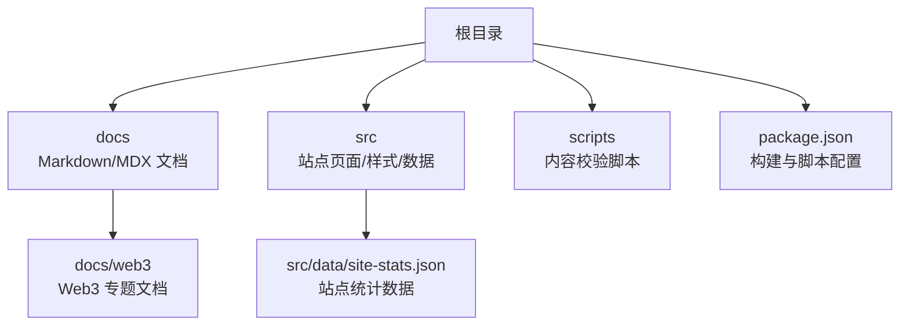
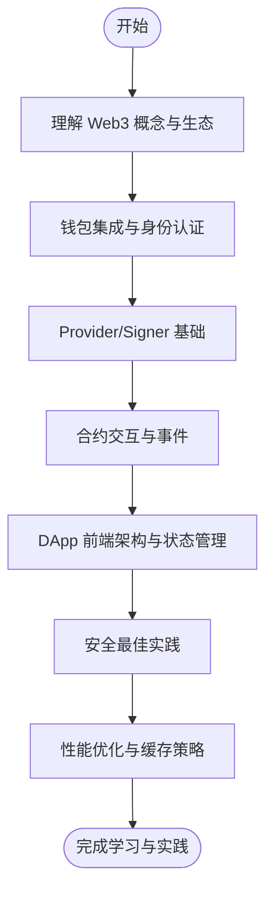
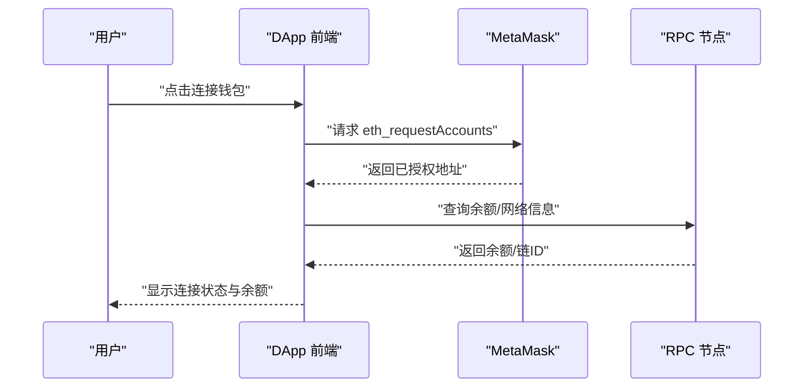
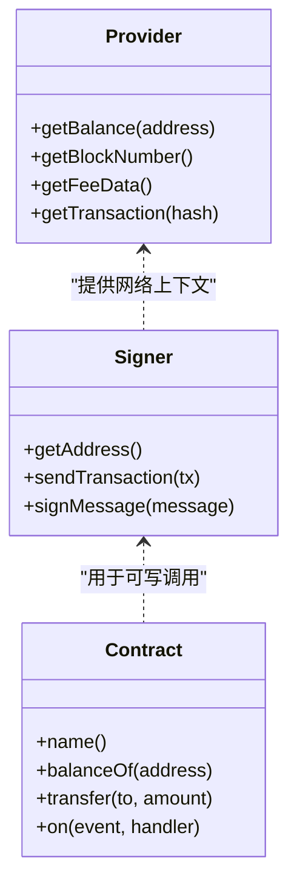
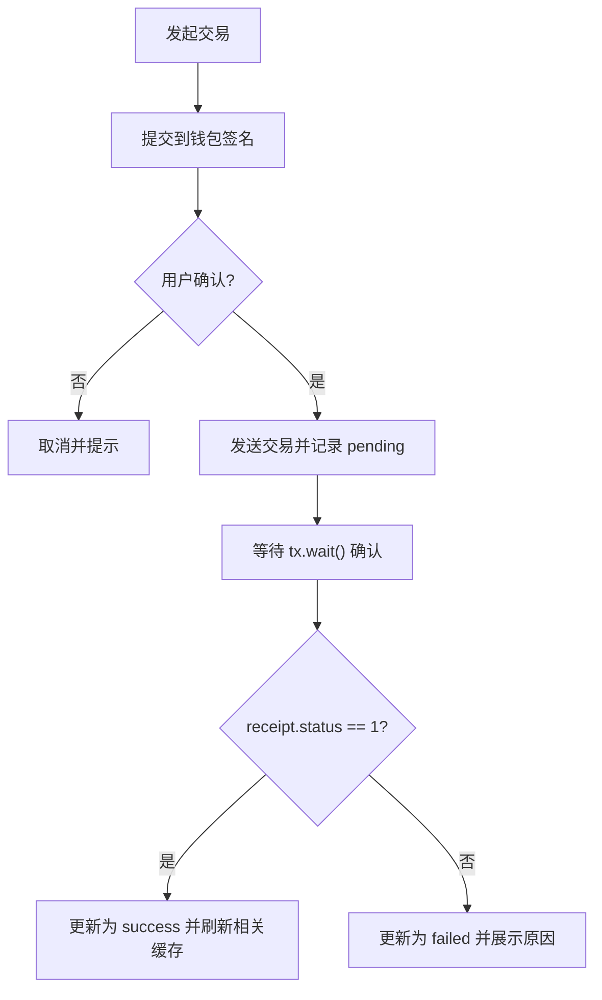
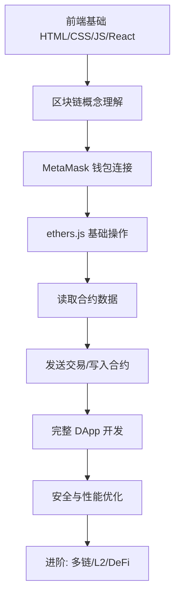
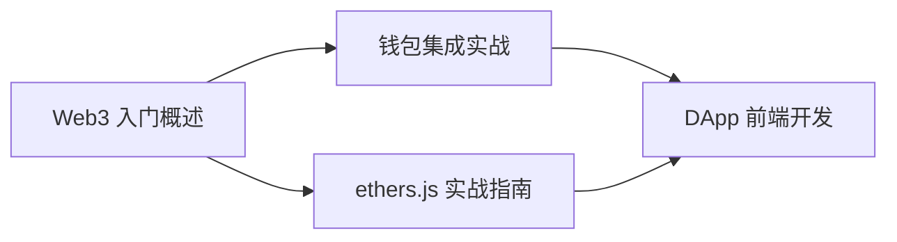

# Web3与区块链

<cite>
**本文引用的文件**
- [README.md](file://README.md)
- [package.json](file://package.json)
- [docs/web3/index.md](file://docs/web3/index.md)
- [docs/web3/_category_.json](file://docs/web3/_category_.json)
- [docs/web3/wallet-integration.md](file://docs/web3/wallet-integration.md)
- [docs/web3/ethersjs-guide.md](file://docs/web3/ethersjs-guide.md)
- [docs/web3/dapp-frontend.md](file://docs/web3/dapp-frontend.md)
- [docs/about.md](file://docs/about.md)
</cite>

## 目录
1. [简介](#简介)
2. [项目结构](#项目结构)
3. [核心组件](#核心组件)
4. [架构总览](#架构总览)
5. [详细组件分析](#详细组件分析)
6. [依赖关系分析](#依赖关系分析)
7. [性能考量](#性能考量)
8. [故障排查指南](#故障排查指南)
9. [结论](#结论)
10. [附录](#附录)

## 简介
本仓库是一个基于 Docusaurus 的前端面试与 AI 开发知识库，其中包含“Web3 与区块链”专题文档。该专题面向前端开发者，系统讲解 Web3 概念、钱包集成、ethers.js 使用以及 DApp 前端开发实践，并提供学习路线、工具链对比、安全与性能建议等。

## 项目结构
本项目采用文档驱动的知识库组织方式：
- docs 目录存放 Markdown/MDX 文档，按主题分目录管理；web3 专题位于 docs/web3
- src 目录包含站点页面、样式与数据（如统计信息）
- scripts 目录包含内容校验脚本
- package.json 定义构建、测试、校验等命令

图表来源
- [README.md:1-88](file://README.md#L1-L88)
- [package.json:1-67](file://package.json#L1-L67)

章节来源
- [README.md:1-88](file://README.md#L1-L88)
- [package.json:1-67](file://package.json#L1-L67)

## 核心组件
- Web3 入门概述：解释 Web3 理念、技术栈全景图、主流平台对比、学习路线与工具链选择
- 钱包集成实战：MetaMask 连接、事件监听、网络切换、WalletConnect 与 wagmi + RainbowKit 现代方案、签名与安全最佳实践
- ethers.js 实战指南：Provider/Signer/Contract 三大抽象、读写合约、事件监听、错误处理与常见面试题
- DApp 前端开发：DApp 架构设计、状态管理与缓存策略、交易 UI 设计、NFT 展示与铸造、安全与性能优化

章节来源
- [docs/web3/index.md:1-179](file://docs/web3/index.md#L1-L179)
- [docs/web3/wallet-integration.md:1-465](file://docs/web3/wallet-integration.md#L1-L465)
- [docs/web3/ethersjs-guide.md:1-476](file://docs/web3/ethersjs-guide.md#L1-L476)
- [docs/web3/dapp-frontend.md:1-568](file://docs/web3/dapp-frontend.md#L1-L568)

## 架构总览
从知识体系角度，Web3 专题围绕“概念—工具—实践—优化”的递进路径展开，形成如下学习与应用闭环：

[此图为概念性流程图，不直接映射具体源码文件]

## 详细组件分析

### 钱包集成实战
- 角色定位：钱包承担身份认证、交易签名、资产管理三重角色
- MetaMask 集成：检测安装、请求账户、获取余额、监听账户/网络切换、React Hook 封装
- 网络管理：切换网络、添加自定义网络
- WalletConnect v2：中继服务器原理、基础配置、支持钱包列表
- wagmi + RainbowKit：声明式 Hooks、多钱包支持、类型安全、缓存管理、开箱即用 UI
- 安全最佳实践：EIP-191/EIP-712 签名、防钓鱼、权限最小化

图表来源
- [docs/web3/wallet-integration.md:24-117](file://docs/web3/wallet-integration.md#L24-L117)
- [docs/web3/wallet-integration.md:202-256](file://docs/web3/wallet-integration.md#L202-L256)
- [docs/web3/wallet-integration.md:258-344](file://docs/web3/wallet-integration.md#L258-L344)

章节来源
- [docs/web3/wallet-integration.md:1-465](file://docs/web3/wallet-integration.md#L1-L465)

### ethers.js 实战指南
- 核心抽象：Provider（只读）、Signer（可签名）、Contract（合约交互）
- Provider 用法：创建不同 Provider、查询余额/区块/交易/Gas 费用
- Signer 用法：从浏览器钱包或私钥创建、发送 ETH 转账、签名消息
- Contract 交互：ABI 简写、读取 view 函数、写入交易、估算 Gas、等待确认
- 事件监听：实时监听、一次性监听、过滤历史事件
- 错误处理：常见错误码与友好提示、交易替换处理

图表来源
- [docs/web3/ethersjs-guide.md:28-95](file://docs/web3/ethersjs-guide.md#L28-L95)
- [docs/web3/ethersjs-guide.md:96-149](file://docs/web3/ethersjs-guide.md#L96-L149)
- [docs/web3/ethersjs-guide.md:150-254](file://docs/web3/ethersjs-guide.md#L150-L254)
- [docs/web3/ethersjs-guide.md:255-346](file://docs/web3/ethersjs-guide.md#L255-L346)

章节来源
- [docs/web3/ethersjs-guide.md:1-476](file://docs/web3/ethersjs-guide.md#L1-L476)

### DApp 前端开发
- 架构对比：传统 Web App vs DApp 的数据源、身份认证、状态持久化、延迟与失败处理差异
- 数据获取策略：直接 RPC、The Graph、事件监听、Alchemy Enhanced API
- 状态管理：Zustand 管理钱包连接状态、交易状态机（idle→confirming→pending→success/failed）
- 缓存策略：React Query 对链上数据进行 staleTime/refetchInterval 控制，交易成功后 invalidate
- 交易 UI：确认弹窗、状态展示组件、链接到区块浏览器
- NFT 展示与铸造：元数据获取（含 IPFS 处理）、卡片组件、数量选择与总价计算
- 安全与性能：金额精度、合约白名单、防重放、Multicall 批处理、长期/短期缓存策略

图表来源
- [docs/web3/dapp-frontend.md:99-166](file://docs/web3/dapp-frontend.md#L99-L166)
- [docs/web3/dapp-frontend.md:168-187](file://docs/web3/dapp-frontend.md#L168-L187)
- [docs/web3/dapp-frontend.md:189-262](file://docs/web3/dapp-frontend.md#L189-L262)
- [docs/web3/dapp-frontend.md:264-384](file://docs/web3/dapp-frontend.md#L264-L384)
- [docs/web3/dapp-frontend.md:473-537](file://docs/web3/dapp-frontend.md#L473-L537)

章节来源
- [docs/web3/dapp-frontend.md:1-568](file://docs/web3/dapp-frontend.md#L1-L568)

### Web3 入门概述
- 核心理念：去中心化、用户主权、无需信任、开放组合
- Web1/Web2/Web3 对比：时间线、数据所有权、交互方式、商业模式、技术架构、身份认证、典型产品
- 技术栈全景：应用层（React/Vue + ethers.js/wagmi/RainbowKit）、协议层（DeFi/NFT/DAO/DID）、中间件层（The Graph/Chainlink/IPFS/ENS）、区块链层（Ethereum/Polygon/Arbitrum/Solana/Base）
- 必备与加分知识：区块链基础、钱包交互、ethers.js、智能合约基础、安全意识；Solidity/The Graph/IPFS/Layer2
- 主流平台对比：共识机制、TPS、Gas 费用、生态成熟度、适合场景
- 开发工具链：智能合约（Hardhat/Foundry/Remix）、前端交互库（ethers.js/wagmi/viem/RainbowKit/web3modal）、基础设施（Infura/Alchemy/The Graph/Pinata）
- 学习路线：从概念到钱包连接、ethers.js 基础、读取/写入合约、完整 DApp、安全与性能、进阶多链/L2/DeFi

图表来源
- [docs/web3/index.md:121-131](file://docs/web3/index.md#L121-L131)

章节来源
- [docs/web3/index.md:1-179](file://docs/web3/index.md#L1-L179)

## 依赖关系分析
- 文档间依赖：
  - “钱包集成实战”依赖“Web3 入门概述”中的概念与工具链背景
  - “ethers.js 实战指南”在 Provider/Signer/Contract 基础上支撑“DApp 前端开发”的状态管理与交易流程
  - “DApp 前端开发”综合钱包与 ethers.js 能力，实现交易 UI、缓存与性能优化
- 工程依赖：
  - 站点构建与校验通过 package.json 脚本驱动，确保内容质量与一致性

图表来源
- [docs/web3/index.md:1-179](file://docs/web3/index.md#L1-L179)
- [docs/web3/wallet-integration.md:1-465](file://docs/web3/wallet-integration.md#L1-L465)
- [docs/web3/ethersjs-guide.md:1-476](file://docs/web3/ethersjs-guide.md#L1-L476)
- [docs/web3/dapp-frontend.md:1-568](file://docs/web3/dapp-frontend.md#L1-L568)

章节来源
- [package.json:1-67](file://package.json#L1-L67)

## 性能考量
- 使用 Multicall 合并多个 RPC 调用，减少请求次数
- 对不同数据类型设置合适的 staleTime 与 refetchInterval，交易成功后立即 invalidate 相关查询
- 大量 NFT 列表使用虚拟滚动与图片懒加载
- 合理选择 RPC 服务与索引服务（The Graph/Alchemy），平衡实时性与成本

章节来源
- [docs/web3/dapp-frontend.md:473-537](file://docs/web3/dapp-frontend.md#L473-L537)

## 故障排查指南
- 钱包连接问题：检查是否安装扩展、用户拒绝连接（错误码 4001）、网络未添加（错误码 4902）
- 交易失败：解析 CALL_EXCEPTION 原因、处理 INSUFFICIENT_FUNDS、ACTION_REJECTED、TRANSACTION_REPLACED
- 网络切换：推荐刷新页面以重置 Provider/合约实例与缓存
- 签名安全：避免签署不可读内容，使用 EIP-712 结构化签名，包含 chainId/nonce/deadline 防止重放

章节来源
- [docs/web3/wallet-integration.md:202-256](file://docs/web3/wallet-integration.md#L202-L256)
- [docs/web3/ethersjs-guide.md:295-346](file://docs/web3/ethersjs-guide.md#L295-L346)
- [docs/web3/dapp-frontend.md:547-568](file://docs/web3/dapp-frontend.md#L547-L568)

## 结论
本专题文档为前端开发者提供了从 Web3 概念到实际开发的系统化路径。通过钱包集成、ethers.js 使用与 DApp 前端架构的实践，结合安全与性能优化建议，帮助读者快速上手并构建高质量的 Web3 应用。

## 附录
- 站点规模与统计：当前包含 248 篇文档、255 道测验题、48 个分类
- 贡献与规范：遵循 Markdown 规范、TypeScript 优先、难度分级标注

章节来源
- [docs/about.md:1-111](file://docs/about.md#L1-L111)
- [src/data/site-stats.json:1-6](file://src/data/site-stats.json#L1-L6)