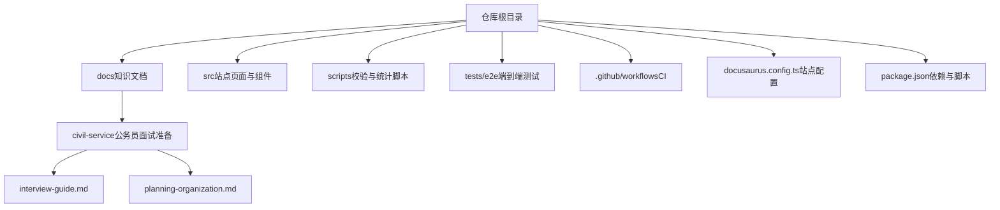
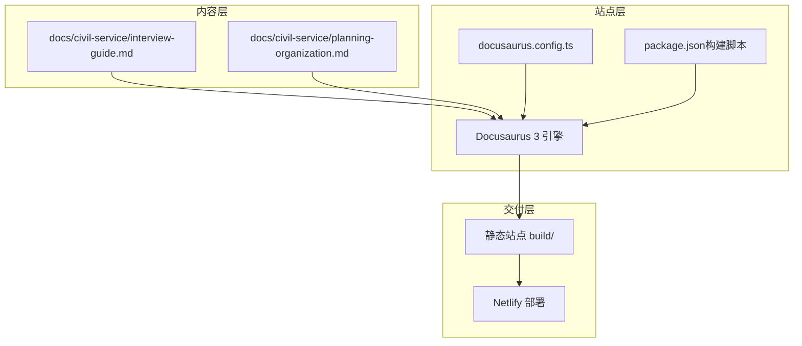
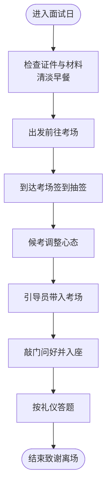
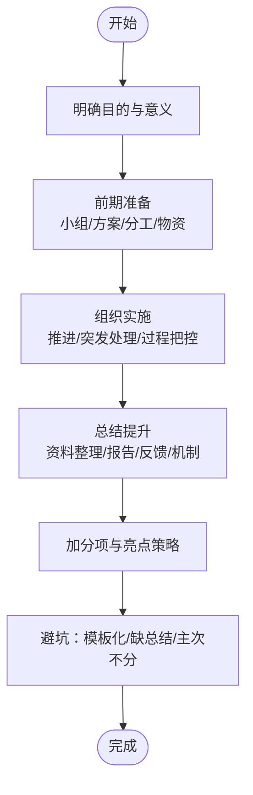
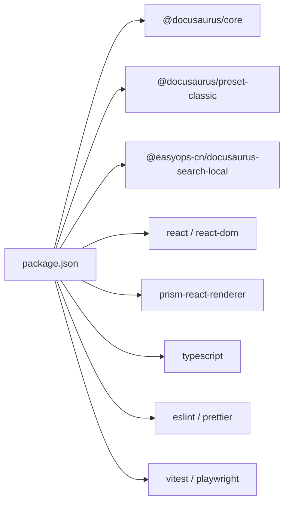

# 公务员面试准备

<cite>
**本文引用的文件**   
- [README.md](file://README.md)
- [package.json](file://package.json)
- [docusaurus.config.ts](file://docusaurus.config.ts)
- [docs/civil-service/interview-guide.md](file://docs/civil-service/interview-guide.md)
- [docs/civil-service/planning-organization.md](file://docs/civil-service/planning-organization.md)
</cite>

## 目录
1. [简介](#简介)
2. [项目结构](#项目结构)
3. [核心组件](#核心组件)
4. [架构总览](#架构总览)
5. [详细组件分析](#详细组件分析)
6. [依赖分析](#依赖分析)
7. [性能考虑](#性能考虑)
8. [故障排查指南](#故障排查指南)
9. [结论](#结论)
10. [附录](#附录)

## 简介
本仓库是一个基于 Docusaurus 的知识库站点，内容涵盖前端、AI、工程化等多个专题，同时包含“公务员面试准备”相关文档。该部分文档聚焦于结构化面试的礼仪流程与计划组织题的答题框架，帮助考生系统化掌握面试当天流程、着装与考场礼仪，以及计划组织类题目的通用思路与高分技巧。

## 项目结构
仓库采用 Docusaurus 3 构建静态站点，文档以 Markdown/MDX 形式存放在 docs 目录下；站点配置位于 docusaurus.config.ts；脚本与工具在 scripts 目录；测验与页面逻辑在 src 目录；测试与 CI 分别在 tests/e2e 与 .github/workflows。

图表来源
- [README.md:1-88](file://README.md#L1-L88)
- [package.json:1-67](file://package.json#L1-L67)
- [docusaurus.config.ts:1-29](file://docusaurus.config.ts#L1-L29)

章节来源
- [README.md:1-88](file://README.md#L1-L88)
- [package.json:1-67](file://package.json#L1-L67)

## 核心组件
- 面试流程与礼仪：覆盖面试当天时间线、着装建议、进场/答题/离场礼仪、候考技巧与常见问题解答，强调第一印象与细节把控。
- 计划组织题：提供题型概述、通用答题框架、分类详解（调研/宣传/活动策划）、高分技巧与常见错误提醒，帮助形成可迁移的解题思路。

章节来源
- [docs/civil-service/interview-guide.md:1-208](file://docs/civil-service/interview-guide.md#L1-L208)
- [docs/civil-service/planning-organization.md:1-258](file://docs/civil-service/planning-organization.md#L1-L258)

## 架构总览
从“内容—站点—交付”的角度看，知识库由文档内容驱动，通过 Docusaurus 生成静态页面并部署到 Netlify。

图表来源
- [docusaurus.config.ts:1-29](file://docusaurus.config.ts#L1-L29)
- [package.json:1-67](file://package.json#L1-L67)
- [README.md:1-88](file://README.md#L1-L88)

## 详细组件分析

### 面试流程与礼仪（interview-guide.md）
本节围绕“面试当天流程、着装礼仪、考场礼仪、候考技巧、常见问题”展开，强调第一印象与细节规范。

图表来源
- [docs/civil-service/interview-guide.md:15-38](file://docs/civil-service/interview-guide.md#L15-L38)
- [docs/civil-service/interview-guide.md:95-169](file://docs/civil-service/interview-guide.md#L95-L169)

章节来源
- [docs/civil-service/interview-guide.md:1-208](file://docs/civil-service/interview-guide.md#L1-L208)

### 计划组织题（planning-organization.md）
本节提供“题型概述—通用框架—分类详解—技巧—常见错误”的完整路径，适用于调研、宣传、活动策划等场景。

图表来源
- [docs/civil-service/planning-organization.md:39-67](file://docs/civil-service/planning-organization.md#L39-L67)
- [docs/civil-service/planning-organization.md:205-230](file://docs/civil-service/planning-organization.md#L205-L230)
- [docs/civil-service/planning-organization.md:232-258](file://docs/civil-service/planning-organization.md#L232-L258)

章节来源
- [docs/civil-service/planning-organization.md:1-258](file://docs/civil-service/planning-organization.md#L1-L258)

## 依赖分析
- 运行时依赖：React、Docusaurus 核心与预设、搜索插件、代码高亮渲染器。
- 开发依赖：TypeScript、ESLint、Prettier、Vitest、Playwright。
- 构建与质量：prestart/prebuild 自动执行内容校验；check 聚合类型检查、Lint、格式化、测试与构建。

图表来源
- [package.json:1-67](file://package.json#L1-L67)

章节来源
- [package.json:1-67](file://package.json#L1-L67)

## 性能考虑
- 内容体积控制：保持单篇文档聚焦主题，避免冗长堆砌，利于站点加载与检索。
- 图片与媒体：尽量使用轻量资源，必要时进行压缩与懒加载。
- 构建优化：利用 Docusaurus 的缓存与增量构建，减少重复编译。
- 搜索体验：合理使用标题层级与关键词，提高本地搜索命中率。

[本节为通用指导，不直接分析具体文件]

## 故障排查指南
- 构建失败或内容校验报错：优先运行 npm run validate:content，定位题目 ID、分类、选项与答案一致性等问题。
- 类型检查失败：运行 npm run typecheck，根据 TS 提示修复类型问题。
- Lint/格式问题：运行 npm run lint 与 npm run format:check，统一代码风格。
- 端到端测试失败：确保已安装 Chromium（npx playwright install chromium），再运行 npm run test:e2e。
- 首次启动慢：预构建会执行内容校验与统计，耐心等待或清理缓存后重试。

章节来源
- [README.md:14-40](file://README.md#L14-L40)
- [README.md:63-79](file://README.md#L63-L79)
- [package.json:15-24](file://package.json#L15-L24)

## 结论
本仓库将“公务员面试准备”的内容以结构化文档的形式沉淀，配合 Docusaurus 的站点能力，便于持续迭代与检索。面试礼仪与计划组织题两大模块覆盖了“外在表现”和“内在思维”，是备考的关键抓手。建议在复习时结合通用框架与真题场景，形成个人化的答题模板，并通过模拟练习强化表达与节奏感。

[本节为总结性内容，不直接分析具体文件]

## 附录
- 快速上手
  - 本地开发：npm ci → npm start
  - 构建生产：npm run build
  - 质量检查：npm run check
- 贡献建议
  - 新增或修改内容后，先运行 npm run check，确保构建、类型检查、Lint、格式化、测试与内容校验全部通过。

章节来源
- [README.md:14-40](file://README.md#L14-L40)
- [README.md:63-88](file://README.md#L63-L88)