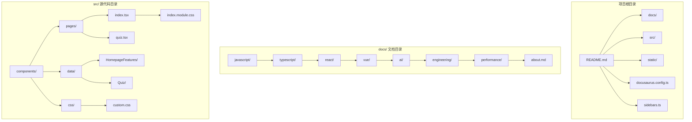
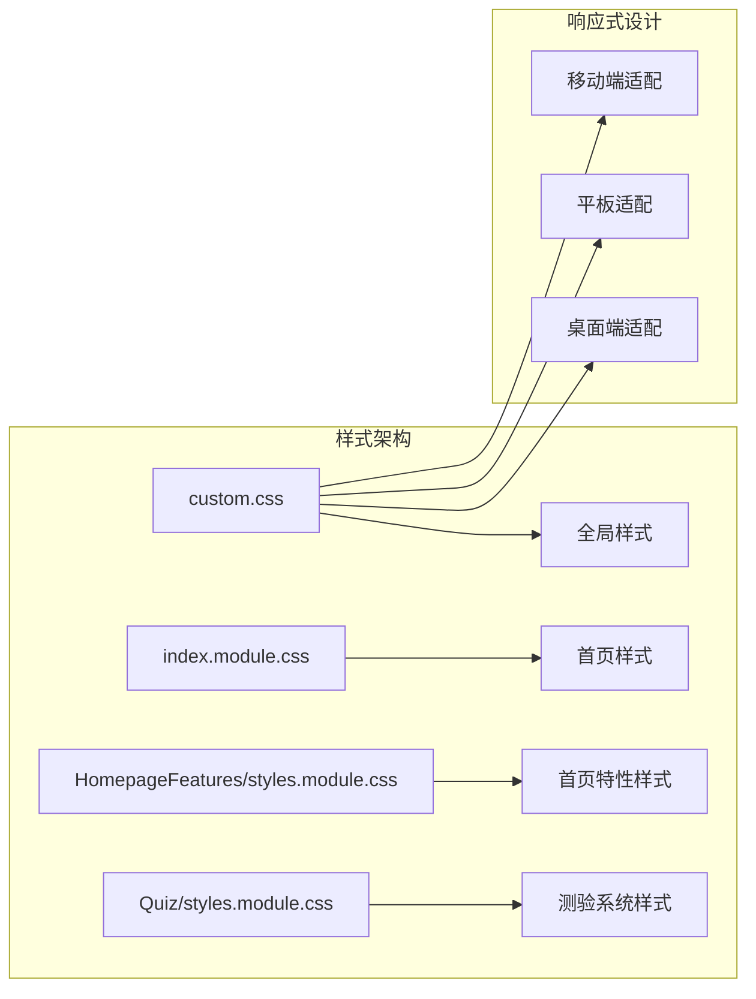
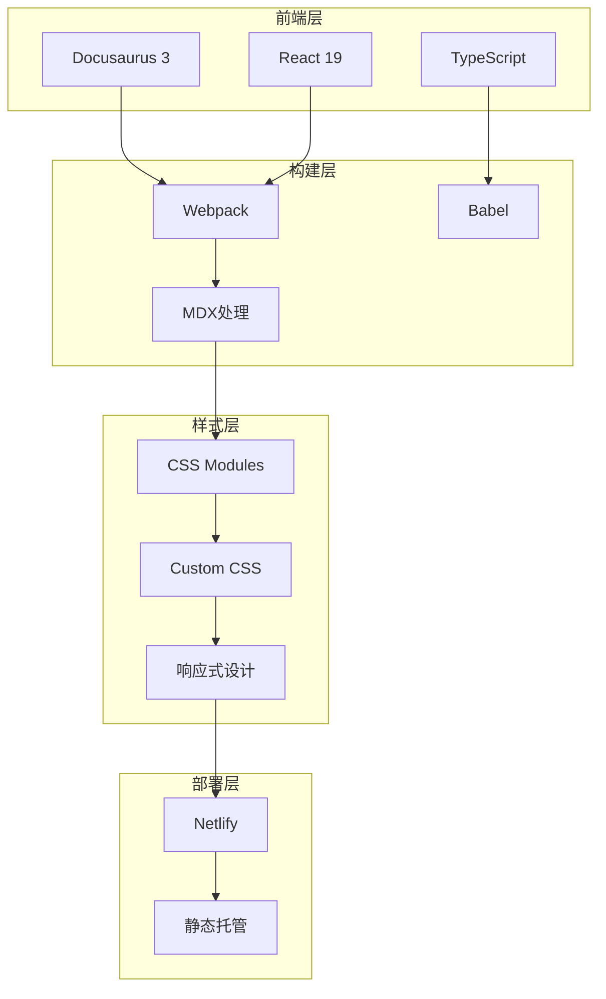
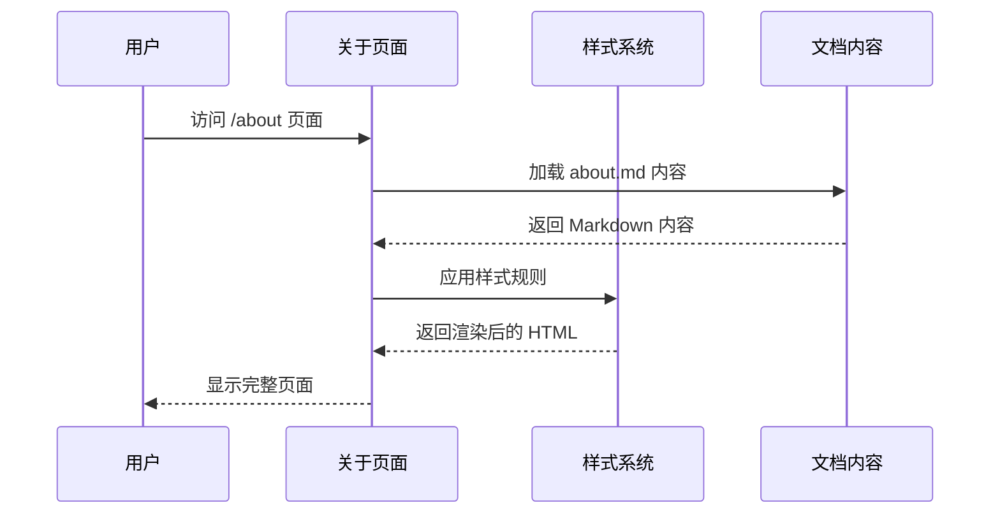
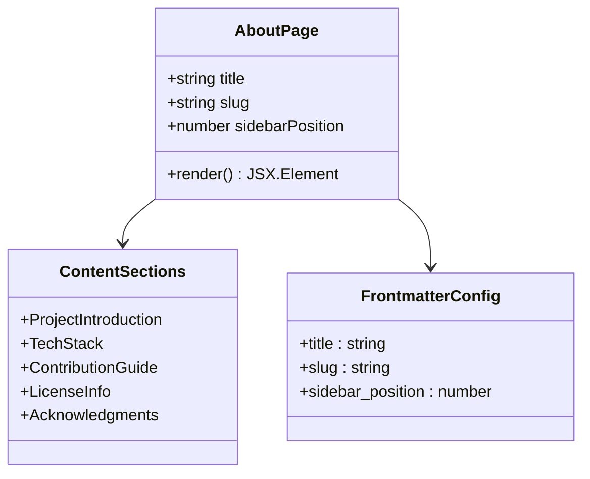
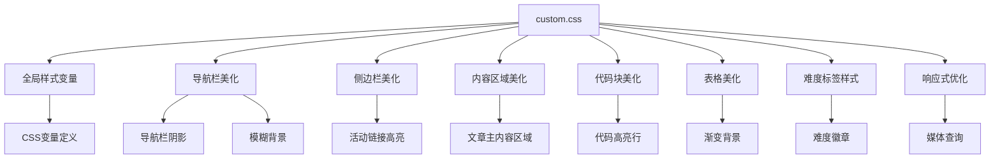
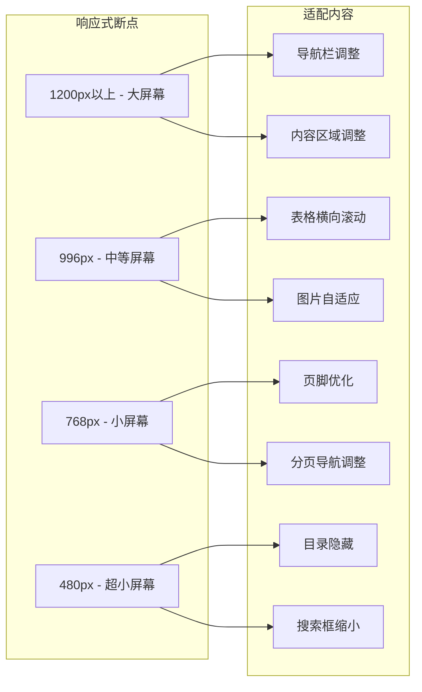
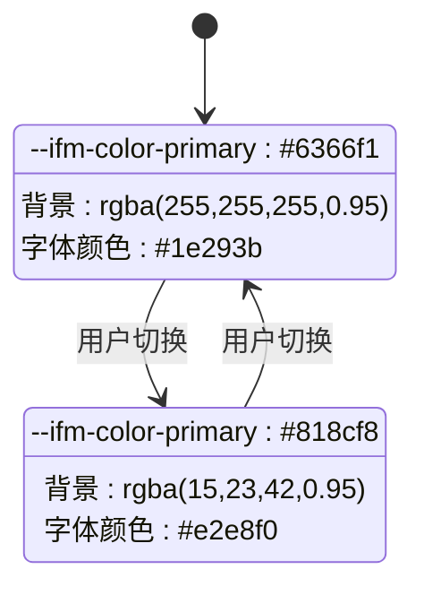
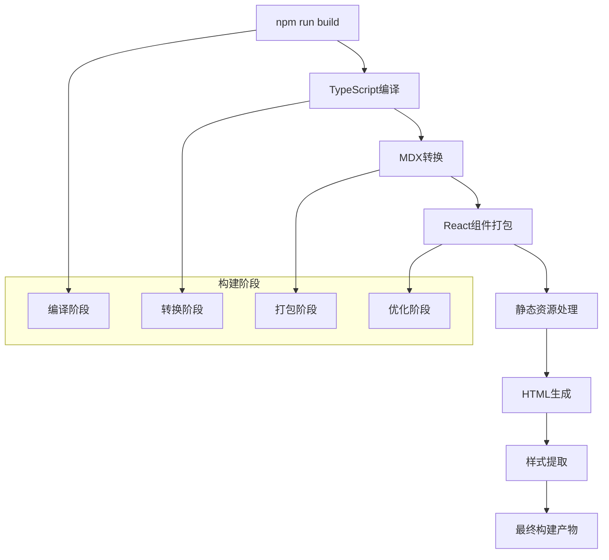
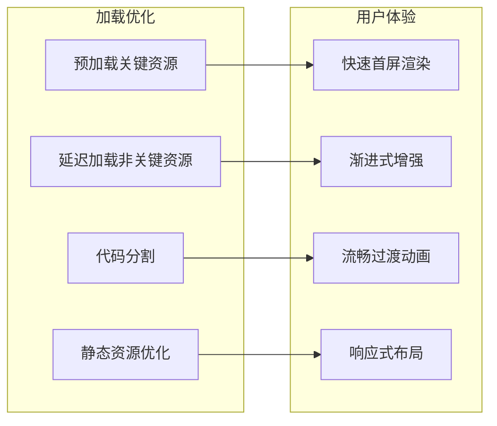

# 关于页面

<cite>
**本文档引用的文件**
- [README.md](file://README.md)
- [docs/about.md](file://docs/about.md)
- [docusaurus.config.ts](file://docusaurus.config.ts)
- [package.json](file://package.json)
- [netlify.toml](file://netlify.toml)
- [src/css/custom.css](file://src/css/custom.css)
- [src/pages/index.module.css](file://src/pages/index.module.css)
- [src/components/HomepageFeatures/styles.module.css](file://src/components/HomepageFeatures/styles.module.css)
- [src/components/Quiz/styles.module.css](file://src/components/Quiz/styles.module.css)
- [src/data/quiz-questions.ts](file://src/data/quiz-questions.ts)
</cite>

## 目录
1. [项目概述](#项目概述)
2. [项目结构](#项目结构)
3. [核心组件](#核心组件)
4. [架构概览](#架构概览)
5. [详细组件分析](#详细组件分析)
6. [依赖关系分析](#依赖关系分析)
7. [性能考虑](#性能考虑)
8. [故障排除指南](#故障排除指南)
9. [结论](#结论)

## 项目概述

前端面试知识库是一个基于 Docusaurus 3 构建的开源前端面试准备平台。该项目旨在帮助开发者系统性地备战技术面试，提供了一个完整的知识体系和实践工具。

### 项目特色

- **200+ 精选面试题** - 覆盖 JavaScript、TypeScript、React、Vue、AI、工程化、性能优化七大方向
- **45+ 深度文档** - 从基础概念到源码解析，层层递进
- **在线测验系统** - 支持错题本、答题历史、自定义题数、计时模式
- **AI 前沿专题** - LLM 集成、RAG、流式响应等热门方向
- **难度分级** - 🟢 Easy / 🟡 Medium / 🔴 Hard 三级标注
- **暗色模式** - 支持系统偏好自动切换
- **响应式设计** - 完美适配手机、平板、桌面端

## 项目结构



**图表来源**
- [README.md:58-83](file://README.md#L58-L83)
- [package.json:1-51](file://package.json#L1-L51)

**章节来源**
- [README.md:58-83](file://README.md#L58-L83)
- [package.json:1-51](file://package.json#L1-L51)

## 核心组件

### 关于页面实现

关于页面通过 Docusaurus 的 MDX 渲染机制实现，位于 `docs/about.md` 文件中。该页面采用标准的 Markdown 格式，包含页面元信息（frontmatter）和内容主体。

### 页面配置

关于页面通过 frontmatter 配置实现：
- `sidebar_position: 100` - 设置侧边栏位置
- `title: 关于本库` - 页面标题
- `slug: /about` - URL 路径别名

### 样式系统

项目采用模块化的 CSS 架构：



**图表来源**
- [src/css/custom.css:1-1120](file://src/css/custom.css#L1-L1120)
- [src/pages/index.module.css:1-683](file://src/pages/index.module.css#L1-L683)

**章节来源**
- [docs/about.md:1-111](file://docs/about.md#L1-L111)
- [src/css/custom.css:1-1120](file://src/css/custom.css#L1-L1120)

## 架构概览

### 技术栈架构



**图表来源**
- [package.json:17-26](file://package.json#L17-L26)
- [docusaurus.config.ts:1-16](file://docusaurus.config.ts#L1-L16)

### 数据流架构



**图表来源**
- [docs/about.md:1-111](file://docs/about.md#L1-L111)
- [src/css/custom.css:1-1120](file://src/css/custom.css#L1-L1120)

## 详细组件分析

### 关于页面组件

#### 页面结构分析

关于页面采用标准的 Markdown 结构，包含多个层次的内容区块：



**图表来源**
- [docs/about.md:1-111](file://docs/about.md#L1-L111)

#### 样式实现分析

页面样式采用模块化 CSS 架构：



**图表来源**
- [src/css/custom.css:1-1120](file://src/css/custom.css#L1-L1120)

**章节来源**
- [docs/about.md:1-111](file://docs/about.md#L1-L111)
- [src/css/custom.css:1-1120](file://src/css/custom.css#L1-L1120)

### 样式系统组件

#### 响应式设计实现

项目实现了多层次的响应式设计：



**图表来源**
- [src/css/custom.css:558-884](file://src/css/custom.css#L558-L884)

#### 主题系统实现

项目支持明暗两种主题模式：



**图表来源**
- [src/css/custom.css:23-33](file://src/css/custom.css#L23-L33)

**章节来源**
- [src/css/custom.css:558-884](file://src/css/custom.css#L558-L884)
- [src/css/custom.css:23-33](file://src/css/custom.css#L23-L33)

## 依赖关系分析

### 核心依赖关系

```mermaid
graph TB
subgraph "运行时依赖"
A[@docusaurus/core]
B[@docusaurus/preset-classic]
C[react]
D[react-dom]
E[prism-react-renderer]
F[@mdx-js/react]
end
subgraph "开发时依赖"
G[@types/react]
H[typescript]
I[@docusaurus/module-type-aliases]
J[@docusaurus/tsconfig]
end
subgraph "构建工具"
K[webpack]
L[babel]
M[netlify-cli]
end
A --> C
A --> D
B --> A
C --> K
D --> K
E --> K
F --> K
G --> H
I --> H
J --> H
K --> L
M --> A
```

**图表来源**
- [package.json:17-34](file://package.json#L17-L34)

### 构建流程分析



**图表来源**
- [package.json:5-16](file://package.json#L5-L16)
- [netlify.toml:1-9](file://netlify.toml#L1-L9)

**章节来源**
- [package.json:17-34](file://package.json#L17-L34)
- [package.json:5-16](file://package.json#L5-L16)
- [netlify.toml:1-9](file://netlify.toml#L1-L9)

## 性能考虑

### 构建优化策略

项目采用了多项性能优化措施：

1. **代码分割** - 自动将不同页面和组件进行代码分割
2. **懒加载** - 非关键资源采用懒加载策略
3. **缓存策略** - 静态资源设置长期缓存
4. **压缩优化** - 生产环境自动压缩 JS 和 CSS

### 加载性能优化



## 故障排除指南

### 常见问题解决

#### 构建问题

**问题**: 构建失败或报错
**解决方案**: 
1. 检查 Node.js 版本是否满足要求（>= 20.0）
2. 清理 node_modules 和重新安装依赖
3. 检查 TypeScript 配置文件

#### 样式问题

**问题**: 页面样式异常或显示不正确
**解决方案**:
1. 检查 CSS 变量定义是否正确
2. 验证响应式断点设置
3. 确认模块化 CSS 文件路径正确

#### 部署问题

**问题**: Netlify 部署失败
**解决方案**:
1. 检查 netlify.toml 配置
2. 验证构建命令和发布目录
3. 确认环境变量设置

**章节来源**
- [package.json:47-49](file://package.json#L47-L49)
- [netlify.toml:1-9](file://netlify.toml#L1-L9)

## 结论

关于页面作为前端面试知识库的重要组成部分，展现了现代静态站点生成器的最佳实践。通过合理的架构设计、模块化的样式系统和完善的响应式支持，该项目为用户提供了优质的阅读体验。

项目的核心优势包括：
- **清晰的架构分层** - 从文档内容到样式系统的完整实现
- **优秀的用户体验** - 响应式设计和主题切换功能
- **可扩展的代码结构** - 便于维护和功能扩展
- **完善的开发工具链** - 从开发到部署的完整流程

未来可以考虑的功能增强包括：
- 更丰富的交互元素
- 更精细的主题定制选项
- 更完善的 SEO 优化
- 更强大的内容管理系统