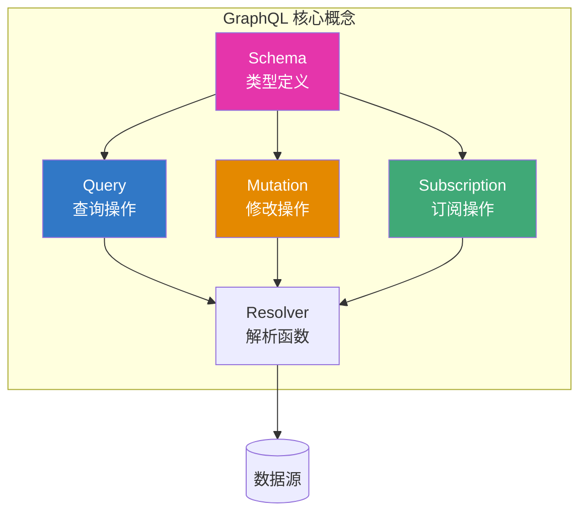
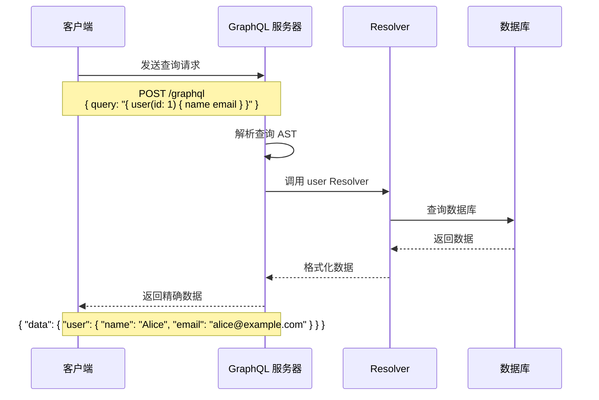
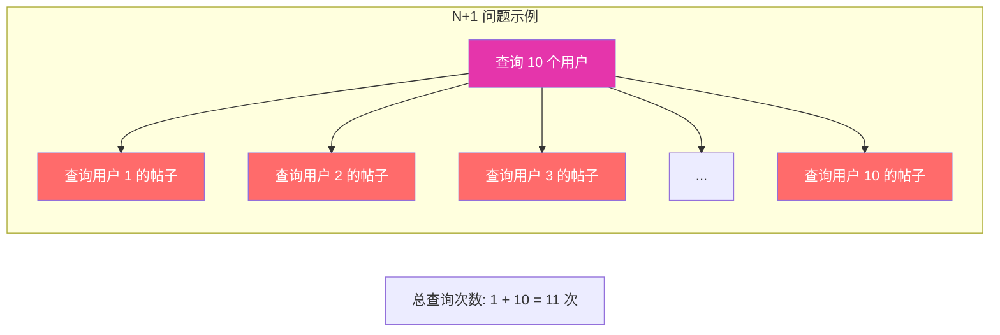
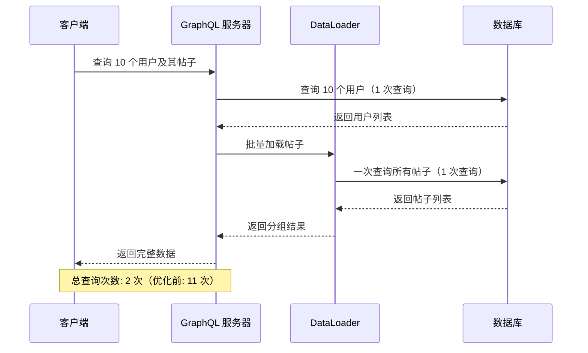
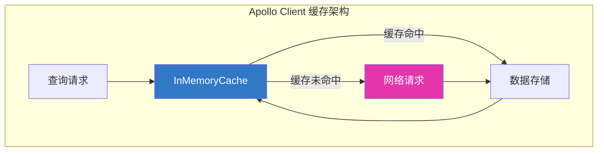
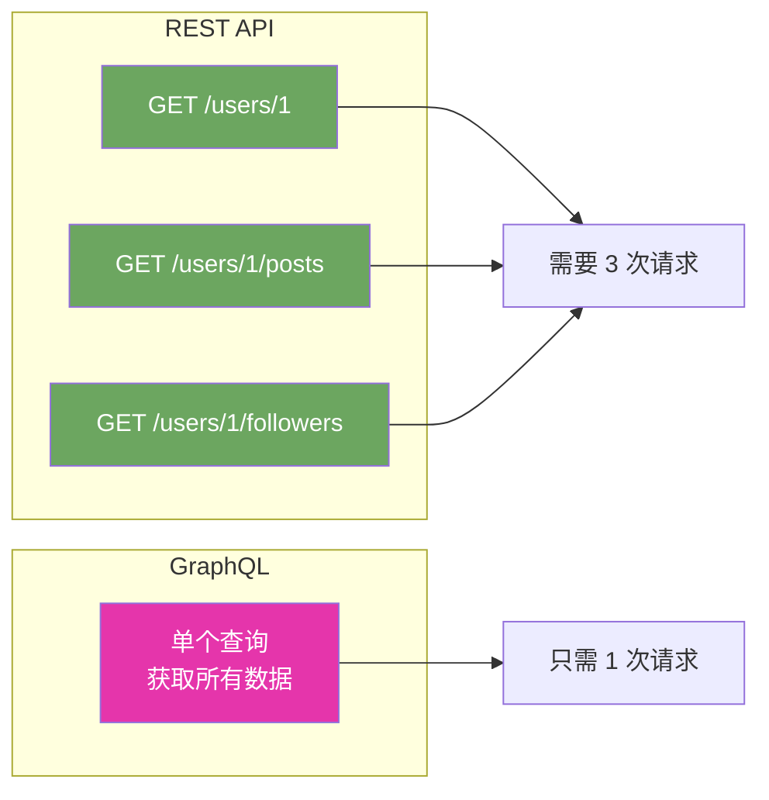

# GraphQL 详解

## 什么是 GraphQL？

GraphQL 是由 Facebook 于 2012 年内部开发、2015 年开源的 API 查询语言。它允许客户端精确指定需要的数据，而不是服务器决定返回什么。

## GraphQL 核心概念



## GraphQL 数据流



## Schema 定义

Schema 是 GraphQL 的核心，定义了 API 的类型系统。

### 基础类型

```graphql
# 基础标量类型
type User {
  id: ID!
  name: String!
  email: String!
  age: Int
  salary: Float
  isActive: Boolean!
  createdAt: DateTime!
}

# 枚举类型
enum Role {
  ADMIN
  USER
  MODERATOR
}

# 接口类型
interface Node {
  id: ID!
}

# 联合类型
union SearchResult = User | Post | Comment
```

### Query 定义

```graphql
type Query {
  # 单个资源查询
  user(id: ID!): User
  post(id: ID!): Post

  # 列表查询
  users(limit: Int, offset: Int): [User!]!
  posts(filter: PostFilter): [Post!]!

  # 搜索查询
  search(keyword: String!): [SearchResult!]!
}

# 输入类型
input PostFilter {
  authorId: ID
  category: String
  publishedAfter: DateTime
}
```

### Mutation 定义

```graphql
type Mutation {
  # 创建
  createUser(input: CreateUserInput!): User!
  createPost(input: CreatePostInput!): Post!

  # 更新
  updateUser(id: ID!, input: UpdateUserInput!): User!
  updatePost(id: ID!, input: UpdatePostInput!): Post!

  # 删除
  deleteUser(id: ID!): Boolean!
  deletePost(id: ID!): Boolean!
}

input CreateUserInput {
  name: String!
  email: String!
  password: String!
}

input UpdateUserInput {
  name: String
  email: String
}
```

### Subscription 定义

```graphql
type Subscription {
  # 实时消息
  messageReceived(channelId: ID!): Message!

  # 数据变更通知
  userUpdated(userId: ID!): User!
  postCreated: Post!
}
```

## Resolver 实现

Resolver 是执行查询的函数，负责获取和返回数据。

### 基础 Resolver

```typescript
import { IResolvers } from '@graphql-tools/utils';
import { Context } from './context';

interface User {
  id: string;
  name: string;
  email: string;
  posts: string[];
}

export const resolvers: IResolvers<any, Context> = {
  Query: {
    // 获取单个用户
    user: async (_parent, { id }, { prisma }) => {
      return prisma.user.findUnique({ where: { id } });
    },

    // 获取用户列表
    users: async (_parent, { limit = 10, offset = 0 }, { prisma }) => {
      return prisma.user.findMany({
        skip: offset,
        take: limit,
      });
    },
  },

  Mutation: {
    // 创建用户
    createUser: async (_parent, { input }, { prisma }) => {
      return prisma.user.create({ data: input });
    },

    // 更新用户
    updateUser: async (_parent, { id, input }, { prisma }) => {
      return prisma.user.update({
        where: { id },
        data: input,
      });
    },

    // 删除用户
    deleteUser: async (_parent, { id }, { prisma }) => {
      await prisma.user.delete({ where: { id } });
      return true;
    },
  },

  // 字段级 Resolver
  User: {
    // 解析用户的帖子
    posts: async (parent, _args, { prisma }) => {
      return prisma.post.findMany({
        where: { authorId: parent.id },
      });
    },

    // 计算字段
    fullName: (parent) => {
      return `${parent.firstName} ${parent.lastName}`;
    },
  },
};
```

### Context 和依赖注入

```typescript
import { PrismaClient } from '@prisma/client';
import { Request } from 'express';

export interface Context {
  prisma: PrismaClient;
  user: { id: string; role: string } | null;
}

export const createContext = ({ req }: { req: Request }): Context => {
  // 从 Header 获取 token
  const token = req.headers.authorization?.replace('Bearer ', '');

  // 验证 token 并获取用户信息
  const user = token ? verifyToken(token) : null;

  return {
    prisma: new PrismaClient(),
    user,
  };
};
```

## 查询优化

### 问题：N+1 查询



### 解决方案：DataLoader

```typescript
import DataLoader from 'dataloader';
import { PrismaClient } from '@prisma/client';

// 批量加载函数
const batchPostsByUserIds = async (userIds: readonly string[]) => {
  const prisma = new PrismaClient();

  // 一次查询获取所有用户的帖子
  const posts = await prisma.post.findMany({
    where: {
      authorId: { in: [...userIds] },
    },
  });

  // 按 userId 分组
  const postsMap = new Map<string, typeof posts>();
  userIds.forEach((id) => postsMap.set(id, []));
  posts.forEach((post) => {
    postsMap.get(post.authorId)?.push(post);
  });

  // 按请求顺序返回
  return userIds.map((id) => postsMap.get(id) || []);
};

// 创建 DataLoader 实例
export const createLoaders = () => ({
  postsByUser: new DataLoader(batchPostsByUserIds),
});

// Context 中使用
export const createContext = ({ req }: { req: Request }): Context => ({
  prisma: new PrismaClient(),
  loaders: createLoaders(),
  user: getUserFromToken(req),
});

// Resolver 中使用
User: {
  posts: async (parent, _args, { loaders }) => {
    return loaders.postsByUser.load(parent.id);
  },
},
```

### 优化后数据流



## Apollo Server 实战

### 项目配置

```typescript
// server.ts
import { ApolloServer } from '@apollo/server';
import { expressMiddleware } from '@apollo/server/express4';
import { ApolloServerPluginDrainHttpServer } from '@apollo/server/plugin/drainHttpServer';
import express from 'express';
import http from 'http';
import cors from 'cors';
import { typeDefs } from './schema';
import { resolvers } from './resolvers';
import { createContext } from './context';

interface MyContext {
  token?: string;
}

const app = express();
const httpServer = http.createServer(app);

const server = new ApolloServer<MyContext>({
  typeDefs,
  resolvers,
  plugins: [ApolloServerPluginDrainHttpServer({ httpServer })],
  // 开发环境启用 GraphQL Playground
  introspection: process.env.NODE_ENV !== 'production',
});

await server.start();

app.use(
  '/graphql',
  cors<cors.CorsRequest>(),
  express.json(),
  expressMiddleware(server, {
    context: async ({ req }) => createContext({ req }),
  })
);

await new Promise<void>((resolve) => httpServer.listen({ port: 4000 }, resolve));
console.log(`Server ready at http://localhost:4000/graphql`);
```

### 客户端查询

```typescript
import { gql, useQuery, useMutation } from '@apollo/client';

// 定义查询
const GET_USERS = gql`
  query GetUsers($limit: Int, $offset: Int) {
    users(limit: $limit, offset: $offset) {
      id
      name
      email
      posts {
        id
        title
      }
    }
  }
`;

// 定义变更
const CREATE_USER = gql`
  mutation CreateUser($input: CreateUserInput!) {
    createUser(input: $input) {
      id
      name
      email
    }
  }
`;

// 使用查询
function UserList() {
  const { loading, error, data } = useQuery(GET_USERS, {
    variables: { limit: 10, offset: 0 },
  });

  if (loading) return <p>Loading...</p>;
  if (error) return <p>Error: {error.message}</p>;

  return (
    <ul>
      {data.users.map((user) => (
        <li key={user.id}>
          {user.name} - {user.email}
        </li>
      ))}
    </ul>
  );
}

// 使用变更
function CreateUserForm() {
  const [createUser] = useMutation(CREATE_USER, {
    // 更新缓存
    update(cache, { data: { createUser } }) {
      cache.modify({
        fields: {
          users(existingUsers = []) {
            const newUserRef = cache.writeQuery({
              data: createUser,
              query: GET_USERS,
            });
            return [...existingUsers, newUserRef];
          },
        },
      });
    },
  });

  const handleSubmit = async (formData) => {
    await createUser({ variables: { input: formData } });
  };

  return <form onSubmit={handleSubmit}>...</form>;
}
```

## 缓存策略

### Apollo Client 缓存



### 缓存配置

```typescript
import { InMemoryCache, makeVar } from '@apollo/client';

// 响应式变量
export const isLoggedInVar = makeVar<boolean>(!!localStorage.getItem('token'));

const cache = new InMemoryCache({
  typePolicies: {
    Query: {
      fields: {
        // 合并分页数据
        users: {
          keyArgs: ['filter'], // 根据 filter 参数缓存不同数据
          merge(existing = [], incoming) {
            return [...existing, ...incoming];
          },
        },

        // 自定义缓存 ID
        user: {
          read(existing, { args, toReference }) {
            return existing || toReference({
              __typename: 'User',
              id: args.id,
            });
          },
        },
      },
    },

    User: {
      // 使用 id 作为缓存键
      keyFields: ['id'],
    },
  },
});
```

## 最佳实践

### 1. Schema 设计原则

```graphql
# 好的设计：使用 Relay 风格的分页
type UserConnection {
  edges: [UserEdge!]!
  pageInfo: PageInfo!
  totalCount: Int!
}

type UserEdge {
  node: User!
  cursor: String!
}

type PageInfo {
  hasNextPage: Boolean!
  hasPreviousPage: Boolean!
  startCursor: String
  endCursor: String
}

type Query {
  users(first: Int, after: String): UserConnection!
}
```

### 2. 错误处理

```typescript
// 自定义错误类
class ValidationError extends Error {
  code = 'VALIDATION_ERROR';
  field: string;

  constructor(field: string, message: string) {
    super(message);
    this.field = field;
  }
}

class AuthenticationError extends Error {
  code = 'AUTHENTICATION_ERROR';
  statusCode = 401;
}

// 格式化错误响应
const formatError = (formattedError, error) => {
  // 生产环境隐藏内部错误
  if (process.env.NODE_ENV === 'production') {
    if (formattedError.extensions?.code === 'INTERNAL_SERVER_ERROR') {
      return {
        ...formattedError,
        message: 'Internal server error',
        extensions: { code: 'INTERNAL_SERVER_ERROR' },
      };
    }
  }

  return formattedError;
};

const server = new ApolloServer({
  typeDefs,
  resolvers,
  formatError,
});
```

### 3. 性能监控

```typescript
import { ApolloServerPlugin } from '@apollo/server';

const performancePlugin: ApolloServerPlugin = {
  async requestDidStart() {
    const start = Date.now();

    return {
      async willSendResponse() {
        const duration = Date.now() - start;
        console.log(`Query duration: ${duration}ms`);
      },

      async didEncounterErrors({ errors }) {
        errors.forEach((error) => {
          console.error('GraphQL Error:', error);
        });
      },
    };
  },
};
```

## GraphQL vs REST 对比



| 维度 | REST | GraphQL |
|------|------|---------|
| **数据获取** | 固定结构，可能 Over/Under-fetch | 精确获取需要的数据 |
| **端点** | 多个端点 | 单一端点 |
| **缓存** | 利用 HTTP 缓存 | 需要额外实现 |
| **文件上传** | 原生支持 | 需要额外处理 |
| **实时更新** | WebSocket | Subscription |
| **学习曲线** | 低 | 中等 |
| **类型安全** | 需要额外工具 | Schema 内置 |

## 面试要点

### 常见问题

1. **什么是 N+1 问题？如何解决？**

   N+1 问题是指在获取列表数据时，先执行 1 次查询获取列表，然后对每个元素执行 N 次查询获取关联数据。

   解决方案：
   - **DataLoader**：批量加载和缓存
   - **JOIN 查询**：数据库层面联表查询
   - **预加载**：ORM 的 eager loading

2. **GraphQL 的 Subscription 如何实现？**

   基于 WebSocket（通常使用 `graphql-ws` 协议）：
   - 客户端订阅特定事件
   - 服务器维护订阅连接
   - 事件发生时推送数据

3. **如何优化 GraphQL 查询性能？**

   - 使用 DataLoader 解决 N+1 问题
   - 查询复杂度分析和限制
   - 深度限制（防止嵌套查询攻击）
   - 响应缓存（Redis、CDN）
   - 持久化查询（减少传输大小）

4. **GraphQL 有哪些安全风险？**

   - **查询复杂度攻击**：发送超大查询消耗服务器资源
   - **信息泄露**：通过内省查询获取 Schema 信息
   - **拒绝服务**：深度嵌套查询

   防御措施：
   - 限制查询深度和复杂度
   - 禁用生产环境内省
   - 实现速率限制
   - 使用持久化查询

## 总结

GraphQL 提供了一种灵活、高效的数据查询方式，特别适合：
- 复杂数据关系的应用
- 移动端应用（减少数据传输）
- 需要快速迭代的前端团队
- 多客户端（Web、iOS、Android）共享 API

## 延伸阅读

- [GraphQL 官方文档](https://graphql.org/)
- [Apollo 文档](https://www.apollographql.com/docs/)
- [Prisma 文档](https://www.prisma.io/docs/)
- [tRPC 详解](./trpc.md)
