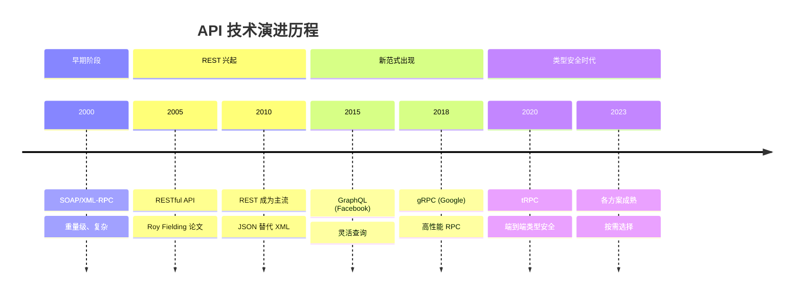
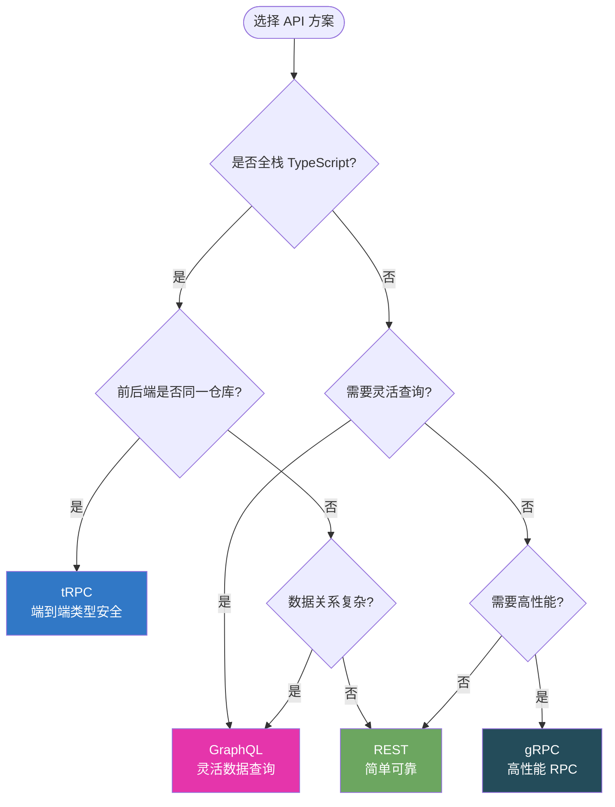
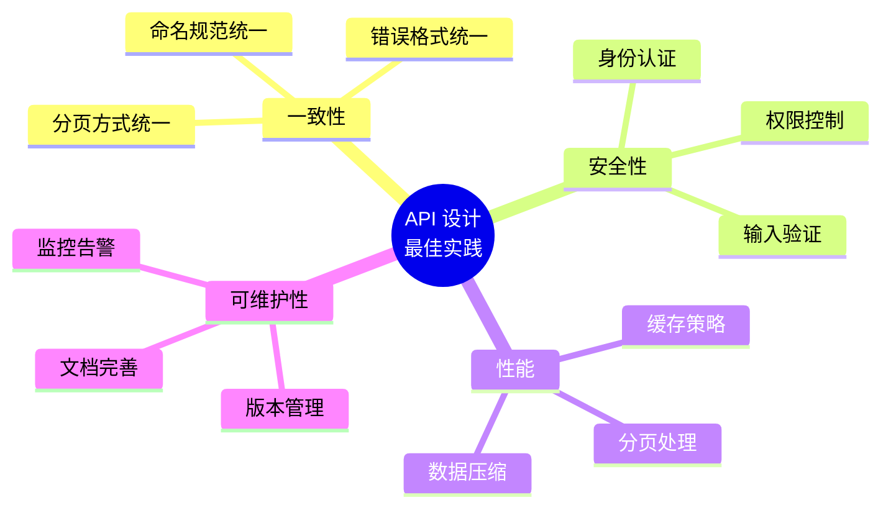

# 现代 API 方案概述

## 什么是 API？

API（Application Programming Interface，应用程序编程接口）是不同软件组件之间进行通信的桥梁。在 Web 开发中，API 通常指前后端之间的数据交换协议。

## API 技术演进



## 主流 API 方案对比

| 特性 | REST | GraphQL | tRPC | gRPC |
|------|------|---------|------|------|
| **数据获取** | 固定结构 | 灵活查询 | RPC 调用 | RPC 调用 |
| **类型安全** | 需额外工具 | 需 Codegen | 原生支持 | Proto 定义 |
| **学习曲线** | 低 | 中 | 低 | 高 |
| **实时支持** | WebSocket | Subscription | Subscription | Streaming |
| **缓存** | HTTP 缓存 | 需额外实现 | 依赖传输层 | 需实现 |
| **适用场景** | 公共 API | 复杂数据需求 | 全栈 TS 项目 | 微服务 |
| **开发体验** | 一般 | 良好 | 优秀 | 一般 |

## 方案选择决策树



## REST API

REST（Representational State Transfer）是最成熟、最广泛使用的 API 架构风格。

### 核心原则

1. **无状态**：每个请求包含所有必要信息
2. **统一接口**：使用标准 HTTP 方法（GET、POST、PUT、DELETE）
3. **资源导向**：每个 URL 代表一个资源
4. **可缓存**：利用 HTTP 缓存机制

### 示例

```typescript
// REST API 示例
// GET    /api/users          - 获取用户列表
// GET    /api/users/:id      - 获取单个用户
// POST   /api/users          - 创建用户
// PUT    /api/users/:id      - 更新用户
// DELETE /api/users/:id      - 删除用户

// 前端调用
const response = await fetch('/api/users/123');
const user = await response.json();
```

### 优点与缺点

**优点：**
- 简单易懂，学习成本低
- 广泛支持，生态成熟
- 利用 HTTP 缓存机制
- 适合 CRUD 操作

**缺点：**
- Over-fetching：获取多余数据
- Under-fetching：需要多次请求
- 版本管理复杂
- 缺乏类型安全

## GraphQL

GraphQL 是由 Facebook 开发的 API 查询语言，允许客户端精确指定需要的数据。

### 核心特点

- **灵活查询**：客户端决定返回哪些字段
- **单一端点**：所有查询通过一个 URL
- **强类型**：Schema 定义数据结构
- **实时更新**：支持 Subscription

### 详细内容

→ [GraphQL 详解](./graphql.md)

## tRPC

tRPC 是一个现代化的 TypeScript RPC 框架，提供端到端的类型安全。

### 核心特点

- **零代码生成**：直接使用 TypeScript 类型
- **端到端类型安全**：前后端共享类型
- **轻量级**：无需额外协议或 Schema
- **快速开发**：自动类型推导

### 详细内容

→ [tRPC 详解](./trpc.md)

## gRPC

gRPC 是 Google 开发的高性能 RPC 框架，使用 Protocol Buffers 进行序列化。

### 核心特点

- **高性能**：二进制协议，HTTP/2 传输
- **强类型**：Protocol Buffers 定义接口
- **多语言支持**：跨语言、跨平台
- **流式传输**：支持双向流

### 适用场景

- 微服务间通信
- 需要高性能的内部服务
- 多语言项目

## 最佳实践

### 1. API 设计原则



### 2. 错误处理

```typescript
// 统一错误响应格式
interface ApiError {
  code: string;        // 错误代码
  message: string;     // 用户友好的错误信息
  details?: unknown;   // 详细错误信息（仅开发环境）
  timestamp: string;   // 错误发生时间
  requestId: string;   // 请求追踪 ID
}

// 示例
{
  "code": "VALIDATION_ERROR",
  "message": "邮箱格式不正确",
  "details": { "field": "email", "value": "invalid" },
  "timestamp": "2024-01-15T10:30:00Z",
  "requestId": "req_abc123"
}
```

### 3. 版本管理

```typescript
// URL 版本管理
// /api/v1/users
// /api/v2/users

// Header 版本管理
// Accept: application/vnd.api.v1+json

// 查询参数版本管理
// /api/users?version=1
```

### 4. 分页设计

```typescript
// Cursor-based 分页（推荐）
interface PaginatedResponse<T> {
  data: T[];
  pagination: {
    cursor: string | null;   // 下一页游标
    hasMore: boolean;        // 是否有更多数据
    total?: number;          // 可选：总数
  };
}

// 使用示例
const response = await fetch('/api/users?cursor=abc123&limit=20');
```

## 面试要点

### 常见问题

1. **REST 和 GraphQL 的区别？各自适用什么场景？**

   **REST**：简单、成熟、适合 CRUD 操作、利用 HTTP 缓存。适用公共 API、简单数据需求。

   **GraphQL**：灵活查询、避免 Over/Under-fetching、强类型。适用复杂数据关系、移动端应用。

2. **什么是 Over-fetching 和 Under-fetching？**

   - **Over-fetching**：获取了不需要的数据（如只需用户名，但返回了整个用户对象）
   - **Under-fetching**：需要多次请求才能获取所需数据（如获取用户后还需要获取订单）

3. **tRPC 如何实现端到端类型安全？**

   tRPC 利用 TypeScript 的类型推导能力，在定义后端 Router 时自动生成类型，前端直接使用这些类型，无需额外的代码生成步骤。

4. **如何选择合适的 API 方案？**

   考虑因素：
   - 技术栈（是否全栈 TypeScript）
   - 数据复杂度（简单 CRUD 还是复杂关系）
   - 性能要求（内部服务还是公共 API）
   - 团队熟悉度
   - 生态系统支持

## 总结

| 选择 | 推荐方案 |
|------|----------|
| 全栈 TypeScript 单体项目 | **tRPC** |
| 复杂数据查询、移动端 | **GraphQL** |
| 简单 CRUD、公共 API | **REST** |
| 微服务、高性能内部通信 | **gRPC** |

## 延伸阅读

- [GraphQL 详解](./graphql.md)
- [tRPC 详解](./trpc.md)
- [WebGL 基础](../webgl/index.md)
