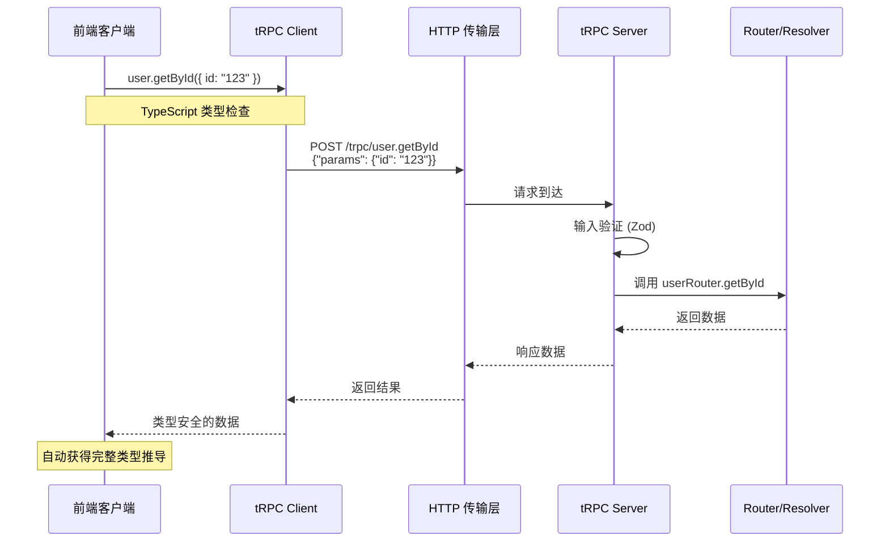
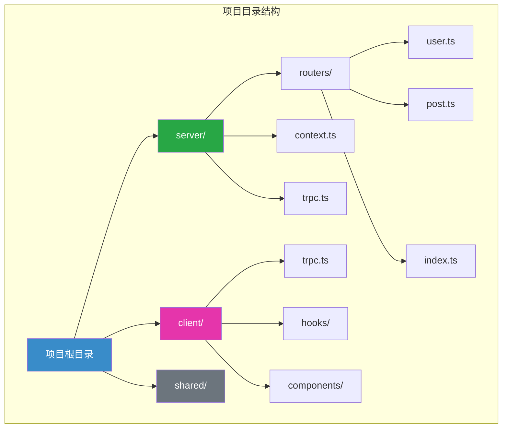
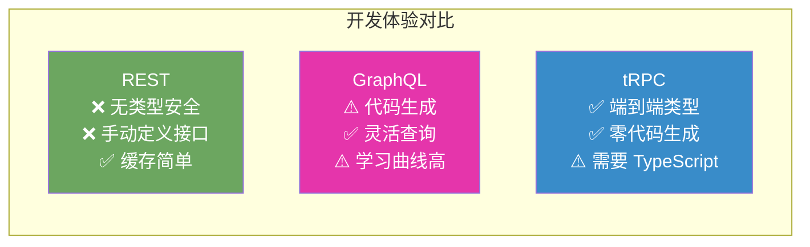

# tRPC 详解

## 什么是 tRPC？

tRPC（TypeScript Remote Procedure Call）是一个现代化的 TypeScript RPC 框架，它利用 TypeScript 的类型推导能力，实现端到端的类型安全，无需代码生成或 Schema 定义。

## tRPC 核心优势

```mermaid
graph TB
    subgraph "传统 API 开发流程"
        T1[定义 Schema] --> T2[代码生成]
        T2 --> T3[编写 Resolver]
        T3 --> T4[客户端调用]
        T4 --> T5[类型检查]
    end

    subgraph "tRPC 开发流程"
        R1[定义 Router] --> R2[类型自动推导]
        R2 --> R3[客户端直接调用]
        R3 --> R4[编译时类型检查]
    end

    style T1 fill:#6c757d,color:#fff
    style T2 fill:#6c757d,color:#fff
    style T3 fill:#6c757d,color:#fff
    style T4 fill:#6c757d,color:#fff
    style T5 fill:#6c757d,color:#fff

    style R1 fill:#398cc9,color:#fff
    style R2 fill:#398cc9,color:#fff
    style R3 fill:#398cc9,color:#fff
    style R4 fill:#398cc9,color:#fff

    Note[传统: 5 步 / tRPC: 4 步，无代码生成]
```



## tRPC 数据流



## tRPC 基础设置

### 安装依赖

```bash
# 服务端
npm install @trpc/server zod

# 客户端
npm install @trpc/client @trpc/react-query @tanstack/react-query
```

### 定义 Context

```typescript
// src/server/context.ts
import { inferAsyncReturnType } from '@trpc/server';
import { CreateHTTPContextOptions } from '@trpc/server/adapters/standalone';
import { verifyToken } from './auth';

export async function createContext({ req }: CreateHTTPContextOptions) {
  // 从 Header 获取 token
  const token = req.headers.authorization?.split(' ')[1];

  // 验证并获取用户信息
  const user = token ? await verifyToken(token) : null;

  return {
    user,
    prisma: new PrismaClient(),
  };
}

export type Context = inferAsyncReturnType<typeof createContext>;
```

### 创建 tRPC 实例

```typescript
// src/server/trpc.ts
import { initTRPC, TRPCError } from '@trpc/server';
import superjson from 'superjson';
import { Context } from './context';

const t = initTRPC.context<Context>().create({
  // 序列化器：支持 Date、Map、Set 等类型
  transformer: superjson,

  // 错误格式化
  errorFormatter({ shape, error }) {
    return {
      ...shape,
      data: {
        ...shape.data,
        zodError:
          error.code === 'BAD_REQUEST' && error.cause instanceof ZodError
            ? error.cause.flatten()
            : null,
      },
    };
  },
});

// 导出工具函数
export const router = t.router;
export const publicProcedure = t.procedure;
export const middleware = t.middleware;

// 认证中间件
const isAuthenticated = middleware(({ ctx, next }) => {
  if (!ctx.user) {
    throw new TRPCError({
      code: 'UNAUTHORIZED',
      message: '请先登录',
    });
  }

  return next({
    ctx: {
      user: ctx.user, // 类型收窄：确保 user 非空
    },
  });
});

// 需要认证的 Procedure
export const protectedProcedure = t.procedure.use(isAuthenticated);
```

## Router 定义

### 基础 Router

```typescript
// src/server/routers/user.ts
import { z } from 'zod';
import { router, publicProcedure, protectedProcedure } from '../trpc';

export const userRouter = router({
  // 查询单个用户
  getById: publicProcedure
    .input(z.object({ id: z.string().uuid() }))
    .query(async ({ input, ctx }) => {
      const user = await ctx.prisma.user.findUnique({
        where: { id: input.id },
        select: {
          id: true,
          name: true,
          email: true,
          createdAt: true,
        },
      });

      if (!user) {
        throw new TRPCError({
          code: 'NOT_FOUND',
          message: '用户不存在',
        });
      }

      return user;
    }),

  // 查询用户列表
  list: publicProcedure
    .input(
      z.object({
        limit: z.number().min(1).max(100).default(10),
        cursor: z.string().nullish(),
      })
    )
    .query(async ({ input, ctx }) => {
      const { limit, cursor } = input;

      const items = await ctx.prisma.user.findMany({
        take: limit + 1,
        cursor: cursor ? { id: cursor } : undefined,
        orderBy: { createdAt: 'desc' },
      });

      let nextCursor: typeof cursor = undefined;
      if (items.length > limit) {
        const nextItem = items.pop();
        nextCursor = nextItem!.id;
      }

      return {
        items,
        nextCursor,
      };
    }),

  // 创建用户
  create: publicProcedure
    .input(
      z.object({
        name: z.string().min(2).max(50),
        email: z.string().email(),
        password: z.string().min(8),
      })
    )
    .mutation(async ({ input, ctx }) => {
      const hashedPassword = await bcrypt.hash(input.password, 10);

      const user = await ctx.prisma.user.create({
        data: {
          ...input,
          password: hashedPassword,
        },
      });

      return { id: user.id, name: user.name, email: user.email };
    }),

  // 更新当前用户
  updateProfile: protectedProcedure
    .input(
      z.object({
        name: z.string().min(2).max(50).optional(),
        email: z.string().email().optional(),
      })
    )
    .mutation(async ({ input, ctx }) => {
      return ctx.prisma.user.update({
        where: { id: ctx.user.id },
        data: input,
        select: { id: true, name: true, email: true },
      });
    }),
});
```

### 合并 Router

```typescript
// src/server/routers/index.ts
import { router } from '../trpc';
import { userRouter } from './user';
import { postRouter } from './post';
import { commentRouter } from './comment';

export const appRouter = router({
  user: userRouter,
  post: postRouter,
  comment: commentRouter,
});

// 导出类型供客户端使用
export type AppRouter = typeof appRouter;
```

## 中间件和插件

### 日志中间件

```typescript
import { middleware } from '../trpc';

const loggerMiddleware = middleware(async ({ path, type, next, input }) => {
  const start = Date.now();

  console.log(`[tRPC] ${type} ${path} - Input:`, input);

  const result = await next();

  const duration = Date.now() - start;
  console.log(`[tRPC] ${type} ${path} - Duration: ${duration}ms`);

  return result;
});

// 使用中间件
const loggedProcedure = publicProcedure.use(loggerMiddleware);
```

### 速率限制中间件

```typescript
import { TRPCError } from '@trpc/server';
import { middleware } from '../trpc';

const rateLimitMap = new Map<string, { count: number; resetTime: number }>();

const rateLimitMiddleware = middleware(async ({ ctx, next, path }) => {
  const ip = ctx.req.ip || 'unknown';
  const key = `${ip}:${path}`;
  const now = Date.now();
  const limit = 100; // 每分钟 100 次
  const window = 60 * 1000; // 1 分钟

  const record = rateLimitMap.get(key);

  if (!record || now > record.resetTime) {
    rateLimitMap.set(key, { count: 1, resetTime: now + window });
  } else if (record.count >= limit) {
    throw new TRPCError({
      code: 'TOO_MANY_REQUESTS',
      message: '请求过于频繁，请稍后再试',
    });
  } else {
    record.count++;
  }

  return next();
});
```

## 前端集成

### React + tRPC

```typescript
// src/client/trpc.ts
import { createTRPCReact } from '@trpc/react-query';
import type { AppRouter } from '../server/routers';

export const trpc = createTRPCReact<AppRouter>();

// src/client/main.tsx
import { QueryClient, QueryClientProvider } from '@tanstack/react-query';
import { httpBatchLink } from '@trpc/client';
import superjson from 'superjson';
import { trpc } from './trpc';

function App() {
  const [queryClient] = useState(() => new QueryClient());
  const [trpcClient] = useState(() =>
    trpc.createClient({
      links: [
        httpBatchLink({
          url: 'http://localhost:3000/trpc',
          headers() {
            const token = localStorage.getItem('token');
            return token ? { Authorization: `Bearer ${token}` } : {};
          },
        }),
      ],
      transformer: superjson,
    })
  );

  return (
    <trpc.Provider client={trpcClient} queryClient={queryClient}>
      <QueryClientProvider client={queryClient}>
        <App />
      </QueryClientProvider>
    </trpc.Provider>
  );
}
```

### 使用 Hooks

```typescript
// src/client/components/UserList.tsx
import { trpc } from '../trpc';

export function UserList() {
  const { data, isLoading, error, fetchNextPage, hasNextPage } =
    trpc.user.list.useInfiniteQuery(
      { limit: 10 },
      { getNextPageParam: (lastPage) => lastPage.nextCursor }
    );

  if (isLoading) return <div>加载中...</div>;
  if (error) return <div>错误: {error.message}</div>;

  return (
    <div>
      {data.pages.map((page) =>
        page.items.map((user) => (
          <div key={user.id}>
            <h3>{user.name}</h3>
            <p>{user.email}</p>
          </div>
        ))
      )}
      {hasNextPage && (
        <button onClick={() => fetchNextPage()}>加载更多</button>
      )}
    </div>
  );
}

// src/client/components/CreateUser.tsx
export function CreateUser() {
  const utils = trpc.useUtils();

  const createUser = trpc.user.create.useMutation({
    // 成功后使缓存失效，重新获取数据
    onSuccess: () => {
      utils.user.list.invalidate();
    },
  });

  const handleSubmit = async (data: CreateUserInput) => {
    try {
      await createUser.mutateAsync(data);
      alert('创建成功！');
    } catch (error) {
      alert(`创建失败: ${error.message}`);
    }
  };

  return <form onSubmit={handleSubmit}>...</form>;
}
```

## 实际项目结构



## tRPC vs GraphQL vs REST



| 特性 | REST | GraphQL | tRPC |
|------|------|---------|------|
| **类型安全** | ❌ 需额外工具 | ⚠️ 需 Codegen | ✅ 原生支持 |
| **学习曲线** | 低 | 中 | 低 |
| **灵活性** | 低 | 高 | 中 |
| **代码生成** | 不需要 | 需要 | 不需要 |
| **缓存支持** | ✅ HTTP 缓存 | ⚠️ 需额外实现 | ⚠️ 依赖传输层 |
| **适用场景** | 公共 API | 复杂查询 | 全栈 TS 项目 |
| **实时支持** | WebSocket | Subscription | Subscription |

## 最佳实践

### 1. 输入验证

```typescript
// 始终使用 Zod 进行输入验证
const userSchema = z.object({
  name: z.string()
    .min(2, '名称至少 2 个字符')
    .max(50, '名称最多 50 个字符')
    .trim(),
  email: z.string()
    .email('请输入有效的邮箱地址')
    .toLowerCase(),
  age: z.number()
    .int('年龄必须是整数')
    .min(0, '年龄不能为负')
    .max(150, '年龄不能超过 150')
    .optional(),
});

// 使用 schema
const createUser = publicProcedure
  .input(userSchema)
  .mutation(async ({ input }) => {
    // input 已经通过验证，类型安全
  });
```

### 2. 错误处理

```typescript
import { TRPCError } from '@trpc/server';

// 抛出具体的错误
throw new TRPCError({
  code: 'NOT_FOUND',
  message: '用户不存在',
  cause: originalError, // 可选：保留原始错误
});

// 错误码对应 HTTP 状态码
// BAD_REQUEST -> 400
// UNAUTHORIZED -> 401
// FORBIDDEN -> 403
// NOT_FOUND -> 404
// TOO_MANY_REQUESTS -> 429
// INTERNAL_SERVER_ERROR -> 500
```

### 3. 分页模式

```typescript
// Cursor-based 分页（推荐）
const list = publicProcedure
  .input(
    z.object({
      limit: z.number().min(1).max(100).default(10),
      cursor: z.string().nullish(),
    })
  )
  .query(async ({ input }) => {
    const { limit, cursor } = input;

    const items = await prisma.post.findMany({
      take: limit + 1,
      cursor: cursor ? { id: cursor } : undefined,
      orderBy: { createdAt: 'desc' },
    });

    const hasMore = items.length > limit;
    if (hasMore) items.pop();

    return {
      items,
      nextCursor: hasMore ? items[items.length - 1]?.id : undefined,
    };
  });
```

### 4. 订阅（实时更新）

```typescript
import { observable } from '@trpc/server/observable';
import { EventEmitter } from 'events';

const ee = new EventEmitter();

const postRouter = router({
  // 发布帖子
  create: protectedProcedure
    .input(postSchema)
    .mutation(async ({ input, ctx }) => {
      const post = await prisma.post.create({
        data: { ...input, authorId: ctx.user.id },
      });

      // 触发事件
      ee.emit('post.created', post);

      return post;
    }),

  // 订阅新帖子
  onCreated: publicProcedure.subscription(() => {
    return observable<Post>((emit) => {
      const onCreate = (post: Post) => {
        emit.next(post);
      };

      ee.on('post.created', onCreate);

      return () => {
        ee.off('post.created', onCreate);
      };
    });
  }),
});
```

## 面试要点

### 常见问题

1. **tRPC 如何实现端到端类型安全？**

   tRPC 利用 TypeScript 的类型推导能力：
   - 定义 Router 时，输入（Zod Schema）和输出类型自动推导
   - 通过 `export type AppRouter = typeof appRouter` 导出类型
   - 客户端使用该类型创建 tRPC 客户端，获得完整的类型提示
   - 整个过程无需代码生成，完全依赖 TypeScript 编译器

2. **tRPC 与 GraphQL 的主要区别？**

   - **类型系统**：tRPC 使用 TypeScript 原生类型，GraphQL 需要自己的类型系统 + Codegen
   - **灵活性**：GraphQL 允许客户端灵活查询，tRPC 是固定的数据结构
   - **学习曲线**：tRPC 更低，特别是对于 TypeScript 开发者
   - **适用场景**：tRPC 适合全栈 TS 项目，GraphQL 适合复杂数据需求

3. **tRPC 的局限性是什么？**

   - 需要 TypeScript（不支持纯 JavaScript）
   - 耦合前后端（共享类型意味着共享代码）
   - 不适合公共 API（客户端需要访问服务端类型）
   - 缓存需要额外处理（没有像 GraphQL 那样的标准化缓存方案）

4. **如何处理 tRPC 的错误？**

   ```typescript
   // 服务端：抛出具体错误
   throw new TRPCError({
     code: 'NOT_FOUND',
     message: '资源不存在',
   });

   // 客户端：捕获并处理
   try {
     await trpc.user.getById.mutate({ id: '123' });
   } catch (error) {
     if (error.data?.code === 'NOT_FOUND') {
       // 处理 404
     }
   }
   ```

## 总结

tRPC 是一个优秀的全栈 TypeScript API 框架，它的核心优势：
- **零代码生成**：直接使用 TypeScript 类型
- **端到端类型安全**：编译时发现问题
- **开发体验优秀**：自动类型推导、代码补全
- **快速迭代**：修改服务端类型，客户端立即感知

最适合的场景是：全栈 TypeScript 项目、前后端同一仓库、内部 API。

## 延伸阅读

- [tRPC 官方文档](https://trpc.io/docs)
- [tRPC GitHub](https://github.com/trpc/trpc)
- [Zod 文档](https://zod.dev/)
- [GraphQL 详解](./graphql.md)
