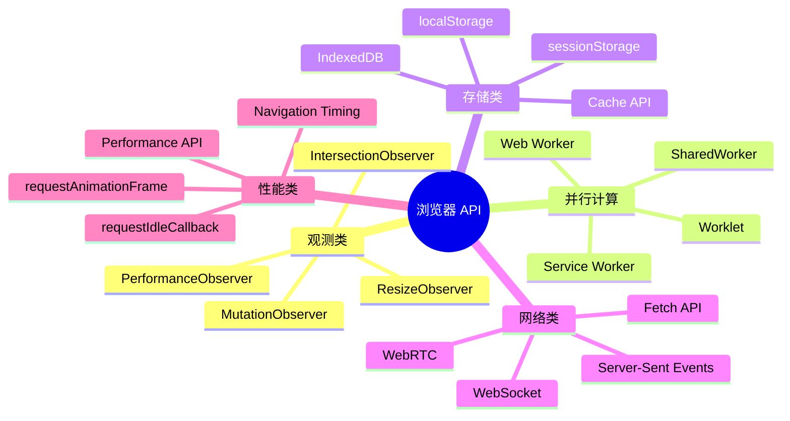
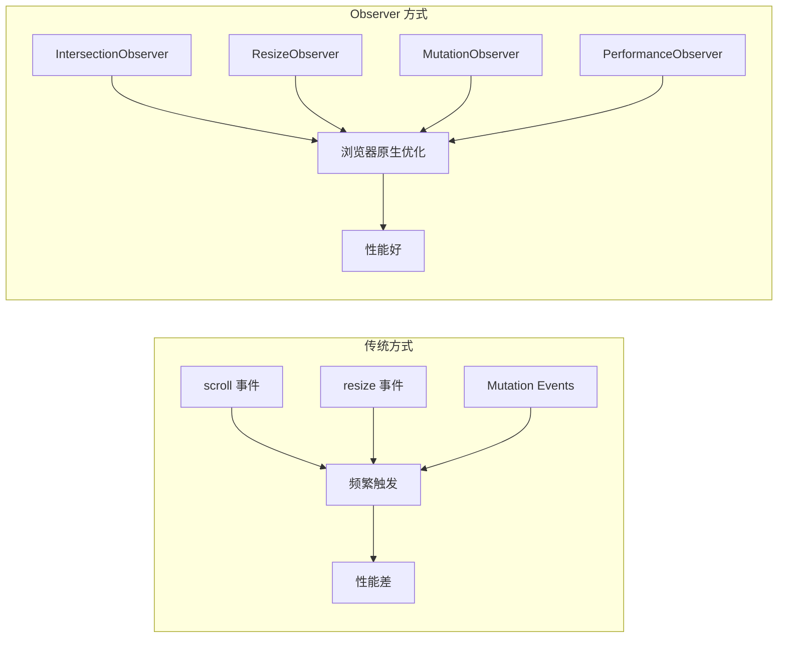
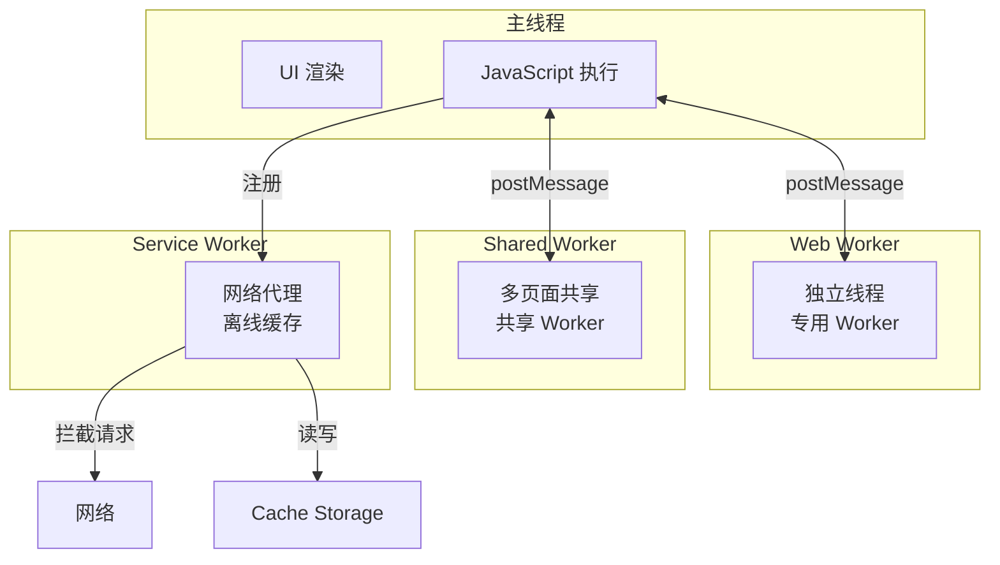

# 浏览器 API 概述

现代浏览器提供了丰富的 API，帮助开发者实现高性能、高体验的 Web 应用。本模块深入讲解前端面试中高频出现的浏览器 API。

## API 全景图

## 学习路径

| 章节 | 内容 | 核心考点 |
|------|------|---------|
| [IntersectionObserver](./intersection-observer.md) | 懒加载、无限滚动、广告曝光 | 为什么比 scroll 事件性能更好 |
| [Web Worker](./web-worker.md) | 多线程、SharedWorker、Comlink | 主线程与 Worker 的通信机制 |
| [Service Worker](./service-worker.md) | 生命周期、缓存策略、离线优先 | 缓存策略选型与生命周期管理 |

## Observer 模式总览

浏览器提供了一系列 Observer API，用于替代传统的事件监听方式：

| Observer | 用途 | 替代方案 |
|----------|------|---------|
| IntersectionObserver | 元素可见性检测 | scroll 事件 + getBoundingClientRect |
| ResizeObserver | 元素尺寸变化 | resize 事件 + offsetWidth/Height |
| MutationObserver | DOM 变化监听 | Mutation Events（已废弃） |
| PerformanceObserver | 性能指标采集 | performance.timing（已废弃） |

## Worker 体系

## 面试通用要点

1. **为什么需要这些 API** — 浏览器主线程同时负责 UI 渲染和 JS 执行，长时间运行的任务会阻塞渲染
2. **异步与非阻塞** — 这些 API 的核心设计理念是将耗时操作移出主线程
3. **浏览器兼容性** — 需要了解 polyfill 方案和降级策略
4. **性能优化视角** — 这些 API 本质上都是性能优化工具
