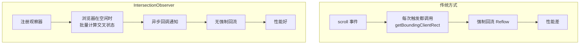
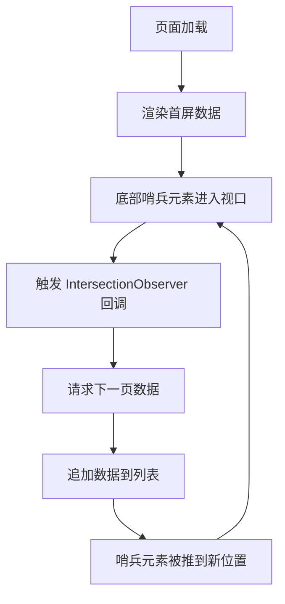
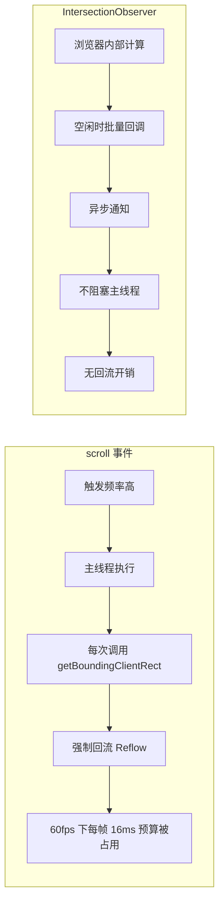

# IntersectionObserver 详解

IntersectionObserver 提供了一种异步观察目标元素与祖先元素或视口交叉状态变化的方式，是实现懒加载、无限滚动、广告曝光等场景的核心 API。

## 工作原理



IntersectionObserver 由浏览器在内部优化的线程中计算元素交叉，避免了在主线程中频繁调用 `getBoundingClientRect` 导致的回流。

## 核心 API

```javascript
const observer = new IntersectionObserver(callback, options);
```

### 参数说明

| 参数 | 类型 | 说明 |
|------|------|------|
| callback | Function | 交叉状态变化时的回调函数 |
| options.root | Element | 观测的根元素，默认为视口 |
| options.rootMargin | string | 根元素的外边距，类似 CSS margin |
| options.threshold | number/array | 触发回调的交叉比例阈值 |

### Callback 参数

```javascript
const observer = new IntersectionObserver((entries) => {
  entries.forEach((entry) => {
    console.log(entry.isIntersecting);    // 是否可见
    console.log(entry.intersectionRatio); // 交叉比例 0~1
    console.log(entry.boundingClientRect); // 元素位置信息
    console.log(entry.rootBounds);         // 根元素位置
    console.log(entry.target);             // 被观察的元素
    console.log(entry.time);               // 交叉时间戳
  });
}, {
  threshold: [0, 0.25, 0.5, 0.75, 1],
});
```

## 场景一：图片懒加载

### 基础实现

```javascript
class LazyLoader {
  constructor(options = {}) {
    this.rootMargin = options.rootMargin || '200px 0px';
    this.observer = null;
  }

  observe() {
    const images = document.querySelectorAll('[data-src]');

    this.observer = new IntersectionObserver(
      (entries) => {
        entries.forEach((entry) => {
          if (entry.isIntersecting) {
            this.loadImage(entry.target);
            this.observer.unobserve(entry.target);
          }
        });
      },
      { rootMargin: this.rootMargin }
    );

    images.forEach((img) => this.observer.observe(img));
  }

  loadImage(img) {
    const src = img.dataset.src;
    if (!src) return;

    img.src = src;
    img.removeAttribute('data-src');

    img.onload = () => img.classList.add('loaded');
    img.onerror = () => img.src = '/placeholder.png';
  }

  disconnect() {
    this.observer?.disconnect();
  }
}

// 使用
const loader = new LazyLoader({ rootMargin: '300px 0px' });
loader.observe();
```

### HTML 结构

```html


```

### React 自定义 Hook

```javascript
import { useEffect, useRef, useState } from 'react';

function useLazyLoad(options = {}) {
  const ref = useRef(null);
  const [isVisible, setIsVisible] = useState(false);

  useEffect(() => {
    const element = ref.current;
    if (!element) return;

    const observer = new IntersectionObserver(
      ([entry]) => {
        if (entry.isIntersecting) {
          setIsVisible(true);
          observer.unobserve(element);
        }
      },
      { rootMargin: '200px 0px', ...options }
    );

    observer.observe(element);
    return () => observer.disconnect();
  }, []);

  return { ref, isVisible };
}

// 使用
function LazyImage({ src, alt }) {
  const { ref, isVisible } = useLazyLoad();

  return (
    <div ref={ref} className="lazy-container">
      {isVisible ? (
        
      ) : (
        <div className="placeholder" />
      )}
    </div>
  );
}
```

## 场景二：无限滚动



### 实现

```javascript
class InfiniteScroller {
  constructor(container, options) {
    this.container = container;
    this.loadMore = options.loadMore;
    this.threshold = options.threshold || 200;
    this.loading = false;
    this.hasMore = true;

    this.sentinel = document.createElement('div');
    this.sentinel.className = 'scroll-sentinel';
    this.container.appendChild(this.sentinel);

    this.observer = new IntersectionObserver(
      (entries) => {
        const entry = entries[0];
        if (entry.isIntersecting && !this.loading && this.hasMore) {
          this.loadItems();
        }
      },
      { rootMargin: `${this.threshold}px` }
    );

    this.observer.observe(this.sentinel);
  }

  async loadItems() {
    this.loading = true;
    this.sentinel.textContent = '加载中...';

    try {
      const { items, hasMore } = await this.loadMore();
      this.hasMore = hasMore;

      items.forEach((item) => {
        const el = this.createItemElement(item);
        this.container.insertBefore(el, this.sentinel);
      });

      if (!hasMore) {
        this.observer.unobserve(this.sentinel);
        this.sentinel.textContent = '没有更多了';
      }
    } catch (error) {
      this.sentinel.textContent = '加载失败，点击重试';
      this.sentinel.onclick = () => this.loadItems();
    } finally {
      this.loading = false;
    }
  }

  createItemElement(item) {
    const div = document.createElement('div');
    div.className = 'list-item';
    div.textContent = item.title;
    return div;
  }

  disconnect() {
    this.observer?.disconnect();
  }
}

// 使用
const scroller = new InfiniteScroller(
  document.getElementById('list'),
  {
    loadMore: async () => {
      const res = await fetch(`/api/items?page=${currentPage++}`);
      return res.json();
    },
  }
);
```

## 场景三：广告曝光统计

```javascript
class AdExposureTracker {
  constructor() {
    this.exposedAds = new Set();

    this.observer = new IntersectionObserver(
      (entries) => {
        entries.forEach((entry) => {
          if (entry.isIntersecting) {
            this.handleExposure(entry.target);
          }
        });
      },
      {
        threshold: 0.5, // 50% 可见才算曝光
        rootMargin: '0px',
      }
    );
  }

  track(adElement) {
    const adId = adElement.dataset.adId;
    if (!adId || this.exposedAds.has(adId)) return;
    this.observer.observe(adElement);
  }

  handleExposure(element) {
    const adId = element.dataset.adId;

    // 需要可见持续 1 秒才算有效曝光
    const timer = setTimeout(() => {
      if (this.isStillVisible(element)) {
        this.exposedAds.add(adId);
        this.reportExposure(adId);
        this.observer.unobserve(element);
      }
    }, 1000);

    // 如果在 1 秒内离开视口，取消计时
    element._exposureTimer = timer;
  }

  isStillVisible(element) {
    const rect = element.getBoundingClientRect();
    return (
      rect.top < window.innerHeight &&
      rect.bottom > 0 &&
      rect.left < window.innerWidth &&
      rect.right > 0
    );
  }

  reportExposure(adId) {
    // 上报曝光数据
    navigator.sendBeacon('/api/ad/exposure', JSON.stringify({
      adId,
      timestamp: Date.now(),
    }));
  }

  disconnect() {
    this.observer?.disconnect();
  }
}

// 使用
const tracker = new AdExposureTracker();
document.querySelectorAll('[data-ad-id]').forEach((ad) => {
  tracker.track(ad);
});
```

## 场景四：吸顶导航

```javascript
function setupStickyNav() {
  const nav = document.querySelector('.sticky-nav');
  const sentinel = document.createElement('div');
  sentinel.className = 'nav-sentinel';
  nav.parentNode.insertBefore(sentinel, nav);

  const observer = new IntersectionObserver(
    ([entry]) => {
      // 哨兵元素离开视口时，说明导航需要吸顶
      nav.classList.toggle('is-stuck', !entry.isIntersecting);
    },
    { threshold: [1], rootMargin: '-1px 0px 0px 0px' }
  );

  observer.observe(sentinel);
}

// CSS
// .sticky-nav.is-stuck { position: fixed; top: 0; box-shadow: ... }
```

## 性能对比



| 维度 | scroll 事件 | IntersectionObserver |
|------|-------------|---------------------|
| 计算时机 | 每次滚动 | 浏览器内部优化 |
| 主线程占用 | 高（同步计算） | 低（异步回调） |
| 回流风险 | 高（getBoundingClientRect） | 无 |
| 节流需求 | 必须手动节流 | 不需要 |
| 元素定位 | 只能相对于视口 | 可自定义 root |

## 浏览器兼容性与 Polyfill

```javascript
// Polyfill 方案
if (!('IntersectionObserver' in window)) {
  // 动态加载 polyfill
  await import('intersection-observer');

  // 或使用简单的降级方案
  const images = document.querySelectorAll('[data-src]');
  images.forEach((img) => {
    img.src = img.dataset.src;
  });
}
```

## 面试要点

1. **为什么比 scroll 事件性能好** — 浏览器在内部线程计算交叉，异步回调，不触发回流
2. **threshold 的含义** — 交叉比例达到指定值时触发回调，可以传数组监听多个阈值
3. **rootMargin 的作用** — 扩大或缩小根元素的判定范围，常用于提前加载
4. **如何实现懒加载** — 监听元素进入视口，替换 data-src 到 src，然后 unobserve
5. **如何实现无限滚动** — 在列表底部放置哨兵元素，进入视口时加载更多
6. **广告曝光的有效性** — 需要满足可见面积比例 + 持续时间两个条件
7. **浏览器兼容性** — IE 不支持，需要 polyfill 或降级方案
