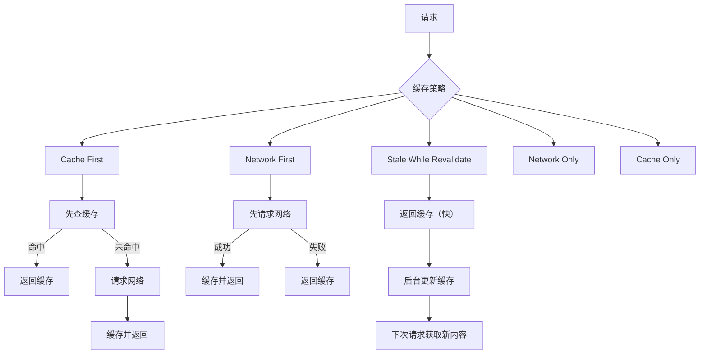
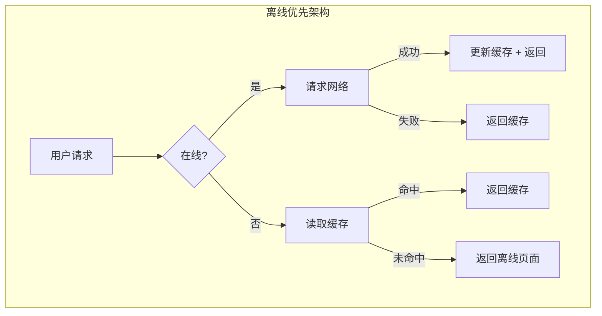
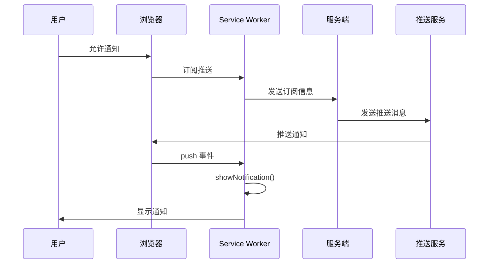

# Service Worker 详解

Service Worker 是一个运行在浏览器后台的脚本，独立于网页，可以拦截网络请求、缓存资源、实现离线访问和推送通知。它是 PWA 的核心技术。

## Service Worker 生命周期

```mermaid
stateDiagram-v2
    [*] --> Installing: navigator.serviceWorker.register()
    Installing --> Installed: 安装成功
    Installing --> Redundant: 安装失败
    Installed --> Activating: 前一个 SW 已退出 / skipWaiting()
    Activating --> Activated: 激活成功
    Activating --> Redundant: 激活失败
    Activated --> Activated: 处理 fetch/push 等事件
    Activated --> Installing: 新版本 SW 开始安装
    Installing --> Installed: 新版本安装完成
    note right of Activated: 控制所有页面
    note right of Redundant: 被废弃
```



### 注册与安装

```javascript
// main.js — 注册 Service Worker
if ('serviceWorker' in navigator) {
  window.addEventListener('load', async () => {
    try {
      const registration = await navigator.serviceWorker.register('/sw.js', {
        scope: '/',           // 控制范围
        updateViaCache: 'none', // 不通过 HTTP 缓存更新 SW
      });

      console.log('SW 注册成功:', registration.scope);

      // 监听更新
      registration.addEventListener('updatefound', () => {
        const newWorker = registration.installing;
        newWorker.addEventListener('statechange', () => {
          if (newWorker.state === 'activated') {
            showUpdateNotification();
          }
        });
      });
    } catch (error) {
      console.error('SW 注册失败:', error);
    }
  });
}
```

```javascript
// sw.js — Service Worker 安装
const CACHE_NAME = 'app-v1';
const STATIC_ASSETS = [
  '/',
  '/index.html',
  '/styles/main.css',
  '/scripts/app.js',
  '/images/logo.png',
  '/offline.html',
];

// 安装阶段：预缓存静态资源
self.addEventListener('install', (event) => {
  console.log('[SW] 安装中...');
  event.waitUntil(
    caches.open(CACHE_NAME)
      .then((cache) => {
        console.log('[SW] 预缓存静态资源');
        return cache.addAll(STATIC_ASSETS);
      })
      .then(() => self.skipWaiting()) // 立即激活
  );
});
```

```javascript
// 激活阶段：清理旧缓存
self.addEventListener('activate', (event) => {
  console.log('[SW] 激活中...');
  event.waitUntil(
    caches.keys()
      .then((cacheNames) => {
        return Promise.all(
          cacheNames
            .filter((name) => name !== CACHE_NAME)
            .map((name) => {
              console.log('[SW] 删除旧缓存:', name);
              return caches.delete(name);
            })
        );
      })
      .then(() => self.clients.claim()) // 立即控制所有页面
  );
});
```

## 缓存策略



### 策略实现

```javascript
// sw.js — 缓存策略实现

// 策略一：Cache First（静态资源）
async function cacheFirst(request) {
  const cached = await caches.match(request);
  if (cached) return cached;

  const response = await fetch(request);
  if (response.ok) {
    const cache = await caches.open(CACHE_NAME);
    cache.put(request, response.clone());
  }
  return response;
}

// 策略二：Network First（API 请求）
async function networkFirst(request) {
  try {
    const response = await fetch(request);
    if (response.ok) {
      const cache = await caches.open(CACHE_NAME);
      cache.put(request, response.clone());
    }
    return response;
  } catch (error) {
    const cached = await caches.match(request);
    return cached || new Response('离线', { status: 503 });
  }
}

// 策略三：Stale While Revalidate（频繁更新的资源）
async function staleWhileRevalidate(request) {
  const cache = await caches.open(CACHE_NAME);
  const cached = await cache.match(request);

  const fetchPromise = fetch(request).then((response) => {
    if (response.ok) {
      cache.put(request, response.clone());
    }
    return response;
  }).catch(() => cached);

  return cached || fetchPromise;
}

// 拦截请求
self.addEventListener('fetch', (event) => {
  const { request } = event;
  const url = new URL(request.url);

  // API 请求 → Network First
  if (url.pathname.startsWith('/api/')) {
    event.respondWith(networkFirst(request));
    return;
  }

  // 静态资源 → Cache First
  if (request.destination === 'style' || request.destination === 'script') {
    event.respondWith(cacheFirst(request));
    return;
  }

  // 图片 → Stale While Revalidate
  if (request.destination === 'image') {
    event.respondWith(staleWhileRevalidate(request));
    return;
  }

  // 其他请求 → Network First
  event.respondWith(networkFirst(request));
});
```

### 缓存策略选型指南

| 策略 | 适用场景 | 优点 | 缺点 |
|------|---------|------|------|
| Cache First | 静态资源、字体、图标 | 速度快，离线可用 | 更新不及时 |
| Network First | API 请求、动态内容 | 数据最新 | 离线不可用 |
| Stale While Revalidate | 频繁更新但可接受旧数据 | 速度与新鲜度平衡 | 短暂不一致 |
| Network Only | 实时数据、敏感操作 | 数据实时 | 离线不可用 |
| Cache Only | 预缓存的静态资源 | 极快 | 需要预缓存 |

## 离线优先应用



### 离线页面与数据同步

```javascript
// sw.js — 离线优先 + 数据同步
const STATIC_CACHE = 'static-v1';
const DYNAMIC_CACHE = 'dynamic-v1';
const OFFLINE_URL = '/offline.html';

self.addEventListener('install', (event) => {
  event.waitUntil(
    caches.open(STATIC_CACHE).then((cache) =>
      cache.addAll([
        '/',
        '/index.html',
        '/offline.html',
        '/styles/main.css',
        '/scripts/app.js',
      ])
    )
  );
});

self.addEventListener('fetch', (event) => {
  if (event.request.mode === 'navigate') {
    event.respondWith(
      fetch(event.request)
        .then((response) => {
          const clone = response.clone();
          caches.open(DYNAMIC_CACHE).then((cache) => cache.put(event.request, clone));
          return response;
        })
        .catch(() => caches.match(OFFLINE_URL))
    );
    return;
  }

  event.respondWith(
    caches.match(event.request).then((cached) => {
      const fetchPromise = fetch(event.request).then((response) => {
        if (response.ok) {
          caches.open(DYNAMIC_CACHE).then((cache) =>
            cache.put(event.request, response.clone())
          );
        }
        return response;
      });
      return cached || fetchPromise;
    })
  );
});

// 后台同步
self.addEventListener('sync', (event) => {
  if (event.tag === 'sync-drafts') {
    event.waitUntil(syncDrafts());
  }
});

async function syncDrafts() {
  const db = await openDB();
  const drafts = await db.getAll('drafts');

  for (const draft of drafts) {
    try {
      await fetch('/api/drafts', {
        method: 'POST',
        body: JSON.stringify(draft),
      });
      await db.delete('drafts', draft.id);
    } catch (error) {
      console.error('同步失败:', error);
    }
  }
}
```

## 推送通知



### 订阅与发送

```javascript
// main.js — 订阅推送
async function subscribeToPush() {
  const registration = await navigator.serviceWorker.ready;

  const subscription = await registration.pushManager.subscribe({
    userVisibleOnly: true,
    applicationServerKey: urlBase64ToUint8Array(VAPID_PUBLIC_KEY),
  });

  // 发送订阅信息到服务端
  await fetch('/api/push/subscribe', {
    method: 'POST',
    headers: { 'Content-Type': 'application/json' },
    body: JSON.stringify(subscription),
  });
}

function urlBase64ToUint8Array(base64String) {
  const padding = '='.repeat((4 - (base64String.length % 4)) % 4);
  const base64 = (base64String + padding).replace(/-/g, '+').replace(/_/g, '/');
  const rawData = window.atob(base64);
  return Uint8Array.from([...rawData].map((c) => c.charCodeAt(0)));
}
```

```javascript
// sw.js — 处理推送
self.addEventListener('push', (event) => {
  const data = event.data?.json() ?? {
    title: '新通知',
    body: '您有一条新消息',
  };

  const options = {
    body: data.body,
    icon: '/images/icon-192.png',
    badge: '/images/badge-72.png',
    vibrate: [100, 50, 100],
    data: { url: data.url },
    actions: [
      { action: 'open', title: '打开' },
      { action: 'dismiss', title: '忽略' },
    ],
  };

  event.waitUntil(
    self.registration.showNotification(data.title, options)
  );
});

// 处理通知点击
self.addEventListener('notificationclick', (event) => {
  event.notification.close();

  if (event.action === 'dismiss') return;

  event.waitUntil(
    clients.matchAll({ type: 'window' }).then((windowClients) => {
      const url = event.notification.data?.url || '/';

      // 如果已有窗口打开，聚焦它
      for (const client of windowClients) {
        if (client.url === url && 'focus' in client) {
          return client.focus();
        }
      }
      // 否则打开新窗口
      return clients.openWindow(url);
    })
  );
});
```

## 版本更新策略

```javascript
// main.js — 检查更新并提示用户
class UpdateManager {
  constructor() {
    this.registration = null;
  }

  async init() {
    this.registration = await navigator.serviceWorker.ready;

    // 每小时检查一次更新
    setInterval(() => this.checkUpdate(), 60 * 60 * 1000);

    // 监听新 Worker 安装完成
    this.registration.addEventListener('updatefound', () => {
      const newWorker = this.registration.installing;
      newWorker.addEventListener('statechange', () => {
        if (newWorker.state === 'installed' && navigator.serviceWorker.controller) {
          this.showUpdatePrompt(newWorker);
        }
      });
    });
  }

  async checkUpdate() {
    await this.registration.update();
  }

  showUpdatePrompt(newWorker) {
    // 显示更新提示
    const confirmed = confirm('发现新版本，是否更新？');
    if (confirmed) {
      newWorker.postMessage({ type: 'skipWaiting' });
      window.location.reload();
    }
  }
}

// sw.js — 接收跳过等待消息
self.addEventListener('message', (event) => {
  if (event.data.type === 'skipWaiting') {
    self.skipWaiting();
  }
});
```

## Workbox — 生产级 SW 工具库

```javascript
// sw.js — 使用 Workbox
import { registerRoute } from 'workbox-routing';
import { CacheFirst, NetworkFirst, StaleWhileRevalidate } from 'workbox-strategies';
import { ExpirationPlugin } from 'workbox-expiration';
import { precacheAndRoute } from 'workbox-precaching';

// 预缓存构建产物
precacheAndRoute(self.__WB_MANIFEST);

// 静态资源 — Cache First
registerRoute(
  ({ request }) => ['style', 'script', 'font'].includes(request.destination),
  new CacheFirst({
    cacheName: 'static-resources',
    plugins: [
      new ExpirationPlugin({ maxEntries: 100, maxAgeSeconds: 30 * 24 * 60 * 60 }),
    ],
  })
);

// API 请求 — Network First
registerRoute(
  ({ url }) => url.pathname.startsWith('/api/'),
  new NetworkFirst({
    cacheName: 'api-cache',
    plugins: [
      new ExpirationPlugin({ maxEntries: 50, maxAgeSeconds: 5 * 60 }),
    ],
  })
);

// 图片 — Stale While Revalidate
registerRoute(
  ({ request }) => request.destination === 'image',
  new StaleWhileRevalidate({
    cacheName: 'images',
    plugins: [
      new ExpirationPlugin({ maxEntries: 200, maxAgeSeconds: 7 * 24 * 60 * 60 }),
    ],
  })
);
```

## 面试要点

1. **Service Worker 的本质** — 浏览器后台脚本，独立于页面，可拦截网络请求
2. **生命周期三阶段** — installing → activating → activated，理解每个阶段的作用
3. **缓存策略选型** — 根据资源类型选择 Cache First、Network First 或 Stale While Revalidate
4. **离线优先实现** — 预缓存关键资源，API 请求优先网络、降级缓存
5. **推送通知流程** — 订阅 → 发送订阅到服务端 → 服务端通过推送服务发送 → SW 处理 push 事件
6. **skipWaiting 与 clients.claim** — 控制新版本 SW 的激活时机
7. **安全要求** — 必须在 HTTPS 下运行（localhost 除外）
8. **与 Web Worker 的区别** — SW 是网络代理层，Web Worker 是计算层
