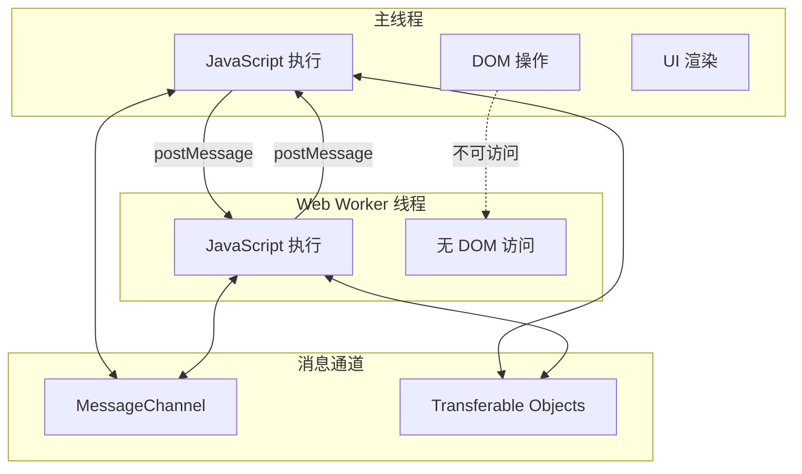
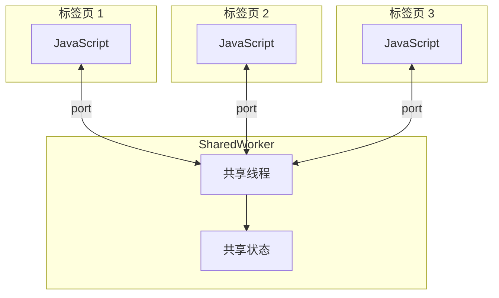
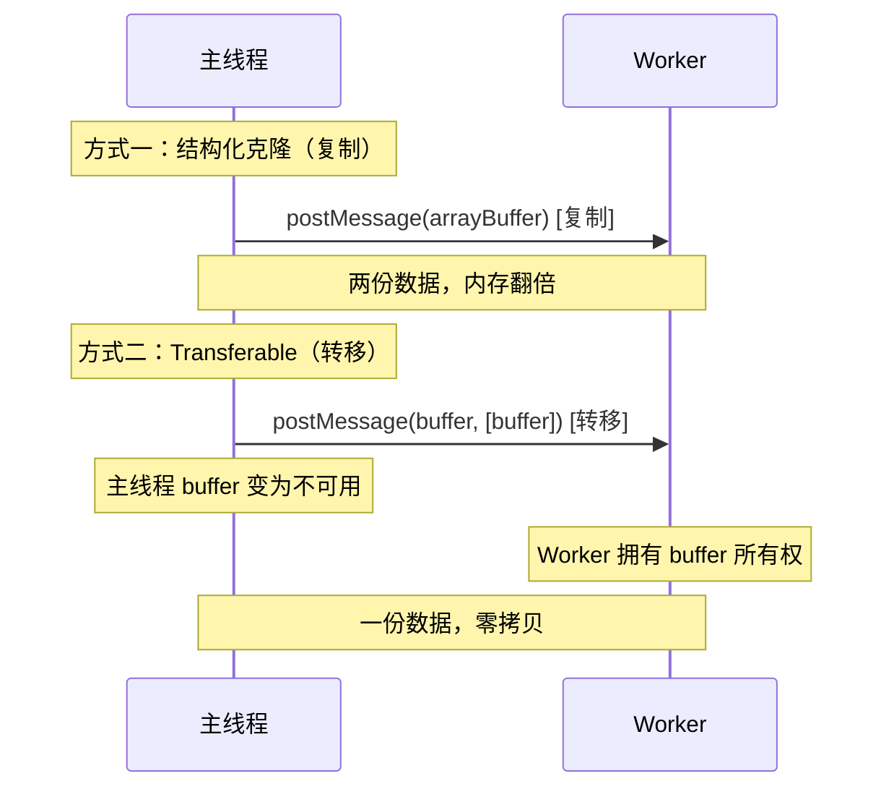
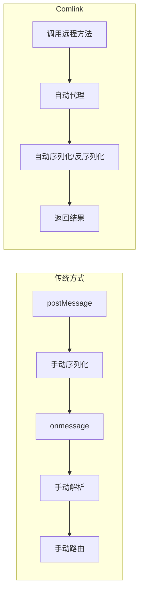

# Web Worker 与 SharedWorker

Web Worker 允许在后台线程中运行 JavaScript，避免耗时计算阻塞主线程的 UI 渲染。本文深入讲解 Worker 的通信机制、SharedWorker、Transferable Objects 以及 Comlink 等高级用法。

## Worker 通信模型



## Web Worker 基础

### 创建 Worker

```javascript
// main.js — 主线程
const worker = new Worker(new URL('./worker.js', import.meta.url), {
  type: 'module',  // 支持 ES Module
  name: 'my-worker',
});

// 发送消息
worker.postMessage({ type: 'calculate', data: [1, 2, 3, 4, 5] });

// 接收消息
worker.onmessage = (event) => {
  console.log('计算结果:', event.data);
};

// 错误处理
worker.onerror = (error) => {
  console.error('Worker 错误:', error.message);
};
```

```javascript
// worker.js — Worker 线程
self.onmessage = (event) => {
  const { type, data } = event.data;

  switch (type) {
    case 'calculate':
      const result = heavyCalculation(data);
      self.postMessage({ type: 'result', data: result });
      break;
  }
};

function heavyCalculation(data) {
  // 模拟耗时计算
  let sum = 0;
  for (let i = 0; i < 1e9; i++) {
    sum += i;
  }
  return data.reduce((a, b) => a + b, 0) + sum;
}
```

### Worker 内可用的 API

Worker 中不能访问 DOM，但可以使用以下 API：

| 可用 | 不可用 |
|------|--------|
| setTimeout / setInterval | DOM API |
| Fetch / XMLHttpRequest | document / window |
| WebSocket | alert / confirm |
| IndexedDB | localStorage |
| Cache API | sessionStorage |
| WebAssembly | Canvas (需要 OffscreenCanvas) |
| crypto | Web Audio |
| URL / Blob | Web Animations |

## SharedWorker

SharedWorker 可以被多个页面共享，适用于跨标签页通信和共享状态。



### SharedWorker 实现

```javascript
// shared-worker.js
const connections = [];
let sharedState = { count: 0, messages: [] };

self.onconnect = (event) => {
  const port = event.ports[0];
  connections.push(port);

  port.onmessage = (e) => {
    const { type, payload } = e.data;

    switch (type) {
      case 'increment':
        sharedState.count++;
        broadcast({ type: 'stateUpdate', payload: sharedState });
        break;
      case 'sendMessage':
        sharedState.messages.push(payload);
        broadcast({ type: 'newMessage', payload });
        break;
      case 'getState':
        port.postMessage({ type: 'stateUpdate', payload: sharedState });
        break;
    }
  };

  port.start();
};

function broadcast(message) {
  const data = JSON.stringify(message);
  connections.forEach((port) => {
    port.postMessage(data);
  });
}
```

```javascript
// 页面中使用 SharedWorker
function connectSharedWorker() {
  const worker = new SharedWorker('shared-worker.js');
  const port = worker.port;
  port.start();

  port.onmessage = (event) => {
    const { type, payload } = JSON.parse(event.data);
    switch (type) {
      case 'stateUpdate':
        updateUI(payload);
        break;
      case 'newMessage':
        appendMessage(payload);
        break;
    }
  };

  // 获取初始状态
  port.postMessage({ type: 'getState' });

  return {
    increment: () => port.postMessage({ type: 'increment' }),
    sendMessage: (msg) => port.postMessage({ type: 'sendMessage', payload: msg }),
  };
}
```

## Transferable Objects

默认情况下，`postMessage` 使用结构化克隆算法复制数据。对于大型数据，使用 Transferable Objects 可以实现零拷贝传输。



### 使用示例

```javascript
// 主线程
const worker = new Worker('image-processor.js');

function processImage(imageData) {
  // 创建大型 ArrayBuffer
  const buffer = new ArrayBuffer(imageData.width * imageData.height * 4);

  // 填充像素数据
  const pixels = new Uint8Array(buffer);
  // ... 填充数据

  // 零拷贝传输给 Worker
  worker.postMessage(
    { type: 'process', buffer, width: imageData.width, height: imageData.height },
    [buffer] // Transferable 列表
  );

  // 注意：传输后 buffer 在主线程中不可用
  console.log(buffer.byteLength); // 0
}

worker.onmessage = (event) => {
  const { processedBuffer } = event.data;
  // buffer 被传回来了
};
```

```javascript
// image-processor.js
self.onmessage = (event) => {
  const { type, buffer, width, height } = event.data;

  if (type === 'process') {
    const pixels = new Uint8Array(buffer);

    // 图像处理：灰度化
    for (let i = 0; i < pixels.length; i += 4) {
      const gray = pixels[i] * 0.299 + pixels[i + 1] * 0.587 + pixels[i + 2] * 0.114;
      pixels[i] = pixels[i + 1] = pixels[i + 2] = gray;
    }

    // 处理完后传回主线程
    self.postMessage({ processedBuffer: buffer }, [buffer]);
  }
};
```

### 可转移的类型

| 类型 | 说明 |
|------|------|
| ArrayBuffer | 二进制数据缓冲区 |
| MessagePort | 消息通道端口 |
| ImageBitmap | 图像位图 |
| OffscreenCanvas | 离屏画布 |
| ReadableStream | 可读流 |
| WritableStream | 可写流 |
| TransformStream | 转换流 |

## Comlink — 简化 Worker 通信

Comlink 是 Google 开发的库，将 Worker 的 postMessage 通信封装为类似 RPC 的调用方式。



### 使用 Comlink

```javascript
// worker.js
import * as Comlink from 'comlink';

class ImageProcessor {
  constructor() {
    this.initialized = false;
  }

  async init() {
    this.initialized = true;
  }

  // 复杂计算
  calculateSimilarity(imageA, imageB) {
    // 大量计算...
    return 0.95;
  }

  // 返回值可以是复杂对象
  async analyzeImage(buffer) {
    const pixels = new Uint8Array(buffer);
    const histogram = new Array(256).fill(0);
    pixels.forEach((v) => histogram[v]++);

    return {
      histogram,
      mean: pixels.reduce((a, b) => a + b, 0) / pixels.length,
      size: pixels.length,
    };
  }
}

Comlink.expose(ImageProcessor);
```

```javascript
// main.js
import * as Comlink from 'comlink';

const ImageProcessor = Comlink.wrap(
  new Worker(new URL('./worker.js', import.meta.url), { type: 'module' })
);

async function main() {
  const processor = await new ImageProcessor();
  await processor.init();

  // 像调用本地方法一样
  const result = await processor.analyzeImage(imageBuffer);
  console.log(result.histogram);

  const similarity = await processor.calculateSimilarity(imgA, imgB);
  console.log('相似度:', similarity);
}

main();
```

## 实战：Web Worker 处理大文件

```javascript
// file-chunk-processor.js
self.onmessage = (event) => {
  const { file, chunkSize } = event.data;
  const reader = new FileReaderSync(); // Worker 中可用

  let offset = 0;
  let index = 0;

  while (offset < file.size) {
    const chunk = file.slice(offset, offset + chunkSize);
    const buffer = reader.readAsArrayBuffer(chunk);

    // 计算 chunk 的 hash
    const hash = computeHash(new Uint8Array(buffer));

    self.postMessage({
      type: 'chunk',
      index: index++,
      hash,
      offset,
      size: chunk.size,
    });

    offset += chunkSize;
  }

  self.postMessage({ type: 'complete', totalChunks: index });
};

function computeHash(data) {
  // 简单 hash 实现
  let hash = 0;
  for (let i = 0; i < data.length; i++) {
    hash = ((hash << 5) - hash + data[i]) | 0;
  }
  return hash.toString(16);
}
```

```javascript
// main.js
async function processFile(file) {
  const worker = new Worker('file-chunk-processor.js');
  const chunks = [];

  return new Promise((resolve) => {
    worker.onmessage = (event) => {
      const { type } = event.data;

      if (type === 'chunk') {
        chunks.push(event.data);
        updateProgress(chunks.length, event.data);
      } else if (type === 'complete') {
        resolve(chunks);
        worker.terminate();
      }
    };

    worker.postMessage({ file, chunkSize: 1024 * 1024 }); // 1MB chunks
  });
}
```

## Worker 线程池

```javascript
class WorkerPool {
  constructor(workerUrl, poolSize = navigator.hardwareConcurrency || 4) {
    this.workers = [];
    this.taskQueue = [];
    this.workerStatus = [];

    for (let i = 0; i < poolSize; i++) {
      const worker = new Worker(workerUrl);
      this.workers.push(worker);
      this.workerStatus.push({ busy: false });
    }
  }

  async runTask(task) {
    return new Promise((resolve, reject) => {
      const available = this.workerStatus.findIndex((s) => !s.busy);

      if (available !== -1) {
        this.executeOnWorker(available, task, resolve, reject);
      } else {
        this.taskQueue.push({ task, resolve, reject });
      }
    });
  }

  executeOnWorker(index, task, resolve, reject) {
    const worker = this.workers[index];
    this.workerStatus[index].busy = true;

    const handler = (event) => {
      worker.removeEventListener('message', handler);
      worker.removeEventListener('error', errorHandler);
      this.workerStatus[index].busy = false;

      // 处理队列中的下一个任务
      if (this.taskQueue.length > 0) {
        const next = this.taskQueue.shift();
        this.executeOnWorker(index, next.task, next.resolve, next.reject);
      }

      resolve(event.data);
    };

    const errorHandler = (error) => {
      worker.removeEventListener('message', handler);
      worker.removeEventListener('error', errorHandler);
      this.workerStatus[index].busy = false;
      reject(error);
    };

    worker.addEventListener('message', handler);
    worker.addEventListener('error', errorHandler);
    worker.postMessage(task);
  }

  terminate() {
    this.workers.forEach((w) => w.terminate());
  }
}

// 使用
const pool = new WorkerPool('compute-worker.js', 4);

// 并行执行多个计算任务
const results = await Promise.all(
  dataChunks.map((chunk) => pool.runTask({ type: 'compute', data: chunk }))
);
```

## 面试要点

1. **Web Worker 的限制** — 不能访问 DOM，不能使用 document、window 对象
2. **通信机制** — postMessage 使用结构化克隆算法，不是引用传递
3. **Transferable Objects** — 零拷贝传输，传输后原对象不可用
4. **SharedWorker vs Web Worker** — SharedWorker 多页面共享，Web Worker 一对一
5. **Comlink 的原理** — 基于 Proxy 和 postMessage，将异步通信封装为同步调用
6. **Worker 线程池** — 复用 Worker 实例，避免频繁创建销毁的开销
7. **适用场景** — 大数据计算、图像处理、加密解密、复杂算法，不适用于 DOM 操作
