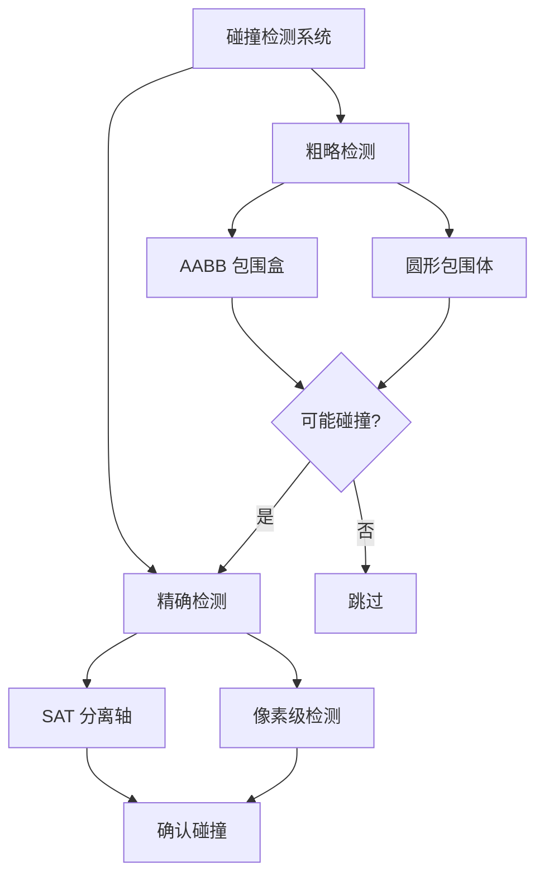
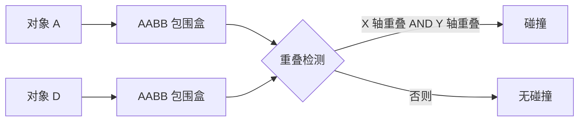
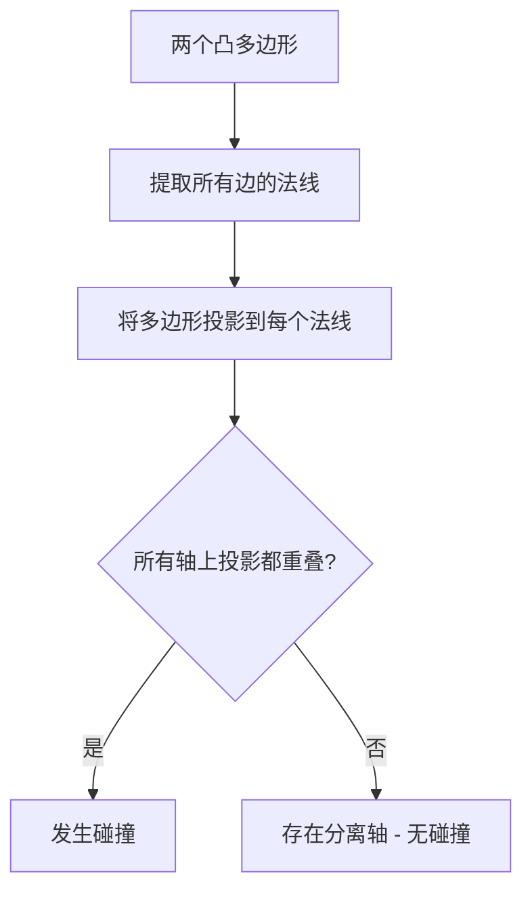
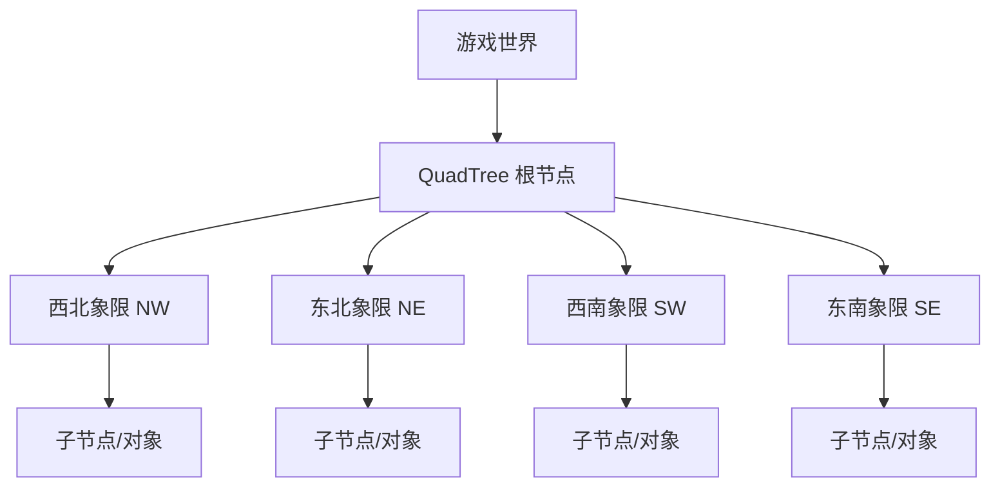
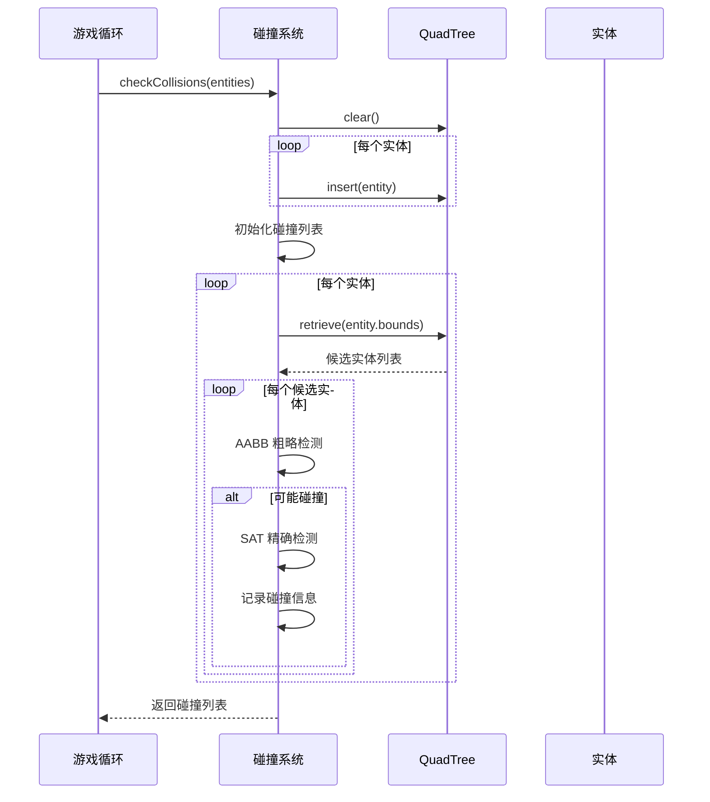

# 碰撞检测

> **"碰撞检测是游戏物理的基石"** —— 没有碰撞，游戏世界就是一片虚无。

## 碰撞检测概述

碰撞检测是判断两个或多个游戏对象是否发生重叠的过程，是游戏物理系统的核心。



## AABB 矩形碰撞

AABB（Axis-Aligned Bounding Box）是最简单、最常用的碰撞检测算法。

### 基本原理



### 实现代码

```javascript
// AABB 碰撞检测
function checkAABBCollision(rectA, rectB) {
  return (
    rectA.x < rectB.x + rectB.width &&
    rectA.x + rectA.width > rectB.x &&
    rectA.y < rectB.y + rectB.height &&
    rectA.y + rectA.height > rectB.y
  );
}

// AABB 碰撞信息
function getAABBCollisionInfo(rectA, rectB) {
  const overlapX = Math.min(
    rectA.x + rectA.width - rectB.x,
    rectB.x + rectB.width - rectA.x
  );
  const overlapY = Math.min(
    rectA.y + rectA.height - rectB.y,
    rectB.y + rectB.height - rectA.y
  );

  if (overlapX <= 0 || overlapY <= 0) {
    return null; // 无碰撞
  }

  // 确定碰撞方向
  let normal = { x: 0, y: 0 };
  if (overlapX < overlapY) {
    normal.x = rectA.x + rectA.width / 2 < rectB.x + rectB.width / 2 ? 1 : -1;
  } else {
    normal.y = rectA.y + rectA.height / 2 < rectB.y + rectB.height / 2 ? 1 : -1;
  }

  return {
    overlap: Math.min(overlapX, overlapY),
    normal,
    direction: overlapX < overlapY ? 'horizontal' : 'vertical',
  };
}

// 碰撞响应
function resolveAABBCollision(entityA, entityB) {
  const info = getAABBCollisionInfo(entityA, entityB);
  if (!info) return;

  // 分离实体
  entityA.x += info.normal.x * info.overlap * 0.5;
  entityA.y += info.normal.y * info.overlap * 0.5;
  entityB.x -= info.normal.x * info.overlap * 0.5;
  entityB.y -= info.normal.y * info.overlap * 0.5;

  // 反弹速度
  if (info.direction === 'horizontal') {
    entityA.velocity.x *= -1;
    entityB.velocity.x *= -1;
  } else {
    entityA.velocity.y *= -1;
    entityB.velocity.y *= -1;
  }
}
```

## 圆形碰撞检测

圆形碰撞检测比 AABB 更适合圆形物体，计算也更简单。

### 基本原理

```javascript
function checkCircleCollision(circleA, circleB) {
  const dx = circleA.x - circleB.x;
  const dy = circleA.y - circleB.y;
  const distance = Math.sqrt(dx * dx + dy * dy);
  const minDistance = circleA.radius + circleB.radius;

  return distance < minDistance;
}

// 优化：避免开方运算
function checkCircleCollisionFast(circleA, circleB) {
  const dx = circleA.x - circleB.x;
  const dy = circleA.y - circleB.y;
  const distanceSquared = dx * dx + dy * dy;
  const minDistance = circleA.radius + circleB.radius;

  return distanceSquared < minDistance * minDistance;
}
```

### 圆形碰撞响应

```javascript
function resolveCircleCollision(circleA, circleB) {
  const dx = circleB.x - circleA.x;
  const dy = circleB.y - circleA.y;
  const distance = Math.sqrt(dx * dx + dy * dy);
  const minDistance = circleA.radius + circleB.radius;

  if (distance >= minDistance) return;

  // 碰撞法线
  const nx = dx / distance;
  const ny = dy / distance;

  // 分离重叠
  const overlap = minDistance - distance;
  circleA.x -= nx * overlap * 0.5;
  circleA.y -= ny * overlap * 0.5;
  circleB.x += nx * overlap * 0.5;
  circleB.y += ny * overlap * 0.5;

  // 弹性碰撞
  const dvx = circleA.velocity.x - circleB.velocity.x;
  const dvy = circleA.velocity.y - circleB.velocity.y;
  const dvn = dvx * nx + dvy * ny;

  if (dvn > 0) return; // 已经分离

  const restitution = 0.8; // 弹性系数
  const impulse = -(1 + restitution) * dvn / 2;

  circleA.velocity.x += impulse * nx;
  circleA.velocity.y += impulse * ny;
  circleB.velocity.x -= impulse * nx;
  circleB.velocity.y -= impulse * ny;
}
```

## SAT 分离轴定理

SAT（Separating Axis Theorem）适用于凸多边形碰撞检测，是更通用的算法。

### 基本原理



### 实现代码

```javascript
class SAT {
  // 获取多边形所有边的法线
  static getNormals(vertices) {
    const normals = [];
    for (let i = 0; i < vertices.length; i++) {
      const next = (i + 1) % vertices.length;
      const edge = {
        x: vertices[next].x - vertices[i].x,
        y: vertices[next].y - vertices[i].y,
      };
      // 法线（垂直于边）
      normals.push({ x: -edge.y, y: edge.x });
    }
    return normals;
  }

  // 将多边形投影到轴上
  static projectOnAxis(vertices, axis) {
    let min = Infinity;
    let max = -Infinity;

    for (const vertex of vertices) {
      const projection = vertex.x * axis.x + vertex.y * axis.y;
      min = Math.min(min, projection);
      max = Math.max(max, projection);
    }

    return { min, max };
  }

  // 检测两个凸多边形是否碰撞
  static checkCollision(polygonA, polygonB) {
    const normalsA = this.getNormals(polygonA.vertices);
    const normalsB = this.getNormals(polygonB.vertices);
    const allNormals = [...normalsA, ...normalsB];

    let minOverlap = Infinity;
    let smallestAxis = null;

    for (const normal of allNormals) {
      const projectionA = this.projectOnAxis(polygonA.vertices, normal);
      const projectionB = this.projectOnAxis(polygonB.vertices, normal);

      const overlap = Math.min(
        projectionA.max - projectionB.min,
        projectionB.max - projectionA.min
      );

      if (overlap <= 0) {
        return null; // 存在分离轴，无碰撞
      }

      if (overlap < minOverlap) {
        minOverlap = overlap;
        smallestAxis = normal;
      }
    }

    return {
      overlap: minOverlap,
      normal: smallestAxis,
    };
  }
}
```

## QuadTree 空间分割

当游戏对象数量很多时，逐对检测碰撞效率极低。QuadTree 通过空间分割优化碰撞检测。

### 基本原理



### 实现代码

```javascript
class QuadTree {
  constructor(bounds, maxObjects = 10, maxLevels = 5, level = 0) {
    this.bounds = bounds;
    this.maxObjects = maxObjects;
    this.maxLevels = maxLevels;
    this.level = level;
    this.objects = [];
    this.nodes = [];
  }

  // 清空四叉树
  clear() {
    this.objects = [];
    for (const node of this.nodes) {
      node.clear();
    }
    this.nodes = [];
  }

  // 分裂为四个子节点
  split() {
    const subWidth = this.bounds.width / 2;
    const subHeight = this.bounds.height / 2;
    const x = this.bounds.x;
    const y = this.bounds.y;

    this.nodes[0] = new QuadTree(
      { x: x + subWidth, y, width: subWidth, height: subHeight },
      this.maxObjects, this.maxLevels, this.level + 1
    );
    this.nodes[1] = new QuadTree(
      { x, y, width: subWidth, height: subHeight },
      this.maxObjects, this.maxLevels, this.level + 1
    );
    this.nodes[2] = new QuadTree(
      { x, y: y + subHeight, width: subWidth, height: subHeight },
      this.maxObjects, this.maxLevels, this.level + 1
    );
    this.nodes[3] = new QuadTree(
      { x: x + subWidth, y: y + subHeight, width: subWidth, height: subHeight },
      this.maxObjects, this.maxLevels, this.level + 1
    );
  }

  // 获取对象所在的象限索引
  getIndex(rect) {
    const midX = this.bounds.x + this.bounds.width / 2;
    const midY = this.bounds.y + this.bounds.height / 2;

    const topHalf = rect.y < midY && rect.y + rect.height < midY;
    const bottomHalf = rect.y > midY;
    const leftHalf = rect.x < midX && rect.x + rect.width < midX;
    const rightHalf = rect.x > midX;

    if (topHalf) {
      if (rightHalf) return 0;
      if (leftHalf) return 1;
    }
    if (bottomHalf) {
      if (leftHalf) return 2;
      if (rightHalf) return 3;
    }

    return -1; // 跨越多个象限
  }

  // 插入对象
  insert(obj) {
    if (this.nodes.length > 0) {
      const index = this.getIndex(obj.bounds);
      if (index !== -1) {
        this.nodes[index].insert(obj);
        return;
      }
    }

    this.objects.push(obj);

    if (this.objects.length > this.maxObjects && this.level < this.maxLevels) {
      if (this.nodes.length === 0) {
        this.split();
      }

      let i = 0;
      while (i < this.objects.length) {
        const index = this.getIndex(this.objects[i].bounds);
        if (index !== -1) {
          this.nodes[index].insert(this.objects.splice(i, 1)[0]);
        } else {
          i++;
        }
      }
    }
  }

  // 检索可能碰撞的对象
  retrieve(rect, found = []) {
    const index = this.getIndex(rect);

    if (this.nodes.length > 0) {
      if (index !== -1) {
        this.nodes[index].retrieve(rect, found);
      } else {
        for (const node of this.nodes) {
          node.retrieve(rect, found);
        }
      }
    }

    found.push(...this.objects);
    return found;
  }
}
```

### 使用 QuadTree 优化碰撞检测

```javascript
class CollisionSystem {
  constructor(worldBounds) {
    this.quadTree = new QuadTree(worldBounds);
  }

  checkCollisions(entities) {
    this.quadTree.clear();

    // 插入所有实体
    for (const entity of entities) {
      this.quadTree.insert({
        bounds: entity.getBounds(),
        entity,
      });
    }

    // 检测碰撞
    const collisions = [];
    for (const entity of entities) {
      const candidates = this.quadTree.retrieve(entity.getBounds());

      for (const candidate of candidates) {
        if (candidate.entity === entity) continue;

        if (checkAABBCollision(entity.getBounds(), candidate.entity.getBounds())) {
          collisions.push([entity, candidate.entity]);
        }
      }
    }

    return collisions;
  }
}
```

## 碰撞检测流程



## 面试要点

### 常见面试题

1. **AABB 和 OBB 的区别？**
   - AABB：轴对齐包围盒，计算简单，适合快速筛选
   - OBB：有向包围盒，更紧凑但计算复杂

2. **如何优化大量对象的碰撞检测？**
   - 空间分割（QuadTree、Grid）
   - 宽相位 + 窄相位
   - 扫掠修剪（Sweep and Prune）

3. **SAT 算法的适用范围？**
   - 仅适用于凸多边形
   - 凹多边形需要先分解为凸多边形

4. **如何处理高速物体的碰撞穿透？**
   - 连续碰撞检测（CCD）
   - 射线投射
   - 限制最大速度

### 性能对比

| 算法 | 时间复杂度 | 适用场景 | 精度 |
|------|-----------|----------|------|
| AABB | O(1) | 快速筛选 | 低 |
| 圆形碰撞 | O(1) | 圆形物体 | 中 |
| SAT | O(n) | 凸多边形 | 高 |
| QuadTree | O(log n) | 大量对象 | - |

## 总结

- **AABB**：最简单的碰撞检测，适合矩形物体
- **圆形碰撞**：适合圆形物体，计算高效
- **SAT**：通用凸多边形碰撞，精度高
- **QuadTree**：空间分割优化，减少检测次数
- 实际项目中通常组合使用：QuadTree 粗筛 + AABB/SAT 精确检测
