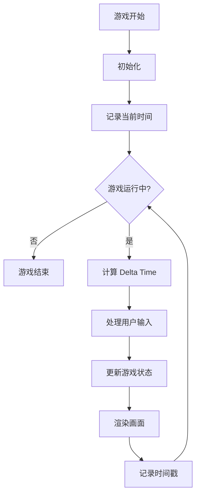
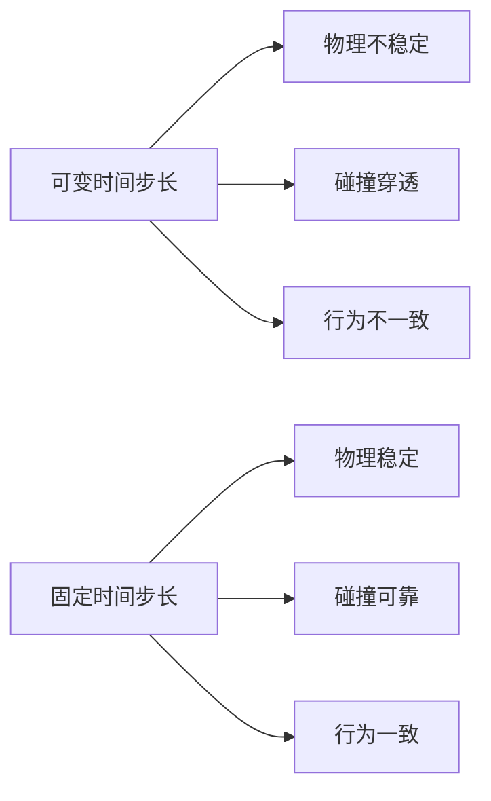
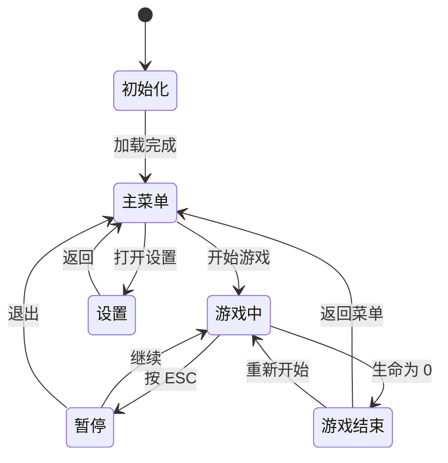

# 游戏循环与帧率控制

> **"游戏的本质就是不断重复：输入 → 更新 → 输出"** —— 这就是游戏循环。

## 什么是游戏循环？

游戏循环（Game Loop）是游戏引擎的核心，它以固定的频率重复执行：处理输入、更新游戏状态、渲染画面。



## requestAnimationFrame

### 为什么不用 setTimeout？

```javascript
// ❌ 错误方式：使用 setTimeout
function gameLoop() {
  update();
  render();
  setTimeout(gameLoop, 16); // 约 60fps
}

// 问题：
// 1. 无法与浏览器刷新率同步
// 2. 后台标签页仍会执行，浪费资源
// 3. 时间间隔不精确
```

```javascript
// ✅ 正确方式：使用 requestAnimationFrame
function gameLoop(timestamp) {
  update();
  render();
  requestAnimationFrame(gameLoop);
}

requestAnimationFrame(gameLoop);
```

### requestAnimationFrame 的优势

| 特性 | setTimeout | requestAnimationFrame |
|------|-----------|----------------------|
| 刷新率同步 | 否 | 是（通常 60fps） |
| 后台标签页 | 继续执行 | 自动暂停 |
| 电池消耗 | 高 | 低 |
| 时间精度 | 不精确 | 精确到毫秒 |
| 浏览器优化 | 无 | 自动批量处理 |

## Delta Time 原理

### 为什么需要 Delta Time？

不同设备的帧率不同（30fps、60fps、144fps），如果不使用 Delta Time，游戏速度会因设备而异。

```javascript
// ❌ 错误：帧率相关的速度
function update() {
  player.x += 5; // 60fps 时移动 300px/s，30fps 时只有 150px/s
}
```

```javascript
// ✅ 正确：帧率无关的速度
function update(dt) {
  player.x += 300 * dt; // 无论多少帧率，都是 300px/s
}
```

### Delta Time 计算

```javascript
class Game {
  constructor() {
    this.lastTime = 0;
    this.deltaTime = 0;
    this.fps = 0;
    this.frameCount = 0;
    this.fpsTimer = 0;
  }

  gameLoop(currentTime) {
    // 计算 Delta Time（秒）
    this.deltaTime = (currentTime - this.lastTime) / 1000;
    this.lastTime = currentTime;

    // 防止 Delta Time 过大（例如从后台切回）
    if (this.deltaTime > 0.1) {
      this.deltaTime = 0.1;
    }

    // 计算 FPS
    this.frameCount++;
    this.fpsTimer += this.deltaTime;
    if (this.fpsTimer >= 1) {
      this.fps = this.frameCount;
      this.frameCount = 0;
      this.fpsTimer = 0;
    }

    this.update(this.deltaTime);
    this.render();

    requestAnimationFrame((t) => this.gameLoop(t));
  }

  start() {
    requestAnimationFrame((t) => this.gameLoop(t));
  }
}
```

## 固定时间步长

### 为什么需要固定时间步长？

物理模拟需要**确定性**，否则会导致：
- 碰撞检测不稳定
- 物理行为不可重现
- 不同帧率下表现不一致



### 固定时间步长实现

```javascript
class FixedTimestepGame {
  constructor() {
    this.accumulator = 0;
    this.fixedDeltaTime = 1 / 60; // 60 次/秒
    this.lastTime = 0;
    this.maxAccumulator = 0.2; // 防止螺旋死亡
  }

  gameLoop(currentTime) {
    let deltaTime = (currentTime - this.lastTime) / 1000;
    this.lastTime = currentTime;

    // 限制最大 Delta Time
    if (deltaTime > this.maxAccumulator) {
      deltaTime = this.maxAccumulator;
    }

    this.accumulator += deltaTime;

    // 固定时间步长更新（物理模拟）
    while (this.accumulator >= this.fixedDeltaTime) {
      this.fixedUpdate(this.fixedDeltaTime);
      this.accumulator -= this.fixedDeltaTime;
    }

    // 插值因子（用于渲染平滑）
    const alpha = this.accumulator / this.fixedDeltaTime;
    this.render(alpha);

    requestAnimationFrame((t) => this.gameLoop(t));
  }

  fixedUpdate(dt) {
    // 物理更新、碰撞检测等
    this.physicsUpdate(dt);
    this.collisionDetection();
  }

  render(alpha) {
    // 使用插值因子平滑渲染
    this.interpolateEntities(alpha);
    this.draw();
  }

  interpolateEntities(alpha) {
    // 位置插值：current = previous * (1 - alpha) + current * alpha
    for (const entity of this.entities) {
      entity.renderX = entity.previousX * (1 - alpha) + entity.x * alpha;
      entity.renderY = entity.previousY * (1 - alpha) + entity.y * alpha;
    }
  }
}
```

## 完整游戏循环实现

```javascript
class GameLoop {
  constructor(canvas) {
    this.canvas = canvas;
    this.ctx = canvas.getContext('2d');
    this.entities = [];
    this.isRunning = false;

    // 时间控制
    this.lastTime = 0;
    this.accumulator = 0;
    this.fixedDeltaTime = 1 / 60;
    this.maxAccumulator = 0.25;

    // 帧率统计
    this.fps = 0;
    this.frameCount = 0;
    this.fpsTimer = 0;

    // 性能监控
    this.updateTime = 0;
    this.renderTime = 0;
  }

  start() {
    this.isRunning = true;
    this.lastTime = performance.now();
    requestAnimationFrame((t) => this.loop(t));
  }

  stop() {
    this.isRunning = false;
  }

  loop(currentTime) {
    if (!this.isRunning) return;

    const deltaTime = Math.min(
      (currentTime - this.lastTime) / 1000,
      this.maxAccumulator
    );
    this.lastTime = currentTime;

    // FPS 统计
    this.frameCount++;
    this.fpsTimer += deltaTime;
    if (this.fpsTimer >= 1) {
      this.fps = this.frameCount;
      this.frameCount = 0;
      this.fpsTimer = 0;
    }

    // 输入处理
    this.processInput();

    // 固定时间步长物理更新
    this.accumulator += deltaTime;
    const updateStart = performance.now();
    while (this.accumulator >= this.fixedDeltaTime) {
      this.fixedUpdate(this.fixedDeltaTime);
      this.accumulator -= this.fixedDeltaTime;
    }
    this.updateTime = performance.now() - updateStart;

    // 渲染
    const renderStart = performance.now();
    const alpha = this.accumulator / this.fixedDeltaTime;
    this.render(alpha);
    this.renderTime = performance.now() - renderStart;

    requestAnimationFrame((t) => this.loop(t));
  }

  fixedUpdate(dt) {
    for (const entity of this.entities) {
      entity.previousX = entity.x;
      entity.previousY = entity.y;
      entity.update(dt);
    }
    this.checkCollisions();
  }

  render(alpha) {
    this.ctx.clearRect(0, 0, this.canvas.width, this.canvas.height);

    for (const entity of this.entities) {
      const renderX = entity.previousX + (entity.x - entity.previousX) * alpha;
      const renderY = entity.previousY + (entity.y - entity.previousY) * alpha;
      entity.render(this.ctx, renderX, renderY);
    }

    // 显示调试信息
    this.renderDebugInfo();
  }

  renderDebugInfo() {
    this.ctx.fillStyle = '#fff';
    this.ctx.font = '14px monospace';
    this.ctx.fillText(`FPS: ${this.fps}`, 10, 20);
    this.ctx.fillText(`Update: ${this.updateTime.toFixed(2)}ms`, 10, 40);
    this.ctx.fillText(`Render: ${this.renderTime.toFixed(2)}ms`, 10, 60);
  }
}
```

## 游戏循环状态机



## 帧率限制与平滑

### 帧率限制

```javascript
class FrameRateLimiter {
  constructor(targetFPS = 60) {
    this.targetFPS = targetFPS;
    this.frameInterval = 1000 / targetFPS;
    this.lastFrameTime = 0;
  }

  shouldRender(currentTime) {
    const elapsed = currentTime - this.lastFrameTime;
    if (elapsed >= this.frameInterval) {
      this.lastFrameTime = currentTime - (elapsed % this.frameInterval);
      return true;
    }
    return false;
  }
}

// 使用方式
function gameLoop(currentTime) {
  if (limiter.shouldRender(currentTime)) {
    update();
    render();
  }
  requestAnimationFrame(gameLoop);
}
```

### 帧率平滑

```javascript
class FrameRateSmoother {
  constructor(sampleSize = 60) {
    this.samples = [];
    this.sampleSize = sampleSize;
  }

  addSample(deltaTime) {
    this.samples.push(deltaTime);
    if (this.samples.length > this.sampleSize) {
      this.samples.shift();
    }
  }

  getSmoothedDeltaTime() {
    if (this.samples.length === 0) return 0;
    const sum = this.samples.reduce((a, b) => a + b, 0);
    return sum / this.samples.length;
  }
}
```

## 面试要点

### 常见面试题

1. **requestAnimationFrame 和 setTimeout 的区别？**
   - rAF 与浏览器刷新率同步，setTimeout 不精确
   - rAF 后台标签页自动暂停，节省资源
   - rAF 返回一个 ID，可用于取消动画

2. **什么是 Delta Time？为什么需要它？**
   - 帧间时间差，用于实现帧率无关的运动
   - 保证不同设备上游戏速度一致
   - 通常以秒为单位，如 `dt = 16.67ms / 1000`

3. **固定时间步长的作用是什么？**
   - 保证物理模拟的确定性和稳定性
   - 避免碰撞检测的穿透问题
   - 使游戏行为可重现

4. **如何处理从后台切回前台时的 Delta Time 过大？**
   - 限制最大 Delta Time（如 0.1 秒）
   - 跳过第一帧的更新
   - 重置累积器

### 关键代码片段

```javascript
// 标准游戏循环模板
function gameLoop(currentTime) {
  const dt = Math.min((currentTime - lastTime) / 1000, 0.1);
  lastTime = currentTime;

  processInput();
  update(dt);
  render();

  requestAnimationFrame(gameLoop);
}
```

## 总结

| 概念 | 作用 | 使用场景 |
|------|------|----------|
| requestAnimationFrame | 浏览器动画 API | 所有动画场景 |
| Delta Time | 帧率无关运动 | 通用游戏更新 |
| 固定时间步长 | 物理稳定性 | 物理模拟、碰撞检测 |
| 帧率限制 | 控制资源消耗 | 移动端、低性能设备 |
| 帧率平滑 | 避免抖动 | 平滑动画 |
