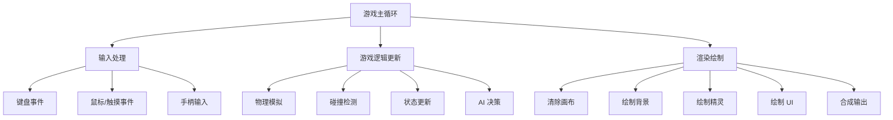
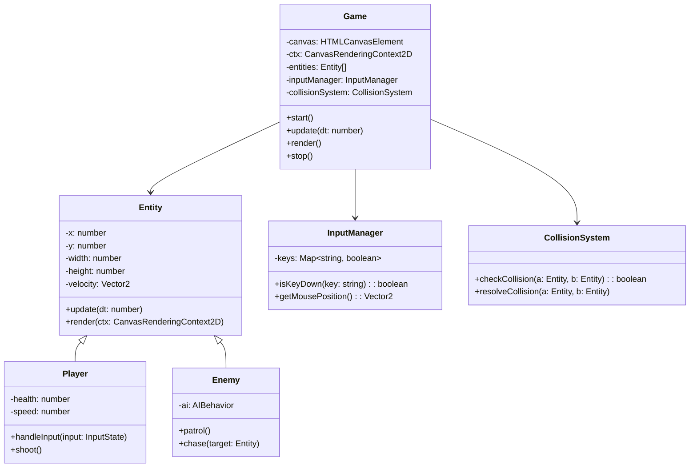
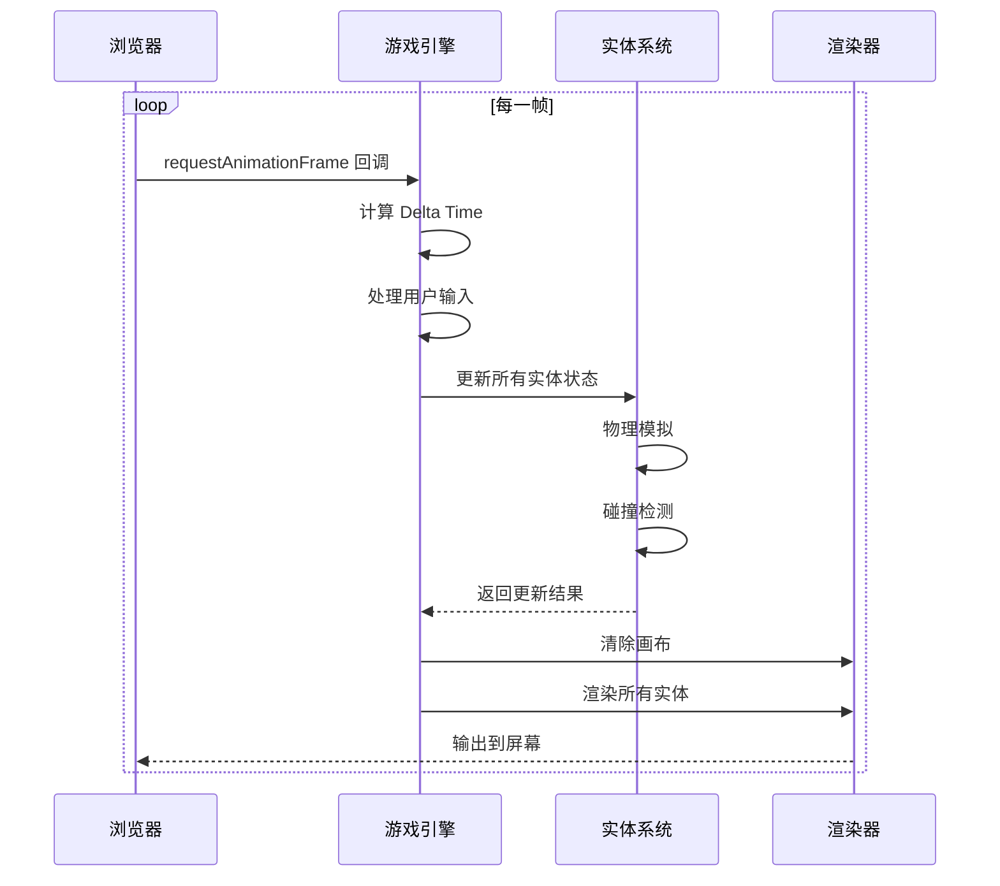

# Canvas 2D 游戏开发概述

> **"游戏是学习编程的最佳方式"** —— 每一个伟大的程序员，都曾被一个简单的游戏点燃过热情。

## 为什么学习 Canvas 游戏开发？

Canvas 2D 游戏开发是前端工程师深入理解**浏览器渲染机制**、**动画原理**和**性能优化**的绝佳途径。

```
┌─────────────────────────────────────────────────────────────┐
│                  Canvas 游戏开发技能树                         │
├─────────────────────────────────────────────────────────────┤
│                                                             │
│   🎨 渲染层              ⚙️ 逻辑层             🚀 进阶层     │
│   ───────────           ──────────           ──────────    │
│   • Canvas API          • 游戏循环             • 物理引擎     │
│   • 绘制基础             • 碰撞检测             • 粒子系统     │
│   • 图像处理             • 状态管理             • AI 寻路      │
│   • 动画帧              • 输入处理             • 网络同步     │
│                                                             │
└─────────────────────────────────────────────────────────────┘
```

## Canvas 基础知识

### 获取画布上下文

```html
<canvas id="gameCanvas" width="800" height="600"></canvas>
```

```javascript
const canvas = document.getElementById('gameCanvas');
const ctx = canvas.getContext('2d');

// 设置画布尺寸（考虑设备像素比）
function resizeCanvas(canvas) {
  const dpr = window.devicePixelRatio || 1;
  const rect = canvas.getBoundingClientRect();
  canvas.width = rect.width * dpr;
  canvas.height = rect.height * dpr;
  ctx.scale(dpr, dpr);
}
```

### 核心绘制 API

```javascript
// 绘制矩形
ctx.fillStyle = '#ff6b6b';
ctx.fillRect(100, 100, 50, 50);

// 绘制圆形
ctx.beginPath();
ctx.arc(200, 200, 25, 0, Math.PI * 2);
ctx.fillStyle = '#4ecdc4';
ctx.fill();

// 绘制图像
const img = new Image();
img.src = 'player.png';
img.onload = () => {
  ctx.drawImage(img, 100, 100, 64, 64);
};

// 清除画布
ctx.clearRect(0, 0, canvas.width, canvas.height);
```

## 游戏开发核心模块



### 典型游戏架构



## 本专题内容

```
📁 Canvas 2D 游戏开发
├── 📄 概述（本页）
├── 📄 游戏循环与帧率控制
│   ├── requestAnimationFrame
│   ├── Delta Time 原理
│   ├── 固定时间步长
│   └── 帧率限制与平滑
├── 📄 碰撞检测
│   ├── AABB 矩形碰撞
│   ├── 圆形碰撞检测
│   ├── SAT 分离轴定理
│   └── QuadTree 空间分割
└── 📄 粒子系统
    ├── 粒子发射器
    ├── 生命周期管理
    ├── 物理模拟
    └── 特效应用
```

## 游戏循环流程



## 面试要点

### 常见面试题

1. **Canvas 和 SVG 的区别？各自适用场景？**
   - Canvas：位图，适合频繁重绘的游戏场景
   - SVG：矢量，适合图标、图表等静态图形

2. **如何实现 60fps 的流畅动画？**
   - 使用 `requestAnimationFrame` 而非 `setTimeout`
   - 使用 Delta Time 保证帧率无关性
   - 避免在渲染循环中创建新对象

3. **Canvas 性能优化有哪些手段？**
   - 离屏 Canvas 缓存静态内容
   - 局部更新而非全屏重绘
   - 使用 `willReadFrequently` 优化像素操作
   - 合理使用合成层

### 关键概念速查

| 概念 | 说明 | 重要程度 |
|------|------|----------|
| requestAnimationFrame | 浏览器提供的动画帧 API | ⭐⭐⭐⭐⭐ |
| Delta Time | 帧间时间差，保证匀速运动 | ⭐⭐⭐⭐⭐ |
| AABB 碰撞 | 轴对齐包围盒碰撞检测 | ⭐⭐⭐⭐ |
| QuadTree | 四叉树空间分割优化 | ⭐⭐⭐⭐ |
| 粒子系统 | 特效实现的核心技术 | ⭐⭐⭐⭐ |
| 离屏 Canvas | 性能优化的重要手段 | ⭐⭐⭐ |

## 开始学习

准备好进入游戏开发的世界了吗？让我们从 **游戏循环与帧率控制** 开始！

import DocCardList from '@theme/DocCardList';

<DocCardList />
