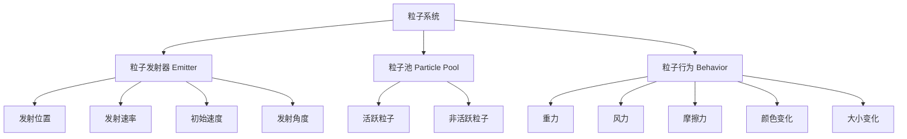
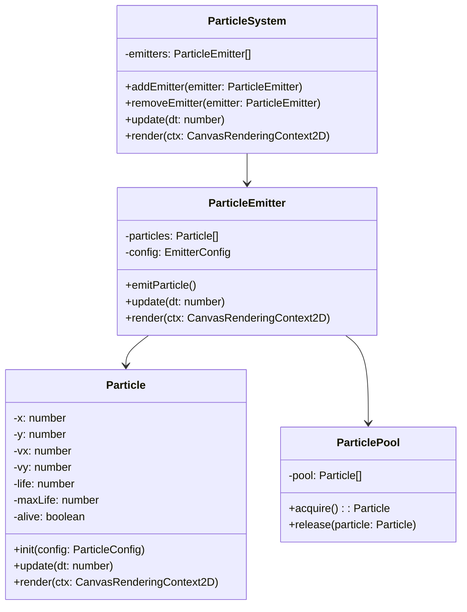
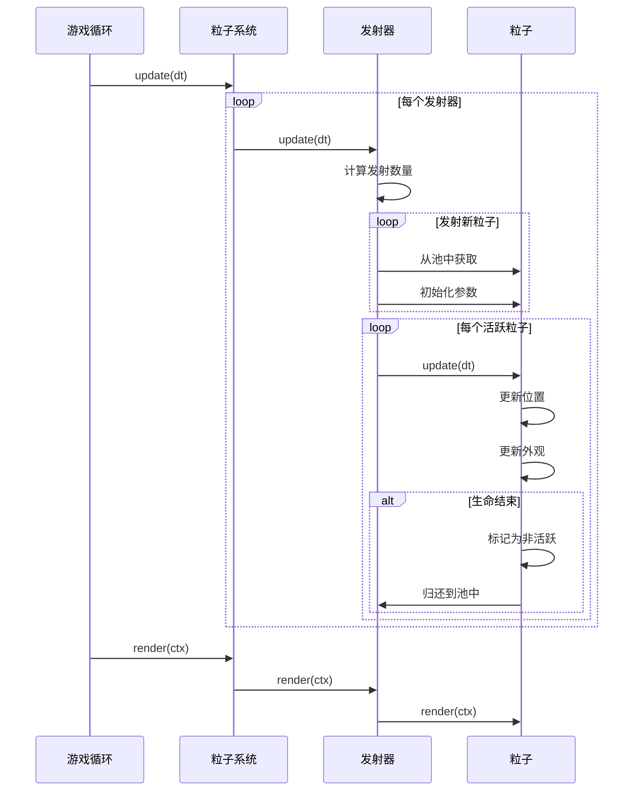

# 粒子系统

> **"粒子系统是游戏特效的灵魂"** —— 从爆炸到火焰，从烟雾到魔法，都离不开粒子。

## 什么是粒子系统？

粒子系统是一种模拟大量微小粒子行为的技术，用于创建复杂的视觉效果。



## 粒子类设计

### 基础粒子

```javascript
class Particle {
  constructor() {
    this.reset();
  }

  reset() {
    // 位置
    this.x = 0;
    this.y = 0;

    // 速度
    this.vx = 0;
    this.vy = 0;

    // 加速度
    this.ax = 0;
    this.ay = 0;

    // 外观
    this.size = 1;
    this.sizeStart = 1;
    this.sizeEnd = 0;

    // 颜色（RGBA）
    this.r = 255;
    this.g = 255;
    this.b = 255;
    this.alpha = 1;
    this.alphaStart = 1;
    this.alphaEnd = 0;

    // 生命周期
    this.life = 0;
    this.maxLife = 1;
    this.alive = false;

    // 旋转
    this.rotation = 0;
    this.rotationSpeed = 0;

    // 形状
    this.shape = 'circle'; // circle, square, star, image
    this.image = null;
  }

  init(config) {
    this.x = config.x || 0;
    this.y = config.y || 0;
    this.vx = config.vx || 0;
    this.vy = config.vy || 0;
    this.ax = config.ax || 0;
    this.ay = config.ay || 0;
    this.sizeStart = config.sizeStart || 1;
    this.sizeEnd = config.sizeEnd || 0;
    this.alphaStart = config.alphaStart || 1;
    this.alphaEnd = config.alphaEnd || 0;
    this.maxLife = config.maxLife || 1;
    this.rotationSpeed = config.rotationSpeed || 0;
    this.shape = config.shape || 'circle';
    this.image = config.image || null;

    this.life = 0;
    this.alive = true;
    this.size = this.sizeStart;
    this.alpha = this.alphaStart;
  }

  update(dt) {
    if (!this.alive) return;

    // 更新生命周期
    this.life += dt;
    if (this.life >= this.maxLife) {
      this.alive = false;
      return;
    }

    // 计算生命周期进度（0-1）
    const progress = this.life / this.maxLife;

    // 更新物理
    this.vx += this.ax * dt;
    this.vy += this.ay * dt;
    this.x += this.vx * dt;
    this.y += this.vy * dt;

    // 更新外观（插值）
    this.size = this.lerp(this.sizeStart, this.sizeEnd, progress);
    this.alpha = this.lerp(this.alphaStart, this.alphaEnd, progress);

    // 更新旋转
    this.rotation += this.rotationSpeed * dt;
  }

  render(ctx) {
    if (!this.alive || this.alpha <= 0) return;

    ctx.save();
    ctx.globalAlpha = this.alpha;
    ctx.translate(this.x, this.y);
    ctx.rotate(this.rotation);

    switch (this.shape) {
      case 'circle':
        ctx.beginPath();
        ctx.arc(0, 0, this.size, 0, Math.PI * 2);
        ctx.fillStyle = `rgb(${this.r}, ${this.g}, ${this.b})`;
        ctx.fill();
        break;

      case 'square':
        ctx.fillStyle = `rgb(${this.r}, ${this.g}, ${this.b})`;
        ctx.fillRect(-this.size, -this.size, this.size * 2, this.size * 2);
        break;

      case 'image':
        if (this.image) {
          ctx.drawImage(
            this.image,
            -this.size, -this.size,
            this.size * 2, this.size * 2
          );
        }
        break;
    }

    ctx.restore();
  }

  lerp(start, end, t) {
    return start + (end - start) * t;
  }
}
```

## 粒子发射器

### 发射器配置

```javascript
class ParticleEmitter {
  constructor(config = {}) {
    // 位置
    this.x = config.x || 0;
    this.y = config.y || 0;

    // 发射形状
    this.emitShape = config.emitShape || 'point'; // point, circle, rect, line
    this.emitRadius = config.emitRadius || 0;
    this.emitWidth = config.emitWidth || 0;
    this.emitHeight = config.emitHeight || 0;

    // 发射参数
    this.emitRate = config.emitRate || 10; // 每秒发射数量
    this.emitCount = 0;
    this.emitTimer = 0;

    // 粒子配置范围
    this.speed = config.speed || { min: 50, max: 100 };
    this.angle = config.angle || { min: 0, max: 360 };
    this.life = config.life || { min: 0.5, max: 1.5 };
    this.size = config.size || { min: 2, max: 5 };

    // 物理参数
    this.gravity = config.gravity || { x: 0, y: 0 };
    this.wind = config.wind || { x: 0, y: 0 };

    // 外观配置
    this.colors = config.colors || ['#ff0000', '#ff6600', '#ffcc00'];
    this.alphaStart = config.alphaStart || 1;
    this.alphaEnd = config.alphaEnd || 0;
    this.sizeStart = config.sizeStart || 1;
    this.sizeEnd = config.sizeEnd || 0;

    // 状态
    this.active = true;
    this.duration = config.duration || Infinity;
    this.elapsed = 0;

    // 粒子池
    this.particles = [];
    this.maxParticles = config.maxParticles || 1000;
  }

  // 获取随机发射位置
  getEmitPosition() {
    let x = this.x;
    let y = this.y;

    switch (this.emitShape) {
      case 'circle': {
        const angle = Math.random() * Math.PI * 2;
        const radius = Math.random() * this.emitRadius;
        x += Math.cos(angle) * radius;
        y += Math.sin(angle) * radius;
        break;
      }
      case 'rect': {
        x += (Math.random() - 0.5) * this.emitWidth;
        y += (Math.random() - 0.5) * this.emitHeight;
        break;
      }
      case 'line': {
        x += (Math.random() - 0.5) * this.emitWidth;
        break;
      }
    }

    return { x, y };
  }

  // 发射单个粒子
  emitParticle() {
    // 找到非活跃粒子
    let particle = this.particles.find(p => !p.alive);

    if (!particle && this.particles.length < this.maxParticles) {
      particle = new Particle();
      this.particles.push(particle);
    }

    if (!particle) return;

    // 计算发射参数
    const pos = this.getEmitPosition();
    const angle = this.randomRange(this.angle.min, this.angle.max) * Math.PI / 180;
    const speed = this.randomRange(this.speed.min, this.speed.max);
    const color = this.colors[Math.floor(Math.random() * this.colors.length)];

    // 初始化粒子
    particle.init({
      x: pos.x,
      y: pos.y,
      vx: Math.cos(angle) * speed,
      vy: Math.sin(angle) * speed,
      ax: this.gravity.x + this.wind.x,
      ay: this.gravity.y + this.wind.y,
      sizeStart: this.randomRange(this.size.min, this.size.max) * this.sizeStart,
      sizeEnd: this.randomRange(this.size.min, this.size.max) * this.sizeEnd,
      alphaStart: this.alphaStart,
      alphaEnd: this.alphaEnd,
      maxLife: this.randomRange(this.life.min, this.life.max),
      rotationSpeed: (Math.random() - 0.5) * 2,
    });

    // 解析颜色
    const rgb = this.hexToRgb(color);
    particle.r = rgb.r;
    particle.g = rgb.g;
    particle.b = rgb.b;
  }

  update(dt) {
    if (!this.active) return;

    this.elapsed += dt;
    if (this.elapsed >= this.duration) {
      this.active = false;
    }

    // 按速率发射粒子
    this.emitTimer += dt;
    const emitInterval = 1 / this.emitRate;

    while (this.emitTimer >= emitInterval) {
      this.emitParticle();
      this.emitTimer -= emitInterval;
    }

    // 更新所有粒子
    for (const particle of this.particles) {
      particle.update(dt);
    }
  }

  render(ctx) {
    for (const particle of this.particles) {
      particle.render(ctx);
    }
  }

  // 工具方法
  randomRange(min, max) {
    return min + Math.random() * (max - min);
  }

  hexToRgb(hex) {
    const result = /^#?([a-f\d]{2})([a-f\d]{2})([a-f\d]{2})$/i.exec(hex);
    return result ? {
      r: parseInt(result[1], 16),
      g: parseInt(result[2], 16),
      b: parseInt(result[3], 16),
    } : { r: 255, g: 255, b: 255 };
  }

  // 停止发射
  stop() {
    this.active = false;
  }

  // 重新开始
  restart() {
    this.active = true;
    this.elapsed = 0;
  }
}
```

## 常见粒子特效

### 爆炸效果

```javascript
function createExplosion(x, y) {
  return new ParticleEmitter({
    x, y,
    emitShape: 'point',
    emitRate: 200,
    duration: 0.1,
    speed: { min: 100, max: 300 },
    angle: { min: 0, max: 360 },
    life: { min: 0.3, max: 0.8 },
    size: { min: 2, max: 6 },
    colors: ['#ff0000', '#ff6600', '#ffcc00', '#ffffff'],
    alphaStart: 1,
    alphaEnd: 0,
    sizeStart: 1,
    sizeEnd: 0,
    gravity: { x: 0, y: 100 },
    maxParticles: 200,
  });
}
```

### 烟雾效果

```javascript
function createSmoke(x, y) {
  return new ParticleEmitter({
    x, y,
    emitShape: 'circle',
    emitRadius: 10,
    emitRate: 20,
    duration: Infinity,
    speed: { min: 20, max: 50 },
    angle: { min: 250, max: 290 },
    life: { min: 1, max: 2 },
    size: { min: 5, max: 15 },
    colors: ['#666666', '#888888', '#aaaaaa'],
    alphaStart: 0.6,
    alphaEnd: 0,
    sizeStart: 0.5,
    sizeEnd: 2,
    gravity: { x: 0, y: -30 },
    wind: { x: 20, y: 0 },
  });
}
```

### 魔法效果

```javascript
function createMagicEffect(x, y) {
  return new ParticleEmitter({
    x, y,
    emitShape: 'circle',
    emitRadius: 30,
    emitRate: 50,
    duration: 2,
    speed: { min: 30, max: 80 },
    angle: { min: 0, max: 360 },
    life: { min: 0.5, max: 1.5 },
    size: { min: 1, max: 4 },
    colors: ['#00ffff', '#0088ff', '#8800ff', '#ff00ff'],
    alphaStart: 1,
    alphaEnd: 0,
    sizeStart: 1,
    sizeEnd: 0.2,
    gravity: { x: 0, y: -50 },
  });
}
```

## 粒子系统架构



## 性能优化

### 对象池模式

```javascript
class ParticlePool {
  constructor(createFn, initialSize = 100) {
    this.createFn = createFn;
    this.pool = [];
    this.active = [];

    // 预创建对象
    for (let i = 0; i < initialSize; i++) {
      this.pool.push(this.createFn());
    }
  }

  acquire() {
    let obj = this.pool.pop();
    if (!obj) {
      obj = this.createFn();
    }
    this.active.push(obj);
    return obj;
  }

  release(obj) {
    const index = this.active.indexOf(obj);
    if (index !== -1) {
      this.active.splice(index, 1);
      this.pool.push(obj);
    }
  }

  releaseAll() {
    while (this.active.length > 0) {
      this.pool.push(this.active.pop());
    }
  }
}
```

### 离屏 Canvas 缓存

```javascript
class OptimizedParticleSystem {
  constructor() {
    this.offscreenCanvas = document.createElement('canvas');
    this.offscreenCtx = this.offscreenCanvas.getContext('2d');
  }

  // 预渲染粒子形状到离屏 Canvas
  preRenderParticle(size, color) {
    const key = `${size}-${color}`;
    if (this.cache[key]) return this.cache[key];

    const canvas = document.createElement('canvas');
    canvas.width = size * 2;
    canvas.height = size * 2;
    const ctx = canvas.getContext('2d');

    ctx.beginPath();
    ctx.arc(size, size, size, 0, Math.PI * 2);
    ctx.fillStyle = color;
    ctx.fill();

    this.cache[key] = canvas;
    return canvas;
  }

  renderParticle(ctx, particle) {
    const cached = this.preRenderParticle(particle.size, particle.color);
    ctx.globalAlpha = particle.alpha;
    ctx.drawImage(cached, particle.x - particle.size, particle.y - particle.size);
  }
}
```

## 粒子系统流程



## 面试要点

### 常见面试题

1. **粒子系统的性能瓶颈在哪里？如何优化？**
   - 瓶颈：大量粒子的绘制调用
   - 优化：对象池、离屏 Canvas、批量渲染、GPU 加速

2. **如何实现粒子的颜色渐变？**
   - 使用 HSL 颜色空间更自然
   - 预计算颜色数组，按生命周期索引
   - 使用 Canvas 的 createLinearGradient

3. **对象池模式的作用是什么？**
   - 避免频繁的内存分配和垃圾回收
   - 减少 GC 导致的卡顿
   - 提高内存使用效率

4. **如何让粒子跟随物体运动？**
   - 发射器跟随物体位置更新
   - 使用相对坐标系
   - 发射时继承物体速度

### 关键概念速查

| 概念 | 说明 | 重要程度 |
|------|------|----------|
| 粒子发射器 | 控制粒子的发射行为 | ⭐⭐⭐⭐⭐ |
| 生命周期 | 粒子从出生到死亡的过程 | ⭐⭐⭐⭐⭐ |
| 对象池 | 性能优化的关键技术 | ⭐⭐⭐⭐ |
| 插值 | 平滑过渡粒子属性 | ⭐⭐⭐⭐ |
| 离屏 Canvas | 缓存静态粒子形状 | ⭐⭐⭐ |

## 总结

- **粒子系统**是游戏特效的核心技术
- **发射器**控制粒子的发射位置、速度、颜色等
- **生命周期**管理粒子的诞生、变化和消亡
- **对象池**是性能优化的关键
- 实际项目中可以使用成熟的粒子库（如 tsParticles）
