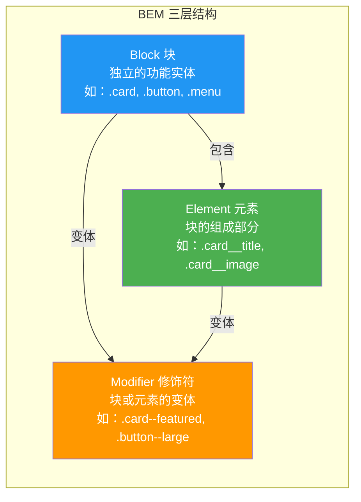
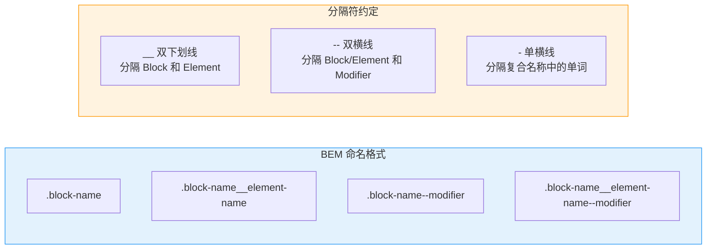
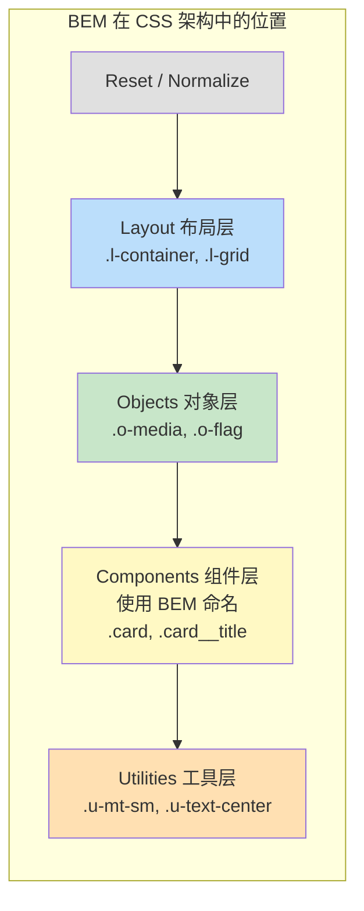
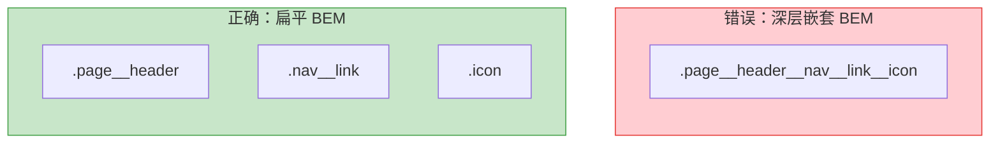
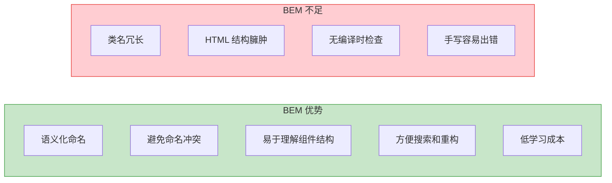

# BEM 方法论与 CSS 规范化

BEM（Block Element Modifier）是由 Yandex 提出的 CSS 命名方法论，是目前最广泛使用的 CSS 命名规范之一。

## BEM 核心概念



### 命名规则



## BEM 实战示例

### 卡片组件

```html
<!-- Block -->
<article class="card">
  <!-- Element -->
  
  <div class="card__content">
    <h3 class="card__title">Title</h3>
    <p class="card__description">Description text</p>
  </div>
  <div class="card__actions">
    <!-- Block 内嵌 Block -->
    <button class="button button--primary">Read More</button>
    <button class="button button--outline">Share</button>
  </div>
</article>

<!-- Modifier: 带特征的卡片变体 -->
<article class="card card--featured card--dark">
  <!-- ... -->
</article>
```

```css
/* Block */
.card {
  border-radius: 8px;
  overflow: hidden;
  box-shadow: 0 2px 8px rgba(0, 0, 0, 0.1);
}

/* Elements */
.card__image {
  width: 100%;
  height: 200px;
  object-fit: cover;
}

.card__content {
  padding: 16px;
}

.card__title {
  margin: 0 0 8px;
  font-size: 1.25rem;
}

.card__description {
  color: #666;
  line-height: 1.6;
}

.card__actions {
  display: flex;
  gap: 8px;
  padding: 0 16px 16px;
}

/* Modifiers */
.card--featured {
  border: 2px solid #ff9800;
}

.card--dark {
  background: #1a1a1a;
  color: #fff;
}
```

### 导航组件

```html
<nav class="nav">
  <a class="nav__link nav__link--active" href="/">Home</a>
  <a class="nav__link" href="/about">About</a>
  <a class="nav__link nav__link--disabled" href="#">Contact</a>
</nav>
```

```css
.nav {
  display: flex;
  gap: 4px;
}

.nav__link {
  padding: 8px 16px;
  text-decoration: none;
  color: #333;
  border-radius: 4px;
  transition: background-color 0.2s;
}

.nav__link:hover {
  background-color: #f5f5f5;
}

.nav__link--active {
  background-color: #2196f3;
  color: #fff;
}

.nav__link--disabled {
  opacity: 0.5;
  pointer-events: none;
}
```

## BEM 架构层次



## BEM 变体与扩展

### 混合（Mixes）— 一个元素拥有多个 Block 的类

```html
<!-- 同时是 card 的元素和 button 的块 -->
<div class="card__actions button button--primary">
  Action
</div>
```

### 扁平结构 vs 嵌套结构



**原则：BEM 不建议超过两层嵌套（Block__Element），Element 不再嵌套 Element。**

## BEM 与 Sass 结合

```scss
// 使用 Sass 嵌套保持 BEM 结构清晰
.card {
  border-radius: 8px;
  overflow: hidden;

  &__image {
    width: 100%;
    height: 200px;
    object-fit: cover;
  }

  &__content {
    padding: 16px;
  }

  &__title {
    margin: 0 0 8px;
    font-size: 1.25rem;
  }

  // Modifier 使用嵌套或 &--
  &--featured {
    border: 2px solid #ff9800;
  }

  // 嵌套 Modifier 在 Element 上
  &__link {
    color: #333;

    &--active {
      color: #2196f3;
      font-weight: 600;
    }
  }
}
```

## BEM 的优缺点



## 替代方法论简介

| 方法论 | 核心思想 | 代表框架 |
|--------|----------|----------|
| **BEM** | 语义化块-元素-修饰符 | Yandex |
| **OOCSS** | 结构与皮肤分离、容器与内容分离 | Nicole Sullivan |
| **SMACSS** | 分层：Base/Layout/Module/State/Theme | Jonathan Snook |
| **ITCSS** | 倒三角分层控制特异性 | Harry Roberts |
| **Atomic CSS** | 一个类只做一件事 | Tailwind CSS, Tachyons |

## 最佳实践

1. **Block 应该是独立的** — 可以在页面任何位置使用，不依赖父级
2. **Element 不能脱离 Block 使用** — `card__title` 必须在 `card` 内部
3. **Modifier 不能脱离 Block/Element 使用** — `--primary` 必须配合 `button` 使用
4. **避免深层嵌套** — 最多 Block__Element，不要 Element__Element
5. **使用混合（Mixes）处理多角色元素** — 而不是创建过长的类名

## 面试要点

1. **BEM 的三个组成部分是什么？** — Block（独立功能单元）、Element（块的组成部分，双下划线连接）、Modifier（状态或变体，双横线连接）
2. **BEM 解决了什么问题？** — 全局 CSS 命名冲突、样式耦合、团队协作规范不统一
3. **BEM 的局限性是什么？** — 类名冗长、无编译时类型检查、HTML 结构臃肿
4. **BEM 命名中 Element 可以嵌套 Element 吗？** — 不推荐，应保持扁平结构
5. **BEM 与 CSS-in-JS 如何选择？** — BEM 适合传统多页面应用；CSS-in-JS 适合 React 等组件化框架

---

> **相关章节**：[CSS-in-JS 方案对比](./css-in-js.md) | [设计系统搭建](./design-system.md)
