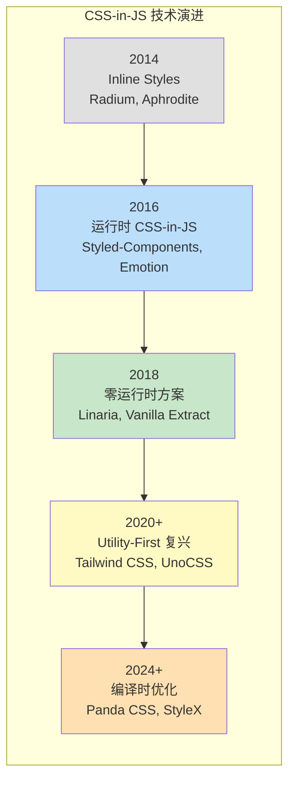
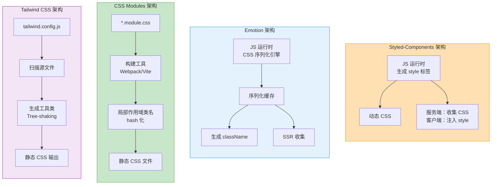
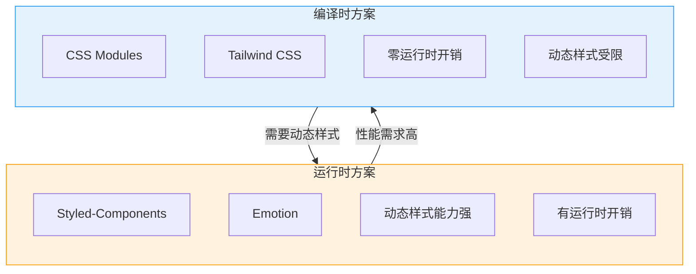
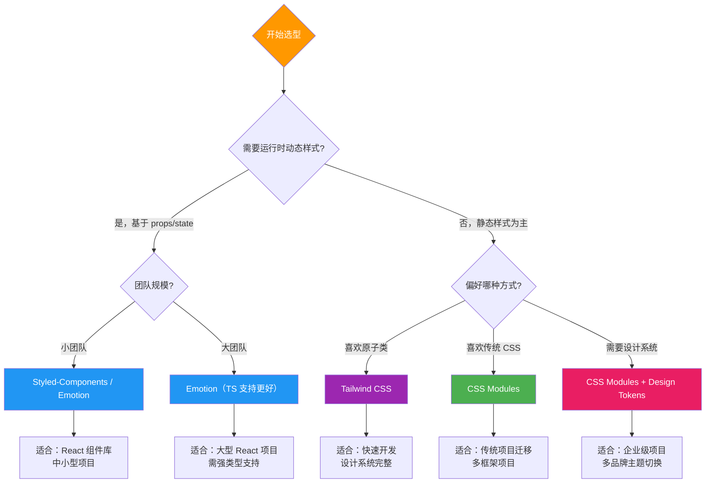

# CSS-in-JS 方案对比

CSS-in-JS 是将样式直接写在 JavaScript 中的技术方案，解决了传统 CSS 的作用域、复用和动态样式等问题。

## CSS-in-JS 演进路线



## 四大方案架构对比



## Styled-Components

### 基本用法

```tsx
import styled, { css, keyframes } from 'styled-components';

// 基础组件
const Button = styled.button`
  padding: 8px 16px;
  border-radius: 4px;
  font-size: 14px;
  cursor: pointer;
  transition: all 0.2s ease;

  &:hover {
    opacity: 0.9;
  }
`;

// 带 props 的动态样式
const PrimaryButton = styled(Button)<{ $variant?: 'primary' | 'danger' }>`
  background: ${({ $variant }) =>
    $variant === 'danger' ? '#e53935' : '#2196f3'};
  color: #fff;

  &:disabled {
    opacity: 0.5;
    cursor: not-allowed;
  }
`;

// 继承已有组件
const LargeButton = styled(Button)`
  padding: 12px 24px;
  font-size: 18px;
`;

// 动画
const fadeIn = keyframes`
  from { opacity: 0; transform: translateY(10px); }
  to { opacity: 1; transform: translateY(0); }
`;

const AnimatedCard = styled.div`
  animation: ${fadeIn} 0.3s ease forwards;
`;

// 全局样式
import { createGlobalStyle } from 'styled-components';

const GlobalStyle = createGlobalStyle`
  * {
    margin: 0;
    padding: 0;
    box-sizing: border-box;
  }

  body {
    font-family: -apple-system, BlinkMacSystemFont, 'Segoe UI', Roboto, sans-serif;
  }
`;

// 使用
function App() {
  return (
    <>
      <GlobalStyle />
      <PrimaryButton $variant="primary">Click Me</PrimaryButton>
    </>
  );
}
```

### Styled-Components 主题

```tsx
import { ThemeProvider, useTheme } from 'styled-components';

const theme = {
  colors: {
    primary: '#2196f3',
    secondary: '#ff9800',
    background: '#ffffff',
    text: '#333333',
  },
  spacing: {
    sm: '8px',
    md: '16px',
    lg: '24px',
  },
};

const ThemedButton = styled.button`
  background: ${({ theme }) => theme.colors.primary};
  color: #fff;
  padding: ${({ theme }) => theme.spacing.md};
`;

function App() {
  return (
    <ThemeProvider theme={theme}>
      <ThemedButton>Themed Button</ThemedButton>
    </ThemeProvider>
  );
}
```

## Emotion

### 基本用法

```tsx
/** @jsxImportSource @emotion/react */
import { css, jsx } from '@emotion/react';
import styled from '@emotion/styled';

// css prop 方式
const cardStyle = css`
  background: #fff;
  border-radius: 8px;
  box-shadow: 0 2px 8px rgba(0, 0, 0, 0.1);
  padding: 16px;
`;

function Card({ children }: { children: React.ReactNode }) {
  return <div css={cardStyle}>{children}</div>;
}

// styled API（与 Styled-Components 类似）
const Container = styled.div`
  max-width: 1200px;
  margin: 0 auto;
  padding: 0 16px;
`;

// 对象语法
const buttonStyle = (variant: 'primary' | 'secondary') => css({
  padding: '8px 16px',
  borderRadius: 4,
  border: 'none',
  cursor: 'pointer',
  background: variant === 'primary' ? '#2196f3' : '#ff9800',
  color: '#fff',
  transition: 'opacity 0.2s',
  '&:hover': {
    opacity: 0.9,
  },
});

function Button({ variant = 'primary', children }: ButtonProps) {
  return <button css={buttonStyle(variant)}>{children}</button>;
}
```

## CSS Modules

### 基本用法

```css
/* Button.module.css */
.button {
  padding: 8px 16px;
  border-radius: 4px;
  border: none;
  cursor: pointer;
  font-size: 14px;
  transition: all 0.2s ease;
}

.primary {
  background: #2196f3;
  color: #fff;
}

.secondary {
  background: transparent;
  border: 1px solid #2196f3;
  color: #2196f3;
}

.large {
  padding: 12px 24px;
  font-size: 18px;
}

.loading {
  opacity: 0.7;
  pointer-events: none;
}
```

```tsx
// Button.tsx
import styles from './Button.module.css';
import cn from 'classnames'; // 或 clsx

interface ButtonProps {
  variant?: 'primary' | 'secondary';
  size?: 'normal' | 'large';
  loading?: boolean;
  children: React.ReactNode;
}

export function Button({
  variant = 'primary',
  size = 'normal',
  loading = false,
  children,
}: ButtonProps) {
  return (
    <button
      className={cn(styles.button, {
        [styles.primary]: variant === 'primary',
        [styles.secondary]: variant === 'secondary',
        [styles.large]: size === 'large',
        [styles.loading]: loading,
      })}
    >
      {children}
    </button>
  );
}
```

### CSS Modules + Sass

```scss
// _variables.scss
$primary: #2196f3;
$border-radius: 4px;

// Button.module.scss
.button {
  padding: 8px 16px;
  border-radius: $border-radius;

  // 使用 composes 组合
}

.icon {
  margin-right: 8px;
}
```

```tsx
// composes 关键字实现组合
// Button.module.css
.base {
  display: inline-flex;
  align-items: center;
}

.primary {
  composes: base;
  background: #2196f3;
}
```

## Tailwind CSS

### 基本用法

```tsx
// 纯 Tailwind 工具类
function Card({ title, description }: CardProps) {
  return (
    <div className="rounded-lg bg-white p-4 shadow-md transition-shadow hover:shadow-lg">
      <h3 className="mb-2 text-lg font-semibold text-gray-900">{title}</h3>
      <p className="leading-relaxed text-gray-600">{description}</p>
      <button className="mt-4 rounded bg-blue-500 px-4 py-2 text-white hover:bg-blue-600">
        Read More
      </button>
    </div>
  );
}
```

### Tailwind 配置与自定义

```js
// tailwind.config.js
module.exports = {
  content: ['./src/**/*.{tsx,ts,jsx,js}'],
  darkMode: 'class',
  theme: {
    extend: {
      colors: {
        brand: {
          50: '#e3f2fd',
          500: '#2196f3',
          600: '#1e88e5',
          700: '#1976d2',
        },
      },
      fontFamily: {
        sans: ['Inter', 'system-ui', 'sans-serif'],
      },
      borderRadius: {
        '4xl': '2rem',
      },
    },
  },
  plugins: [],
};
```

### Tailwind 组件抽象

```tsx
// 使用 cva（class-variance-authority）管理变体
import { cva, type VariantProps } from 'class-variance-authority';

const buttonVariants = cva('rounded font-medium transition-colors focus:outline-none', {
  variants: {
    variant: {
      primary: 'bg-brand-500 text-white hover:bg-brand-600',
      secondary: 'border border-brand-500 text-brand-500 hover:bg-brand-50',
      ghost: 'text-gray-600 hover:bg-gray-100',
    },
    size: {
      sm: 'px-3 py-1.5 text-sm',
      md: 'px-4 py-2 text-base',
      lg: 'px-6 py-3 text-lg',
    },
  },
  defaultVariants: {
    variant: 'primary',
    size: 'md',
  },
});

interface ButtonProps extends VariantProps<typeof buttonVariants> {
  children: React.ReactNode;
}

export function Button({ variant, size, children }: ButtonProps) {
  return (
    <button className={buttonVariants({ variant, size })}>
      {children}
    </button>
  );
}
```

## 四大方案深度对比



### 关键维度对比表

| 维度 | Styled-Components | Emotion | CSS Modules | Tailwind CSS |
|------|-------------------|---------|-------------|--------------|
| **运行时** | 有 | 有 | 无 | 无 |
| **作用域** | 组件级 | 组件级 | 文件级 | 全局（需约定） |
| **动态样式** | 强 | 强 | 有限 | 有限 |
| **SSR 支持** | 好 | 好 | 原生 | 原生 |
| **Tree Shaking** | 有限 | 有限 | 好 | 好 |
| **学习成本** | 低 | 低 | 低 | 中 |
| **TS 支持** | 插件 | 内置 | 原生 | 插件 |
| **Bundle 大小** | ~12KB | ~8KB | ~0KB | ~0KB（生成后） |
| **开发体验** | 好 | 好 | 中 | 好 |
| **维护状态** | 活跃 | 活跃 | 内置于工具链 | 活跃 |

## 方案选择决策流程



## 混合方案实践

在实际项目中，往往混合使用多种方案：

```tsx
// 布局和基础样式用 CSS Modules
import layoutStyles from './layout.module.css';

// 复杂动态组件用 Styled-Components
import styled from 'styled-components';

// 工具类用 Tailwind
// <div className="flex items-center gap-2">

const DynamicBar = styled.div<{ width: number }>`
  width: ${({ width }) => width}%;
  height: 4px;
  background: #2196f3;
  transition: width 0.3s ease;
`;

function Progress({ value }: { value: number }) {
  return (
    <div className={layoutStyles.progressContainer}>
      <DynamicBar width={value} />
      <span className="text-sm text-gray-500">{value}%</span>
    </div>
  );
}
```

## 面试要点

1. **CSS-in-JS 的运行时开销是什么？** — 需要在 JS 中解析、序列化、注入样式，会增加首屏时间和运行时 CPU 消耗
2. **Styled-Components 和 Emotion 的区别？** — API 类似，Emotion 的 css prop 更灵活，TS 支持更好，包体积更小
3. **CSS Modules 的原理？** — 构建工具将类名哈希化，实现局部作用域，输出独立的 CSS 文件
4. **Tailwind CSS 的 Tree Shaking 原理？** — 扫描源文件中使用的类名，只生成实际用到的工具类
5. **为什么 SSR 项目倾向于用 CSS Modules 或 Tailwind？** — 无运行时开销，CSS 提取简单，不影响流式渲染
6. **React 19 + RSC 时代 CSS-in-JS 的挑战？** — 运行时方案无法在 Server Components 中使用，需要客户端组件边界

---

> **相关章节**：[BEM 方法论](./bem.md) | [设计系统搭建](./design-system.md)
