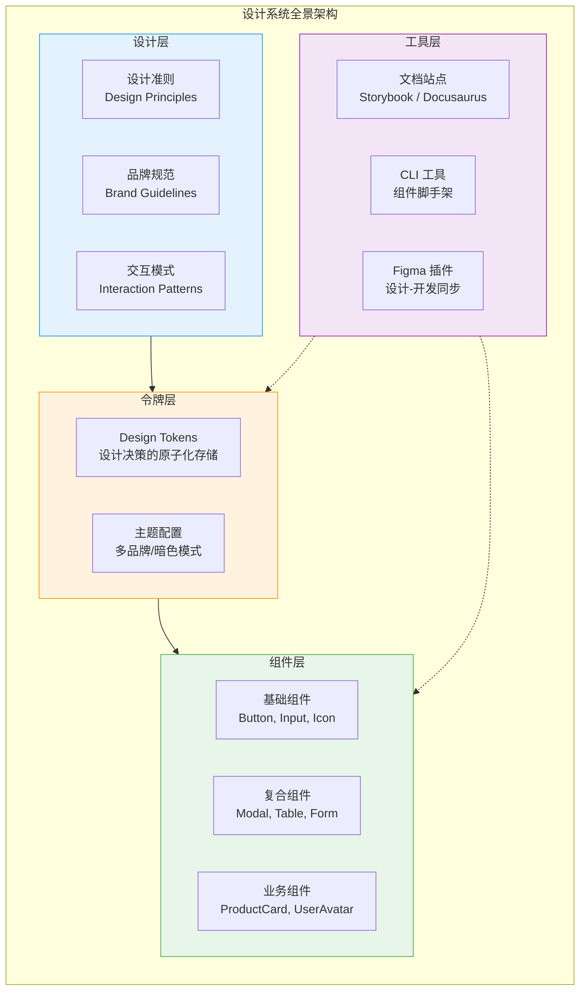
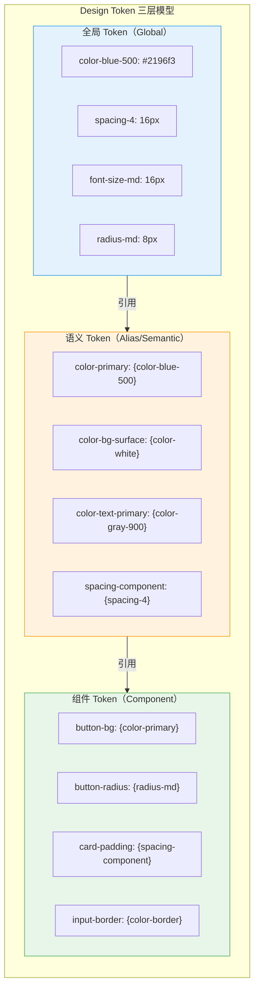
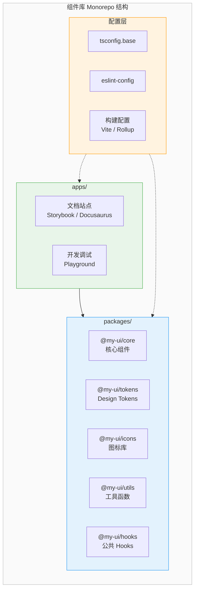
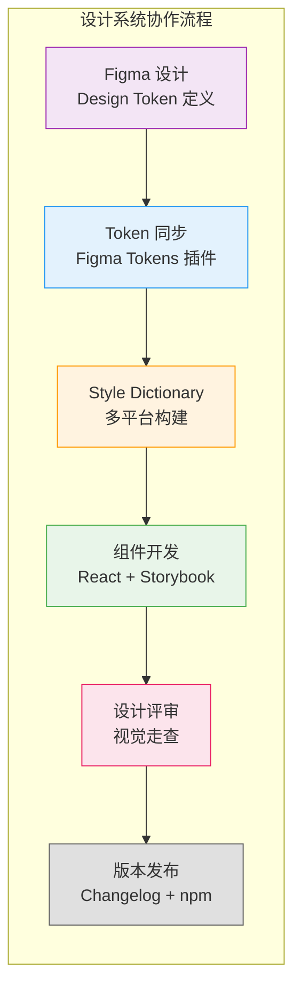

# 设计系统搭建

设计系统是产品设计与开发的基础设施，包含设计准则、组件库、设计令牌和文档，确保产品在视觉和交互上的一致性。

## 设计系统全景架构



## Design Token 体系

Design Token 是设计决策的最小可复用单元，以键值对形式存储颜色、间距、字体等设计属性。

### Token 分层模型



### Design Token 实现

```json
// tokens/color.json — W3C Design Token Community Group 格式
{
  "color": {
    "blue": {
      "50":  { "$value": "#e3f2fd", "$type": "color" },
      "100": { "$value": "#bbdefb", "$type": "color" },
      "500": { "$value": "#2196f3", "$type": "color" },
      "600": { "$value": "#1e88e5", "$type": "color" },
      "700": { "$value": "#1976d2", "$type": "color" }
    },
    "gray": {
      "50":  { "$value": "#fafafa", "$type": "color" },
      "100": { "$value": "#f5f5f5", "$type": "color" },
      "900": { "$value": "#212121", "$type": "color" }
    },
    "semantic": {
      "primary":     { "$value": "{color.blue.500}", "$type": "color" },
      "primary-hover": { "$value": "{color.blue.600}", "$type": "color" },
      "bg-surface":  { "$value": "{color.gray.50}", "$type": "color" },
      "text-primary": { "$value": "{color.gray.900}", "$type": "color" }
    }
  },
  "spacing": {
    "1": { "$value": "4px", "$type": "dimension" },
    "2": { "$value": "8px", "$type": "dimension" },
    "3": { "$value": "12px", "$type": "dimension" },
    "4": { "$value": "16px", "$type": "dimension" },
    "6": { "$value": "24px", "$type": "dimension" },
    "8": { "$value": "32px", "$type": "dimension" }
  },
  "borderRadius": {
    "sm": { "$value": "4px", "$type": "dimension" },
    "md": { "$value": "8px", "$type": "dimension" },
    "lg": { "$value": "12px", "$type": "dimension" },
    "full": { "$value": "9999px", "$type": "dimension" }
  }
}
```

### 使用 Style Dictionary 转换 Token

```js
// style-dictionary.config.js
const StyleDictionary = require('style-dictionary');

module.exports = {
  source: ['tokens/**/*.json'],
  platforms: {
    css: {
      transformGroup: 'css',
      buildPath: 'dist/css/',
      files: [
        {
          destination: 'variables.css',
          format: 'css/variables',
          options: {
            outputReferences: true,
          },
        },
      ],
    },
    js: {
      transformGroup: 'js',
      buildPath: 'dist/js/',
      files: [
        {
          destination: 'tokens.js',
          format: 'javascript/es6',
        },
      ],
    },
    scss: {
      transformGroup: 'scss',
      buildPath: 'dist/scss/',
      files: [
        {
          destination: '_variables.scss',
          format: 'scss/variables',
        },
      ],
    },
  },
};
```

输出结果：

```css
/* dist/css/variables.css */
:root {
  --color-blue-50: #e3f2fd;
  --color-blue-500: #2196f3;
  --color-primary: var(--color-blue-500);
  --color-bg-surface: #fafafa;
  --spacing-4: 16px;
  --radius-md: 8px;
}
```

```scss
// dist/scss/_variables.scss
$color-blue-500: #2196f3;
$color-primary: $color-blue-500;
$spacing-4: 16px;
$radius-md: 8px;
```

## 主题切换实现

### 方案一：CSS 变量切换

```mermaid
graph LR
    subgraph THEME_SWITCH["主题切换流程"]
        direction TB
        ROOT[":root<br/>默认（亮色）变量"]
        DARK["[data-theme='dark']<br/>暗色变量覆盖"]
        JS["JavaScript<br/>切换 data-theme 属性"]
    end

    JS -->|"setAttribute<br/>data-theme"| ROOT
    JS -->|"setAttribute<br/>data-theme"| DARK

    style ROOT fill:#fffde7,stroke:#fbc02d
    style DARK fill:#37474f,stroke:#263238
    style JS fill:#e3f2fd,stroke:#2196f3
```



```css
/* 亮色主题（默认） */
:root {
  --color-bg-primary: #ffffff;
  --color-bg-secondary: #f5f5f5;
  --color-text-primary: #212121;
  --color-text-secondary: #757575;
  --color-border: #e0e0e0;
  --color-primary: #2196f3;
  --shadow-card: 0 2px 8px rgba(0, 0, 0, 0.1);
}

/* 暗色主题 */
[data-theme='dark'] {
  --color-bg-primary: #121212;
  --color-bg-secondary: #1e1e1e;
  --color-text-primary: #e0e0e0;
  --color-text-secondary: #9e9e9e;
  --color-border: #333333;
  --color-primary: #64b5f6;
  --shadow-card: 0 2px 8px rgba(0, 0, 0, 0.4);
}

/* 使用变量 */
.card {
  background: var(--color-bg-primary);
  color: var(--color-text-primary);
  border: 1px solid var(--color-border);
  box-shadow: var(--shadow-card);
}
```

```tsx
// 主题切换 Hook
function useTheme() {
  const [theme, setTheme] = useState<'light' | 'dark'>('light');

  useEffect(() => {
    document.documentElement.setAttribute('data-theme', theme);
    localStorage.setItem('theme', theme);
  }, [theme]);

  useEffect(() => {
    const saved = localStorage.getItem('theme') as 'light' | 'dark';
    const prefersDark = window.matchMedia('(prefers-color-scheme: dark)').matches;
    setTheme(saved || (prefersDark ? 'dark' : 'light'));
  }, []);

  const toggle = () => setTheme(prev => (prev === 'light' ? 'dark' : 'light'));

  return { theme, toggle };
}
```

### 方案二：Styled-Components ThemeProvider

```tsx
import { ThemeProvider, useTheme as useStyledTheme } from 'styled-components';

const lightTheme = {
  colors: {
    bgPrimary: '#ffffff',
    textPrimary: '#212121',
    primary: '#2196f3',
  },
};

const darkTheme = {
  colors: {
    bgPrimary: '#121212',
    textPrimary: '#e0e0e0',
    primary: '#64b5f6',
  },
};

function ThemeSwitcher({ children }: { children: React.ReactNode }) {
  const [isDark, setIsDark] = useState(false);

  return (
    <ThemeProvider theme={isDark ? darkTheme : lightTheme}>
      <button onClick={() => setIsDark(!isDark)}>Toggle Theme</button>
      {children}
    </ThemeProvider>
  );
}
```

## 组件库架构

### 项目结构



### 组件目录结构

```
packages/core/src/
├── Button/
│   ├── Button.tsx          # 组件实现
│   ├── Button.styles.ts    # 样式定义
│   ├── Button.types.ts     # 类型定义
│   ├── Button.test.tsx     # 单元测试
│   ├── Button.stories.tsx  # Storybook 文档
│   └── index.ts            # 导出
├── Input/
│   ├── ...
├── hooks/
│   ├── useTheme.ts
│   └── useBreakpoint.ts
└── index.ts                # 统一导出
```

### 组件设计原则

```tsx
// Button 组件设计示例
interface ButtonProps {
  // 语义化变体
  variant?: 'primary' | 'secondary' | 'ghost' | 'danger';
  // 尺寸
  size?: 'sm' | 'md' | 'lg';
  // 状态
  loading?: boolean;
  disabled?: boolean;
  // 图标
  icon?: React.ReactNode;
  iconPosition?: 'left' | 'right';
  // 原生属性透传
  type?: 'button' | 'submit' | 'reset';
  onClick?: (e: React.MouseEvent<HTMLButtonElement>) => void;
  children: React.ReactNode;
}

export function Button({
  variant = 'primary',
  size = 'md',
  loading = false,
  disabled = false,
  icon,
  iconPosition = 'left',
  type = 'button',
  onClick,
  children,
}: ButtonProps) {
  return (
    <button
      className={cn('btn', `btn--${variant}`, `btn--${size}`, {
        'btn--loading': loading,
      })}
      type={type}
      disabled={disabled || loading}
      onClick={onClick}
    >
      {loading && <Spinner size={size} />}
      {!loading && icon && iconPosition === 'left' && icon}
      <span className="btn__text">{children}</span>
      {!loading && icon && iconPosition === 'right' && icon}
    </button>
  );
}
```

## 设计系统工作流



## 面试要点

1. **Design Token 是什么？** — 设计决策的原子化存储，以键值对形式保存颜色、间距、字体等属性，支持多平台输出
2. **Token 的三层结构是什么？** — 全局 Token（具体值）→ 语义 Token（抽象含义）→ 组件 Token（组件专属）
3. **主题切换有哪些方案？** — CSS 变量切换、ThemeProvider（运行时）、构建时多套 CSS
4. **如何保证设计与开发的一致性？** — Design Token 作为单一数据源，Figma 插件同步，Style Dictionary 多平台构建
5. **组件库的版本策略？** — 语义化版本、独立发包、changelog 自动生成、渐进式迁移指南
6. **Monorepo 管理组件库用什么工具？** — Turborepo、Nx、pnpm workspace

---

> **相关章节**：[BEM 方法论](./bem.md) | [CSS-in-JS 方案对比](./css-in-js.md)
