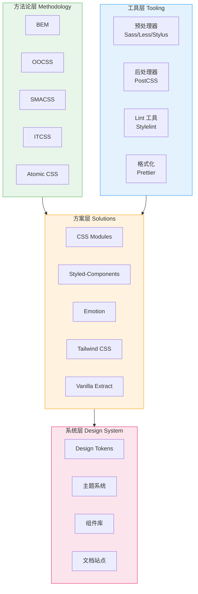
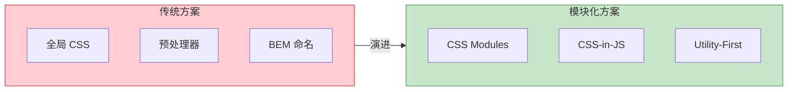
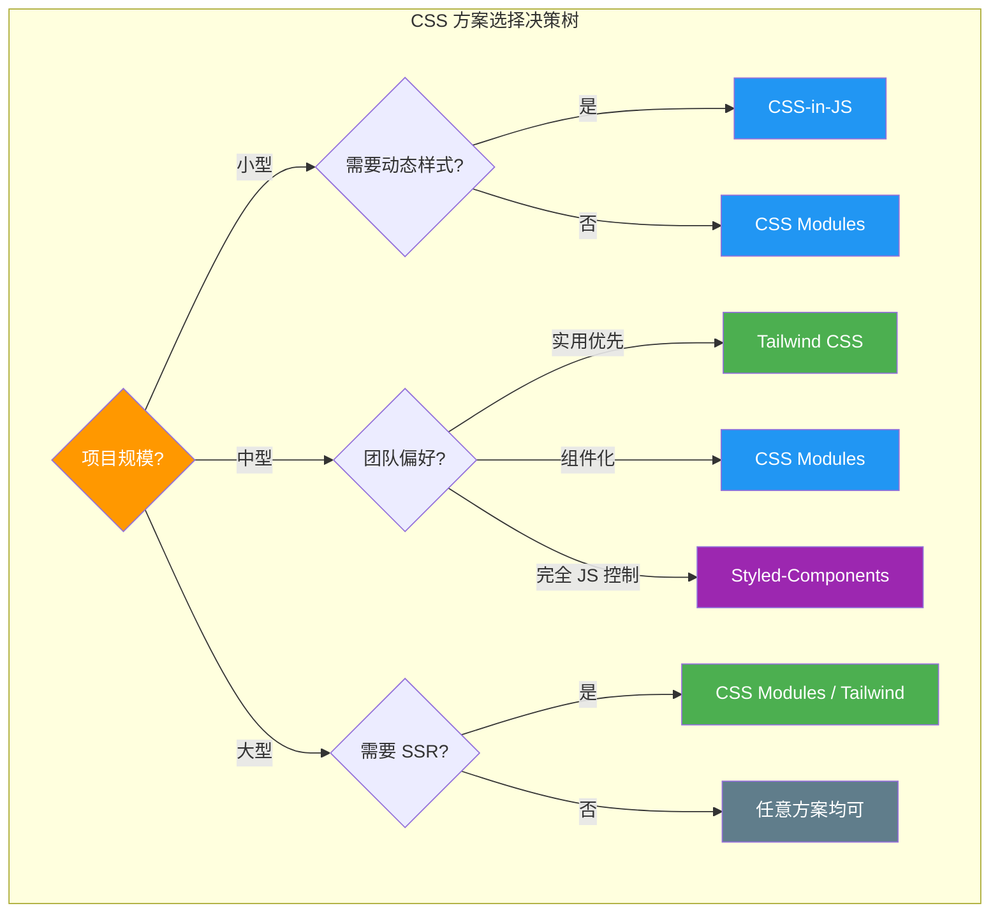
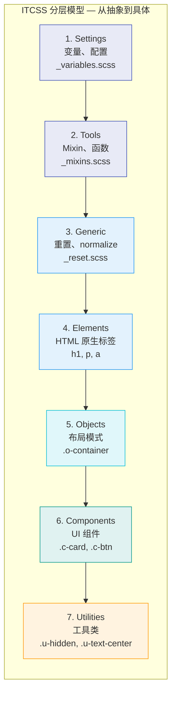

# CSS 架构概述

CSS 架构是前端工程化的核心支柱之一。良好的 CSS 架构能让样式代码可维护、可扩展、可协作，避免"CSS 地狱"。

## 为什么需要 CSS 架构？

随着项目规模增长，原生 CSS 会面临以下问题：

| 问题 | 表现 | 根因 |
|------|------|------|
| 命名冲突 | 样式被意外覆盖 | 全局作用域 |
| 依赖关系混乱 | 修改一处影响全局 | 无模块化 |
| 代码冗余 | 大量重复样式 | 无复用机制 |
| 难以删除 | 不确定样式是否被使用 | 无引用追踪 |
| 团队协作困难 | 合并冲突频繁 | 无规范约束 |

## CSS 架构全景

## 主流 CSS 架构方案对比

### 核心维度对比

## CSS 架构层级（ITCSS 模型）

ITCSS（Inverted Triangle CSS）是最经典的 CSS 架构分层模型，由 Harry Roberts 提出：

**特异性从上到下递增，每一层只依赖上一层，不反向依赖。**

## 本模块内容导航

| 章节 | 核心内容 | 关键知识点 |
|------|----------|------------|
| [BEM 方法论](./bem.md) | CSS 命名规范与方法论 | Block/Element/Modifier、命名约定、变体管理 |
| [CSS-in-JS 方案](./css-in-js.md) | 运行时与编译时方案对比 | Styled-Components、Emotion、CSS Modules、Tailwind |
| [设计系统搭建](./design-system.md) | 从 Token 到组件库的完整体系 | Design Token、主题切换、组件库架构 |

## 面试要点

1. **解释 ITCSS 模型的分层思想** — 从最宽泛的设置层到最具体的工具层
2. **BEM 方法论解决了什么问题** — 全局命名冲突、样式耦合
3. **CSS-in-JS 与 CSS Modules 的区别** — 运行时 vs 编译时
4. **Design Token 是什么** — 设计决策的原子化存储
5. **如何做主题切换** — CSS 变量、Theme Provider、数据属性切换

---

> **下一步**：从 [BEM 方法论](./bem.md) 开始，了解最基础的 CSS 命名规范。
