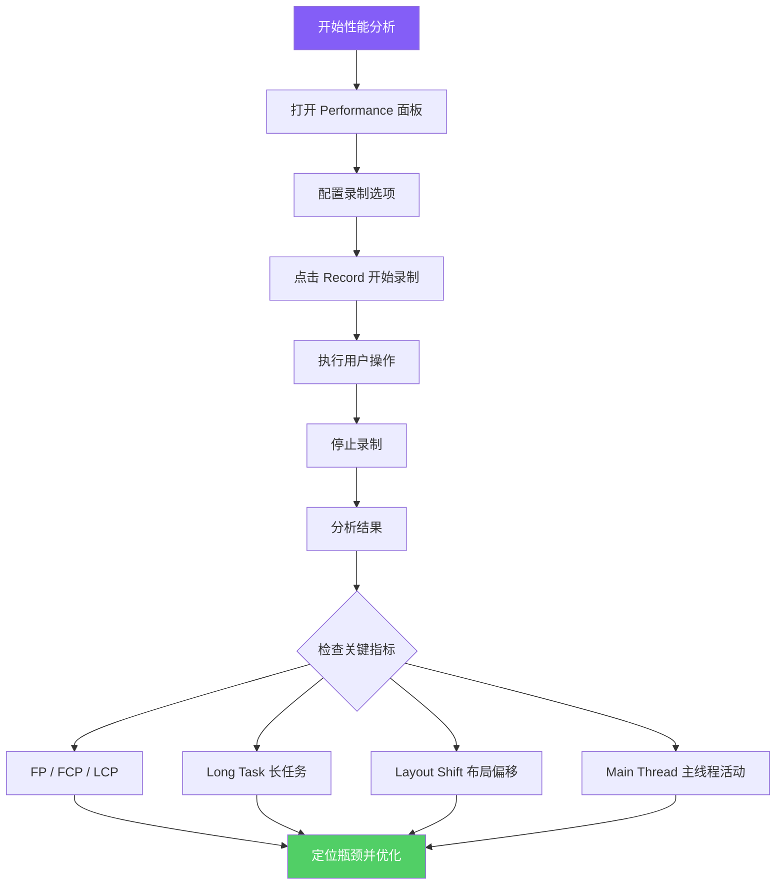
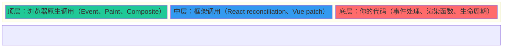
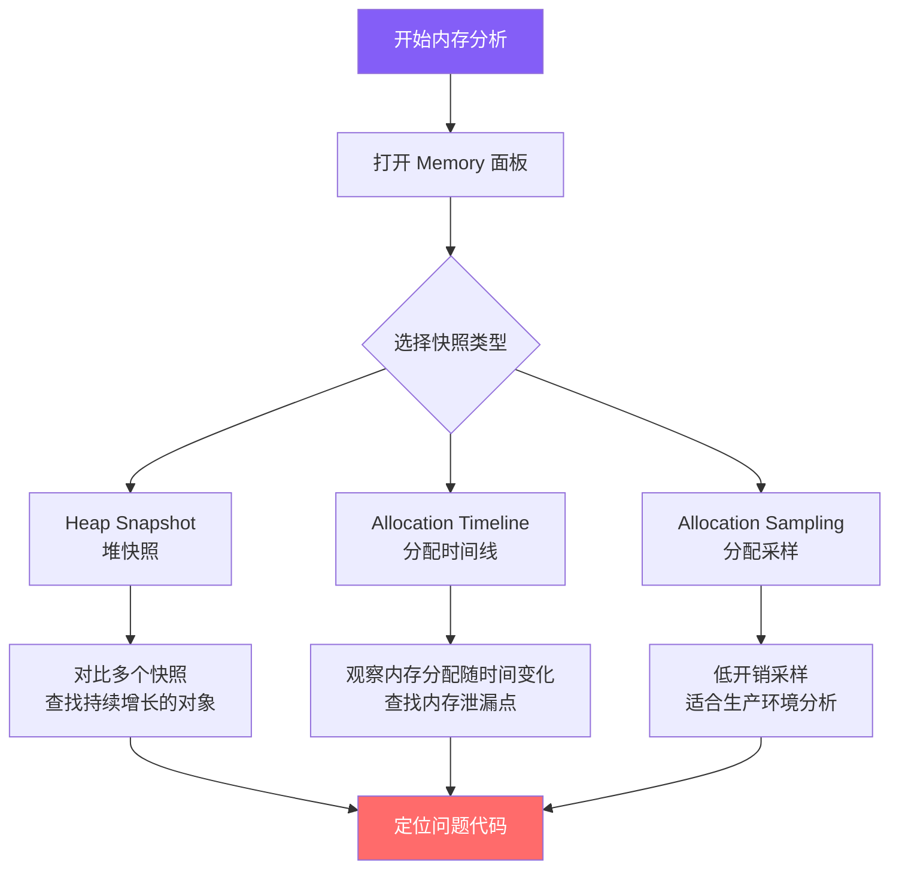
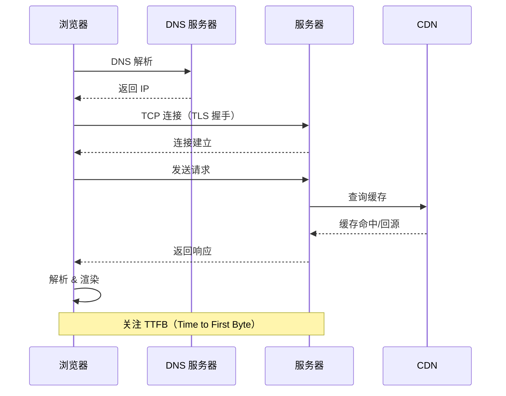
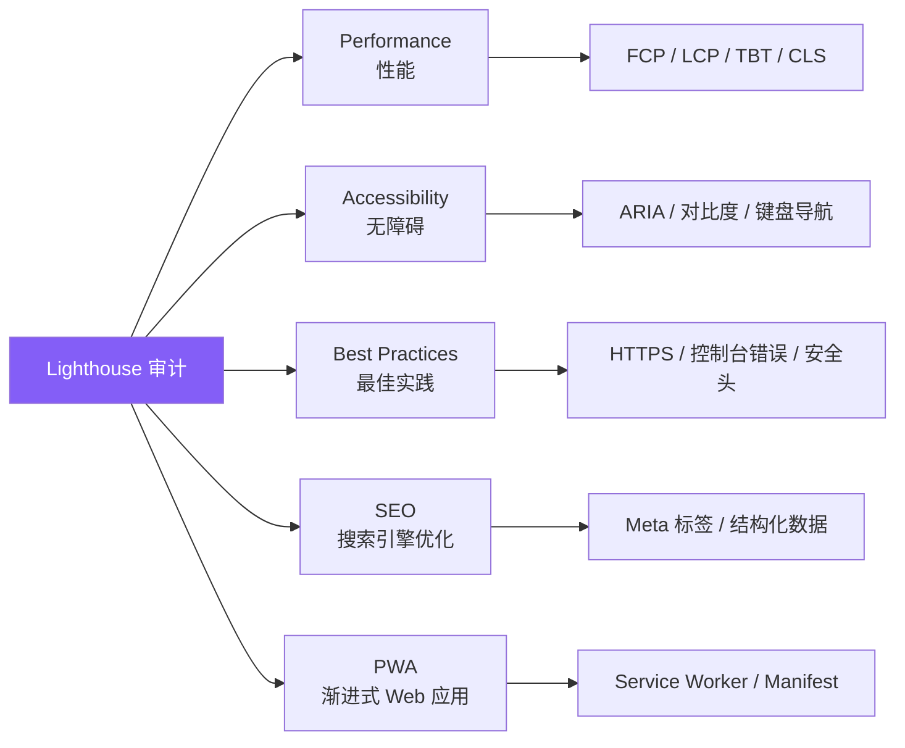
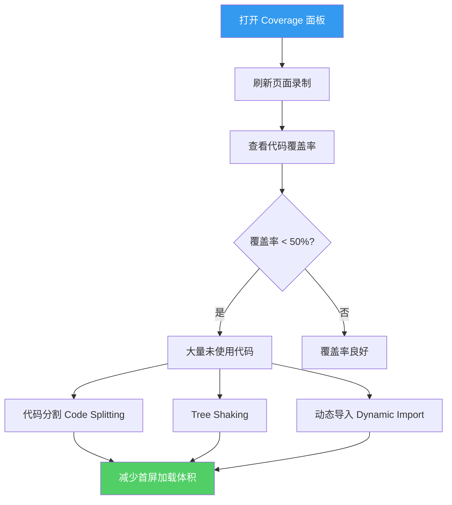

# Chrome DevTools 进阶

Chrome DevTools 是前端调试的核心工具。本文深入讲解 Performance、Memory、Network 三大面板的高级用法，以及 Lighthouse 审计和火焰图分析技巧。

## Performance 面板

### 性能分析流程



### 核心指标解读

| 指标 | 全称 | 含义 | 达标值 |
|------|------|------|--------|
| FP | First Paint | 首次绘制 | < 1s |
| FCP | First Contentful Paint | 首次内容绘制 | < 1.8s |
| LCP | Largest Contentful Paint | 最大内容绘制 | < 2.5s |
| TTI | Time to Interactive | 可交互时间 | < 3.8s |
| TBT | Total Blocking Time | 总阻塞时间 | < 200ms |
| CLS | Cumulative Layout Shift | 累积布局偏移 | < 0.1 |

### 火焰图（Flame Chart）分析

火焰图是 Performance 面板中最核心的可视化工具：



**火焰图阅读要点**：

- **宽度** = 执行时间，越宽表示耗时越长
- **颜色**：黄色 = 脚本执行，紫色 = 渲染，绿色 = 绘制
- **长任务（红色三角）**：超过 50ms 的任务会阻塞主线程

```javascript
// 模拟一个长任务，可在 Performance 面板中观察
function longTask() {
  const start = performance.now();
  // 模拟耗时计算
  while (performance.now() - start < 100) {
    // 阻塞主线程 100ms
  }
  console.log('Long task completed');
}

// 使用 requestIdleCallback 拆分长任务
function processLargeArray(array) {
  const CHUNK_SIZE = 100;
  let index = 0;

  function processChunk(deadline) {
    while (index < array.length && deadline.timeRemaining() > 0) {
      const chunk = array.slice(index, index + CHUNK_SIZE);
      chunk.forEach(processItem);
      index += CHUNK_SIZE;
    }
    if (index < array.length) {
      requestIdleCallback(processChunk);
    }
  }

  requestIdleCallback(processChunk);
}
```

### Performance 录制技巧

```javascript
// 使用 Performance API 手动标记关键节点
performance.mark('render-start');
// ... 执行渲染逻辑
performance.mark('render-end');
performance.measure('render-duration', 'render-start', 'render-end');

// 在 Performance 面板的 Timings 区域可以看到自定义标记
const measures = performance.getEntriesByType('measure');
console.log('Render duration:', measures[0].duration);
```

## Memory 面板

### 内存分析流程



### 堆快照分析

| 视图 | 用途 | 关注点 |
|------|------|--------|
| Summary 视图 | 按构造函数分组 | 对象数量和内存占用 |
| Comparison 视图 | 对比两个快照 | Delta（增量）为正数的对象 |
| Containment 视图 | 查看对象引用链 | GC Root 到对象的引用路径 |
| Statistics 视图 | 内存分布饼图 | 各类型内存占比 |

```javascript
// 使用 Heap Snapshot 的 Comparison 视图排查泄漏
// 步骤：
// 1. 打开页面，拍第一个快照
// 2. 执行可疑操作（如打开/关闭弹窗）
// 3. 手动触发 GC，拍第二个快照
// 4. 切换到 Comparison 视图，对比两个快照
// 5. 关注 #Delta 为正数且持续增长的对象

// 在代码中辅助排查
class LeakDetector {
  constructor() {
    this.trackedObjects = new WeakMap();
  }

  track(obj, label) {
    this.trackedObjects.set(obj, label);
    console.log(`[LeakDetector] Tracking: ${label}`);
  }

  // 使用 FinalizationRegistry 检测对象是否被回收
  createRegistry() {
    return new FinalizationRegistry((heldValue) => {
      console.log(`[LeakDetector] GC'd: ${heldValue}`);
    });
  }
}
```

### Allocation Timeline 使用

Allocation Timeline 可以直观地看到内存分配的时间分布：

- **蓝色竖线** = 新对象分配
- **灰色区域** = 已被 GC 回收
- **持续存在的蓝色区域** = 潜在的内存泄漏

## Network 面板

### 网络请求分析



### Network 面板高级功能

| 功能 | 用途 | 操作方式 |
|------|------|----------|
| 请求过滤 | 快速定位特定请求 | Filter 输入框支持类型/状态码/大小过滤 |
| 导出 HAR | 保存网络记录供分析 | 右键 > Save all as HAR with content |
| 模拟限速 | 测试弱网表现 | Network throttling 下拉菜单 |
| 模拟离线 | 测试 Service Worker | Offline 复选框 |
| 阻止请求 | 模拟资源加载失败 | Network request blocking |
| 覆盖响应 | Mock 接口数据 | Overrides 本地文件覆盖 |

```javascript
// 使用 Service Worker 拦截和 Mock 请求（开发环境）
// mock-sw.js
self.addEventListener('fetch', (event) => {
  const url = new URL(event.request.url);

  if (url.pathname === '/api/user') {
    event.respondWith(
      new Response(JSON.stringify({
        id: 1,
        name: 'Test User',
        email: 'test@example.com'
      }), {
        headers: { 'Content-Type': 'application/json' }
      })
    );
  }
});

// 使用 Performance API 监控资源加载
const observer = new PerformanceObserver((list) => {
  for (const entry of list.getEntries()) {
    if (entry.duration > 1000) {
      console.warn(`[Slow Resource] ${entry.name}: ${entry.duration}ms`);
    }
  }
});
observer.observe({ entryTypes: ['resource'] });
```

## Lighthouse 审计

### Lighthouse 报告解读



### Lighthouse CI 集成

```javascript
// lighthouserc.js - Lighthouse CI 配置
module.exports = {
  ci: {
    collect: {
      url: ['http://localhost:3000/', 'http://localhost:3000/about'],
      numberOfRuns: 3,
      settings: {
        preset: 'desktop',
      },
    },
    assert: {
      assertions: {
        'first-contentful-paint': ['error', { maxNumericValue: 2000 }],
        'largest-contentful-paint': ['error', { maxNumericValue: 2500 }],
        'cumulative-layout-shift': ['error', { maxNumericValue: 0.1 }],
        'total-blocking-time': ['error', { maxNumericValue: 200 }],
      },
    },
    upload: {
      target: 'temporary-public-storage',
    },
  },
};
```

## 实战调试技巧

### 模拟不同环境

```javascript
// 在 Console 中模拟不同设备和网络
// 1. 设备模拟：DevTools > Toggle Device Toolbar (Ctrl+Shift+M)
// 2. 网络节流：Network > Throttling > Slow 3G / Fast 3G
// 3. CPU 节流：Performance > CPU > 4x slowdown

// 使用 Console 模拟地理位置
// DevTools > Sensors > Location > 自定义经纬度

// 使用 Console 模拟色盲模式
// DevTools > Rendering > Emulate vision deficiencies
```

### Coverage 面板：代码覆盖率分析



### Rendering 面板可视化

DevTools 的 Rendering 面板提供多种可视化调试选项：

| 选项 | 用途 |
|------|------|
| Paint Flashing | 高亮重绘区域（绿色闪烁） |
| Layer Borders | 显示图层边界 |
| Layout Shift Regions | 高亮布局偏移区域 |
| Core Web Vitals | 实时显示 CWV 指标 |
| Frame Rendering Stats | 显示 FPS 和 GPU 内存 |

## 面试要点

### 常见面试问题

1. **如何使用 Performance 面板分析页面性能瓶颈？**
   - 录制用户操作流程，关注 Long Task（超过 50ms 的任务）
   - 分析火焰图中耗时最长的函数调用栈
   - 检查 Main 线程是否存在阻塞（JS 执行、布局、绘制）
   - 关注 Recalculate Style 和 Layout 的耗时

2. **Memory 面板中如何定位内存泄漏？**
   - 使用 Heap Snapshot 的 Comparison 视图对比两个快照
   - 关注 Delta 为正数的对象（未被 GC 回收）
   - 使用 Allocation Timeline 观察内存分配趋势
   - 通过 Retainers 面板追溯引用链，找到持有引用的代码

3. **如何优化首屏加载性能？**
   - 使用 Coverage 面板识别未使用的 JS/CSS 代码
   - 通过代码分割和动态导入减少首屏资源体积
   - 使用 Network 面板识别阻塞渲染的资源
   - 利用 Lighthouse 的优化建议逐步改进
