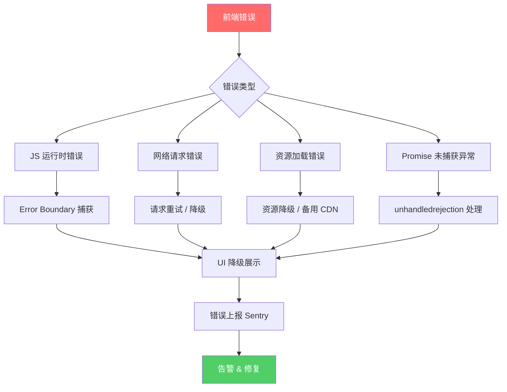
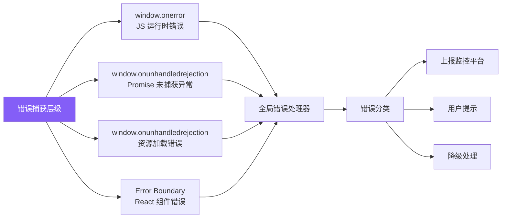
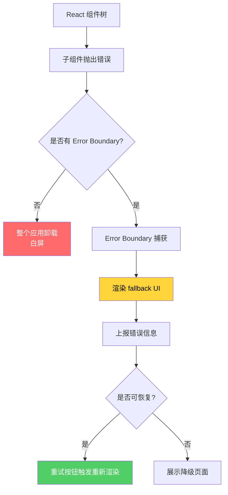
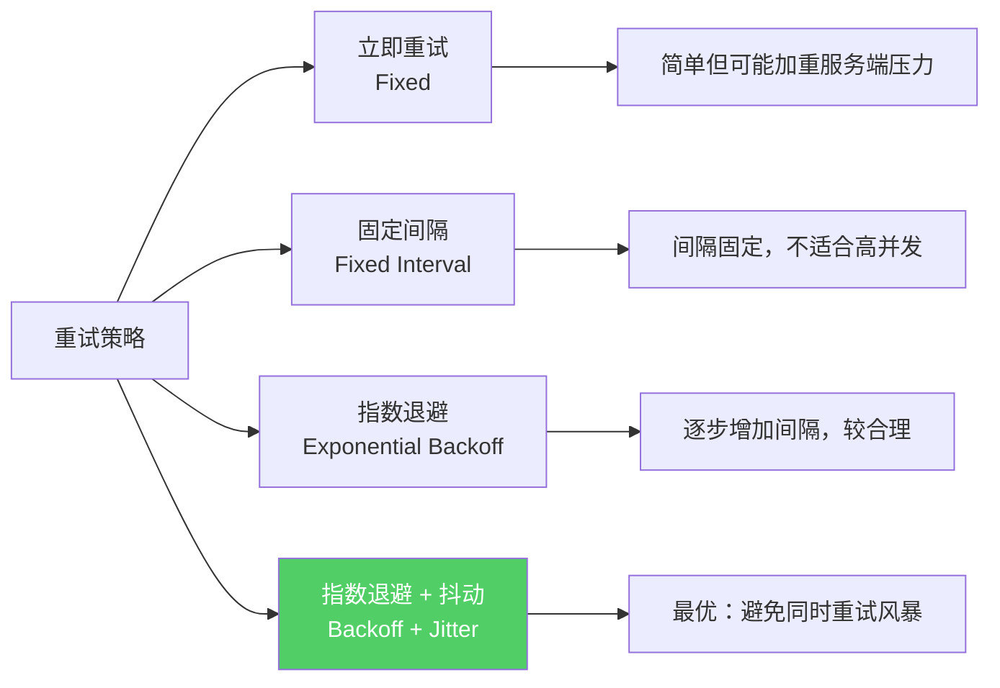
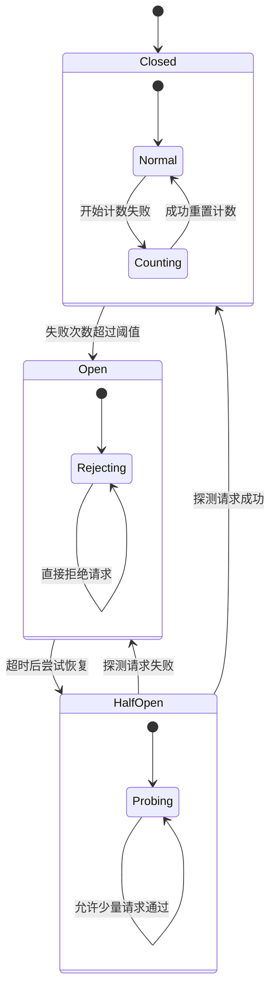
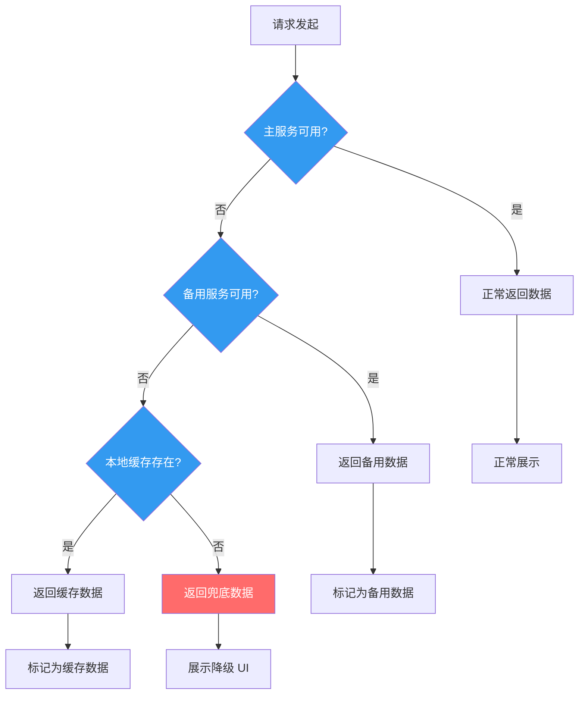

# 错误处理与容错

健壮的错误处理是高质量前端应用的基础。本文系统讲解前端错误处理的完整体系，从 Error Boundary 到熔断机制，帮助构建高可用的前端应用。

## 错误处理架构总览



## 全局错误捕获

### 错误捕获机制



### 完整的全局错误捕获实现

```javascript
// error-catcher.js - 全局错误捕获器
class ErrorCatcher {
  constructor(options = {}) {
    this.onReport = options.onReport || console.error;
    this.onError = options.onError || null;
    this.maxErrors = options.maxErrors || 10;
    this.errorCount = 0;
  }

  install() {
    // 1. 捕获 JS 运行时错误
    window.onerror = (message, source, lineno, colno, error) => {
      this.handleError({
        type: 'runtime',
        message,
        source,
        lineno,
        colno,
        stack: error?.stack,
      });
      return true; // 阻止默认行为
    };

    // 2. 捕获未处理的 Promise 异常
    window.addEventListener('unhandledrejection', (event) => {
      this.handleError({
        type: 'promise',
        message: event.reason?.message || String(event.reason),
        stack: event.reason?.stack,
      });
      event.preventDefault();
    });

    // 3. 捕获资源加载错误
    window.addEventListener('error', (event) => {
      if (event.target && (event.target.src || event.target.href)) {
        this.handleError({
          type: 'resource',
          message: `Failed to load: ${event.target.src || event.target.href}`,
          tagName: event.target.tagName,
          resourceUrl: event.target.src || event.target.href,
        });
      }
    }, true); // 使用捕获阶段

    // 4. 捕获 CSS 解析错误等
    window.addEventListener('error', (event) => {
      if (event.message && !event.target) {
        this.handleError({
          type: 'unknown',
          message: event.message,
        });
      }
    });
  }

  handleError(errorInfo) {
    this.errorCount++;

    if (this.errorCount > this.maxErrors) {
      console.warn('[ErrorCatcher] Max error count reached, stopping report');
      return;
    }

    // 补充环境信息
    const enrichedError = {
      ...errorInfo,
      timestamp: Date.now(),
      url: window.location.href,
      userAgent: navigator.userAgent,
      errorId: this.generateErrorId(errorInfo),
    };

    // 上报
    this.onReport(enrichedError);

    // 执行自定义错误处理
    if (this.onError) {
      this.onError(enrichedError);
    }
  }

  generateErrorId(errorInfo) {
    const key = `${errorInfo.type}-${errorInfo.message}-${errorInfo.source}`;
    return this.hashString(key);
  }

  hashString(str) {
    let hash = 0;
    for (let i = 0; i < str.length; i++) {
      hash = ((hash << 5) - hash) + str.charCodeAt(i);
      hash |= 0;
    }
    return Math.abs(hash).toString(36);
  }
}

// 使用
const catcher = new ErrorCatcher({
  onReport: (error) => {
    // 上报到 Sentry / 自建监控
    Sentry.captureException(error);
  },
  onError: (error) => {
    // 执行降级逻辑
    if (error.type === 'resource') {
      handleResourceError(error);
    }
  },
});
catcher.install();
```

## Error Boundary

### Error Boundary 工作流程



### Error Boundary 实现

```jsx
// ErrorBoundary.jsx
import React from 'react';

class ErrorBoundary extends React.Component {
  constructor(props) {
    super(props);
    this.state = {
      hasError: false,
      error: null,
      errorInfo: null,
    };
  }

  static getDerivedStateFromError(error) {
    return { hasError: true, error };
  }

  componentDidCatch(error, errorInfo) {
    this.setState({ errorInfo });

    // 上报错误
    console.error('[ErrorBoundary] Caught error:', error, errorInfo);

    // 可以集成 Sentry 等监控工具
    if (typeof window.__REPORT_ERROR__ === 'function') {
      window.__REPORT_ERROR__(error, {
        componentStack: errorInfo.componentStack,
      });
    }
  }

  handleRetry = () => {
    this.setState({ hasError: false, error: null, errorInfo: null });
  };

  render() {
    if (this.state.hasError) {
      // 使用自定义 fallback 或默认 UI
      if (this.props.fallback) {
        return this.props.fallback({
          error: this.state.error,
          reset: this.handleRetry,
        });
      }

      return (
        <div className="error-boundary-fallback">
          <h2>出现了一些问题</h2>
          <p>{this.state.error?.message}</p>
          <button onClick={this.handleRetry}>重试</button>
        </div>
      );
    }

    return this.props.children;
  }
}

// 使用方式
function App() {
  return (
    <ErrorBoundary
      fallback={({ error, reset }) => (
        <div className="global-error">
          <h1>应用出错了</h1>
          <pre>{error.message}</pre>
          <button onClick={reset}>重新加载</button>
        </div>
      )}
    >
      <Header />
      <MainContent />
      <Footer />
    </ErrorBoundary>
  );
}

// 细粒度 Error Boundary
function UserProfile({ userId }) {
  return (
    <ErrorBoundary
      fallback={({ reset }) => (
        <div className="profile-error">
          <p>用户信息加载失败</p>
          <button onClick={reset}>重试</button>
        </div>
      )}
    >
      <UserAvatar userId={userId} />
      <UserDetails userId={userId} />
    </ErrorBoundary>
  );
}
```

## 重试策略

### 重试策略对比



### 指数退避重试实现

```javascript
// retry.js - 重试工具函数
async function retryWithBackoff(fn, options = {}) {
  const {
    maxRetries = 3,
    baseDelay = 1000,
    maxDelay = 30000,
    backoffFactor = 2,
    jitter = true,
    retryCondition = () => true,
    onRetry = () => {},
    signal = null,
  } = options;

  let lastError;

  for (let attempt = 0; attempt <= maxRetries; attempt++) {
    // 检查是否已取消
    if (signal?.aborted) {
      throw new DOMException('Aborted', 'AbortError');
    }

    try {
      return await fn(attempt);
    } catch (error) {
      lastError = error;

      // 最后一次尝试失败，直接抛出
      if (attempt === maxRetries) {
        throw error;
      }

      // 检查是否满足重试条件
      if (!retryCondition(error, attempt)) {
        throw error;
      }

      // 计算延迟时间
      let delay = Math.min(
        baseDelay * Math.pow(backoffFactor, attempt),
        maxDelay
      );

      // 添加抖动，避免重试风暴
      if (jitter) {
        delay = delay * (0.5 + Math.random() * 0.5);
      }

      onRetry(error, attempt + 1, delay);

      // 等待延迟
      await new Promise((resolve, reject) => {
        const timer = setTimeout(resolve, delay);
        if (signal) {
          signal.addEventListener('abort', () => {
            clearTimeout(timer);
            reject(new DOMException('Aborted', 'AbortError'));
          });
        }
      });
    }
  }

  throw lastError;
}

// 使用示例
async function fetchWithRetry(url, options = {}) {
  return retryWithBackoff(
    async (attempt) => {
      console.log(`[Retry] Attempt ${attempt + 1} for ${url}`);
      const response = await fetch(url, {
        ...options,
        signal: options.signal,
      });

      if (!response.ok) {
        throw new Error(`HTTP ${response.status}: ${response.statusText}`);
      }

      return response.json();
    },
    {
      maxRetries: 3,
      baseDelay: 1000,
      backoffFactor: 2,
      jitter: true,
      retryCondition: (error, attempt) => {
        // 只对网络错误和 5xx 错误重试
        if (error.name === 'TypeError') return true; // 网络错误
        if (error.message.includes('HTTP 5')) return true; // 5xx
        if (error.message.includes('HTTP 429')) return true; // Too Many Requests
        return false; // 4xx 客户端错误不重试
      },
      onRetry: (error, attempt, delay) => {
        console.warn(`[Retry] Attempt ${attempt} failed, retrying in ${delay}ms`, error.message);
      },
    }
  );
}
```

### React Hook 封装

```javascript
// useRetry.js
function useRetry(asyncFn, options = {}) {
  const [state, setState] = useState({
    data: null,
    error: null,
    loading: false,
    attempt: 0,
  });

  const abortControllerRef = useRef(null);

  const execute = useCallback(async (...args) => {
    // 取消之前的请求
    abortControllerRef.current?.abort();
    abortControllerRef.current = new AbortController();

    setState(prev => ({ ...prev, loading: true, error: null }));

    try {
      const result = await retryWithBackoff(
        () => asyncFn(...args, { signal: abortControllerRef.current.signal }),
        {
          ...options,
          signal: abortControllerRef.current.signal,
          onRetry: (error, attempt, delay) => {
            setState(prev => ({ ...prev, attempt }));
            options.onRetry?.(error, attempt, delay);
          },
        }
      );

      setState({ data: result, error: null, loading: false, attempt: 0 });
      return result;
    } catch (error) {
      if (error.name !== 'AbortError') {
        setState(prev => ({ ...prev, error, loading: false }));
      }
      throw error;
    }
  }, [asyncFn]);

  // 组件卸载时取消请求
  useEffect(() => {
    return () => abortControllerRef.current?.abort();
  }, []);

  return { ...state, execute, retry: execute };
}

// 使用
function UserProfile({ userId }) {
  const { data, error, loading, retry, attempt } = useRetry(
    (signal) => fetch(`/api/users/${userId}`, { signal }).then(r => r.json()),
    { maxRetries: 3 }
  );

  useEffect(() => { retry(); }, [userId]);

  if (loading) return <div>加载中... (第 {attempt + 1} 次尝试)</div>;
  if (error) return <div>加载失败: {error.message} <button onClick={retry}>重试</button></div>;
  return <div>{data.name}</div>;
}
```

## 熔断机制

### 熔断器状态机



### 熔断器实现

```javascript
// circuit-breaker.js
class CircuitBreaker {
  constructor(options = {}) {
    this.failureThreshold = options.failureThreshold || 5;
    this.resetTimeout = options.resetTimeout || 30000;
    this.monitorInterval = options.monitorInterval || 10000;

    this.state = 'CLOSED'; // CLOSED | OPEN | HALF_OPEN
    this.failureCount = 0;
    this.successCount = 0;
    this.lastFailureTime = null;
    this.nextAttemptTime = null;

    this.listeners = {
      onStateChange: options.onStateChange || (() => {}),
      onFailure: options.onFailure || (() => {}),
      onSuccess: options.onSuccess || (() => {}),
    };
  }

  async execute(fn) {
    if (this.state === 'OPEN') {
      if (Date.now() < this.nextAttemptTime) {
        throw new Error('Circuit breaker is OPEN');
      }
      this.state = 'HALF_OPEN';
      this.listeners.onStateChange('HALF_OPEN');
    }

    try {
      const result = await fn();
      this.onSuccess();
      return result;
    } catch (error) {
      this.onFailure(error);
      throw error;
    }
  }

  onSuccess() {
    if (this.state === 'HALF_OPEN') {
      this.successCount++;
      if (this.successCount >= 3) {
        this.state = 'CLOSED';
        this.failureCount = 0;
        this.successCount = 0;
        this.listeners.onStateChange('CLOSED');
      }
    } else {
      this.failureCount = 0;
    }
    this.listeners.onSuccess();
  }

  onFailure(error) {
    this.failureCount++;
    this.lastFailureTime = Date.now();

    if (this.state === 'HALF_OPEN') {
      this.state = 'OPEN';
      this.nextAttemptTime = Date.now() + this.resetTimeout;
      this.listeners.onStateChange('OPEN');
    } else if (this.failureCount >= this.failureThreshold) {
      this.state = 'OPEN';
      this.nextAttemptTime = Date.now() + this.resetTimeout;
      this.listeners.onStateChange('OPEN');
    }

    this.listeners.onFailure(error, this.failureCount);
  }

  getState() {
    return {
      state: this.state,
      failureCount: this.failureCount,
      nextAttemptTime: this.nextAttemptTime,
    };
  }
}

// 使用示例
const breaker = new CircuitBreaker({
  failureThreshold: 5,
  resetTimeout: 30000,
  onStateChange: (newState) => {
    console.log(`[CircuitBreaker] State changed to: ${newState}`);
  },
  onFailure: (error, count) => {
    console.warn(`[CircuitBreaker] Failure ${count}:`, error.message);
  },
});

async function callApiWithBreaker(url) {
  return breaker.execute(() =>
    fetch(url).then(res => {
      if (!res.ok) throw new Error(`HTTP ${res.status}`);
      return res.json();
    })
  );
}
```

## 降级方案

### 降级策略架构



### 降级方案实现

```javascript
// degradation.js - 降级策略管理器
class DegradationManager {
  constructor() {
    this.strategies = new Map();
    this.cache = new Map();
  }

  // 注册降级策略
  register(key, strategies) {
    this.strategies.set(key, strategies);
  }

  // 执行带降级的请求
  async execute(key, primaryFn) {
    const strategies = this.strategies.get(key) || [];
    const errors = [];

    // 尝试主逻辑
    try {
      const result = await primaryFn();
      this.cache.set(key, { data: result, timestamp: Date.now() });
      return { data: result, source: 'primary' };
    } catch (error) {
      errors.push(error);
    }

    // 依次尝试降级策略
    for (const strategy of strategies) {
      try {
        const result = await strategy.fallback(errors);
        return { data: result, source: strategy.name };
      } catch (error) {
        errors.push(error);
      }
    }

    // 所有策略都失败
    throw new Error(`All degradation strategies failed for: ${key}`);
  }
}

// 使用示例
const degradation = new DegradationManager();

// 注册降级策略链
degradation.register('user-profile', [
  {
    name: 'backup-api',
    fallback: async () => {
      const res = await fetch('https://backup-api.com/user');
      return res.json();
    },
  },
  {
    name: 'local-cache',
    fallback: async () => {
      const cached = localStorage.getItem('user-profile');
      if (cached) return JSON.parse(cached);
      throw new Error('No cache');
    },
  },
  {
    name: 'default-data',
    fallback: async () => ({
      name: '用户',
      avatar: '/default-avatar.png',
      isDefault: true,
    }),
  },
]);

// 使用降级策略
async function loadUserProfile() {
  const { data, source } = await degradation.execute('user-profile', () =>
    fetch('/api/user').then(r => r.json())
  );

  console.log(`Data source: ${source}`);
  return data;
}
```

## 面试要点

### 常见面试问题

1. **前端如何做全局错误捕获？**
   - `window.onerror` 捕获 JS 运行时错误
   - `window.addEventListener('unhandledrejection')` 捕获未处理的 Promise 异常
   - 资源加载错误通过 `addEventListener('error', handler, true)` 捕获
   - React 中使用 Error Boundary 捕获组件树错误

2. **Error Boundary 的原理是什么？为什么不能捕获事件处理函数中的错误？**
   - 原理：通过 `componentDidCatch` 和 `getDerivedStateFromError` 生命周期捕获子组件渲染期间的错误
   - 不能捕获事件处理错误：事件处理函数不在 React 的渲染流程中，需要使用 try-catch

3. **指数退避重试策略为什么比固定间隔好？**
   - 避免所有客户端同时重试造成"重试风暴"
   - 给服务端更多恢复时间
   - 添加抖动（Jitter）进一步分散重试请求
   - 对于 4xx 错误（客户端错误）不应重试

4. **什么是熔断机制？前端如何实现？**
   - 熔断是当下游服务故障时，快速失败而非等待超时
   - 三个状态：Closed（正常）-> Open（熔断）-> HalfOpen（探测恢复）
   - 前端实现：记录失败次数，超过阈值后短路请求，超时后尝试恢复

5. **如何设计前端降级方案？**
   - 主服务 -> 备用服务 -> 本地缓存 -> 兜底数据
   - 每一层降级都应有明确的数据来源和展示策略
   - 降级时应向用户明确提示当前状态
   - 记录降级日志用于后续分析

### 最佳实践总结

| 实践 | 说明 |
|------|------|
| 错误分级 | 区分致命错误和非致命错误，采取不同处理策略 |
| 用户友好 | 错误提示对用户友好，避免暴露技术细节 |
| 可恢复性 | 提供重试机制，让用户有机会恢复操作 |
| 监控闭环 | 错误上报 + 告警 + 修复，形成完整闭环 |
| 渐进增强 | 核心功能必须可用，增强功能可以降级 |
