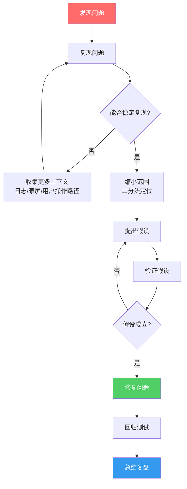
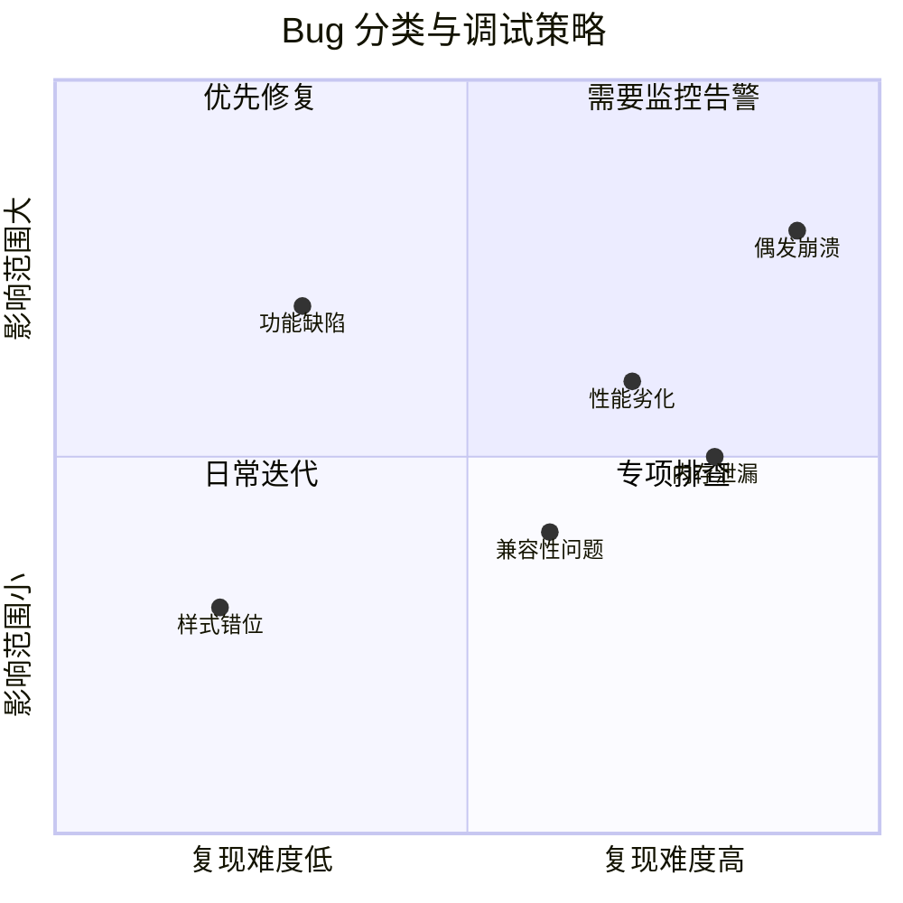
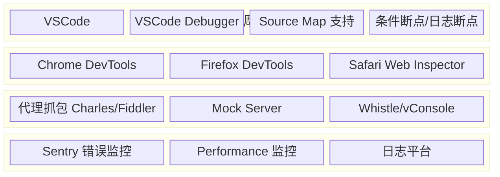
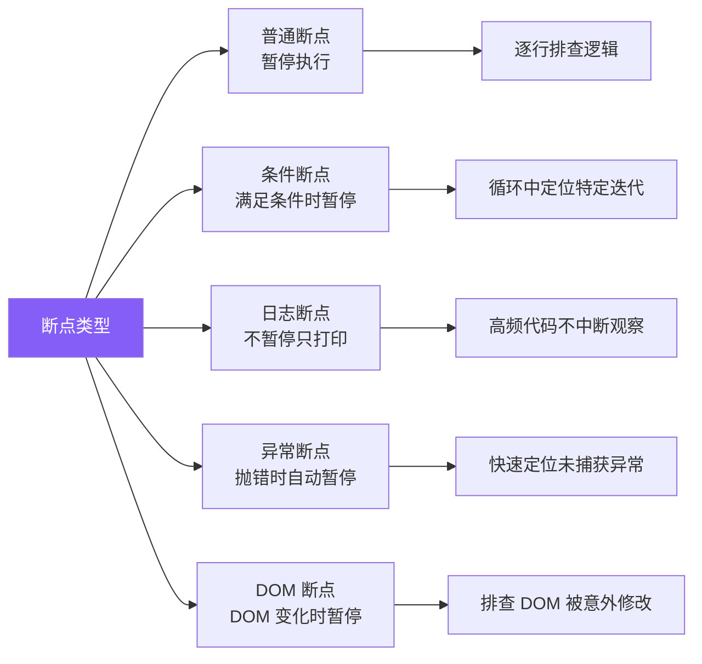
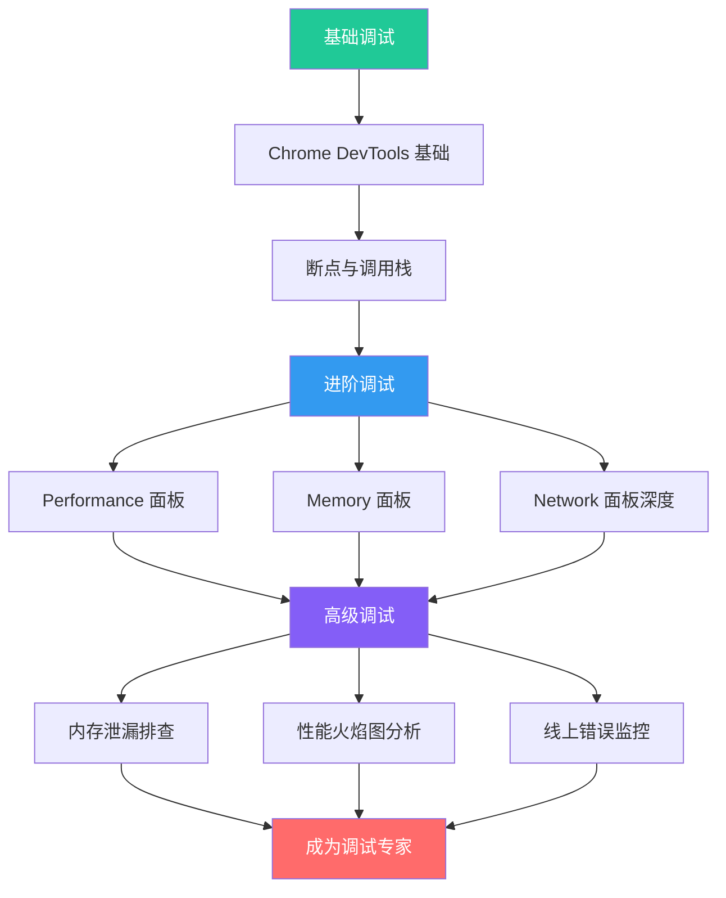

# 调试与排错概述

调试是前端工程师的核心技能之一。高效的调试能力不仅能快速定位问题，更能深入理解系统运行机制。本文建立调试与排错的知识框架，为后续深入学习奠定基础。

## 调试思维模型

### 问题定位五步法

面对任何 Bug，遵循系统化的排查流程可以大幅提升效率：



### 问题分类矩阵

不同类型的 Bug 需要不同的调试策略：



## 调试工具链全景

### 工具分层架构



| 层级 | 工具 | 适用场景 |
|------|------|----------|
| IDE 层 | VSCode Debugger、WebStorm | 本地开发、Node.js 调试、单元测试 |
| 浏览器层 | Chrome DevTools、Firefox DevTools | DOM 调试、网络请求、性能分析 |
| 网络层 | Charles、Fiddler、Whistle | 接口调试、Mock 数据、HTTPS 抓包 |
| 监控层 | Sentry、FundBug、自建平台 | 线上错误收集、性能监控、用户行为回放 |

## 常见调试场景速查

### 1. UI 渲染异常

```javascript
// 使用 DevTools 的 Elements 面板排查
// 1. 检查元素的盒模型、计算样式
// 2. 查看 CSS 优先级是否被覆盖
// 3. 检查父元素的 overflow、z-index 层级

// 代码层面：打印关键渲染状态
useEffect(() => {
  console.log('[Render] component rendered with props:', props);
  console.log('[Render] computed styles:', getComputedStyle(element));
}, [props]);
```

### 2. 接口请求异常

```javascript
// 使用 Network 面板排查
// 关注：请求头、响应状态码、CORS 头、Cookie

// 代码层面：封装请求拦截器
const requestInterceptor = (config) => {
  console.group(`[Request] ${config.method?.toUpperCase()} ${config.url}`);
  console.log('Headers:', config.headers);
  console.log('Params:', config.params);
  console.log('Body:', config.data);
  console.groupEnd();
  return config;
};

const responseInterceptor = (response) => {
  console.group(`[Response] ${response.status} ${response.config.url}`);
  console.log('Data:', response.data);
  console.log('Time:', response.headers['x-response-time']);
  console.groupEnd();
  return response;
};
```

### 3. 状态管理异常

```javascript
// 使用 Redux DevTools / Zustand DevTools
// 追踪每一次状态变更的 action 和 payload

// 自定义状态调试 Hook
function useDebugState(name, state) {
  const prevState = useRef(state);
  useEffect(() => {
    console.group(`[State] ${name} changed`);
    console.log('Previous:', prevState.current);
    console.log('Current:', state);
    console.log('Diff:', diff(prevState.current, state));
    console.groupEnd();
    prevState.current = state;
  }, [state]);
}
```

## 调试最佳实践

### 断点策略



### 调试效率提升技巧

1. **使用 `debugger` 语句**：在代码中直接插入断点，配合 Source Map 定位源码
2. **条件断点**：右键断点设置条件，避免在循环中频繁暂停
3. **日志断点（Logpoint）**：不修改代码也能打印变量值
4. **Call Stack 面板**：追溯函数调用链，理解执行上下文
5. **Watch 表达式**：持续监控关键变量的变化
6. **Blackbox Script**：屏蔽第三方库代码，只调试自己的代码

## 面试要点

### 常见面试问题

1. **如果线上出现一个偶发的白屏问题，你会如何排查？**
   - 首先通过 Sentry 等工具收集错误信息和用户环境
   - 检查是否存在 JS 运行时错误（TypeError、undefined 等）
   - 检查网络请求是否失败（CDN 资源加载失败、接口超时）
   - 检查是否存在兼容性问题（特定浏览器版本）
   - 通过用户行为回放还原操作路径，尝试复现

2. **如何调试移动端 H5 页面？**
   - Android：`chrome://inspect` 远程调试
   - iOS：Safari Web Inspector 远程调试
   - 工具：vConsole、eruda 等移动端调试面板
   - Charles/Fiddler 代理抓包

3. **Source Map 的作用和安全考虑？**
   - 作用：将编译/压缩后的代码映射回源码，方便调试
   - 安全：生产环境不应暴露 Source Map，防止源码泄露
   - 方案：上传 Source Map 到 Sentry 等平台后删除公开访问

## 推荐学习路径



## 知识体系导航

| 主题 | 内容 | 难度 |
|------|------|------|
| [Chrome DevTools 进阶](./devtools-advanced.md) | Performance/Memory/Network 面板、Lighthouse、火焰图 | 中高级 |
| [内存泄漏排查](./memory-leak.md) | 常见原因、排查工具、WeakRef/FinalizationRegistry | 高级 |
| [错误处理与容错](./error-handling.md) | Error Boundary、全局捕获、降级方案、重试策略 | 中高级 |
