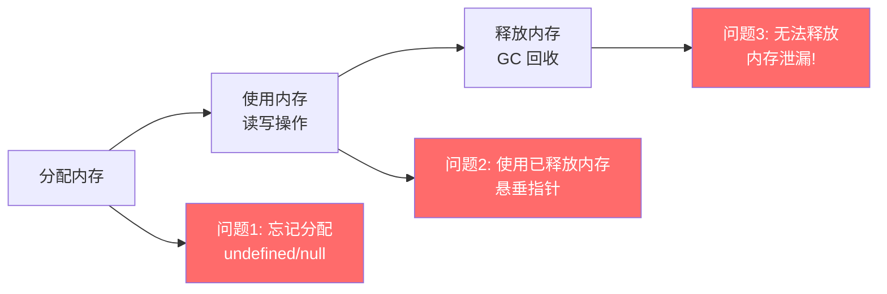
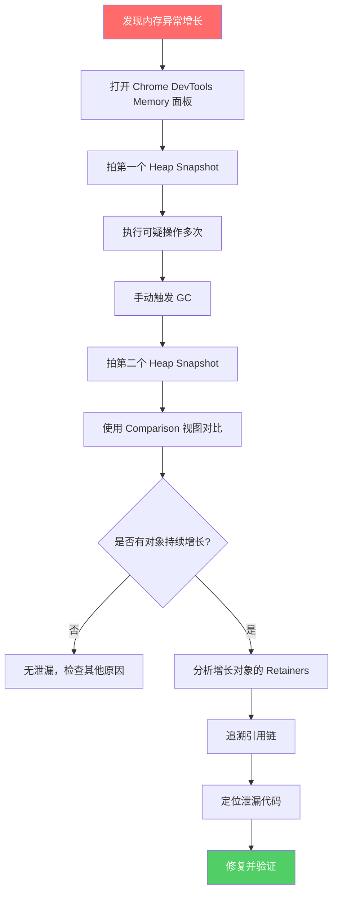
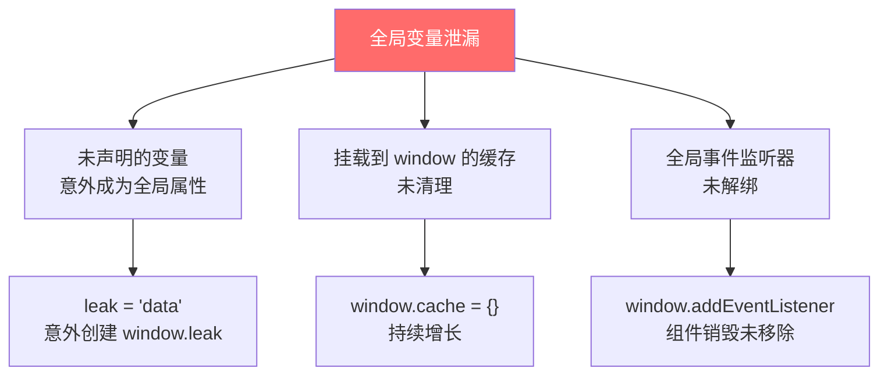
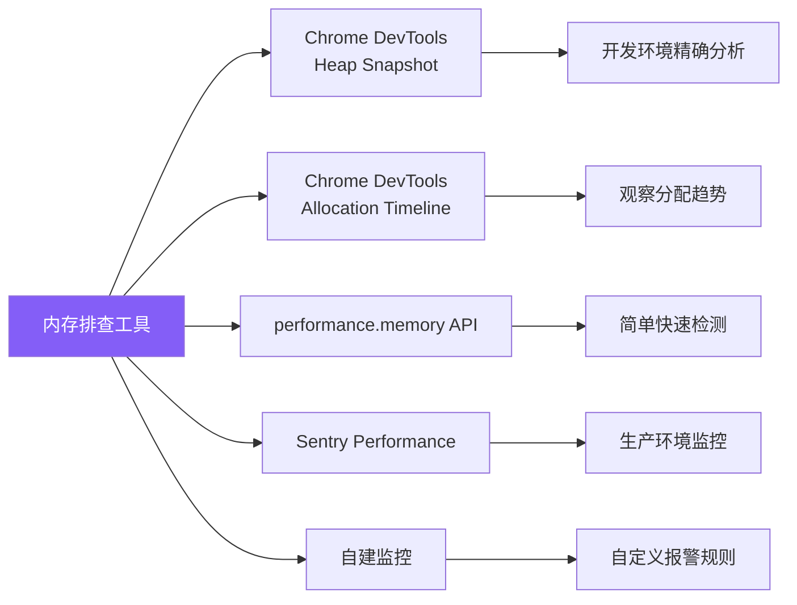
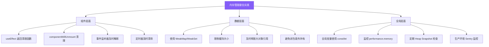

# 内存泄漏排查

内存泄漏是指程序不再使用的内存没有被正确释放，导致内存占用持续增长，最终可能引发页面卡顿甚至崩溃。前端项目中，内存泄漏问题往往隐蔽且难以排查。

## 内存生命周期



## 内存泄漏排查流程



## 常见内存泄漏原因

### 1. 全局变量泄漏



```javascript
// 错误示例：意外的全局变量
function processData() {
  leak = 'this becomes a global variable'; // 未使用 let/const/var
  window.cache = window.cache || [];
  window.cache.push(new Array(10000).fill('*'));
}

// 正确做法
function processData() {
  const data = 'this stays local';
  // 使用 WeakMap 或模块级变量管理缓存
  const cache = new WeakMap();
}
```

### 2. 事件监听器泄漏

```javascript
// 错误示例：未清理事件监听器
class MyComponent {
  constructor() {
    this.handleClick = this.handleClick.bind(this);
    window.addEventListener('scroll', this.handleScroll);
    window.addEventListener('resize', this.handleResize);
    document.addEventListener('click', this.handleClick);
  }

  // 忘记实现 destroy 方法！
  handleClick(e) { /* ... */ }
  handleScroll() { /* ... */ }
  handleResize() { /* ... */ }
}

// 正确做法：组件销毁时清理
class MyComponent {
  constructor() {
    this.handleClick = this.handleClick.bind(this);
    this.handleScroll = this.handleScroll.bind(this);
    this.handleResize = this.handleResize.bind(this);

    window.addEventListener('scroll', this.handleScroll);
    window.addEventListener('resize', this.handleResize);
    document.addEventListener('click', this.handleClick);
  }

  destroy() {
    window.removeEventListener('scroll', this.handleScroll);
    window.removeEventListener('resize', this.handleResize);
    document.removeEventListener('click', this.handleClick);
  }
}

// React 中使用 useEffect 清理
function MyComponent() {
  useEffect(() => {
    const handleScroll = () => { /* ... */ };
    window.addEventListener('scroll', handleScroll);

    return () => {
      window.removeEventListener('scroll', handleScroll);
    };
  }, []);
}
```

### 3. 闭包泄漏

```javascript
// 错误示例：闭包持有大对象引用
function createHeavyClosure() {
  const largeData = new Array(1000000).fill('x');

  return function closure() {
    // 即使不使用 largeData，闭包仍持有其引用
    // V8 引擎可能无法回收 largeData
    return 'result';
  };
}

// 正确做法：及时释放不需要的引用
function createOptimizedClosure() {
  let largeData = new Array(1000000).fill('x');
  const result = process(largeData);
  largeData = null; // 手动释放引用

  return function closure() {
    return result;
  };
}
```

### 4. 定时器泄漏

```javascript
// 错误示例：未清理定时器
class PollingService {
  constructor() {
    this.data = [];
    setInterval(() => {
      this.fetchData().then(data => {
        this.data.push(...data); // data 持续增长
      });
    }, 5000);
  }
}

// 正确做法：保存定时器 ID 并在适当时机清理
class PollingService {
  constructor() {
    this.data = [];
    this.timerId = null;
    this.maxDataSize = 1000;
  }

  start() {
    this.timerId = setInterval(() => {
      this.fetchData().then(data => {
        this.data.push(...data);
        // 限制缓存大小
        if (this.data.length > this.maxDataSize) {
          this.data = this.data.slice(-this.maxDataSize);
        }
      });
    }, 5000);
  }

  stop() {
    if (this.timerId) {
      clearInterval(this.timerId);
      this.timerId = null;
    }
  }
}
```

### 5. DOM 引用泄漏

```javascript
// 错误示例：缓存了已移除的 DOM 元素
class DOMCache {
  constructor() {
    this.elements = new Map();
  }

  add(key, element) {
    this.elements.set(key, element);
  }

  // 问题：即使 DOM 元素已从页面移除，Map 中仍持有引用
  get(key) {
    return this.elements.get(key);
  }
}

// 正确做法：使用 WeakMap 自动释放
class DOMCache {
  constructor() {
    this.elements = new WeakMap();
  }

  add(key, element) {
    this.elements.set(key, element);
  }

  get(key) {
    return this.elements.get(key);
  }
}
```

## 现代解决方案：WeakRef 与 FinalizationRegistry

### WeakRef（弱引用）

```javascript
// WeakRef 允许创建对对象的弱引用
// 如果对象只被 WeakRef 引用，GC 可以回收它

class HeavyObjectCache {
  constructor() {
    this.cache = new Map();
  }

  set(key, heavyObject) {
    // 使用 WeakRef 包装，允许 GC 回收
    this.cache.set(key, new WeakRef(heavyObject));
  }

  get(key) {
    const ref = this.cache.get(key);
    if (!ref) return undefined;

    const obj = ref.deref(); // 尝试获取引用的对象
    if (obj === undefined) {
      // 对象已被 GC 回收，清理无效条目
      this.cache.delete(key);
      return undefined;
    }

    return obj;
  }
}

// 使用示例
const cache = new HeavyObjectCache();
let heavyData = { data: new Array(100000).fill('*') };
cache.set('key1', heavyData);

// 当 heavyData 的其他引用被释放后，GC 可能回收它
heavyData = null;

// 下次访问时可能返回 undefined
setTimeout(() => {
  console.log(cache.get('key1')); // 可能是 undefined
}, 10000);
```

### FinalizationRegistry（终结器）

```javascript
// FinalizationRegistry 在对象被 GC 回收时执行回调
// 适合用于资源清理（关闭连接、释放本地资源等）

class ResourcePool {
  constructor() {
    this.activeResources = new Map();

    this.cleanupRegistry = new FinalizationRegistry((heldValue) => {
      // 当资源对象被 GC 回收时，执行清理逻辑
      console.log(`[ResourcePool] Cleaning up: ${heldValue}`);
      this.activeResources.delete(heldValue);
      // 可以在这里关闭数据库连接、释放文件句柄等
    });
  }

  acquire(id) {
    const resource = this.createResource(id);
    this.activeResources.set(id, resource);

    // 注册终结器，当 resource 被 GC 时触发清理
    this.cleanupRegistry.register(resource, id);

    return resource;
  }

  createResource(id) {
    return { id, data: new ArrayBuffer(1024 * 1024) };
  }

  release(id) {
    const resource = this.activeResources.get(id);
    if (resource) {
      this.activeResources.delete(id);
      // 手动取消注册（可选，避免重复清理）
      this.cleanupRegistry.unregister(resource);
    }
  }
}

// 注意：不要依赖 FinalizationRegistry 执行关键业务逻辑
// 回调执行时机不确定，且不保证一定执行
```

## 内存泄漏排查工具

### 工具对比



### 实战：自动化内存监控

```javascript
// 内存监控 Hook（React）
function useMemoryMonitor(componentName) {
  const renderCount = useRef(0);

  useEffect(() => {
    renderCount.current++;

    if (performance.memory) {
      const { usedJSHeapSize, totalJSHeapSize } = performance.memory;
      console.log(
        `[Memory] ${componentName} render #${renderCount.current}: ` +
        `Used: ${(usedJSHeapSize / 1024 / 1024).toFixed(2)} MB, ` +
        `Total: ${(totalJSHeapSize / 1024 / 1024).toFixed(2)} MB`
      );
    }
  });

  // 检测组件是否正常卸载
  useEffect(() => {
    return () => {
      console.log(`[Memory] ${componentName} unmounted, cleaning up...`);
    };
  }, [componentName]);
}

// 通用内存泄漏检测器
class MemoryLeakDetector {
  constructor(options = {}) {
    this.threshold = options.threshold || 50 * 1024 * 1024; // 50MB
    this.interval = options.interval || 30000; // 30s
    this.onLeak = options.onLeak || console.warn;
    this.snapshots = [];
  }

  start() {
    this.timer = setInterval(() => {
      if (!performance.memory) return;

      const { usedJSHeapSize } = performance.memory;
      this.snapshots.push({
        timestamp: Date.now(),
        used: usedJSHeapSize,
      });

      // 保留最近 100 个快照
      if (this.snapshots.length > 100) {
        this.snapshots = this.snapshots.slice(-100);
      }

      // 检测持续增长趋势
      if (this.snapshots.length >= 10) {
        const recent = this.snapshots.slice(-10);
        const isGrowing = recent.every(
          (s, i) => i === 0 || s.used >= recent[i - 1].used
        );

        if (isGrowing && usedJSHeapSize > this.threshold) {
          this.onLeak({
            currentHeap: usedJSHeapSize,
            threshold: this.threshold,
            trend: '持续增长',
            snapshots: recent,
          });
        }
      }
    }, this.interval);
  }

  stop() {
    clearInterval(this.timer);
  }
}
```

## 最佳实践清单



## 面试要点

### 常见面试问题

1. **什么是内存泄漏？前端常见的内存泄漏场景有哪些？**
   - 内存泄漏指不再使用的内存未被正确释放，导致内存占用持续增长
   - 常见场景：未清理的事件监听器、未清除的定时器、闭包持有大对象引用、DOM 元素引用未释放、全局变量意外创建

2. **如何使用 Chrome DevTools 排查内存泄漏？**
   - 使用 Memory 面板的 Heap Snapshot 对比功能
   - 拍摄两个快照，使用 Comparison 视图查看增量
   - 通过 Retainers 面板追溯引用链
   - 使用 Allocation Timeline 观察内存分配趋势

3. **WeakRef 和 FinalizationRegistry 的区别和使用场景？**
   - WeakRef：创建对对象的弱引用，不影响 GC 回收，适合实现缓存
   - FinalizationRegistry：对象被 GC 回收时执行回调，适合资源清理
   - 注意：不要依赖它们执行关键业务逻辑，执行时机不确定

4. **React 项目中如何避免内存泄漏？**
   - useEffect 中返回清理函数
   - 组件卸载时取消未完成的异步请求（AbortController）
   - 使用 WeakMap 存储组件相关的缓存数据
   - 避免在组件外部持有组件实例的引用
