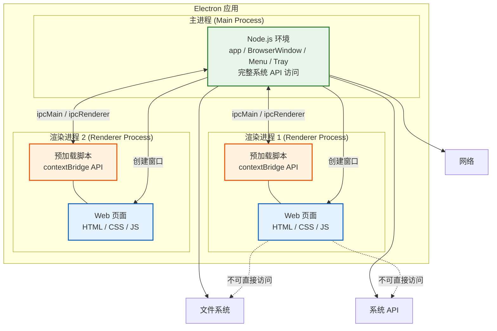
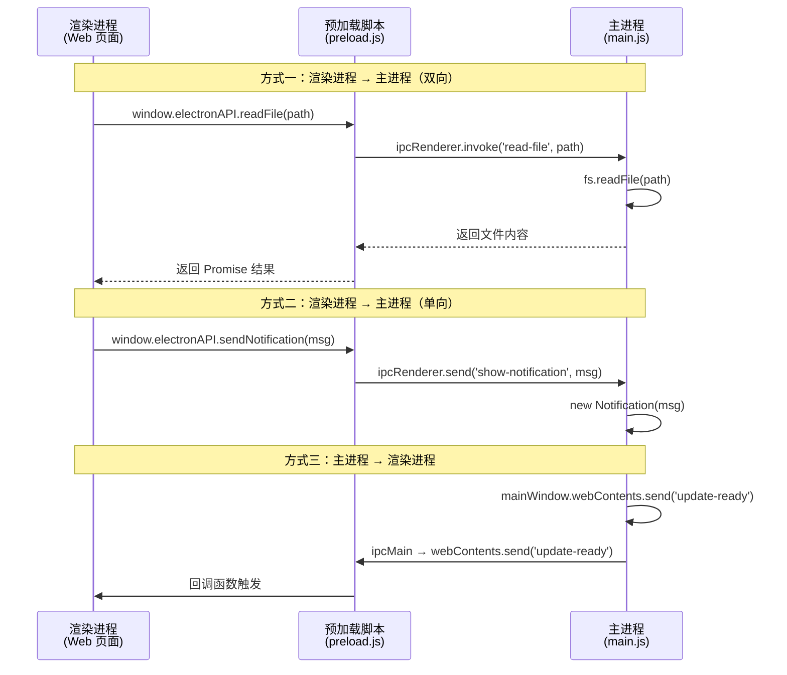
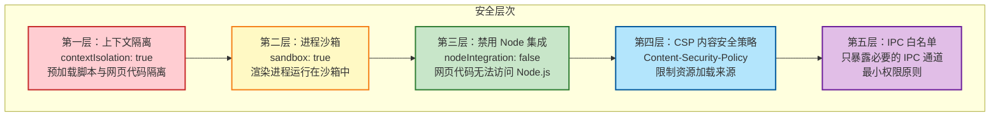

# Electron 架构

> **"理解进程模型是掌握 Electron 的第一步"** —— Electron 的架构基于 Chromium 的多进程模型，主进程和渲染进程各司其职，通过 IPC 通信协作。

## 进程模型总览



## 主进程 (Main Process)

主进程是 Electron 应用的入口，运行在 Node.js 环境中。

### 核心职责

```
主进程的核心职责
═══════════════════════════════════════════════════════

1. 应用生命周期管理
   • app.on('ready')      → 应用初始化完成
   • app.on('window-all-closed') → 所有窗口关闭
   • app.on('activate')   → macOS dock 图标点击

2. 窗口管理
   • BrowserWindow 创建和管理
   • 窗口的最小化、最大化、关闭
   • 多窗口之间的协调

3. 原生功能
   • 系统菜单 (Menu)
   • 系统托盘 (Tray)
   • 原生对话框 (dialog)
   • 全局快捷键 (globalShortcut)

4. 系统交互
   • 文件系统访问
   • 系统信息获取
   • 剪贴板操作
   • 电源监控
```

### 主进程代码示例

```javascript
// src/main/index.js
const { app, BrowserWindow, Menu, ipcMain, dialog } = require('electron');
const path = require('path');

let mainWindow;

function createMainWindow() {
  mainWindow = new BrowserWindow({
    width: 1400,
    height: 900,
    minWidth: 800,
    minHeight: 600,
    titleBarStyle: 'hiddenInset', // macOS 无边框
    webPreferences: {
      preload: path.join(__dirname, '../preload/preload.js'),
      contextIsolation: true,    // 关键：启用上下文隔离
      nodeIntegration: false,    // 关键：禁用 Node.js 集成
      sandbox: true,             // 关键：启用沙箱
    },
  });

  // 开发环境加载 dev server
  if (process.env.NODE_ENV === 'development') {
    mainWindow.loadURL('http://localhost:3000');
    mainWindow.webContents.openDevTools();
  } else {
    mainWindow.loadFile(path.join(__dirname, '../renderer/index.html'));
  }

  // 窗口事件
  mainWindow.on('closed', () => {
    mainWindow = null;
  });
}

// 应用生命周期
app.whenReady().then(() => {
  createMainWindow();
  createMenu();

  app.on('activate', () => {
    if (BrowserWindow.getAllWindows().length === 0) {
      createMainWindow();
    }
  });
});

app.on('window-all-closed', () => {
  if (process.platform !== 'darwin') {
    app.quit();
  }
});

// IPC 通信：处理渲染进程的请求
ipcMain.handle('dialog:openFile', async () => {
  const result = await dialog.showOpenDialog(mainWindow, {
    properties: ['openFile'],
    filters: [
      { name: 'Images', extensions: ['jpg', 'png', 'gif'] },
      { name: 'All Files', extensions: ['*'] },
    ],
  });
  return result.filePaths;
});

ipcMain.handle('app:getVersion', () => {
  return app.getVersion();
});
```

## 渲染进程 (Renderer Process)

每个 `BrowserWindow` 对应一个渲染进程，运行在 Chromium 中。

### 核心特点

```
渲染进程的特点
═══════════════════════════════════════════════════════

✅ 可以：
  • 渲染 HTML/CSS/JS 页面（完整的 Web 能力）
  • 使用所有前端框架（React / Vue / Angular）
  • 通过预加载脚本暴露的 API 与主进程通信

❌ 不可以：
  • 直接访问 Node.js API（除非开启 nodeIntegration，不推荐）
  • 直接访问文件系统
  • 直接调用系统 API
  • 跨越进程边界访问其他渲染进程的数据

原因：
  • 安全性：防止恶意网页代码控制系统
  • 稳定性：一个渲染进程崩溃不影响其他进程
  • 隔离性：每个窗口是独立的沙箱环境
```

## IPC 通信机制

IPC (Inter-Process Communication) 是 Electron 进程间通信的核心。

### IPC 通信流程



### IPC 代码实现

```javascript
// ===== 预加载脚本 =====
// src/preload/preload.js
const { contextBridge, ipcRenderer } = require('electron');

contextBridge.exposeInMainWorld('electronAPI', {
  // 双向通信：invoke / handle（推荐，返回 Promise）
  readFile: (path) => ipcRenderer.invoke('file:read', path),
  saveFile: (path, content) => ipcRenderer.invoke('file:save', path, content),
  openDialog: () => ipcRenderer.invoke('dialog:openFile'),
  getAppVersion: () => ipcRenderer.invoke('app:getVersion'),

  // 单向通信：send / on（用于通知类消息）
  sendNotification: (msg) => ipcRenderer.send('show-notification', msg),
  quitApp: () => ipcRenderer.send('app:quit'),

  // 监听主进程消息
  onUpdateReady: (callback) => {
    ipcRenderer.on('update:ready', (_event, data) => callback(data));
  },
  onMenuAction: (callback) => {
    ipcRenderer.on('menu:action', (_event, action) => callback(action));
  },
});
```

```javascript
// ===== 渲染进程 =====
// src/renderer/app.js
// 调用预加载脚本暴露的 API
async function openFile() {
  const filePath = await window.electronAPI.openDialog();
  if (filePath && filePath.length > 0) {
    const content = await window.electronAPI.readFile(filePath[0]);
    document.getElementById('editor').value = content;
  }
}

async function saveFile() {
  const content = document.getElementById('editor').value;
  const result = await window.electronAPI.saveFile('/path/to/file.txt', content);
  if (result.success) {
    console.log('文件保存成功');
  }
}

// 监听主进程消息
window.electronAPI.onUpdateReady((data) => {
  showUpdateNotification(data.version);
});
```

```javascript
// ===== 主进程 =====
// src/main/ipc-handlers.js
const { ipcMain, dialog, Notification } = require('electron');
const fs = require('fs').promises;

// 双向通信：处理文件读取
ipcMain.handle('file:read', async (_event, filePath) => {
  try {
    const content = await fs.readFile(filePath, 'utf-8');
    return { success: true, content };
  } catch (error) {
    return { success: false, error: error.message };
  }
});

// 双向通信：处理文件保存
ipcMain.handle('file:save', async (_event, filePath, content) => {
  try {
    await fs.writeFile(filePath, content, 'utf-8');
    return { success: true };
  } catch (error) {
    return { success: false, error: error.message };
  }
});

// 单向通信：显示通知
ipcMain.on('show-notification', (_event, message) => {
  new Notification({ title: '通知', body: message }).show();
});
```

## 预加载脚本 (Preload Script)

预加载脚本是连接渲染进程和主进程的桥梁。

### 为什么需要预加载脚本？

```
没有预加载脚本的"灾难"
═══════════════════════════════════════════════════════

方案 A：开启 nodeIntegration（❌ 极度危险）
  → 网页中可以直接调用 require('child_process').exec('rm -rf /')
  → 任何 XSS 漏洞都可以直接控制系统

方案 B：关闭 nodeIntegration，不使用预加载（❌ 功能受限）
  → 渲染进程无法访问任何 Node.js API
  → 无法与主进程通信
  → 只能做一个普通网页

方案 C：使用预加载脚本（✅ 推荐）
  → 预加载脚本运行在 Node.js 环境中
  → 通过 contextBridge 安全地暴露 API
  → 渲染进程只能调用你暴露的方法
  → 即使网页被 XSS 攻击，也只能调用有限的 API
```

### contextBridge 安全暴露 API

```javascript
// src/preload/preload.js
const { contextBridge, ipcRenderer } = require('electron');

// 错误做法：直接暴露整个 ipcRenderer
// ❌ contextBridge.exposeInMainWorld('electron', ipcRenderer);
// → 渲染进程可以调用任何 IPC 通道，安全性等同于 nodeIntegration

// 正确做法：只暴露需要的方法和通道
// ✅
contextBridge.exposeInMainWorld('electronAPI', {
  // 明确列出每个允许的 IPC 通道
  readFile: (path) => ipcRenderer.invoke('file:read', path),
  saveFile: (path, content) => ipcRenderer.invoke('file:save', path, content),

  // 对输入参数进行验证
  sendMessage: (channel, data) => {
    const allowedChannels = ['notification', 'log'];
    if (allowedChannels.includes(channel)) {
      ipcRenderer.send(channel, data);
    }
  },

  // 移除所有监听器（防止内存泄漏）
  removeAllListeners: (channel) => {
    ipcRenderer.removeAllListeners(channel);
  },
});
```

## 安全模型

### Electron 安全架构



### 安全配置清单

```javascript
// src/main/index.js - 安全最佳实践
const { app, BrowserWindow, session } = require('electron');

app.whenReady().then(async () => {
  // 1. 设置 CSP 头
  session.defaultSession.webRequest.onHeadersReceived((details, callback) => {
    callback({
      responseHeaders: {
        ...details.responseHeaders,
        'Content-Security-Policy': [
          "default-src 'self'; script-src 'self'; style-src 'self' 'unsafe-inline';",
        ],
      },
    });
  });

  // 2. 创建安全的窗口
  const win = new BrowserWindow({
    webPreferences: {
      // 必须开启的安全选项
      contextIsolation: true,   // 上下文隔离
      nodeIntegration: false,   // 禁用 Node 集成
      sandbox: true,            // 启用沙箱

      // 预加载脚本
      preload: path.join(__dirname, '../preload/preload.js'),

      // 禁用不必要的功能
      webviewTag: false,        // 禁用 <webview> 标签
      enableRemoteModule: false, // 禁用 remote 模块
    },
  });

  // 3. 限制导航（防止跳转到恶意网站）
  win.webContents.on('will-navigate', (event, url) => {
    const allowedOrigins = ['http://localhost:3000', 'file://'];
    const parsedUrl = new URL(url);
    if (!allowedOrigins.includes(parsedUrl.origin)) {
      event.preventDefault();
    }
  });

  // 4. 禁止新窗口打开（防止钓鱼）
  win.webContents.setWindowOpenHandler(() => {
    return { action: 'deny' };
  });
});
```

## 进程架构对比

```
Electron vs 浏览器 vs Node.js
═══════════════════════════════════════════════════════

特性              浏览器          Electron 渲染     Node.js
─────────────────────────────────────────────────────────
DOM 操作          ✅              ✅                ❌
Web API          ✅              ✅                ❌
Node.js API      ❌              ❌（默认）        ✅
文件系统          ❌              ❌（默认）        ✅
系统 API          ❌              ❌（默认）        ✅
沙箱隔离          ✅              ✅                ❌
─────────────────────────────────────────────────────────

Electron 的独特之处：
  主进程 = Node.js + 系统 API
  渲染进程 = 浏览器 + 沙箱
  预加载脚本 = 安全桥梁
```

## 面试要点

### 常见面试题

```
Q1: Electron 的主进程和渲染进程有什么区别？
─────────────────────────────────────────────────
A:
  主进程：
    • 运行在 Node.js 环境
    • 可以访问所有系统 API
    • 管理应用生命周期和窗口
    • 只有一个主进程

  渲染进程：
    • 运行在 Chromium 中
    • 每个窗口对应一个渲染进程
    • 负责渲染 Web 页面
    • 默认无法访问 Node.js API
    • 通过预加载脚本与主进程通信

Q2: 为什么推荐 contextIsolation: true？
─────────────────────────────────────────────────
A:
  • 防止预加载脚本的 API 被网页代码篡改
  • 预加载脚本和网页运行在不同的上下文中
  • 即使网页被 XSS 攻击，也无法直接访问 Node.js API
  • 是 Electron 安全模型的核心

Q3: invoke/handle 和 send/on 有什么区别？
─────────────────────────────────────────────────
A:
  invoke/handle（双向）：
    • 返回 Promise，支持异步返回值
    • 适合需要获取结果的操作（读文件、API 调用）
    • 自动处理错误传播

  send/on（单向）：
    • 不返回值，只发送消息
    • 适合通知类消息（日志、事件通知）
    • 需要手动管理监听器生命周期

Q4: 预加载脚本的作用是什么？
─────────────────────────────────────────────────
A:
  • 运行在 Node.js 环境中，可以访问 Node.js API
  • 通过 contextBridge 安全地暴露 API 给渲染进程
  • 是渲染进程和主进程之间的安全桥梁
  • 遵循最小权限原则，只暴露必要的功能
```
