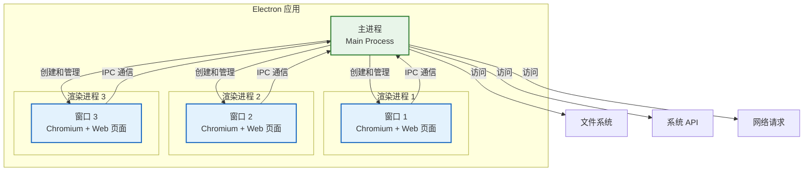
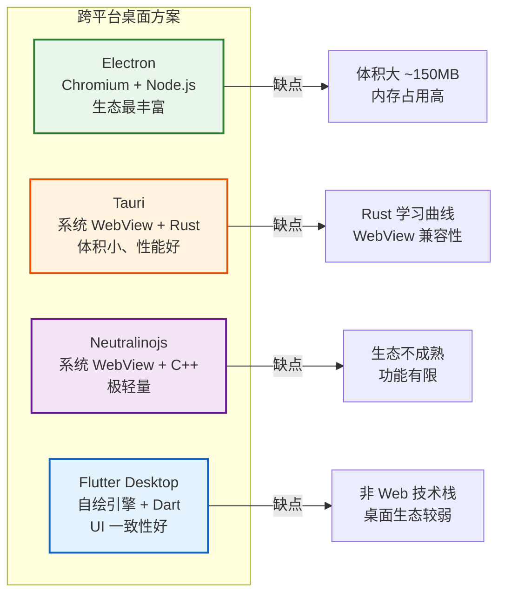
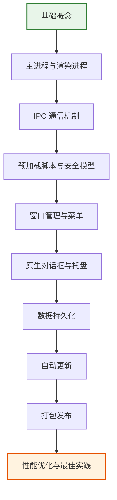

# Electron 桌面开发

> **"用 Web 技术构建跨平台桌面应用"** —— Electron 让前端工程师能够用 HTML、CSS、JavaScript 开发原生桌面应用，是前端进阶桌面端的核心技术。

## 什么是 Electron？

```
Electron 的本质
═══════════════════════════════════════════════════════

Electron = Chromium（浏览器内核）+ Node.js（后端能力）

前端工程师的"降维打击"：
  ✅ 用 HTML/CSS/JS 开发桌面应用
  ✅ 用 Node.js 访问文件系统、系统 API
  ✅ 一套代码 → Windows / macOS / Linux
  ✅ 复用 Web 生态的所有工具和库

类比理解：
  Web 应用 → 运行在浏览器中 → 受浏览器沙箱限制
  Electron 应用 → 运行在 Chromium + Node.js 中 → 可访问系统 API
```

## 为什么需要 Electron？

```
Web 应用 vs 桌面应用 vs Electron
═══════════════════════════════════════════════════════

              Web 应用        桌面应用        Electron
  ─────────────────────────────────────────────────────
  开发成本     低              高              低
  跨平台       ✅ 天然          ❌ 单平台        ✅ 一套代码
  离线使用     ❌ 依赖网络      ✅              ✅
  系统权限     ❌ 沙箱限制      ✅ 完整          ✅ 完整
  推送通知     ❌ 受限          ✅ 原生          ✅ 原生
  托盘/菜单    ❌              ✅              ✅
  自动更新     ❌              需自行实现       ✅ 内置
  性能         中等             好              中等（内存占用大）
  ─────────────────────────────────────────────────────
  代表产品     网页             Office          VS Code、Slack
```

## Electron 的核心架构



## 谁在用 Electron？

| 应用 | 类型 | 日活 |
|------|------|------|
| **VS Code** | 代码编辑器 | 数千万 |
| **Slack** | 企业通讯 | 数千万 |
| **Discord** | 社交通讯 | 数亿 |
| **Notion** | 笔记/协作 | 数千万 |
| **Figma** (桌面端) | 设计工具 | 数百万 |
| **1Password** | 密码管理 | 数百万 |
| **Obsidian** | 知识管理 | 数百万 |

## Electron vs 竞品对比



## 快速开始

### 环境准备

```bash
# 确保 Node.js >= 18
node --version

# 创建项目
mkdir my-electron-app && cd my-electron-app
npm init -y

# 安装 Electron
npm install electron --save-dev

# 安装开发工具
npm install electron-builder --save-dev
```

### 项目结构

```
my-electron-app/
├── src/
│   ├── main/              # 主进程代码
│   │   ├── index.js       # 主进程入口
│   │   ├── menu.js        # 菜单配置
│   │   ├── tray.js        # 托盘配置
│   │   └── updater.js     # 自动更新
│   ├── renderer/          # 渲染进程代码（前端页面）
│   │   ├── index.html
│   │   ├── styles.css
│   │   └── app.js
│   └── preload/           # 预加载脚本
│       └── preload.js
├── package.json
├── electron-builder.yml   # 打包配置
└── forge.config.js        # Electron Forge 配置
```

### 最小可运行示例

```javascript
// src/main/index.js
const { app, BrowserWindow } = require('electron');
const path = require('path');

function createWindow() {
  const win = new BrowserWindow({
    width: 1200,
    height: 800,
    webPreferences: {
      preload: path.join(__dirname, '../preload/preload.js'),
      contextIsolation: true,
      nodeIntegration: false,
    },
  });

  win.loadFile(path.join(__dirname, '../renderer/index.html'));
}

app.whenReady().then(createWindow);

app.on('window-all-closed', () => {
  if (process.platform !== 'darwin') app.quit();
});

app.on('activate', () => {
  if (BrowserWindow.getAllWindows().length === 0) createWindow();
});
```

## 学习路线图



## 本章内容导航

| 文档 | 内容 |
|------|------|
| [Electron 架构](./architecture.md) | 主进程/渲染进程、IPC 通信、预加载脚本、安全模型 |
| [Electron 实战](./practice.md) | 自动更新、托盘菜单、原生对话框、打包发布 |

## 面试要点速览

```
Electron 高频面试题
═══════════════════════════════════════════════════════

1. Electron 的主进程和渲染进程有什么区别？
2. Electron 中如何实现进程间通信（IPC）？
3. 为什么需要预加载脚本（preload）？
4. Electron 的安全模型是什么？如何防止 XSS？
5. Electron 应用如何实现自动更新？
6. 如何优化 Electron 应用的性能和包体积？
7. Electron vs Tauri 的优劣对比？
8. 如何实现 Electron 应用的单元测试和 E2E 测试？
```
