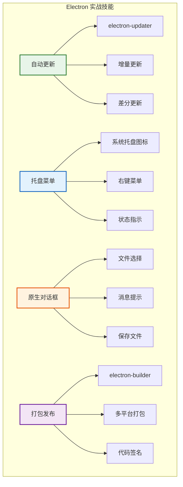
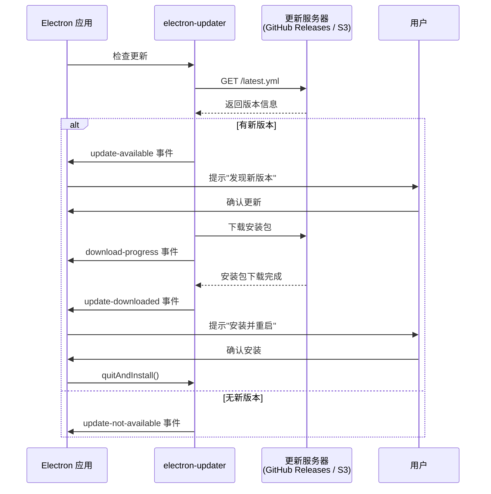
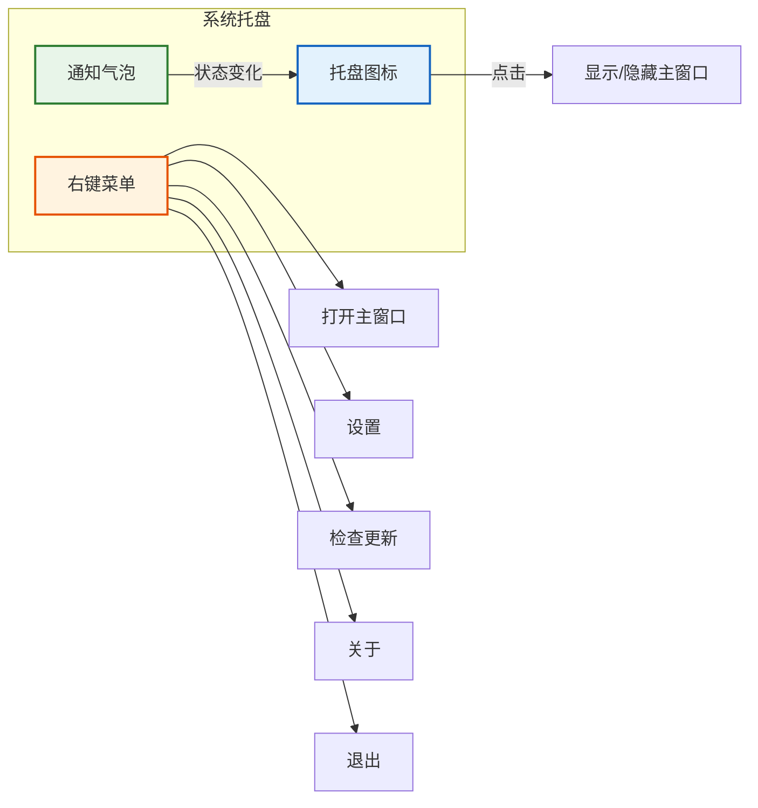
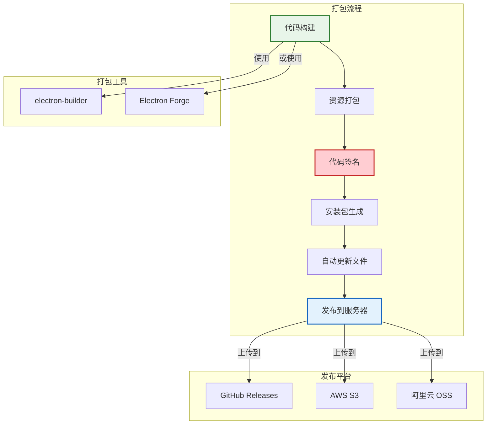

# Electron 实战

> **"从开发到发布的完整生产流程"** —— 掌握自动更新、托盘菜单、原生对话框、打包发布等实战技能，是 Electron 项目落地的关键。

## 实战技能全景图



## 自动更新

### 自动更新流程



### 自动更新代码实现

```javascript
// src/main/updater.js
const { autoUpdater } = require('electron-updater');
const { dialog, BrowserWindow } = require('electron');

class AppUpdater {
  constructor() {
    // 配置更新服务器
    autoUpdater.autoDownload = false;  // 手动控制下载
    autoUpdater.autoInstallOnAppQuit = true;

    // 设置更新服务器地址
    autoUpdater.setFeedURL({
      provider: 'github',
      owner: 'your-org',
      repo: 'your-app',
    });

    this.setupEvents();
  }

  setupEvents() {
    // 检查更新中
    autoUpdater.on('checking-for-update', () => {
      this.sendStatusToWindow('检查更新中...');
    });

    // 发现新版本
    autoUpdater.on('update-available', async (info) => {
      const result = await dialog.showMessageBox({
        type: 'info',
        title: '发现新版本',
        message: `新版本 ${info.version} 已发布，是否立即下载？`,
        detail: info.releaseNotes || '暂无更新说明',
        buttons: ['下载', '稍后'],
        defaultId: 0,
      });

      if (result.response === 0) {
        autoUpdater.downloadUpdate();
      }
    });

    // 没有新版本
    autoUpdater.on('update-not-available', () => {
      this.sendStatusToWindow('当前已是最新版本');
    });

    // 下载进度
    autoUpdater.on('download-progress', (progress) => {
      const percent = Math.round(progress.percent);
      this.sendStatusToWindow(`下载进度: ${percent}%`);
      this.sendToRenderer('update:progress', { percent });
    });

    // 下载完成
    autoUpdater.on('update-downloaded', async () => {
      const result = await dialog.showMessageBox({
        type: 'info',
        title: '更新已就绪',
        message: '新版本已下载完成，是否立即重启安装？',
        buttons: ['立即安装', '稍后安装'],
        defaultId: 0,
      });

      if (result.response === 0) {
        autoUpdater.quitAndInstall(false, true);
      }
    });

    // 错误处理
    autoUpdater.on('error', (error) => {
      console.error('更新错误:', error);
      this.sendStatusToWindow(`更新失败: ${error.message}`);
    });
  }

  // 检查更新
  checkForUpdates() {
    autoUpdater.checkForUpdates();
  }

  // 发送消息到渲染进程
  sendToRenderer(channel, data) {
    const win = BrowserWindow.getFocusedWindow();
    if (win) {
      win.webContents.send(channel, data);
    }
  }

  sendStatusToWindow(text) {
    this.sendToRenderer('update:status', { message: text });
  }
}

module.exports = new AppUpdater();
```

### 渲染进程监听更新

```javascript
// src/renderer/app.js
const updateStatus = document.getElementById('update-status');
const progressBar = document.getElementById('update-progress');

// 监听更新状态
window.electronAPI.onUpdateStatus((data) => {
  updateStatus.textContent = data.message;
});

// 监听下载进度
window.electronAPI.onUpdateProgress((data) => {
  progressBar.style.width = `${data.percent}%`;
  progressBar.textContent = `${data.percent}%`;
});

// 手动检查更新
document.getElementById('check-update').addEventListener('click', () => {
  window.electronAPI.checkForUpdates();
});
```

## 托盘菜单

### 托盘功能架构



### 托盘代码实现

```javascript
// src/main/tray.js
const { Tray, Menu, nativeImage, BrowserWindow, app } = require('electron');
const path = require('path');

class AppTray {
  constructor() {
    this.tray = null;
    this.contextMenu = null;
  }

  create(mainWindow) {
    // 创建托盘图标
    const iconPath = path.join(__dirname, '../assets/tray-icon.png');
    const icon = nativeImage.createFromPath(iconPath);
    this.tray = new Tray(icon.resize({ width: 16, height: 16 }));

    // 设置提示文字
    this.tray.setToolTip('我的 Electron 应用');

    // 创建右键菜单
    this.contextMenu = Menu.buildFromTemplate([
      {
        label: '打开主窗口',
        click: () => {
          mainWindow.show();
          mainWindow.focus();
        },
      },
      { type: 'separator' },
      {
        label: '设置',
        click: () => {
          mainWindow.show();
          mainWindow.webContents.send('navigate', '/settings');
        },
      },
      {
        label: '检查更新',
        click: () => {
          require('./updater').checkForUpdates();
        },
      },
      { type: 'separator' },
      {
        label: '关于',
        click: () => {
          this.showAbout();
        },
      },
      { type: 'separator' },
      {
        label: '退出',
        click: () => {
          app.isQuitting = true;
          app.quit();
        },
      },
    ]);

    // 设置右键菜单
    this.tray.setContextMenu(this.contextMenu);

    // 单击托盘图标：显示/隐藏窗口
    this.tray.on('click', () => {
      if (mainWindow.isVisible()) {
        mainWindow.hide();
      } else {
        mainWindow.show();
        mainWindow.focus();
      }
    });

    // 监听窗口关闭事件（最小化到托盘）
    mainWindow.on('close', (event) => {
      if (!app.isQuitting) {
        event.preventDefault();
        mainWindow.hide();
        this.tray.displayBalloon({
          title: '应用已最小化',
          content: '应用已最小化到系统托盘，双击图标可打开',
        });
      }
    });
  }

  // 更新托盘图标（表示不同状态）
  updateIcon(status) {
    const iconMap = {
      normal: 'tray-icon.png',
      unread: 'tray-icon-unread.png',
      error: 'tray-icon-error.png',
    };
    const iconPath = path.join(__dirname, '../assets', iconMap[status] || iconMap.normal);
    const icon = nativeImage.createFromPath(iconPath);
    this.tray.setImage(icon.resize({ width: 16, height: 16 }));
  }

  // 显示通知气泡
  showBalloon(title, content) {
    this.tray.displayBalloon({ title, content });
  }

  showAbout() {
    dialog.showMessageBox({
      type: 'info',
      title: '关于',
      message: '我的 Electron 应用',
      detail: `版本: ${app.getVersion()}\nElectron: ${process.versions.electron}\nNode.js: ${process.versions.node}`,
    });
  }
}

module.exports = new AppTray();
```

## 原生对话框

### 对话框类型

```
Electron 原生对话框类型
═══════════════════════════════════════════════════════

1. 文件对话框
   • showOpenDialog()  → 选择文件/文件夹
   • showSaveDialog()  → 保存文件
   • 支持过滤器、多选、创建目录

2. 消息对话框
   • showMessageBox()  → 提示信息、确认操作
   • 支持多种图标：info / warning / error / question
   • 支持自定义按钮

3. 错误对话框
   • showErrorBox()    → 显示错误信息
   • 不阻塞主进程
```

### 对话框代码示例

```javascript
// src/main/dialog.js
const { dialog, BrowserWindow, shell } = require('electron');
const path = require('path');

// 打开文件对话框
async function openFileDialog() {
  const result = await dialog.showOpenDialog({
    title: '选择文件',
    defaultPath: app.getPath('documents'),
    filters: [
      { name: '图片文件', extensions: ['jpg', 'jpeg', 'png', 'gif', 'webp'] },
      { name: '文档文件', extensions: ['pdf', 'doc', 'docx', 'txt'] },
      { name: '所有文件', extensions: ['*'] },
    ],
    properties: ['openFile', 'multiSelections', 'showHiddenFiles'],
  });

  if (!result.canceled) {
    return result.filePaths;
  }
  return null;
}

// 保存文件对话框
async function saveFileDialog(defaultName) {
  const result = await dialog.showSaveDialog({
    title: '保存文件',
    defaultPath: path.join(app.getPath('documents'), defaultName),
    filters: [
      { name: 'JSON 文件', extensions: ['json'] },
      { name: '文本文件', extensions: ['txt'] },
    ],
    properties: ['createDirectory', 'showOverwriteConfirmation'],
  });

  if (!result.canceled) {
    return result.filePath;
  }
  return null;
}

// 确认对话框
async function confirmDialog(message, detail) {
  const result = await dialog.showMessageBox({
    type: 'question',
    title: '确认操作',
    message: message,
    detail: detail || '',
    buttons: ['确认', '取消'],
    defaultId: 0,
    cancelId: 1,
    icon: nativeImage.createFromPath(path.join(__dirname, '../assets/icon.png')),
  });

  return result.response === 0;
}

// 错误对话框
function showErrorDialog(title, content) {
  dialog.showErrorBox(title, content);
}

// 在主进程中注册 IPC 处理器
const { ipcMain } = require('electron');

ipcMain.handle('dialog:openFile', async () => {
  return await openFileDialog();
});

ipcMain.handle('dialog:saveFile', async (_event, defaultName) => {
  return await saveFileDialog(defaultName);
});

ipcMain.handle('dialog:confirm', async (_event, message, detail) => {
  return await confirmDialog(message, detail);
});
```

## 打包发布

### 打包配置流程



### electron-builder 配置

```yaml
# electron-builder.yml
appId: com.example.myapp
productName: 我的应用
copyright: Copyright © 2024 Your Company

directories:
  output: dist
  buildResources: build

files:
  - "src/**/*"
  - "!src/**/*.test.*"
  - "!src/**/*.spec.*"

extraResources:
  - from: "assets/"
    to: "assets/"
    filter: ["**/*"]

# Windows 配置
win:
  target:
    - target: nsis
      arch: [x64, arm64]
    - target: portable
      arch: [x64]
  icon: build/icon.ico
  requestedExecutionLevel: asInvoker

nsis:
  oneClick: false
  allowToChangeInstallationDirectory: true
  installerIcon: build/icon.ico
  uninstallerIcon: build/icon.ico
  installerHeaderIcon: build/icon.ico
  createDesktopShortcut: true
  createStartMenuShortcut: true
  shortcutName: 我的应用

# macOS 配置
mac:
  target:
    - target: dmg
      arch: [x64, arm64]
    - target: zip
      arch: [x64, arm64]
  icon: build/icon.icns
  category: public.app-category.developer-tools
  hardenedRuntime: true
  gatekeeperAssess: false
  entitlements: build/entitlements.mac.plist
  entitlementsInherit: build/entitlements.mac.plist

dmg:
  contents:
    - x: 130
      y: 220
    - x: 410
      y: 220
      type: link
      path: /Applications

# Linux 配置
linux:
  target:
    - target: AppImage
      arch: [x64]
    - target: deb
      arch: [x64]
    - target: rpm
      arch: [x64]
  icon: build/icons
  category: Development
  synopsis: 我的 Electron 应用
  description: 一个功能强大的桌面应用

# 自动更新配置
publish:
  provider: github
  owner: your-org
  repo: your-app
  releaseType: release
```

### package.json 打包脚本

```json
{
  "scripts": {
    "dev": "concurrently \"npm run dev:renderer\" \"npm run dev:main\"",
    "dev:renderer": "vite",
    "dev:main": "electron src/main/index.js",
    "build": "vite build",
    "pack": "electron-builder --dir",
    "dist": "electron-builder",
    "dist:win": "electron-builder --win",
    "dist:mac": "electron-builder --mac",
    "dist:linux": "electron-builder --linux",
    "release": "electron-builder --publish always"
  }
}
```

### 代码签名

```javascript
// build/sign.js - Windows 代码签名
const { sign } = require('electron-builder-signtool');

async function signWindows(exePath) {
  await sign({
    path: exePath,
    certificateFile: process.env.CERTIFICATE_FILE,
    certificatePassword: process.env.CERTIFICATE_PASSWORD,
    timestampServer: 'http://timestamp.digicert.com',
    hash: ['sha256'],
  });
}

// macOS 代码签名在 electron-builder.yml 中配置
// 需要 Apple Developer ID 证书
// 环境变量：
//   CSC_LINK: 证书文件路径
//   CSC_KEY_PASSWORD: 证书密码
//   APPLE_ID: Apple ID
//   APPLE_APP_SPECIFIC_PASSWORD: 应用专用密码
//   APPLE_TEAM_ID: 团队 ID
```

## 数据持久化

### 存储方案对比

```
Electron 数据存储方案
═══════════════════════════════════════════════════════

方案              适用场景              容量限制    查询能力
─────────────────────────────────────────────────────────
electron-store    配置项、简单数据       小          键值对
SQLite            结构化数据            大          SQL 查询
lowdb             JSON 文件存储         中          简单过滤
IndexedDB         Web 标准存储          中          索引查询
文件系统           大文件、日志          无限        手动实现
─────────────────────────────────────────────────────────

推荐组合：
  • 配置项 → electron-store
  • 业务数据 → SQLite (better-sqlite3)
  • 缓存数据 → IndexedDB
  • 文件/日志 → 文件系统
```

### electron-store 使用

```javascript
// src/main/store.js
const Store = require('electron-store');

const schema = {
  windowBounds: {
    type: 'object',
    properties: {
      x: { type: 'number' },
      y: { type: 'number' },
      width: { type: 'number', minimum: 800 },
      height: { type: 'number', minimum: 600 },
    },
  },
  theme: {
    type: 'string',
    enum: ['light', 'dark', 'system'],
    default: 'system',
  },
  fontSize: {
    type: 'number',
    minimum: 12,
    maximum: 24,
    default: 14,
  },
};

const store = new Store({ schema });

// 保存窗口位置和大小
function saveWindowBounds(win) {
  const bounds = win.getBounds();
  store.set('windowBounds', bounds);
}

// 恢复窗口位置和大小
function restoreWindowBounds() {
  return store.get('windowBounds', {
    width: 1200,
    height: 800,
  });
}

// 读写配置
function getTheme() {
  return store.get('theme', 'system');
}

function setTheme(theme) {
  store.set('theme', theme);
}

module.exports = {
  store,
  saveWindowBounds,
  restoreWindowBounds,
  getTheme,
  setTheme,
};
```

## 性能优化

### 性能优化策略

```mermaid
graph TB
    subgraph "启动优化"
        A1[延迟加载非关键模块]
        A2[预加载关键资源]
        A3[减少主进程初始化]
    end

    subgraph "运行时优化"
        B1[虚拟列表]
        B2[Web Workers]
        B3[避免频繁 IPC]
    end

    subgraph "内存优化"
        C1[窗口复用]
        C2[及时释放资源]
        C3[避免内存泄漏]
    end

    subgraph "包体积优化"
        D1[Tree Shaking]
        D2[排除开发依赖]
        D3[压缩资源文件]
    end

    A1 --> A2 --> A3
    B1 --> B2 --> B3
    C1 --> C2 --> C3
    D1 --> D2 --> D3

    style A1 fill:#e8f5e9,stroke:#2e7d32,stroke-width:2px
    style B1 fill:#e3f2fd,stroke:#1565c0,stroke-width:2px
    style C1 fill:#fff3e0,stroke:#e65100,stroke-width:2px
    style D1 fill:#f3e5f5,stroke:#6a1b9a,stroke-width:2px
```



### 启动优化代码

```javascript
// src/main/index.js - 启动优化
const { app, BrowserWindow } = require('electron');

// 1. 延迟加载非关键模块
let updater;
function loadUpdater() {
  if (!updater) {
    updater = require('./updater');
  }
  return updater;
}

// 2. 使用 splash screen
function createSplashWindow() {
  const splash = new BrowserWindow({
    width: 400,
    height: 300,
    frame: false,
    alwaysOnTop: true,
    transparent: true,
    webPreferences: { nodeIntegration: false },
  });
  splash.loadFile('src/renderer/splash.html');
  return splash;
}

// 3. 主窗口创建后关闭 splash
async function createMainWindow() {
  const splash = createSplashWindow();

  const win = new BrowserWindow({
    show: false,  // 先隐藏
    webPreferences: {
      preload: path.join(__dirname, '../preload/preload.js'),
      contextIsolation: true,
    },
  });

  await win.loadFile('src/renderer/index.html');

  // 页面准备好后再显示
  win.once('ready-to-show', () => {
    splash.destroy();
    win.show();
  });

  // 4. 空闲时预加载其他模块
  setTimeout(() => {
    loadUpdater();
  }, 5000);
}

// 5. 窗口复用（单例模式）
let mainWindow;
function getOrCreateWindow() {
  if (mainWindow && !mainWindow.isDestroyed()) {
    mainWindow.show();
    return mainWindow;
  }
  mainWindow = createMainWindow();
  return mainWindow;
}
```

## 面试要点

```
Electron 实战面试高频题
═══════════════════════════════════════════════════════

Q1: Electron 应用如何实现自动更新？
─────────────────────────────────────
A:
  • 使用 electron-updater 库
  • 配置更新服务器（GitHub Releases / S3）
  • 监听 update-available / download-progress / update-downloaded 事件
  • 用户确认后调用 quitAndInstall() 安装更新
  • 支持增量更新和差分更新减少下载量

Q2: 如何实现托盘最小化功能？
─────────────────────────────────────
A:
  • 创建 Tray 实例，设置图标和提示文字
  • 监听窗口 close 事件，阻止默认行为，调用 hide()
  • 托盘 click 事件切换窗口显示/隐藏
  • 右键菜单提供快捷操作入口
  • 使用 displayBalloon 显示通知气泡

Q3: electron-builder 和 Electron Forge 的区别？
─────────────────────────────────────
A:
  electron-builder：
    • 配置灵活，支持 YAML 配置
    • 打包格式丰富（NSIS / DMG / AppImage）
    • 自动更新支持好
    • 社区活跃，文档完善

  Electron Forge：
    • 官方推荐工具
    • 插件系统强大
    • 与 Webpack / Vite 集成好
    • 适合新项目

Q4: 如何优化 Electron 应用的包体积？
─────────────────────────────────────
A:
  • 使用 Tree Shaking 移除未使用代码
  • 排除开发依赖（devDependencies）
  • 压缩图片和资源文件
  • 使用 asar 打包减少文件数量
  • 考虑使用 Tauri 替代（体积从 ~150MB 降到 ~5MB）
```
