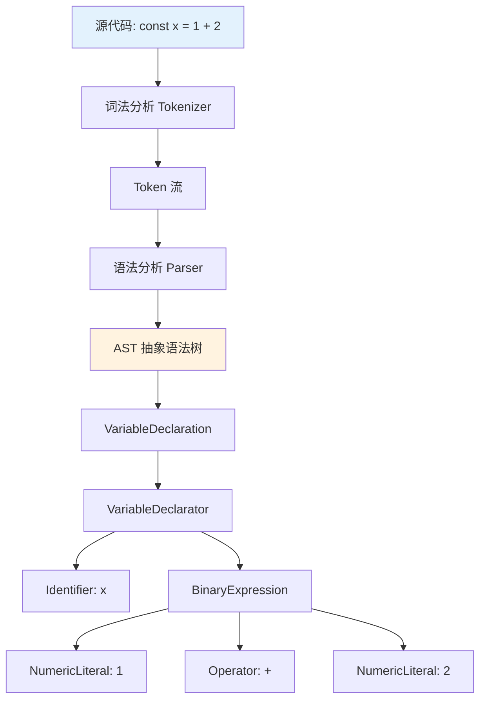
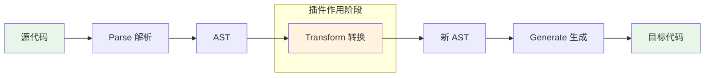
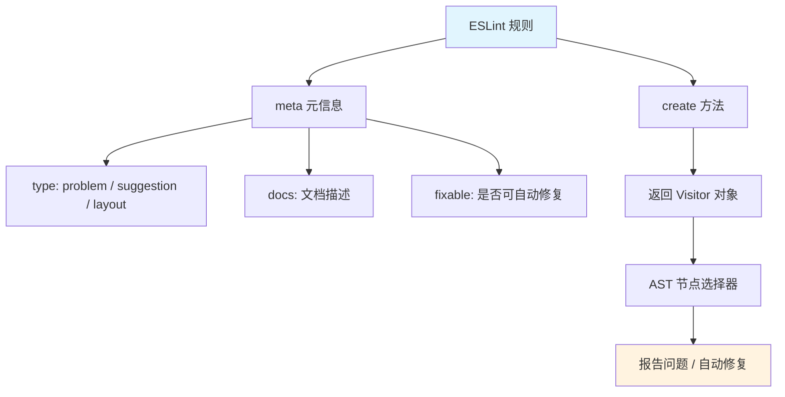
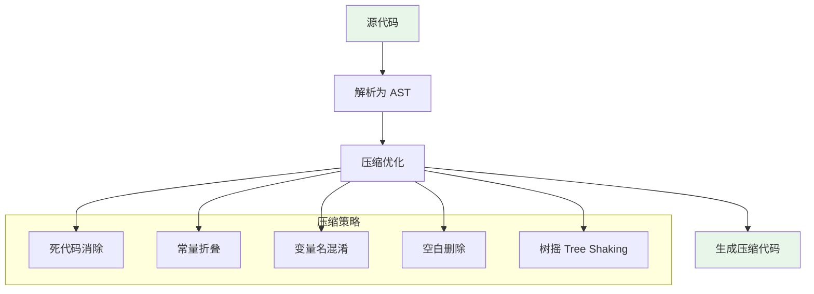
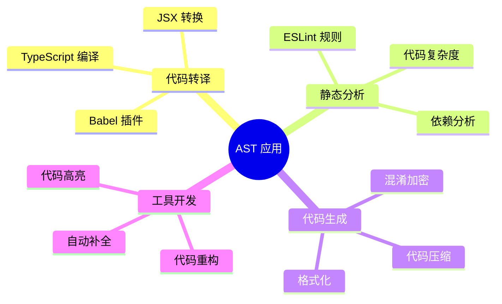

# AST 与代码转换

AST（Abstract Syntax Tree，抽象语法树）是源代码的树形结构表示，是代码转换、静态分析、代码压缩等工具的核心数据结构。

## AST 基本概念

### 什么是 AST



### AST 节点类型

```javascript
// 常见 AST 节点类型
const nodeTypes = {
  // 声明类
  VariableDeclaration: '变量声明',
  FunctionDeclaration: '函数声明',
  ClassDeclaration: '类声明',

  // 表达式类
  BinaryExpression: '二元表达式',
  CallExpression: '调用表达式',
  ArrowFunctionExpression: '箭头函数',

  // 语句类
  IfStatement: '条件语句',
  ForStatement: '循环语句',
  ReturnStatement: '返回语句',

  // 字面量
  NumericLiteral: '数字字面量',
  StringLiteral: '字符串字面量',
  BooleanLiteral: '布尔字面量',
};
```

## Babel 插件编写

### Babel 转换流程



### 实战：编写箭头函数转换插件

```javascript
// babel-plugin-transform-arrow-functions 简化版
module.exports = function (babel) {
  const { types: t } = babel;

  return {
    name: 'transform-arrow-functions',
    visitor: {
      ArrowFunctionExpression(path) {
        const { params, body, async: isAsync } = path.node;

        // 箭头函数体可能是表达式或块语句
        const blockBody = t.isBlockStatement(body)
          ? body
          : t.blockStatement([t.returnStatement(body)]);

        // 创建普通函数表达式
        const functionExpression = t.functionExpression(
          null,        // 匿名函数
          params,      // 参数
          blockBody,   // 函数体
          false,       // generator
          isAsync      // async
        );

        // 替换原节点
        path.replaceWith(functionExpression);
      },
    },
  };
};
```

### 实战：自动移除 console.log

```javascript
// babel-plugin-remove-console
module.exports = function ({ types: t }) {
  return {
    name: 'remove-console',
    visitor: {
      CallExpression(path, state) {
        const callee = path.get('callee');

        // 检查是否是 console.xxx() 调用
        if (
          callee.isMemberExpression() &&
          callee.get('object').isIdentifier({ name: 'console' })
        ) {
          // 可通过配置保留特定方法
          const methods = state.opts.methods || ['log'];
          const methodName = callee.get('property').node.name;

          if (methods.includes(methodName)) {
            path.remove();
          }
        }
      },
    },
  };
};

// 使用方式
// {
//   "plugins": [
//     ["remove-console", { "methods": ["log", "debug", "info"] }]
//   ]
// }
```

## ESLint 自定义规则

### ESLint 规则结构



### 实战：禁止使用 var 声明

```javascript
// eslint-plugin-custom/rules/no-var.js
module.exports = {
  meta: {
    type: 'suggestion',
    docs: {
      description: '禁止使用 var 声明变量',
      category: 'Best Practices',
      recommended: true,
    },
    fixable: 'code',
    schema: [],
    messages: {
      unexpectedVar: '不建议使用 var，请使用 const 或 let。',
    },
  },

  create(context) {
    return {
      VariableDeclaration(node) {
        if (node.kind === 'var') {
          context.report({
            node,
            messageId: 'unexpectedVar',
            fix(fixer) {
              // 自动修复：将 var 替换为 let
              // 实际场景需要更复杂的逻辑判断用 const 还是 let
              return fixer.replaceTextRange(
                [node.start, node.start + 3],
                'let'
              );
            },
          });
        }
      },
    };
  },
};
```

### 实战：强制函数最大行数

```javascript
// eslint-plugin-custom/rules/max-function-lines.js
module.exports = {
  meta: {
    type: 'suggestion',
    docs: {
      description: '限制函数最大行数',
    },
    schema: [
      {
        type: 'object',
        properties: {
          max: { type: 'integer', minimum: 1 },
        },
        additionalProperties: false,
      },
    ],
    messages: {
      exceed:
        '函数体超过 {{max}} 行（当前 {{count}} 行），请拆分。',
    },
  },

  create(context) {
    const options = context.options[0] || {};
    const maxLines = options.max || 50;

    function checkFunction(node) {
      if (!node.body) return;

      const startLine = node.body.loc.start.line;
      const endLine = node.body.loc.end.line;
      const lineCount = endLine - startLine + 1;

      if (lineCount > maxLines) {
        context.report({
          node,
          messageId: 'exceed',
          data: { max: maxLines, count: lineCount },
        });
      }
    }

    return {
      FunctionDeclaration: checkFunction,
      FunctionExpression: checkFunction,
      ArrowFunctionExpression: checkFunction,
    };
  },
};
```

## 代码压缩原理

### 压缩流程



### 常见压缩策略示例

```javascript
// ===== 常量折叠 =====
// 压缩前
const a = 1 + 2;
const b = 'hello' + ' ' + 'world';
const c = true ? x : y;

// 压缩后
const a = 3;
const b = 'hello world';
const c = x;

// ===== 死代码消除 =====
// 压缩前
function foo() {
  if (false) {
    console.log('永远不会执行');
  }
  return 42;
}

// 压缩后
function foo() {
  return 42;
}

// ===== 变量名混淆 =====
// 压缩前
function calculateTotalPrice(itemPrice, taxRate) {
  const totalPrice = itemPrice * (1 + taxRate);
  return totalPrice;
}

// 压缩后
function a(b, c) {
  const d = b * (1 + c);
  return d;
}
```

## AST 在线工具

| 工具 | 用途 | 链接 |
|------|------|------|
| AST Explorer | 在线查看 AST 结构 | astexplorer.net |
| Babel Playground | 测试 Babel 插件 | babeljs.io/repl |
| ESLint Playground | 测试 ESLint 规则 | eslint.org/playground |

## 面试要点

1. **AST 是什么？** 源代码的树形结构表示，是编译器/转译器的核心数据结构
2. **Babel 三阶段？** Parse（解析）→ Transform（转换）→ Generate（生成）
3. **ESLint 如何工作？** 基于 AST 遍历，通过 Visitor 模式匹配节点并报告问题
4. **代码压缩的本质？** 对 AST 进行等价变换以减小代码体积

## 总结


