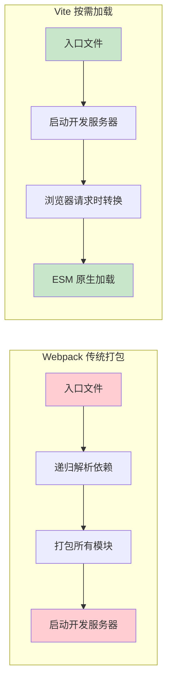
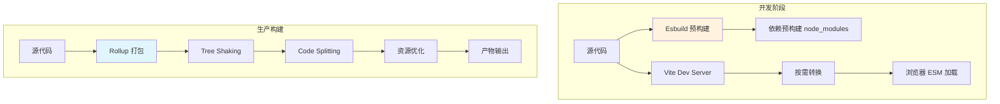
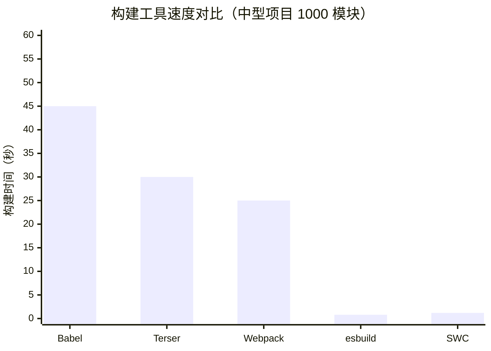
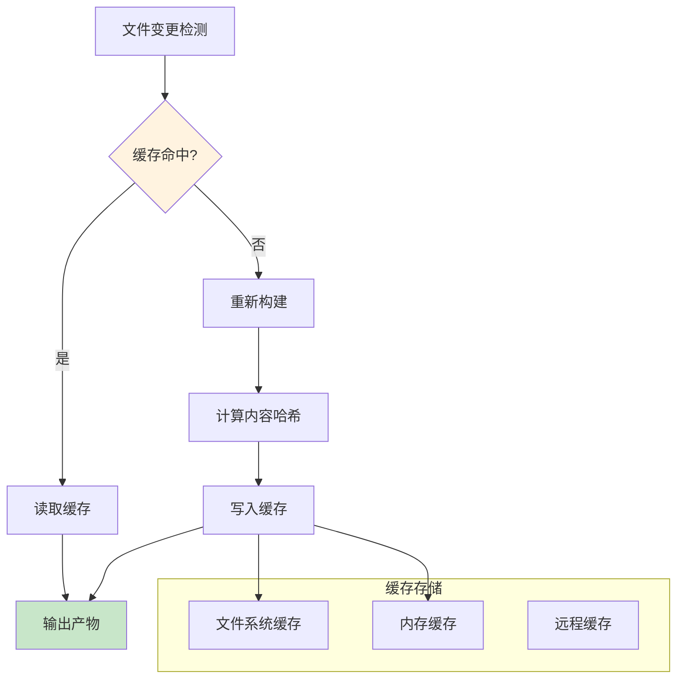
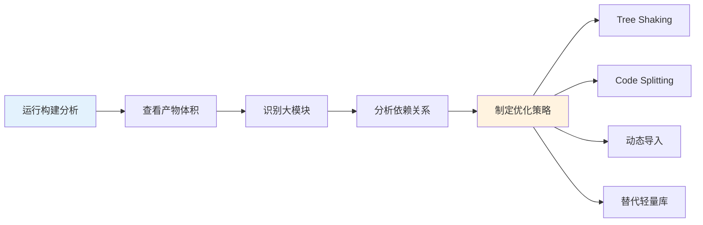
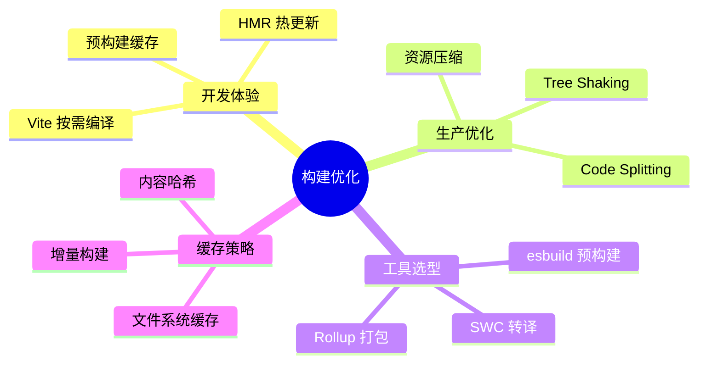

# 构建优化深入

构建性能直接影响开发体验和部署效率。本文深入分析现代构建工具的原理与优化策略。

## Vite 核心原理

### Vite 为什么快



### Vite 架构设计



### Vite 插件开发

```typescript
// 自定义 Vite 插件示例：自动导入组件
import { Plugin } from 'vite';
import { parse, compileTemplate } from '@vue/compiler-sfc';

export function autoImportComponents(): Plugin {
  const componentMap = new Map<string, string>();

  return {
    name: 'auto-import-components',

    // 扫描组件目录
    async buildStart() {
      const files = await this.resolve('src/components/**/*.vue');
      files.forEach((file) => {
        const name = file.match(/(\w+)\.vue$/)?.[1];
        if (name) componentMap.set(name, file);
      });
    },

    // 转换阶段自动注入 import
    transform(code, id) {
      if (!id.endsWith('.vue')) return;

      let modified = code;
      componentMap.forEach((path, name) => {
        const tag = `<${name}`;
        if (modified.includes(tag) && !modified.includes(`import ${name}`)) {
          modified = `import ${name} from '${path}'\n${modified}`;
        }
      });

      return modified;
    },
  };
}
```

## SWC 与 esbuild

### 速度对比



### 为什么 SWC/esbuild 这么快

| 因素 | JavaScript 工具 | 原生工具 (Rust/Go) |
|------|----------------|-------------------|
| 语言 | 解释执行 | 编译执行 |
| 并行化 | 单线程 | 多线程 |
| 内存管理 | GC | 手动管理 |
| AST 遍历 | 动态类型 | 静态类型 |

### esbuild 核心 API

```javascript
import * as esbuild from 'esbuild';

// 基础构建
await esbuild.build({
  entryPoints: ['src/index.ts'],
  bundle: true,
  outfile: 'dist/index.js',
  minify: true,
  sourcemap: true,
  target: ['es2020'],
  format: 'esm',
  splitting: true,        // 代码分割
  treeShaking: true,       // 树摇优化
  metafile: true,          // 生成构建元数据
});

// Transform 模式（单文件转换）
const result = await esbuild.transform(
  'const x: number = 1;',
  { loader: 'ts' }
);
console.log(result.code); // const x = 1;
```

## 持久化缓存

### 缓存策略



### Webpack 5 持久化缓存配置

```javascript
// webpack.config.js
module.exports = {
  cache: {
    type: 'filesystem',
    buildDependencies: {
      config: [__filename],       // 配置文件变更时失效
      tsconfig: ['tsconfig.json'],
    },
    cacheDirectory: path.resolve(__dirname, '.cache'),
    name: `${process.env.NODE_ENV}-${process.env.BUILD_TYPE}`,
    version: '1.0',
  },

  output: {
    // 使用内容哈希确保缓存有效性
    filename: '[name].[contenthash:8].js',
    chunkFilename: '[name].[contenthash:8].js',
  },
};
```

### Vite 缓存优化

```typescript
// vite.config.ts
import { defineConfig } from 'vite';

export default defineConfig({
  // 依赖预构建缓存
  optimizeDeps: {
    include: ['react', 'react-dom', 'lodash-es'],
    force: false,  // 仅在依赖变化时重新预构建
  },

  // 构建缓存
  build: {
    rollupOptions: {
      output: {
        // 持久化缓存文件名
        entryFileNames: 'assets/[name].[hash].js',
        chunkFileNames: 'assets/[name].[hash].js',
        assetFileNames: 'assets/[name].[hash].[ext]',
      },
    },
  },
});
```

## 构建分析

### 构建产物分析

```javascript
// 使用 rollup-plugin-visualizer
import { visualizer } from 'rollup-plugin-visualizer';

export default defineConfig({
  plugins: [
    visualizer({
      open: true,
      filename: 'stats.html',
      gzipSize: true,
      brotliSize: true,
    }),
  ],
});
```

### Bundle 分析流程



### 构建优化检查清单

```typescript
// 构建优化配置最佳实践
export default defineConfig({
  build: {
    // 1. 代码分割
    rollupOptions: {
      output: {
        manualChunks: {
          'vendor-react': ['react', 'react-dom'],
          'vendor-utils': ['lodash-es', 'date-fns'],
        },
      },
    },

    // 2. 压缩配置
    minify: 'terser',
    terserOptions: {
      compress: {
        drop_console: true,
        drop_debugger: true,
        pure_funcs: ['console.log'],
      },
    },

    // 3. 资源处理
    assetsInlineLimit: 4096,     // 4KB 以下内联
    cssCodeSplit: true,          // CSS 代码分割
    sourcemap: false,            // 生产环境关闭 sourcemap

    // 4. 目标环境
    target: 'es2020',
  },
});
```

## 面试要点

1. **Vite 为什么比 Webpack 快？** 开发阶段利用浏览器原生 ESM，无需打包；生产构建使用 Rollup，Tree Shaking 更彻底
2. **esbuild/SWC 的优势？** 使用 Rust/Go 编写，多线程并行处理，比 JS 工具快 10-100 倍
3. **持久化缓存原理？** 基于文件内容哈希，未变更的模块直接读取缓存，避免重复构建
4. **如何分析构建产物？** 使用 visualizer 工具，关注大模块、重复依赖、不必要的 polyfill

## 总结


