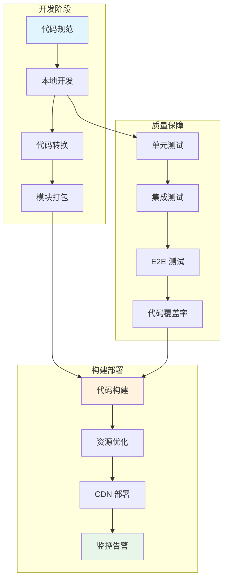
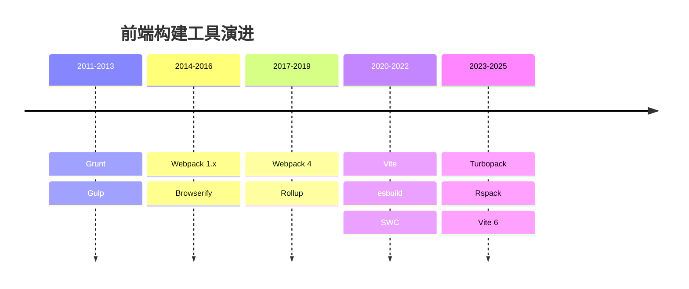
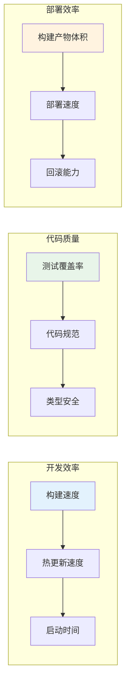

# 前端工程化进阶概述

前端工程化是将软件工程的思想和方法应用于前端开发的过程，目标是提升开发效率、保证代码质量、优化构建性能。

## 工程化体系全景

## 核心模块

| 模块 | 关键技术 | 解决的问题 |
|------|---------|-----------|
| **AST 与代码转换** | Babel、ESLint、Prettier | 语法兼容、代码质量 |
| **构建优化** | Vite、SWC、esbuild | 构建速度、产物体积 |
| **模块化方案** | ESM、CommonJS、UMD | 代码组织、依赖管理 |
| **包管理** | npm、pnpm、yarn | 依赖解析、版本管理 |
| **CI/CD** | GitHub Actions、Jenkins | 自动化部署、质量门禁 |

## 工具链演进

## 工程化核心指标

## 学习路径建议

1. **基础阶段**：理解 AST、掌握 Babel 插件编写、熟悉构建流程
2. **进阶阶段**：深入构建工具原理、性能优化、CI/CD 配置
3. **高级阶段**：自研工具链、工程化体系建设、团队规范制定

## 常见面试问题

| 问题 | 关键点 |
|------|--------|
| Webpack 和 Vite 的区别？ | 打包 vs 按需编译、ESM 原生支持 |
| Tree Shaking 原理？ | ESM 静态分析、副作用标记 |
| Babel 的作用？ | AST 转换、语法降级、Polyfill |
| 如何优化构建速度？ | 缓存、并行、增量编译 |

## 相关文章

- [AST 与代码转换](./ast.md) - 深入理解抽象语法树与代码转换原理
- [构建优化深入](./build-optimization.md) - Vite 原理与构建性能优化
