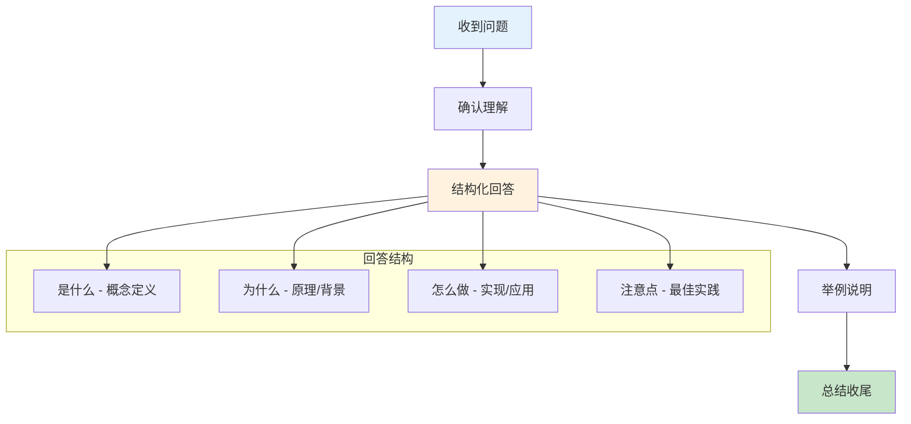
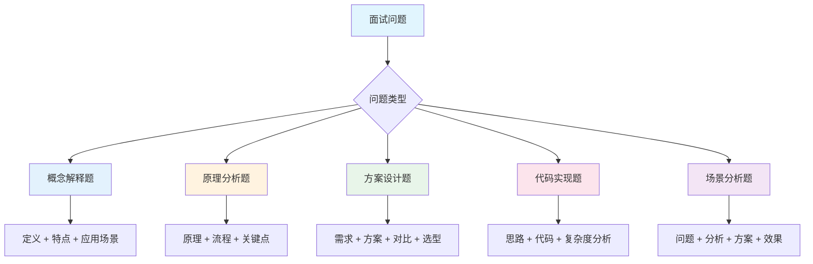
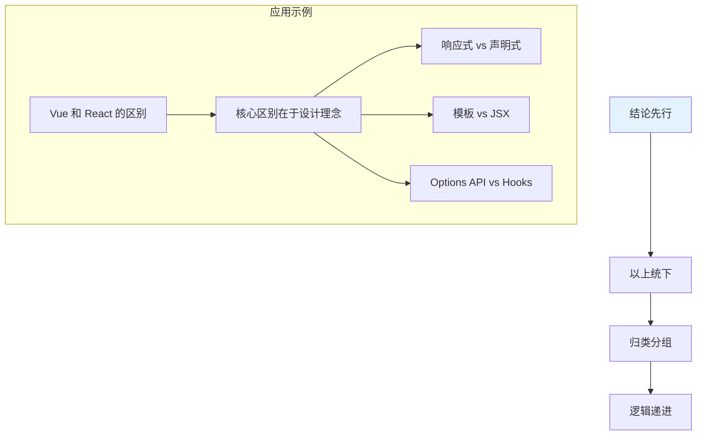
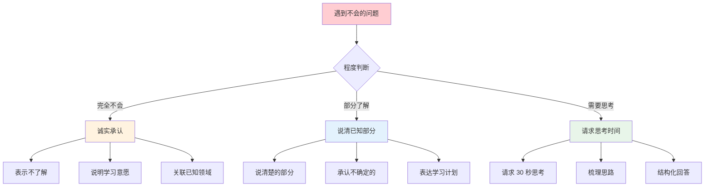
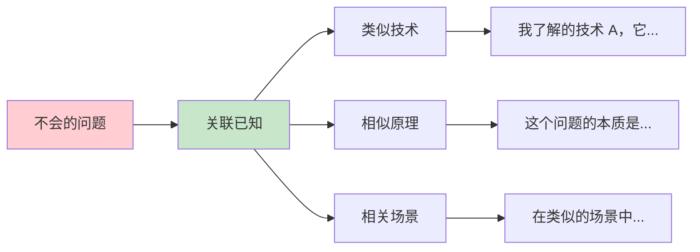
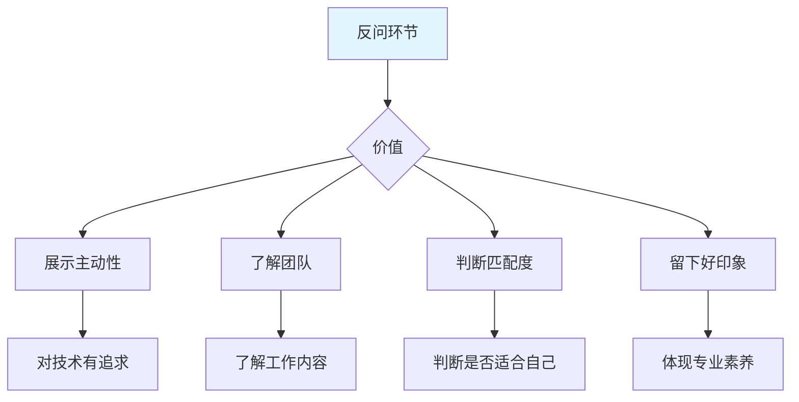
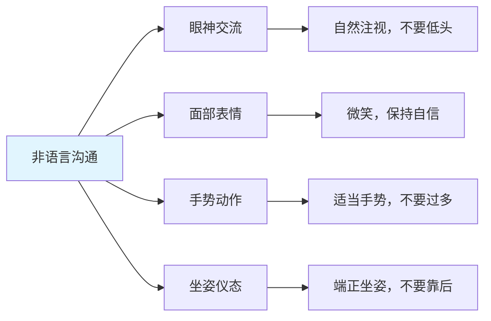
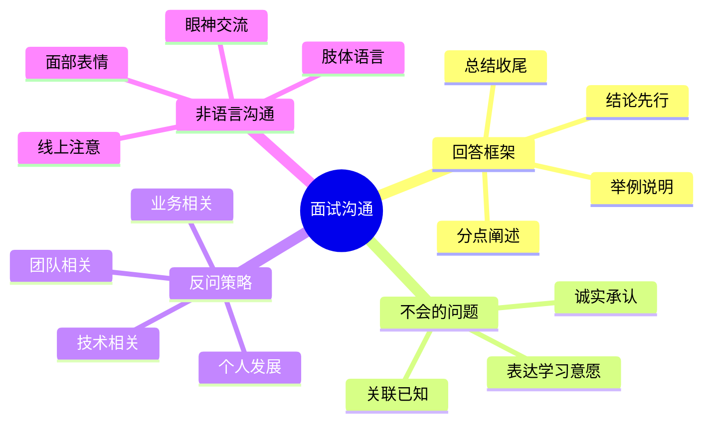

# 面试沟通技巧

良好的沟通能力能让你在面试中充分展现技术实力。本文介绍结构化的回答框架和实用的沟通策略。

## 技术问题回答框架

### 通用回答框架



### 问题分类与回答策略



## 结构化表达方法

### 金字塔原理



### 回答示例：Vue 和 React 的区别

```markdown
## 结构化回答示例

### 结论先行
Vue 和 React 的核心区别在于设计理念：Vue 偏向于易用性和渐进式，
React 偏向于灵活性和函数式。

### 分点阐述

**1. 响应式原理**
- Vue：基于 Proxy 的响应式系统，自动追踪依赖
- React：基于 setState 的显式更新，需要手动管理状态

**2. 模板语法**
- Vue：模板语法（Template），更接近 HTML，学习成本低
- React：JSX，JavaScript 和 HTML 混写，更灵活

**3. 组件逻辑**
- Vue：Options API（data, methods, computed）或 Composition API
- React：函数组件 + Hooks，更纯粹的函数式

**4. 生态系统**
- Vue：官方全家桶（Vue Router, Pinia），统一性强
- React：社区驱动，选择多但需要自己搭配

### 总结
选择 Vue 还是 React 取决于项目需求和团队情况：
- 快速开发、团队经验少 → Vue
- 复杂应用、需要灵活性 → React
```

## 不会的问题应对策略

### 应对流程



### 不同场景的应对话术

```markdown
## 场景一：完全不会

❌ 错误回答："不知道"、"没学过"

✅ 正确回答：
"这个技术我目前还没有深入了解过，但根据我的理解，
它可能是为了解决 XX 问题而产生的。
我之前用过类似的技术 XX 来解决这类问题，
面试结束后我会去深入学习一下。"

---

## 场景二：部分了解

❌ 错误回答：支支吾吾，不确定的也乱说

✅ 正确回答：
"关于这个问题，我了解的是 XX 部分，它的原理是...
但 YY 部分我还没有深入研究，我的理解是...
不确定是否准确，面试结束后我会进一步学习确认。"

---

## 场景三：需要思考

❌ 错误回答：沉默不语，或者马上说"不知道"

✅ 正确回答：
"这个问题让我思考一下...（停顿 5-10 秒）
我的思路是这样的：首先...其次...最后...
以上是我的初步想法，可能还有不完善的地方。"
```

### 关联已知领域



```markdown
## 关联回答示例

面试官："你了解 Rust 的所有权机制吗？"

回答：
"Rust 的所有权机制我还没有深入学习过，
但我理解它是为了解决内存安全问题而设计的。

我在使用 JavaScript 时遇到过内存泄漏的问题，
通常是由于闭包引用或事件监听器未清理导致的。
Rust 的所有权机制应该是在编译期就避免这类问题。

它的核心概念应该是：
1. 每个值都有一个所有者
2. 同一时间只能有一个所有者
3. 所有者离开作用域时值被释放

具体的细节我还需要进一步学习。"
```

## 反问环节策略

### 反问的价值



### 反问问题分类

```markdown
## 推荐的反问问题

### 技术相关（展示技术追求）
1. "团队目前的技术栈是什么？有计划升级或引入新技术吗？"
2. "项目的代码规范和质量保障体系是怎样的？"
3. "团队是如何做技术选型的？决策流程是怎样的？"
4. "新人入职后，通常需要多长时间能独立负责模块？"

### 团队相关（了解工作环境）
1. "团队目前有多少人？前端后端的分工是怎样的？"
2. "团队的开发流程是怎样的？有 Code Review 吗？"
3. "团队内部有技术分享或学习机制吗？"
4. "日常工作中最大的挑战是什么？"

### 业务相关（了解发展方向）
1. "这个岗位主要负责什么业务？未来的发展方向是？"
2. "团队目前最重要的技术挑战是什么？"
3. "公司的技术文化建设是怎样的？"

### 个人发展（展示上进心）
1. "公司对技术人员的培养体系是怎样的？"
2. "这个岗位的晋升路径是怎样的？"
3. "如果我入职，前三个月的重点工作是什么？"
```

### 避免的反问问题

```markdown
## 不推荐的反问问题

❌ 薪资福利相关（应该在 HR 面试时问）
- "工资多少？"
- "加班多吗？"
- "有年假吗？"

❌ 过于基础的信息
- "公司是做什么的？"（面试前应该了解）
- "用什么框架？"（招聘信息通常会写）

❌ 过于敏感的问题
- "为什么离职率这么高？"
- "领导好相处吗？"
```

## 非语言沟通

### 肢体语言要点



### 线上面试注意事项

```markdown
## 线上面试要点

### 环境准备
- ✅ 安静、光线充足的房间
- ✅ 稳定的网络连接
- ✅ 干净的背景
- ❌ 嘈杂的环境
- ❌ 逆光或光线不足

### 设备准备
- ✅ 摄像头在眼睛水平线
- ✅ 麦克风清晰无杂音
- ✅ 提前测试音视频
- ❌ 摄像头角度过低
- ❌ 使用手机面试（除非必要）

### 表现要点
- ✅ 看摄像头而非屏幕
- ✅ 适当点头表示在听
- ✅ 回答时保持微笑
- ❌ 频繁切换窗口
- ❌ 边面试边做其他事
```

## 常见沟通问题

### 问题一：回答太简短

```markdown
❌ 问题回答："是的"、"对"、"用过"

✅ 改进方法：使用 STAR 法则或总分总结构

面试官："你用过 TypeScript 吗？"

改进前："用过。"

改进后：
"是的，我在项目中广泛使用 TypeScript。
主要是为了解决 JavaScript 类型不明确导致的运行时错误。
在实际使用中，我通过定义接口和类型别名来规范数据结构，
配合 ESLint 的 TypeScript 插件做静态检查。
上线后，类型相关的 Bug 减少了约 60%。"
```

### 问题二：回答太冗长

```markdown
❌ 问题：说了 5 分钟还没到重点

✅ 改进方法：
1. 先说结论（1 句话）
2. 分 2-3 个要点展开
3. 每个要点用 1-2 句话说明
4. 最后总结

时间控制：
- 简单问题：30 秒 - 1 分钟
- 中等问题：1 - 2 分钟
- 复杂问题：2 - 3 分钟
```

### 问题三：紧张导致卡壳

```markdown
✅ 应对方法：

1. 深呼吸，放慢语速
2. "让我整理一下思路..."
3. 从自己最熟悉的部分开始说
4. 不懂的部分诚实承认
5. 记住：面试官也在帮你，他们希望你表现好
```

## 面试要点

1. **结构化表达**：结论先行，分点阐述，逻辑清晰
2. **不会的问题**：诚实承认，关联已知，表达学习意愿
3. **反问环节**：展示主动性，了解团队，判断匹配度
4. **非语言沟通**：眼神交流，自信微笑，端正仪态

## 总结


