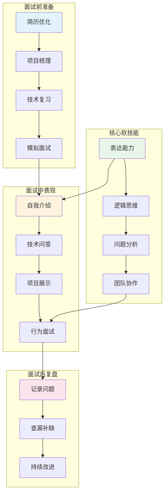
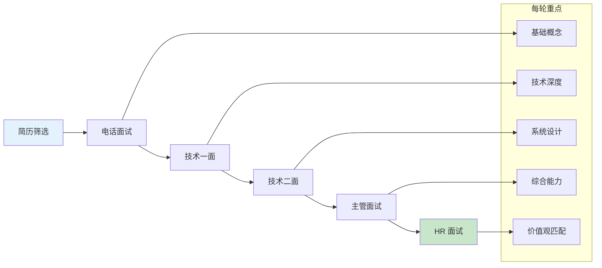
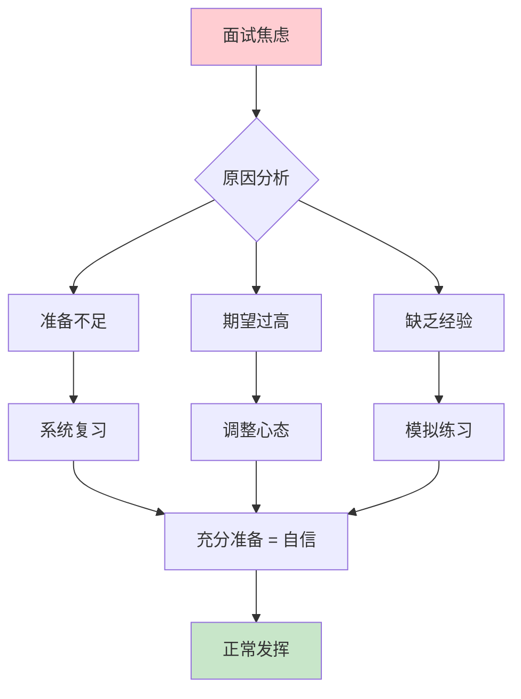

# 面试软技能概述

技术能力是面试的基础，而软技能决定了你能否在面试中充分展现自己的实力。优秀的软技能能让面试官看到你的潜力和团队协作能力。

## 面试软技能全景

## 面试评估维度

| 维度 | 权重 | 考察内容 | 提升方法 |
|------|------|---------|---------|
| **技术深度** | 30% | 原理理解、源码阅读 | 系统学习、动手实践 |
| **项目经验** | 25% | 方案设计、问题解决 | STAR 法则、量化成果 |
| **沟通表达** | 20% | 逻辑清晰、表达准确 | 结构化表达、模拟练习 |
| **学习能力** | 15% | 知识广度、学习方法 | 持续学习、技术博客 |
| **团队协作** | 10% | 协作意识、冲突处理 | 回顾经历、提炼案例 |

## 面试流程与策略

## 常见面试场景

### 技术面试场景

- **算法题**：思路清晰、边界考虑、代码规范
- **系统设计**：需求分析、方案设计、权衡取舍
- **项目深挖**：技术选型、难点突破、成果量化

### 行为面试场景

- **团队冲突**：如何处理意见分歧
- **压力应对**：如何在紧迫工期内完成任务
- **失败经历**：从失败中学到了什么

## 面试心态调整

## 相关文章

- [项目介绍技巧](./project-presentation.md) - STAR 法则、技术方案汇报、亮点提炼
- [面试沟通技巧](./communication.md) - 技术问题回答框架、反问环节策略
