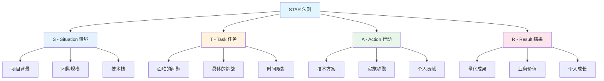
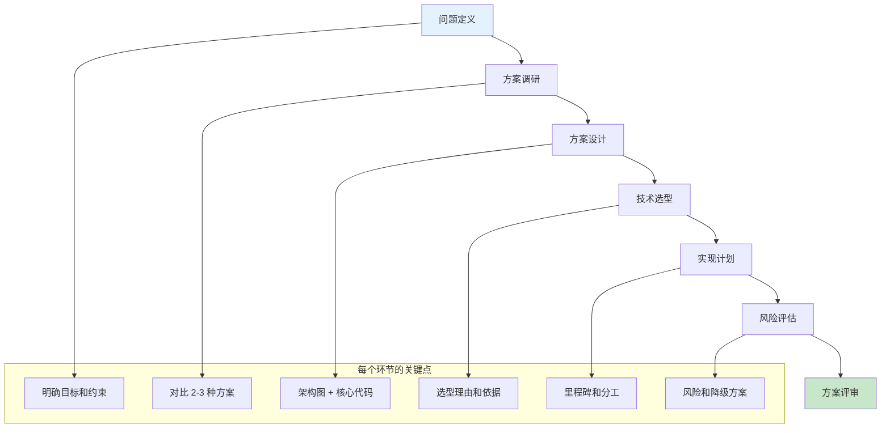
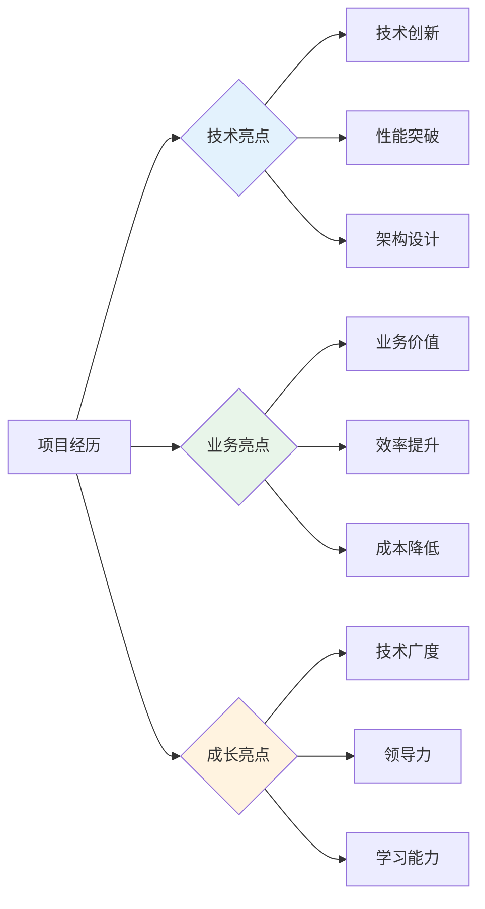
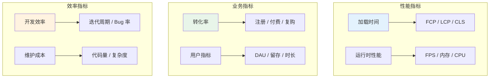
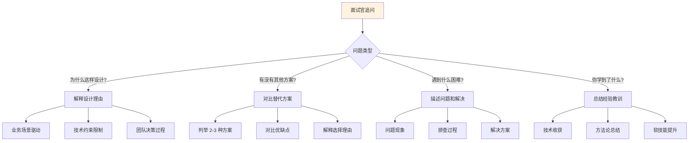
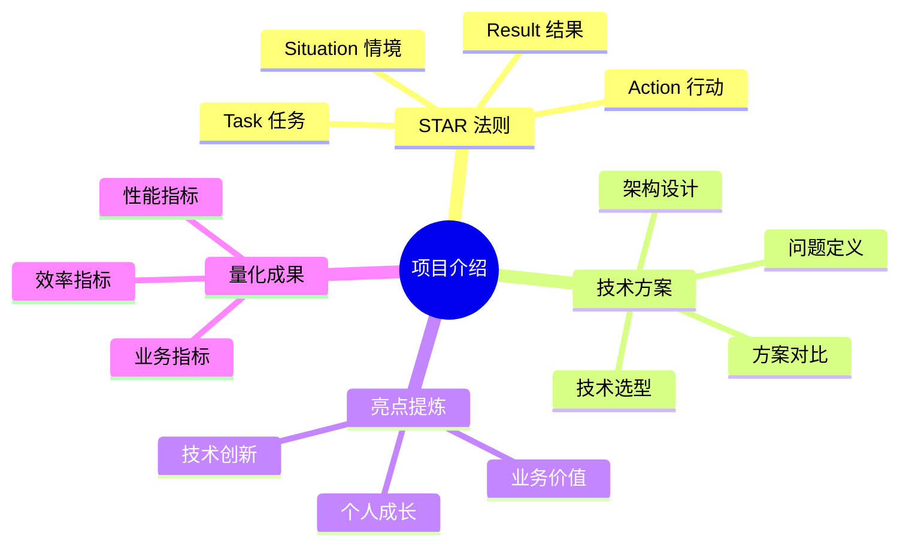

# 项目介绍技巧

项目介绍是面试中最能体现你综合能力的环节。一个好的项目介绍能让面试官快速了解你的技术实力和解决问题的能力。

## STAR 法则

### STAR 法则结构



### STAR 法则示例

```markdown
## 项目：电商平台性能优化

### Situation（情境）
公司核心电商平台，日活用户 50 万，页面加载时间 4.2 秒，
用户跳出率 35%，严重影响转化率。

### Task（任务）
作为前端负责人，需要在 2 个月内将首屏加载时间优化到 2 秒以内，
降低跳出率至 20% 以下。

### Action（行动）
1. **性能分析**：使用 Lighthouse 定位瓶颈，发现 JS Bundle 2.1MB、
   未使用代码占比 40%
2. **代码分割**：按路由拆分，实现按需加载，Bundle 降至 800KB
3. **图片优化**：WebP 格式 + 懒加载，图片体积减少 60%
4. **缓存策略**：Service Worker 缓存静态资源，二次访问秒开
5. **监控体系**：接入 RUM 监控，持续跟踪性能指标

### Result（结果）
- 首屏加载时间：4.2s → 1.8s（优化 57%）
- 用户跳出率：35% → 18%（降低 49%）
- 转化率提升 23%，月增收 150 万
```

## 技术方案汇报框架

### 方案汇报流程



### 技术选型对比表

```markdown
## 状态管理方案选型

| 方案 | 学习成本 | 生态 | 包体积 | 适用场景 |
|------|---------|------|--------|---------|
| Redux | 高 | 丰富 | 11KB | 复杂大型应用 |
| Zustand | 低 | 成熟 | 1KB | 中小型应用 |
| Jotai | 低 | 成长中 | 2KB | 原子化状态 |
| MobX | 中 | 成熟 | 16KB | 响应式编程 |

**选型结论**：选择 Zustand，理由：
1. 团队规模小，学习成本低优先
2. 包体积小，对性能友好
3. API 简洁，开发效率高
```

## 亮点提炼

### 亮点提炼框架



### 亮点表述模板

```markdown
## 技术亮点表述

**公式**：做了什么 + 用了什么技术 + 达到了什么效果

✅ 好的表述：
"设计并实现了基于 WebSocket 的实时消息推送系统，
支持 10 万级并发连接，消息延迟 < 100ms"

❌ 不好的表述：
"做了消息推送功能"
```

## 量化成果

### 量化指标体系



### 量化成果示例

```markdown
## 量化成果表述

### 性能优化类
- "首屏加载时间从 4.2s 优化至 1.8s，提升 57%"
- "Bundle 体积从 2.1MB 降至 800KB，减少 62%"
- "接口响应时间从 800ms 降至 200ms，提升 75%"

### 效率提升类
- "组件复用率从 20% 提升至 60%，开发效率提升 3 倍"
- "构建时间从 3 分钟降至 30 秒，提升 83%"
- "自动化测试覆盖率从 30% 提升至 85%，Bug 率降低 40%"

### 业务价值类
- "转化率提升 23%，月增收 150 万"
- "用户跳出率从 35% 降至 18%，降低 49%"
- "页面 PV 提升 35%，用户停留时长增加 2 分钟"
```

## 项目介绍模板

```markdown
## 项目介绍结构（2-3 分钟）

### 1. 项目背景（30 秒）
- 公司/产品是什么
- 项目的核心目标
- 团队规模和我的角色

### 2. 技术方案（60 秒）
- 整体架构设计
- 核心技术选型和理由
- 关键技术难点

### 3. 个人贡献（45 秒）
- 我负责的模块
- 遇到的问题和解决方案
- 技术亮点和创新点

### 4. 成果总结（15 秒）
- 量化成果（性能/业务/效率）
- 个人成长和收获
```

## 常见问题应对

### 面试官追问应对



## 面试要点

1. **STAR 法则的核心**：用具体的事例展示能力，而非空泛的描述
2. **技术方案汇报**：清晰的问题定义、合理的方案对比、明确的选型理由
3. **亮点提炼**：技术亮点、业务亮点、成长亮点三个维度
4. **量化成果**：用数据说话，展示实际价值

## 总结


