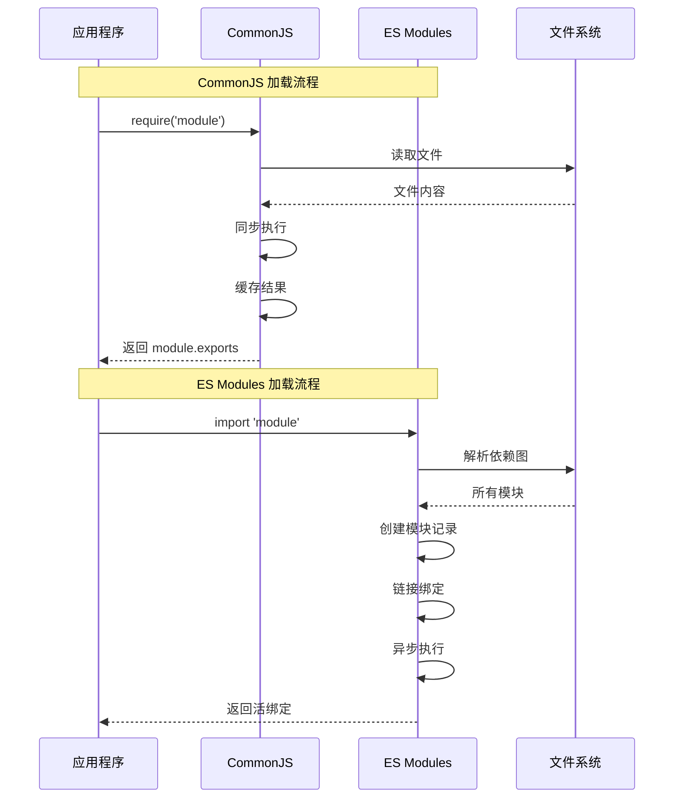
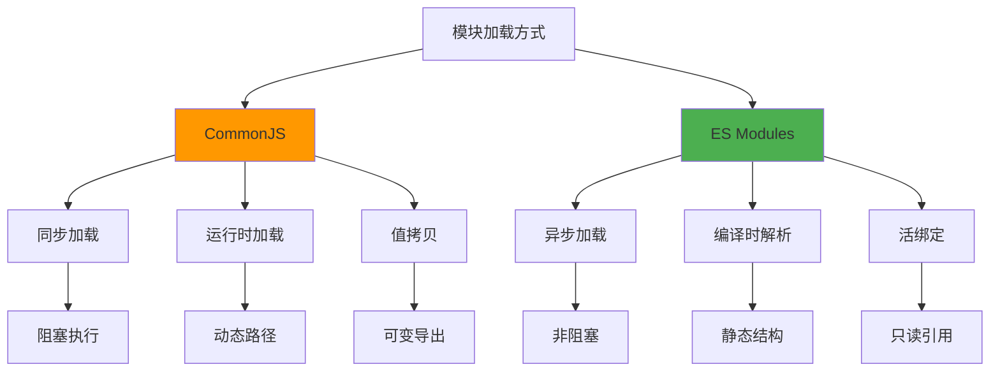
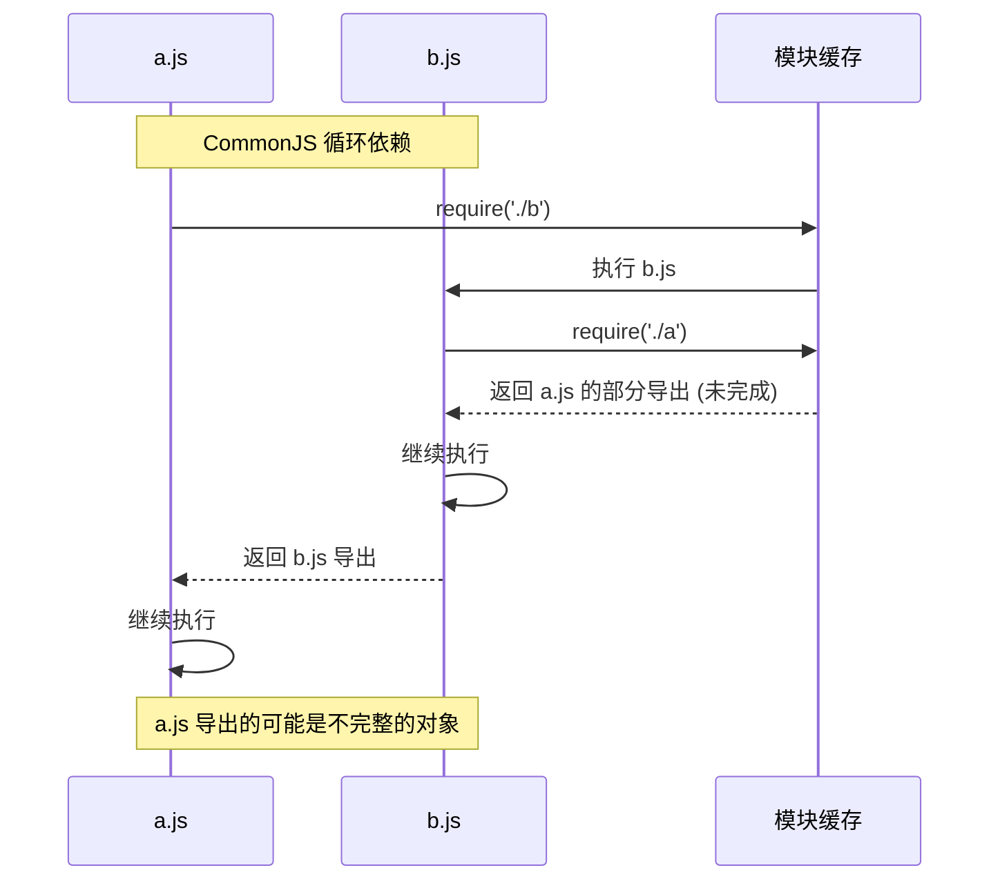
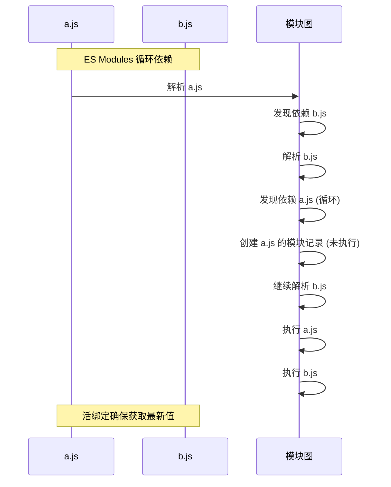
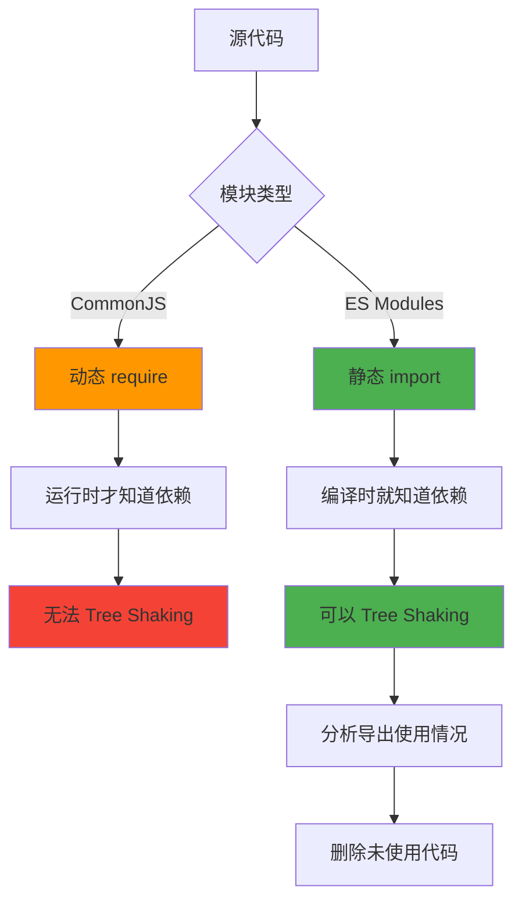
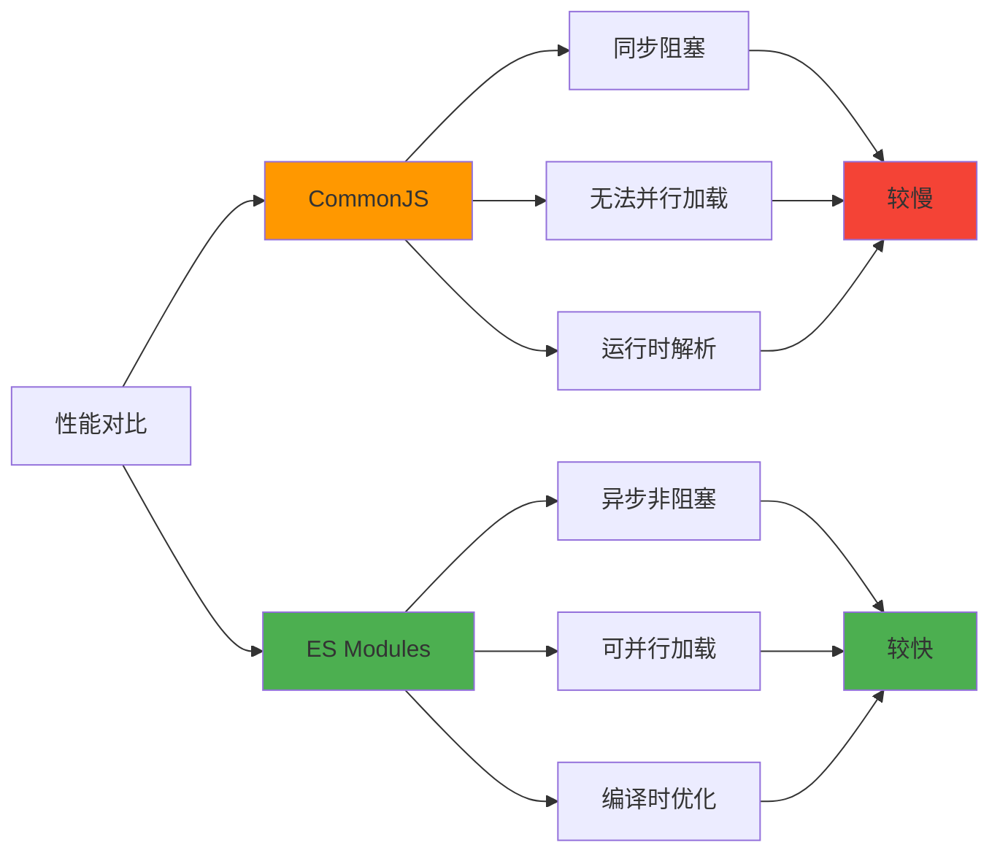

# ESM vs CJS 深度对比

CommonJS 和 ES Modules 是 JavaScript 最重要的两种模块系统，理解它们的差异对现代前端开发至关重要。

## 模块加载机制对比



## 核心差异

### 1. 语法差异

```javascript
// ========== CommonJS ==========
// 导出
module.exports = { name: 'CJS' };
exports.name = 'CJS';

// 导入
const module = require('./module');
const { name } = require('./module');

// ========== ES Modules ==========
// 导出
export const name = 'ESM';
export default { name: 'ESM' };

// 导入
import { name } from './module.js';
import module from './module.js';
import * as module from './module.js';

// 动态导入
const module = await import('./module.js');
```

### 2. 加载方式



### 3. 值拷贝 vs 活绑定

```javascript
// ========== CommonJS: 值拷贝 ==========
// counter.js
let count = 0;
module.exports = {
  count,
  increment: () => { count++; }
};

// main.js
const { count, increment } = require('./counter');
console.log(count);  // 0
increment();
console.log(count);  // 0 (值拷贝，不会变化)

// ========== ES Modules: 活绑定 ==========
// counter.js
export let count = 0;
export function increment() { count++; }

// main.js
import { count, increment } from './counter.js';
console.log(count);  // 0
increment();
console.log(count);  // 1 (活绑定，实时更新)
```

## 循环依赖处理

### CommonJS 循环依赖



```javascript
// ========== CommonJS 循环依赖示例 ==========
// a.js
console.log('a.js 开始');
exports.done = false;
const b = require('./b');
console.log('在 a.js 中, b.done =', b.done);
exports.done = true;
console.log('a.js 结束');

// b.js
console.log('b.js 开始');
exports.done = false;
const a = require('./a');
console.log('在 b.js 中, a.done =', a.done);  // false (不完整)
exports.done = true;
console.log('b.js 结束');

// main.js
const a = require('./a');
console.log('在 main.js 中, a.done =', a.done);  // true
```

### ES Modules 循环依赖



```javascript
// ========== ES Modules 循环依赖示例 ==========
// a.js
import { b } from './b.js';
export const a = 'a';
console.log('b in a:', b);  // 可能是 undefined (如果 b 未执行完)

// b.js
import { a } from './a.js';
export const b = 'b';
console.log('a in b:', a);  // 可能是 undefined (如果 a 未执行完)

// 但后续访问会得到正确的值 (活绑定)
```

## Tree Shaking 原理

### 为什么 ESM 支持 Tree Shaking？



### Tree Shaking 实现

```javascript
// ========== 未使用导出的模块 ==========
// utils.js
export function add(a, b) {
  return a + b;
}

export function subtract(a, b) {
  return a - b;
}

export function multiply(a, b) {
  return a * b;
}

// ========== 只使用部分导出 ==========
// main.js
import { add } from './utils.js';

console.log(add(1, 2));
// subtract 和 multiply 会被 Tree Shaking 移除
```

### 打包后的代码

```javascript
// 打包前 (开发模式)
const utils = {
  add(a, b) { return a + b; },
  subtract(a, b) { return a - b; },
  multiply(a, b) { return a * b; }
};

console.log(utils.add(1, 2));

// 打包后 (生产模式，Tree Shaking)
function add(a, b) { return a + b; }
console.log(add(1, 2));
// subtract 和 multiply 被移除
```

### 副作用问题

```javascript
// ========== 有副作用的模块 ==========
// effects.js
export const pure = 'pure value';

// 副作用：修改全局状态
window.__APP_VERSION__ = '1.0.0';

console.log('Module loaded');

// ========== Tree Shaking 配置 ==========
// package.json
{
  "sideEffects": false  // 声明无副作用
}

// 或者指定有副作用的文件
{
  "sideEffects": [
    "*.css",
    "./src/polyfills.js"
  ]
}
```

## 性能对比



### 实际性能测试

```javascript
// ========== CommonJS 性能 ==========
const start = performance.now();

const module1 = require('./module1');
const module2 = require('./module2');
const module3 = require('./module3');

console.log(`CJS 加载时间: ${performance.now() - start}ms`);

// ========== ES Modules 性能 ==========
const start = performance.now();

const [module1, module2, module3] = await Promise.all([
  import('./module1.js'),
  import('./module2.js'),
  import('./module3.js')
]);

console.log(`ESM 加载时间: ${performance.now() - start}ms`);
```

## 现代打包工具处理

### Webpack 配置

```javascript
// webpack.config.js
module.exports = {
  experiments: {
    outputModule: true  // 输出 ES Modules
  },
  module: {
    rules: [
      {
        test: /\.js$/,
        type: 'javascript/auto',  // 支持 CJS 和 ESM
        resolve: {
          fullySpecified: false  // 不要求完整路径
        }
      }
    ]
  },
  optimization: {
    usedExports: true,     // Tree Shaking
    sideEffects: true,     // 副作用分析
    concatenateModules: true  // 模块合并
  }
};
```

### Vite 的处理方式

```javascript
// vite.config.js
export default {
  build: {
    rollupOptions: {
      output: {
        // 代码分割
        manualChunks: {
          vendor: ['react', 'react-dom'],
          utils: ['lodash', 'date-fns']
        }
      }
    }
  },
  optimizeDeps: {
    // 预构建 CJS 依赖
    include: ['lodash', 'axios']
  }
};
```

## 混合使用策略

### 在 Node.js 中使用 ESM

```json
// package.json
{
  "type": "module",
  "exports": {
    ".": {
      "import": "./dist/index.js",
      "require": "./dist/index.cjs"
    }
  }
}
```

### 双包发布

```javascript
// rollup.config.js
export default [
  // ESM 版本
  {
    input: 'src/index.js',
    output: {
      file: 'dist/index.js',
      format: 'es'
    }
  },
  // CJS 版本
  {
    input: 'src/index.js',
    output: {
      file: 'dist/index.cjs',
      format: 'cjs'
    }
  }
];
```

## 最佳实践

:::tip ESM vs CJS 选择指南
1. **新项目**：优先使用 ES Modules
2. **Node.js**：使用 ESM + `"type": "module"`
3. **浏览器**：必须使用 ESM
4. **库开发**：同时发布 ESM 和 CJS 版本
5. **性能优化**：利用 Tree Shaking 减少包体积
:::

## 面试要点

:::warning 高频面试题
1. CommonJS 和 ES Modules 的主要区别是什么？
2. 什么是活绑定？它和值拷贝有什么区别？
3. 为什么 ES Modules 支持 Tree Shaking 而 CommonJS 不支持？
4. 如何处理模块循环依赖？
5. 如何在 Node.js 中同时支持 ESM 和 CJS？
:::

### 常见陷阱

```javascript
// 陷阱1: CommonJS 动态导入
// 动态路径无法 Tree Shaking
const modules = {};
const files = require.context('./modules', true, /\.js$/);
files.keys().forEach(key => {
  modules[key] = files(key);
});

// 陷阱2: ESM 默认导出
// 默认导出不是命名导出
export default function add(a, b) { return a + b; }

// 导入时的差异
import add from './add.js';      // 正确
import { default as add } from './add.js';  // 正确
import { add } from './add.js';  // 错误！

// 陷阱3: ESM 的 this
// ESM 模块中 this 是 undefined
console.log(this);  // undefined

// CJS 模块中 this 是 module.exports
console.log(this === module.exports);  // true
```

## 总结

| 特性 | CommonJS | ES Modules |
|------|----------|------------|
| 加载方式 | 同步 | 异步 |
| 解析时机 | 运行时 | 编译时 |
| 导出方式 | 值拷贝 | 活绑定 |
| Tree Shaking | 不支持 | 支持 |
| 浏览器原生 | 否 | 是 |
| 动态导入 | 支持 | 支持 |
| 循环依赖 | 部分支持 | 支持 |
| this 指向 | module.exports | undefined |
