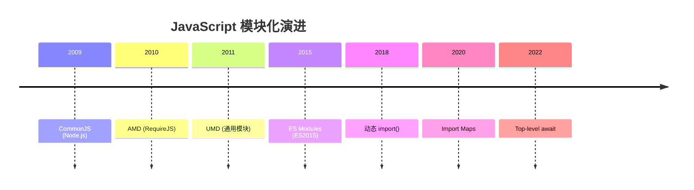
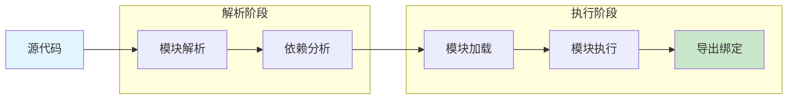
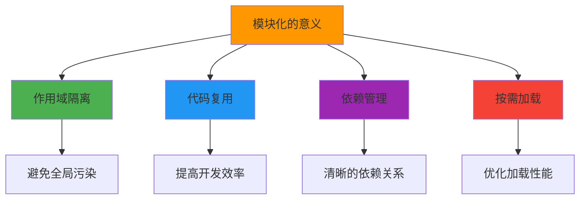
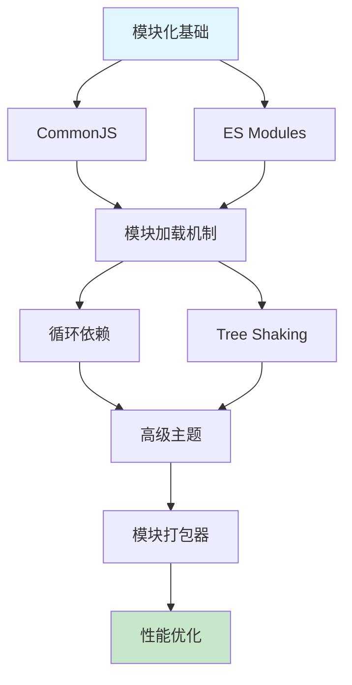

# JavaScript 模块化概述

模块化是现代 JavaScript 开发的基石，它解决了代码组织、依赖管理和作用域隔离等问题。

## 模块化发展历程



## 模块加载流程



## 模块化方案对比

| 特性 | CommonJS | AMD | UMD | ES Modules |
|------|----------|-----|-----|------------|
| 加载方式 | 同步 | 异步 | 两者 | 异步 |
| 运行环境 | Node.js | 浏览器 | 通用 | 两者 |
| 静态分析 | 否 | 否 | 否 | 是 |
| Tree Shaking | 不支持 | 不支持 | 不支持 | 支持 |
| 浏览器原生 | 否 | 否 | 否 | 是 |
| 循环依赖 | 支持 | 支持 | 支持 | 支持 |

## 核心模块系统

### 1. CommonJS

```javascript
// math.js
const PI = 3.14159;

function add(a, b) {
  return a + b;
}

module.exports = {
  PI,
  add
};

// main.js
const math = require('./math');
console.log(math.add(1, 2));
```

### 2. ES Modules

```javascript
// math.js
export const PI = 3.14159;

export function add(a, b) {
  return a + b;
}

// main.js
import { add, PI } from './math.js';
console.log(add(1, 2));
```

### 3. AMD (Asynchronous Module Definition)

```javascript
// 定义模块
define('math', [], function() {
  return {
    add: function(a, b) {
      return a + b;
    }
  };
});

// 使用模块
require(['math'], function(math) {
  console.log(math.add(1, 2));
});
```

### 4. UMD (Universal Module Definition)

```javascript
(function(root, factory) {
  if (typeof define === 'function' && define.amd) {
    // AMD
    define([], factory);
  } else if (typeof module === 'object' && module.exports) {
    // CommonJS
    module.exports = factory();
  } else {
    // 浏览器全局变量
    root.MyModule = factory();
  }
}(typeof self !== 'undefined' ? self : this, function() {
  return {
    add: function(a, b) {
      return a + b;
    }
  };
}));
```

## 模块化的意义



## 现代模块化实践

### 1. 项目结构

```
src/
├── components/
│   ├── Button/
│   │   ├── Button.tsx
│   │   ├── Button.test.tsx
│   │   ├── index.ts          # 重导出
│   │   └── styles.css
│   └── index.ts              # 组件统一导出
├── hooks/
│   ├── useAuth.ts
│   └── index.ts
├── utils/
│   ├── format.ts
│   └── index.ts
└── index.ts                  # 入口文件
```

### 2. Barrel Exports

```typescript
// components/index.ts
export { Button } from './Button';
export { Input } from './Input';
export { Modal } from './Modal';

// 使用
import { Button, Input, Modal } from '@/components';
```

### 3. 动态导入

```javascript
// 按需加载
const module = await import('./heavy-module.js');

// React 懒加载
const LazyComponent = React.lazy(() => import('./LazyComponent'));

// 路由懒加载
const routes = [
  {
    path: '/dashboard',
    component: React.lazy(() => import('./pages/Dashboard'))
  }
];
```

## 模块化最佳实践

:::tip 模块化原则
1. **单一职责**：每个模块只做一件事
2. **明确依赖**：清晰声明模块依赖关系
3. **最小导出**：只导出需要的接口
4. **避免循环依赖**：设计清晰的依赖层次
5. **使用 Barrel Exports**：简化导入路径
:::

## 面试要点

:::warning 高频面试题
1. CommonJS 和 ES Modules 有什么区别？
2. 什么是 Tree Shaking？为什么 ESM 支持而 CJS 不支持？
3. 如何处理模块循环依赖？
4. 动态导入的使用场景是什么？
5. 如何优化模块加载性能？
:::

## 学习路线



## 相关资源

- [MDN: JavaScript Modules](https://developer.mozilla.org/en-US/docs/Web/JavaScript/Guide/Modules)
- [Node.js: Modules](https://nodejs.org/api/modules.html)
- [ECMAScript Modules](https://tc39.es/ecma262/#sec-modules)
