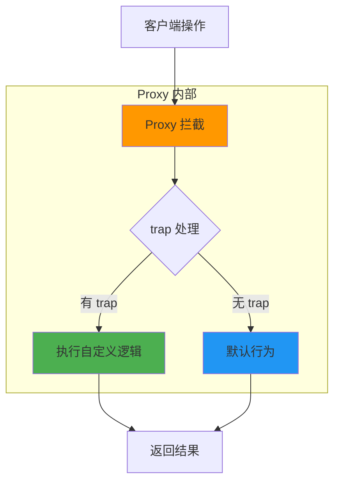
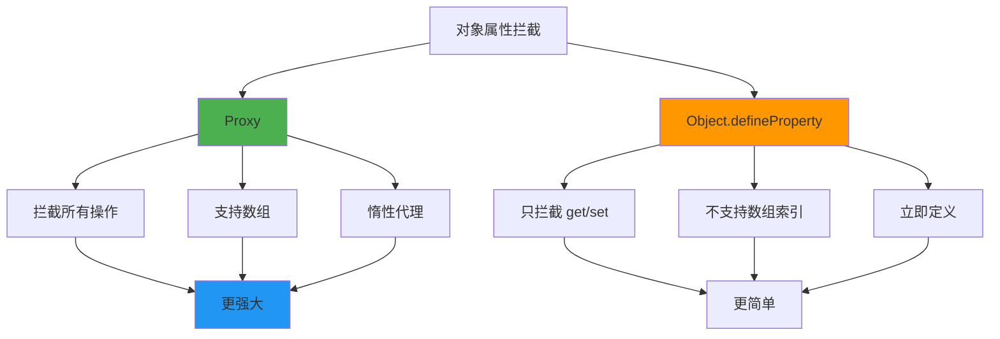
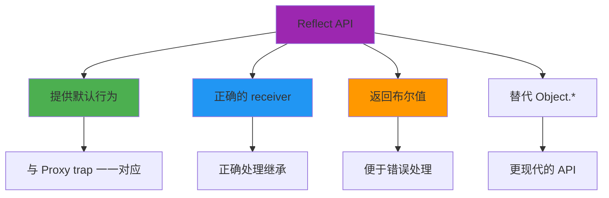
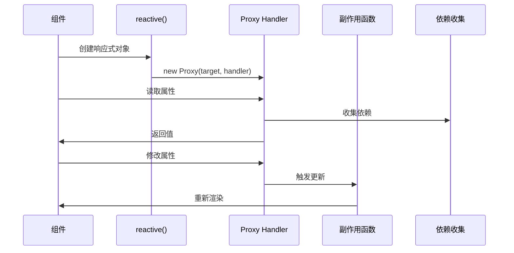

# Proxy 与 Reflect

Proxy 和 Reflect 是 ES6 引入的元编程 API，它们提供了拦截和自定义对象基本操作的能力。

## Proxy 拦截操作流程



## Proxy 基础

### 创建 Proxy

```javascript
const handler = {
  get(target, property, receiver) {
    console.log(`访问属性: ${property}`);
    return Reflect.get(target, property, receiver);
  },
  set(target, property, value, receiver) {
    console.log(`设置属性: ${property} = ${value}`);
    return Reflect.set(target, property, value, receiver);
  }
};

const original = { name: 'John', age: 30 };
const proxy = new Proxy(original, handler);

proxy.name;  // 输出: 访问属性: name
proxy.age = 31;  // 输出: 设置属性: age = 31
```

### Proxy vs Object.defineProperty



## Proxy 处理器方法

### 完整的处理器方法列表

```javascript
const handler = {
  // 属性操作
  get(target, property, receiver) {},
  set(target, property, value, receiver) {},
  has(target, property) {},
  deleteProperty(target, property) {},
  ownKeys(target) {},

  // 函数操作
  apply(target, thisArg, argumentsList) {},
  construct(target, argumentsList, newTarget) {},

  // 属性描述符
  getOwnPropertyDescriptor(target, property) {},
  defineProperty(target, property, descriptor) {},

  // 原型操作
  getPrototypeOf(target) {},
  setPrototypeOf(target, prototype) {},

  // 可扩展性
  isExtensible(target) {},
  preventExtensions(target) {}
};
```

### 常用拦截操作

```javascript
const handler = {
  // 1. 属性读取拦截
  get(target, property, receiver) {
    if (property === 'secret') {
      throw new Error('无权访问 secret 属性');
    }
    return Reflect.get(target, property, receiver);
  },

  // 2. 属性设置拦截
  set(target, property, value, receiver) {
    if (property === 'id') {
      throw new Error('id 属性不可修改');
    }
    return Reflect.set(target, property, value, receiver);
  },

  // 3. 属性存在性检查
  has(target, property) {
    if (property.startsWith('_')) {
      return false;  // 隐藏私有属性
    }
    return Reflect.has(target, property);
  },

  // 4. 删除属性
  deleteProperty(target, property) {
    if (property === 'required') {
      throw new Error('required 属性不可删除');
    }
    return Reflect.deleteProperty(target, property);
  },

  // 5. 获取所有属性
  ownKeys(target) {
    return Reflect.ownKeys(target).filter(
      key => !key.toString().startsWith('_')
    );
  }
};
```

## Reflect API

### Reflect 的作用



### Reflect 基本使用

```javascript
const obj = { name: 'John', age: 30 };

// 1. 属性读取
Reflect.get(obj, 'name');  // 'John'

// 2. 属性设置
Reflect.set(obj, 'age', 31);

// 3. 属性检查
Reflect.has(obj, 'name');  // true

// 4. 删除属性
Reflect.deleteProperty(obj, 'age');

// 5. 获取属性描述符
Reflect.getOwnPropertyDescriptor(obj, 'name');

// 6. 获取所有键
Reflect.ownKeys(obj);

// 7. 原型操作
Reflect.getPrototypeOf(obj);
Reflect.setPrototypeOf(obj, null);

// 8. 可扩展性
Reflect.isExtensible(obj);
Reflect.preventExtensions(obj);
```

### 为什么使用 Reflect？

```javascript
// ========== 不使用 Reflect 的问题 ==========
const handler = {
  get(target, property, receiver) {
    // 问题：硬编码了 target，不支持继承
    return target[property];
  }
};

class Parent {
  get name() {
    return this._name;
  }
}

class Child extends Parent {
  constructor() {
    super();
    this._name = 'Child';
  }
}

const child = new Proxy(new Child(), handler);
console.log(child.name);  // undefined (receiver 错误)

// ========== 使用 Reflect 的正确方式 ==========
const handler = {
  get(target, property, receiver) {
    // 正确：使用 receiver 作为 this
    return Reflect.get(target, property, receiver);
  }
};

const child = new Proxy(new Child(), handler);
console.log(child.name);  // 'Child' (正确)
```

## 响应式原理

### Vue 3 响应式实现



### 简化版响应式实现

```javascript
// ========== 依赖收集 ==========
let activeEffect = null;
const targetMap = new WeakMap();

function track(target, key) {
  if (!activeEffect) return;

  let depsMap = targetMap.get(target);
  if (!depsMap) {
    depsMap = new Map();
    targetMap.set(target, depsMap);
  }

  let deps = depsMap.get(key);
  if (!deps) {
    deps = new Set();
    depsMap.set(key, deps);
  }

  deps.add(activeEffect);
}

function trigger(target, key) {
  const depsMap = targetMap.get(target);
  if (!depsMap) return;

  const deps = depsMap.get(key);
  if (deps) {
    deps.forEach(effect => effect());
  }
}

// ========== reactive 实现 ==========
function reactive(target) {
  const handler = {
    get(target, key, receiver) {
      const result = Reflect.get(target, key, receiver);
      track(target, key);
      return result;
    },
    set(target, key, value, receiver) {
      const oldValue = target[key];
      const result = Reflect.set(target, key, value, receiver);
      if (oldValue !== value) {
        trigger(target, key);
      }
      return result;
    }
  };

  return new Proxy(target, handler);
}

// ========== effect 实现 ==========
function effect(fn) {
  activeEffect = fn;
  fn();
  activeEffect = null;
}

// ========== 使用示例 ==========
const state = reactive({ count: 0, message: 'Hello' });

effect(() => {
  console.log(`Count: ${state.count}`);
});

state.count++;  // 输出: Count: 1
```

### Vue 3 源码简化

```typescript
// Vue 3 reactive 源码简化
export function reactive(target: object) {
  if (target && (target as any).__v_raw) {
    return target;
  }

  return createReactiveObject(
    target,
    false,
    mutableHandlers,
    mutableCollectionHandlers
  );
}

function createReactiveObject(
  target: object,
  isReadonly: boolean,
  baseHandlers: ProxyHandler<any>,
  collectionHandlers: ProxyHandler<any>
) {
  const proxy = new Proxy(
    target,
    isCollection(target) ? collectionHandlers : baseHandlers
  );
  proxyMap.set(target, proxy);
  return proxy;
}

// baseHandlers
export const mutableHandlers: ProxyHandler<object> = {
  get,
  set,
  deleteProperty,
  has,
  ownKeys
};

function get(target: object, key: string | symbol, receiver: object) {
  const res = Reflect.get(target, key, receiver);
  track(target, TrackOpTypes.GET, key);
  return res;
}

function set(
  target: object,
  key: string | symbol,
  value: unknown,
  receiver: object
): boolean {
  const oldValue = (target as any)[key];
  const result = Reflect.set(target, key, value, receiver);
  if (hasChanged(value, oldValue)) {
    trigger(target, TriggerOpTypes.SET, key, value, oldValue);
  }
  return result;
}
```

## 实际应用场景

### 1. 数据验证

```javascript
function createValidator(schema) {
  return new Proxy({}, {
    set(target, property, value) {
      const validator = schema[property];
      if (validator && !validator(value)) {
        throw new Error(`${property} 验证失败`);
      }
      return Reflect.set(target, property, value);
    }
  });
}

const schema = {
  age: (value) => typeof value === 'number' && value >= 0 && value <= 150,
  email: (value) => /^[^\s@]+@[^\s@]+\.[^\s@]+$/.test(value)
};

const user = createValidator(schema);
user.age = 25;  // 正确
// user.age = -1;  // 抛出错误
```

### 2. 默认值处理

```javascript
function withDefaults(defaults) {
  return new Proxy(defaults, {
    get(target, property, receiver) {
      const value = Reflect.get(target, property, receiver);
      if (value === undefined) {
        return defaults[property];
      }
      return value;
    }
  });
}

const defaults = {
  theme: 'light',
  language: 'zh-CN',
  pageSize: 10
};

const config = withDefaults(defaults);
console.log(config.theme);  // 'light'
config.theme = 'dark';
console.log(config.theme);  // 'dark'
console.log(config.pageSize);  // 10 (使用默认值)
```

### 3. 负索引数组

```javascript
function createArray(...items) {
  return new Proxy(items, {
    get(target, property, receiver) {
      const index = Number(property);
      if (Number.isInteger(index) && index < 0) {
        return Reflect.get(target, target.length + index, receiver);
      }
      return Reflect.get(target, property, receiver);
    }
  });
}

const arr = createArray(1, 2, 3, 4, 5);
console.log(arr[-1]);  // 5
console.log(arr[-2]);  // 4
```

### 4. 访问日志

```javascript
function withLogger(target) {
  return new Proxy(target, {
    get(target, property, receiver) {
      const value = Reflect.get(target, property, receiver);
      if (typeof value === 'function') {
        return function (...args) {
          console.log(`调用方法: ${property}(${args.join(', ')})`);
          return Reflect.apply(value, this, args);
        };
      }
      console.log(`读取属性: ${property} = ${value}`);
      return value;
    },
    set(target, property, value, receiver) {
      console.log(`设置属性: ${property} = ${value}`);
      return Reflect.set(target, property, value, receiver);
    }
  });
}

const obj = withLogger({ name: 'John', greet() { return 'Hi!'; } });
obj.name;  // 输出: 读取属性: name = John
obj.greet();  // 输出: 调用方法: greet()
```

### 5. 私有属性

```javascript
function createPrivate(obj, privateKeys) {
  return new Proxy(obj, {
    get(target, property, receiver) {
      if (privateKeys.includes(property)) {
        throw new Error(`${property} 是私有属性`);
      }
      return Reflect.get(target, property, receiver);
    },
    set(target, property, value, receiver) {
      if (privateKeys.includes(property)) {
        throw new Error(`${property} 是私有属性`);
      }
      return Reflect.set(target, property, value, receiver);
    }
  });
}

const user = createPrivate(
  { name: 'John', _password: 'secret', _token: 'abc123' },
  ['_password', '_token']
);

console.log(user.name);  // 'John'
// console.log(user._password);  // 抛出错误
```

## 最佳实践

:::tip Proxy 与 Reflect 最佳实践
1. **始终使用 Reflect**：在 Proxy trap 中使用 Reflect 方法确保正确行为
2. **保持透明**：Proxy 应该尽可能透明，只在必要时拦截
3. **处理继承**：正确使用 receiver 参数处理原型链
4. **性能考虑**：Proxy 有性能开销，避免过度使用
5. **调试友好**：提供有意义的错误信息
:::

## 面试要点

:::warning 高频面试题
1. Proxy 和 Object.defineProperty 有什么区别？
2. 如何实现一个简单的响应式系统？
3. Vue 3 为什么选择 Proxy 而不是 Object.defineProperty？
4. Reflect API 的作用是什么？
5. 如何用 Proxy 实现数据验证？
:::

### 常见陷阱

```javascript
// 陷阱1: 忘记使用 Reflect
const handler = {
  get(target, property) {
    // 错误：硬编码 this
    return target[property];
  }
};

// 正确
const handler = {
  get(target, property, receiver) {
    return Reflect.get(target, property, receiver);
  }
};

// 陷阱2: 不可代理的对象
const frozen = Object.freeze({ name: 'John' });
const proxy = new Proxy(frozen, {
  set() {
    return false;  // 无法修改冻结对象
  }
});

// 陷阱3: Proxy 的 this 绑定
const target = {
  getThis() {
    return this;
  }
};

const proxy = new Proxy(target, {});
target.getThis() === target;  // true
proxy.getThis() === proxy;    // true (不是 target)
```

## 性能优化

```javascript
// ========== 缓存 Proxy ==========
const proxyCache = new WeakMap();

function createProxy(target) {
  if (proxyCache.has(target)) {
    return proxyCache.get(target);
  }

  const proxy = new Proxy(target, handler);
  proxyCache.set(target, proxy);
  return proxy;
}

// ========== 延迟代理 ==========
function lazyProxy(factory) {
  let proxy;
  return new Proxy({}, {
    get(target, property) {
      if (!proxy) {
        proxy = createProxy(factory());
      }
      return Reflect.get(proxy, property);
    },
    set(target, property, value) {
      if (!proxy) {
        proxy = createProxy(factory());
      }
      return Reflect.set(proxy, property, value);
    }
  });
}
```

## 总结

| 特性 | Proxy | Reflect |
|------|-------|---------|
| 定义 | 拦截对象操作 | 提供默认行为 |
| 返回值 | 任意 | 布尔值 |
| 参数 | receiver | receiver |
| 使用场景 | 拦截、验证、日志 | 安全的对象操作 |

Proxy 和 Reflect 是现代 JavaScript 元编程的基石，理解它们对于实现响应式系统、数据验证、访问控制等高级功能至关重要。
