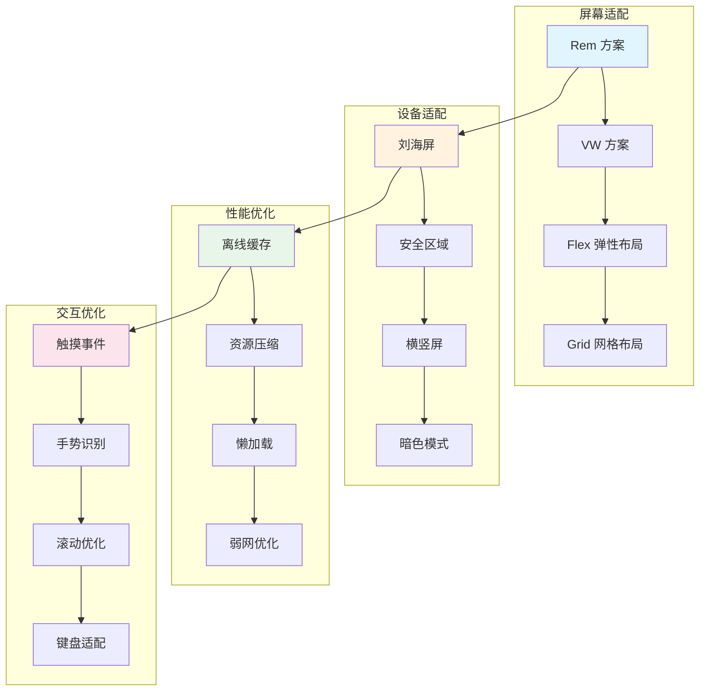
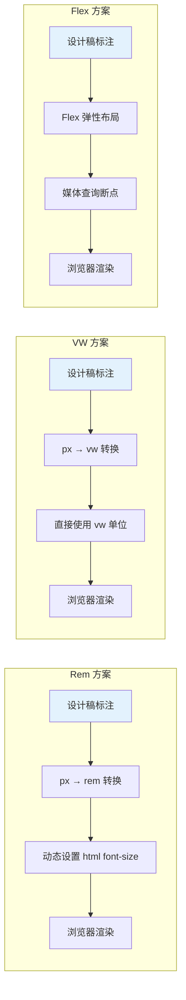

# 移动端适配概述

移动端适配是前端开发中的重要课题，涉及屏幕适配、交互优化、性能优化等多个维度。

## 移动端适配全景



## 核心挑战

| 挑战 | 描述 | 解决方案 |
|------|------|---------|
| **屏幕尺寸碎片化** | 从 320px 到 428px+ 多种宽度 | Rem/VW 适配方案 |
| **1px 物理像素问题** | Retina 屏 1px 看起来过粗 | 伪元素 + transform 缩放 |
| **安全区域** | 刘海、圆角、Home 指示器 | env(safe-area-inset-*) |
| **触摸延迟** | 300ms 点击延迟 | touch-action / FastClick |
| **软键盘遮挡** | 输入框被键盘覆盖 | viewport 调整 / 滚动计算 |
| **弱网环境** | 网络不稳定或无网络 | Service Worker / 离线缓存 |

## 主流适配方案对比



## 适配方案选型建议

| 方案 | 适用场景 | 优点 | 缺点 |
|------|---------|------|------|
| **Rem** | 需要精确还原设计稿 | 兼容性好，控制精确 | 需要 JS 配合 |
| **VW** | 简单的移动端页面 | 纯 CSS，无需 JS | 兼容性稍差 |
| **Flex + 媒体查询** | 响应式网站 | 灵活，适应性强 | 断点设计复杂 |
| **混合方案** | 复杂业务场景 | 取长补短 | 维护成本高 |

## 开发环境配置

```html
<!-- 必备的 viewport meta 标签 -->
<meta
  name="viewport"
  content="width=device-width, initial-scale=1.0, maximum-scale=1.0, user-scalable=no, viewport-fit=cover"
/>
```

```css
/* 安全区域适配 */
body {
  padding-top: env(safe-area-inset-top);
  padding-bottom: env(safe-area-inset-bottom);
  padding-left: env(safe-area-inset-left);
  padding-right: env(safe-area-inset-right);
}
```

## 相关文章

- [响应式布局与适配](./responsive-layout.md) - Rem/VW 方案、安全区域适配、1px 问题
- [移动端离线能力](./offline-capability.md) - 离线缓存策略、IndexedDB、弱网优化
