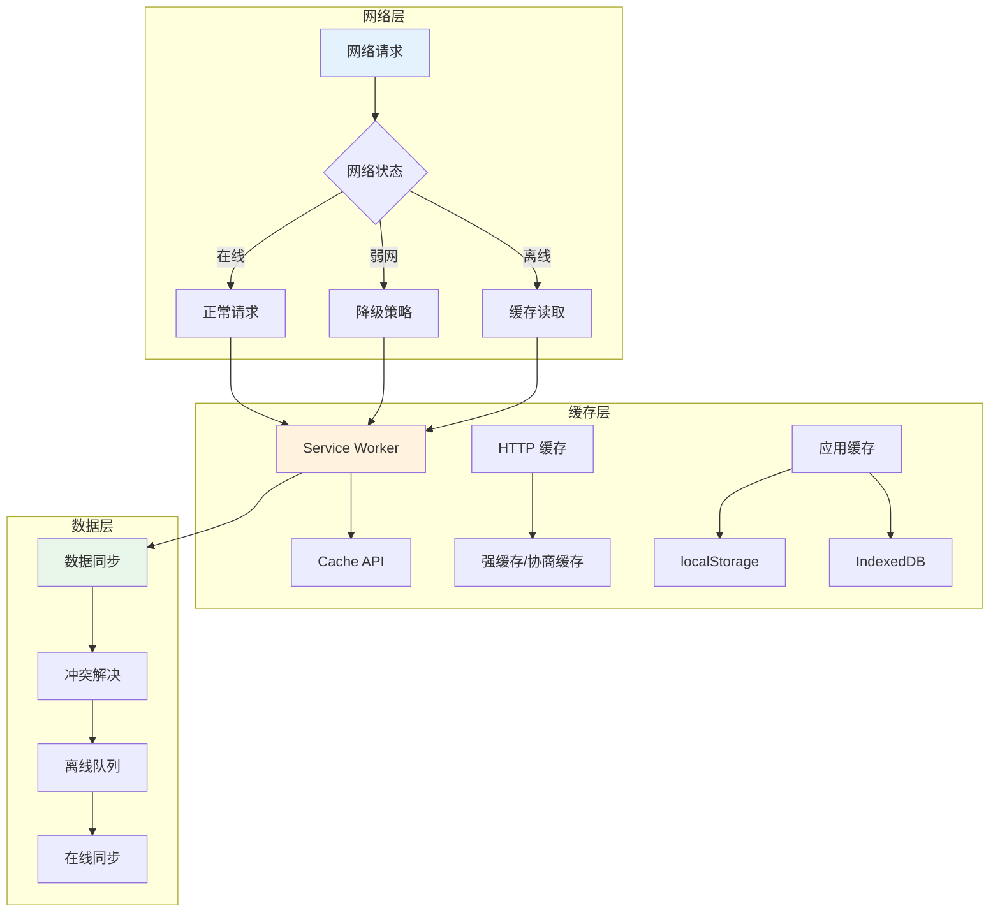
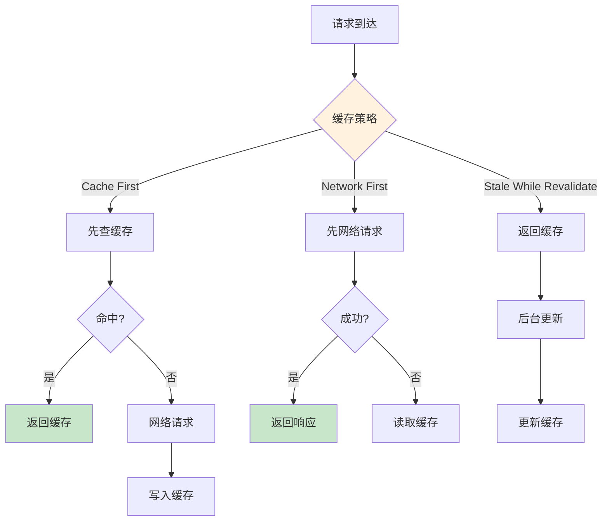
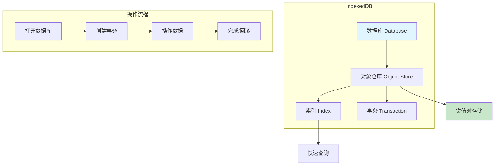
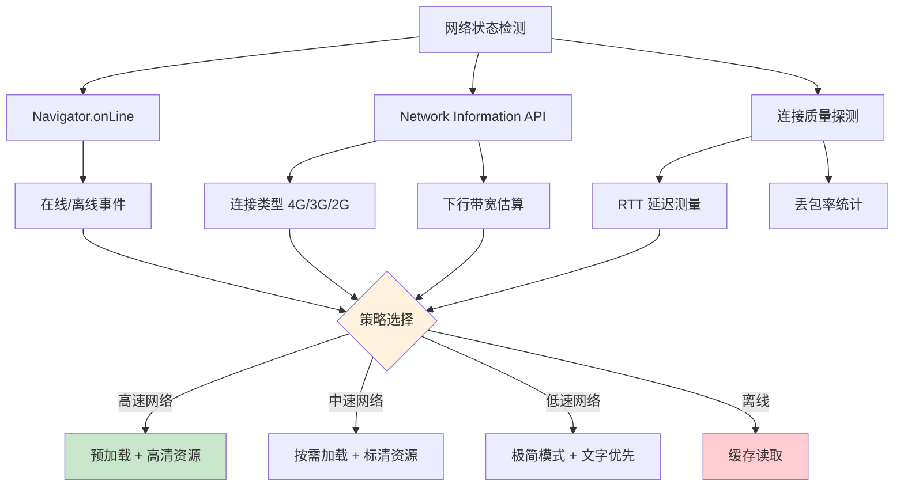
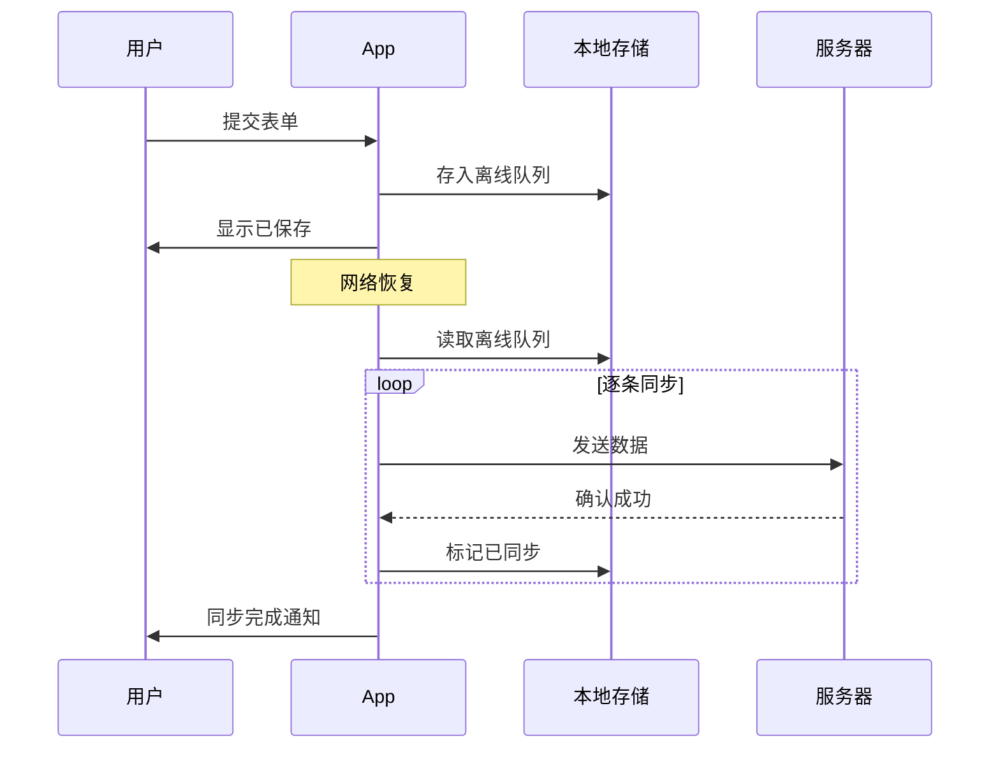
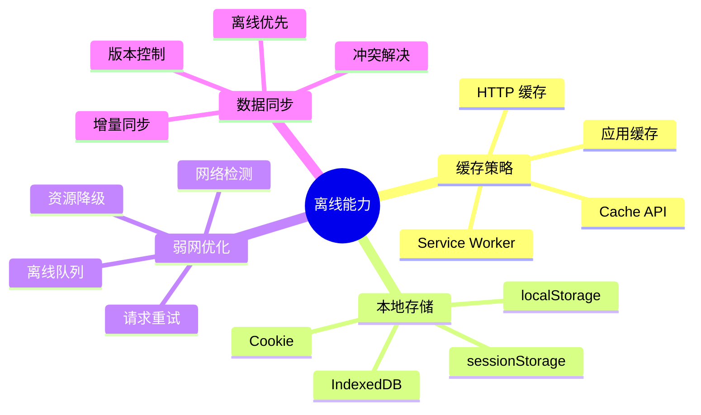

# 移动端离线能力

移动端网络环境复杂多变，具备离线能力是提升用户体验的关键。本文介绍离线缓存、本地存储与弱网优化方案。

## 离线能力架构



## Service Worker 缓存策略

### 常见缓存策略



### Service Worker 注册与缓存

```javascript
// sw.js - Service Worker 文件
const CACHE_NAME = 'app-cache-v1';
const STATIC_ASSETS = [
  '/',
  '/index.html',
  '/styles/main.css',
  '/scripts/app.js',
  '/images/logo.png',
];

// 安装阶段：预缓存静态资源
self.addEventListener('install', (event) => {
  event.waitUntil(
    caches.open(CACHE_NAME).then((cache) => {
      return cache.addAll(STATIC_ASSETS);
    })
  );
  // 立即激活，不等待旧 SW 退出
  self.skipWaiting();
});

// 激活阶段：清理旧缓存
self.addEventListener('activate', (event) => {
  event.waitUntil(
    caches.keys().then((cacheNames) => {
      return Promise.all(
        cacheNames
          .filter((name) => name !== CACHE_NAME)
          .map((name) => caches.delete(name))
      );
    })
  );
  // 立即控制所有客户端
  self.clients.claim();
});

// 请求拦截：Cache First 策略
self.addEventListener('fetch', (event) => {
  event.respondWith(
    caches.match(event.request).then((cached) => {
      if (cached) return cached;

      return fetch(event.request).then((response) => {
        // 缓存新的请求
        if (response.status === 200) {
          const clone = response.clone();
          caches.open(CACHE_NAME).then((cache) => {
            cache.put(event.request, clone);
          });
        }
        return response;
      });
    })
  );
});
```

### Workbox 简化缓存配置

```javascript
import { registerRoute } from 'workbox-routing';
import {
  CacheFirst,
  NetworkFirst,
  StaleWhileRevalidate,
} from 'workbox-strategies';
import { ExpirationPlugin } from 'workbox-expiration';

// 静态资源：Cache First
registerRoute(
  ({ request }) =>
    request.destination === 'style' ||
    request.destination === 'script' ||
    request.destination === 'image',
  new CacheFirst({
    cacheName: 'static-assets',
    plugins: [
      new ExpirationPlugin({
        maxEntries: 100,
        maxAgeSeconds: 30 * 24 * 60 * 60, // 30 天
      }),
    ],
  })
);

// API 请求：Network First
registerRoute(
  ({ url }) => url.pathname.startsWith('/api/'),
  new NetworkFirst({
    cacheName: 'api-cache',
    networkTimeoutSeconds: 3,
    plugins: [
      new ExpirationPlugin({
        maxEntries: 50,
        maxAgeSeconds: 5 * 60, // 5 分钟
      }),
    ],
  })
);

// HTML 页面：Stale While Revalidate
registerRoute(
  ({ request }) => request.destination === 'document',
  new StaleWhileRevalidate({
    cacheName: 'pages',
  })
);
```

## IndexedDB 本地数据库

### IndexedDB 架构



### IndexedDB 封装

```javascript
// 简单的 IndexedDB 封装
class DB {
  constructor(dbName, version = 1) {
    this.dbName = dbName;
    this.version = version;
    this.db = null;
  }

  async open(stores = []) {
    return new Promise((resolve, reject) => {
      const request = indexedDB.open(this.dbName, this.version);

      request.onupgradeneeded = (event) => {
        const db = event.target.result;
        stores.forEach(({ name, keyPath, indexes }) => {
          if (!db.objectStoreNames.contains(name)) {
            const store = db.createObjectStore(name, { keyPath });
            indexes?.forEach((idx) => {
              store.createIndex(idx, idx, { unique: false });
            });
          }
        });
      };

      request.onsuccess = (event) => {
        this.db = event.target.result;
        resolve(this.db);
      };

      request.onerror = () => reject(request.error);
    });
  }

  async add(storeName, data) {
    const tx = this.db.transaction(storeName, 'readwrite');
    const store = tx.objectStore(storeName);
    return new Promise((resolve, reject) => {
      const request = store.add(data);
      request.onsuccess = () => resolve(request.result);
      request.onerror = () => reject(request.error);
    });
  }

  async get(storeName, key) {
    const tx = this.db.transaction(storeName, 'readonly');
    const store = tx.objectStore(storeName);
    return new Promise((resolve, reject) => {
      const request = store.get(key);
      request.onsuccess = () => resolve(request.result);
      request.onerror = () => reject(request.error);
    });
  }

  async getAll(storeName) {
    const tx = this.db.transaction(storeName, 'readonly');
    const store = tx.objectStore(storeName);
    return new Promise((resolve, reject) => {
      const request = store.getAll();
      request.onsuccess = () => resolve(request.result);
      request.onerror = () => reject(request.error);
    });
  }
}

// 使用示例
const db = new DB('MyAppDB', 1);
await db.open([
  {
    name: 'posts',
    keyPath: 'id',
    indexes: ['title', 'createdAt'],
  },
]);

await db.add('posts', { id: 1, title: '文章标题', content: '...' });
const post = await db.get('posts', 1);
```

## Cache API

```javascript
// Cache API 基本用法
async function cacheWithFallback(request, fallbackUrl) {
  const cache = await caches.open('dynamic-v1');

  // 尝试从网络获取
  try {
    const response = await fetch(request);
    // 成功则更新缓存
    cache.put(request, response.clone());
    return response;
  } catch (error) {
    // 网络失败，从缓存获取
    const cached = await cache.match(request);
    if (cached) return cached;

    // 缓存也没有，返回降级内容
    return cache.match(fallbackUrl);
  }
}
```

## 弱网优化

### 网络状态检测



### 弱网适配代码

```javascript
// 网络状态监听
class NetworkMonitor {
  constructor() {
    this.listeners = new Set();
    this.init();
  }

  init() {
    // 监听在线/离线
    window.addEventListener('online', () => this.emit('online'));
    window.addEventListener('offline', () => this.emit('offline'));

    // 监听网络类型变化
    if (navigator.connection) {
      navigator.connection.addEventListener('change', () => {
        this.emit('change', this.getNetworkInfo());
      });
    }
  }

  getNetworkInfo() {
    const conn = navigator.connection;
    if (!conn) return { type: 'unknown', effectiveType: '4g' };

    return {
      type: conn.type,             // wifi, cellular, none
      effectiveType: conn.effectiveType, // 4g, 3g, 2g, slow-2g
      downlink: conn.downlink,     // 下行带宽 Mbps
      rtt: conn.rtt,               // 往返延迟 ms
      saveData: conn.saveData,     // 省流模式
    };
  }

  isSlowNetwork() {
    const info = this.getNetworkInfo();
    return (
      info.effectiveType === '2g' ||
      info.effectiveType === 'slow-2g' ||
      info.downlink < 1.5 ||
      info.rtt > 300
    );
  }

  on(event, callback) {
    this.listeners.add({ event, callback });
  }

  emit(event, data) {
    this.listeners.forEach((l) => {
      if (l.event === event) l.callback(data);
    });
  }
}

// 使用
const monitor = new NetworkMonitor();

// 根据网络状态调整策略
function loadResource(url) {
  if (monitor.isSlowNetwork()) {
    // 低速网络：加载压缩版本
    return fetch(url + '?quality=low');
  }
  // 正常网络：加载原始版本
  return fetch(url);
}
```

### 请求重试与超时

```javascript
// 带重试的请求函数
async function fetchWithRetry(url, options = {}) {
  const { maxRetries = 3, timeout = 5000 } = options;

  for (let i = 0; i < maxRetries; i++) {
    try {
      const controller = new AbortController();
      const timer = setTimeout(() => controller.abort(), timeout);

      const response = await fetch(url, {
        ...options,
        signal: controller.signal,
      });

      clearTimeout(timer);
      return response;
    } catch (error) {
      if (i === maxRetries - 1) throw error;

      // 指数退避
      const delay = Math.pow(2, i) * 1000;
      await new Promise((r) => setTimeout(r, delay));
    }
  }
}
```

## 离线数据同步



## 面试要点

1. **Service Worker 缓存策略有哪些？** Cache First、Network First、Stale While Revalidate，根据资源类型选择
2. **IndexedDB 和 localStorage 的区别？** IndexedDB 支持大量数据、索引查询、事务操作；localStorage 仅支持 5MB 字符串
3. **弱网如何优化？** 检测网络状态、降低资源质量、请求重试、离线队列
4. **如何实现离线数据同步？** 本地存储待同步数据，网络恢复后按队列顺序同步，处理冲突

## 总结


