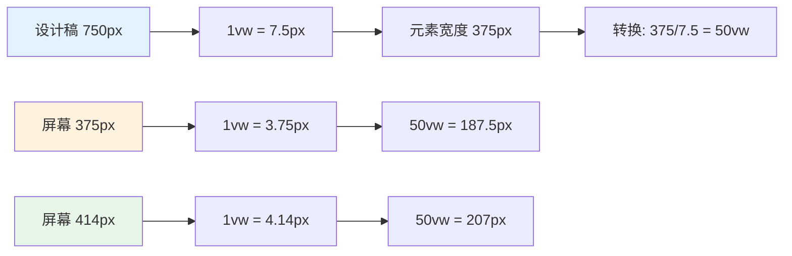
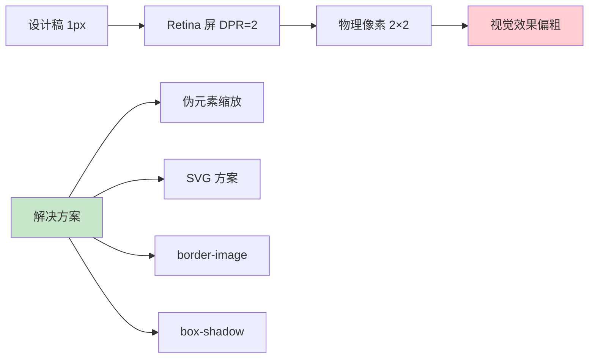
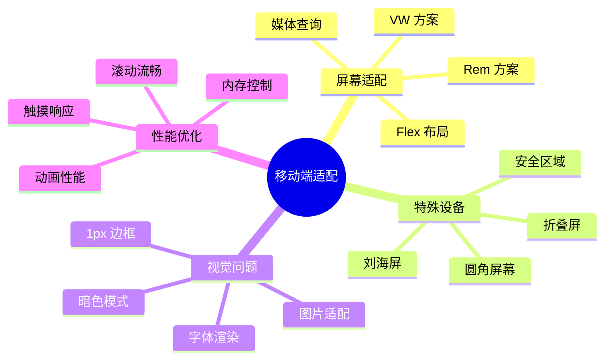

# 响应式布局与适配

移动端屏幕尺寸碎片化严重，需要一套完善的适配方案来保证 UI 在不同设备上的一致性。

## Rem 适配方案

### Rem 适配原理

```mermaid
flowchart TD
    A[设计稿宽度 750px] --> B[设置基准值]
    B --> C[html font-size = 屏幕宽度 / 基准值 × 100]
    C --> D[开发时标注 px]
    D --> E[工具转换 px → rem]
    E --> F[浏览器根据 font-size 计算实际像素]

    subgraph 计算公式
        G[rem = px / (设计稿宽度 / 10)]
        H[例: 100px / 75 = 1.3333rem]
    end

    style A fill:#e3f2fd
    style F fill:#c8e6c9
```

### Rem 方案实现

```javascript
// rem 适配核心代码
(function (designWidth = 750) {
  function setRem() {
    const html = document.documentElement;
    const width = html.clientWidth;
    // 核心公式：屏幕宽度 / 设计稿宽度 * 基准值
    const fontSize = (width / designWidth) * 100;
    html.style.fontSize = fontSize + 'px';
  }

  // 初始化
  setRem();
  // 窗口变化时重新计算
  window.addEventListener('resize', setRem);
  // 页面显示时（从后台切回）重新计算
  window.addEventListener('pageshow', (e) => {
    if (e.persisted) setRem();
  });
})(750);
```

```css
/* 使用 postcss-pxtorem 自动转换 */
/* postcss.config.js 配置 */
module.exports = {
  plugins: {
    'postcss-pxtorem': {
      rootValue: 75,       // 设计稿宽度 / 10
      propList: ['*'],      // 所有属性都转换
      selectorBlackList: ['.norem'], // 排除特定选择器
      replace: true,
      mediaQuery: false,
      minPixelValue: 2,    // 小于 2px 不转换
    },
  },
};
```

## VW 适配方案

### VW 适配原理



### VW 方案实现

```css
/* postcss-px-to-viewport 配置 */
/* postcss.config.js */
module.exports = {
  plugins: {
    'postcss-px-to-viewport': {
      viewportWidth: 750,      // 设计稿宽度
      unitPrecision: 5,        // 转换精度
      viewportUnit: 'vw',      // 转换单位
      selectorBlackList: [],   // 忽略选择器
      minPixelValue: 1,        // 最小转换值
      mediaQuery: false,       // 是否转换媒体查询
      // 特殊处理：1px border 不转换
      exclude: [/node_modules/],
    },
  },
};
```

```css
/* 混合使用 vw 和 rem */
.container {
  width: 90vw;
  max-width: 1200px;
  margin: 0 auto;
  padding: 0 4vw;
}

/* 1px 问题：不转换的情况 */
.border-1px {
  /* 通过选择器黑名单排除 */
  border: 1px solid #e5e5e5;
}

/* 或使用 CSS 变量 */
:root {
  --border-1px: 1px;
}
.border {
  border: var(--border-1px) solid #e5e5e5;
}
```

## 安全区域适配

### 刘海屏处理

```mermaid
graph TD
    subgraph iPhone 14 Pro
        A[状态栏区域]
        B[灵动岛]
        C[安全区域]
        D[Home 指示器]
    end

    A --> E[env&#40;safe-area-inset-top&#41;]
    D --> F[env&#40;safe-area-inset-bottom&#41;]

    style A fill:#ffcdd2
    style B fill:#ffcdd2
    style C fill:#c8e6c9
    style D fill:#ffcdd2
```



```css
/* 安全区域适配最佳实践 */
.page {
  /* 使用 padding 而非 margin */
  padding-top: env(safe-area-inset-top);
  padding-bottom: env(safe-area-inset-bottom);
  padding-left: env(safe-area-inset-left);
  padding-right: env(safe-area-inset-right);
}

/* 底部固定按钮 */
.fixed-bottom {
  position: fixed;
  bottom: 0;
  left: 0;
  right: 0;
  /* 增加安全区域距离 */
  padding-bottom: calc(16px + env(safe-area-inset-bottom));
  /* 同时设置背景色延伸到安全区域外 */
  background-clip: padding-box;
}

/* 全屏页面 */
.fullscreen-page {
  /* 必须设置 viewport-fit=cover */
  min-height: 100vh;
  min-height: 100dvh; /* 动态视口高度 */
  padding: env(safe-area-inset-top) env(safe-area-inset-right)
           env(safe-area-inset-bottom) env(safe-area-inset-left);
}
```

## 1px 问题解决方案

### 问题原因



### 伪元素缩放方案

```css
/* 最通用的 1px 方案 */
.border-1px {
  position: relative;
}

.border-1px::after {
  content: '';
  position: absolute;
  top: 0;
  left: 0;
  right: 0;
  bottom: 0;
  border: 1px solid #e5e5e5;
  border-radius: inherit;
  /* 根据 DPR 缩放 */
  transform: scale(0.5);
  transform-origin: 0 0;
  pointer-events: none;
}

/* DPR 为 3 的设备 */
@media (-webkit-min-device-pixel-ratio: 3) {
  .border-1px::after {
    transform: scale(0.33333);
  }
}

/* 四边分别控制 */
.border-top-1px::before {
  content: '';
  position: absolute;
  top: 0;
  left: 0;
  right: 0;
  height: 1px;
  background: #e5e5e5;
  transform: scaleY(0.5);
  transform-origin: 0 0;
}

.border-bottom-1px::after {
  content: '';
  position: absolute;
  bottom: 0;
  left: 0;
  right: 0;
  height: 1px;
  background: #e5e5e5;
  transform: scaleY(0.5);
  transform-origin: 100% 100%;
}
```

### SVG 方案

```css
/* 使用 SVG 绘制 1px 边框 */
.border-svg {
  border: none;
  background-image: url("data:image/svg+xml,...");
  background-size: 100% 1px, 100% 1px, 1px 100%, 1px 100%;
  background-position: 0 0, 0 100%, 0 0, 100% 0;
  background-repeat: no-repeat;
}
```

## 横竖屏适配

```css
/* 横屏样式 */
@media screen and (orientation: landscape) {
  .header {
    height: 44px;
  }
  .content {
    flex-direction: row;
  }
}

/* 竖屏样式 */
@media screen and (orientation: portrait) {
  .header {
    height: 64px;
  }
  .content {
    flex-direction: column;
  }
}

/* 查询特定屏幕比例 */
@media screen and (min-aspect-ratio: 16/9) {
  /* 宽屏设备 */
}
```

## 面试要点

1. **Rem 和 VW 的区别？** Rem 需要 JS 动态计算 font-size，VW 是纯 CSS 方案；VW 兼容性稍差但更简洁
2. **1px 问题的本质？** Retina 屏 DPR > 1，CSS 1px 对应多个物理像素，视觉效果偏粗
3. **安全区域是什么？** iPhone 刘海、圆角、Home 指示器等不可遮挡的区域
4. **如何选择适配方案？** 简单页面用 VW，复杂业务用 Rem + postcss 插件，响应式网站用 Flex + 媒体查询

## 总结


