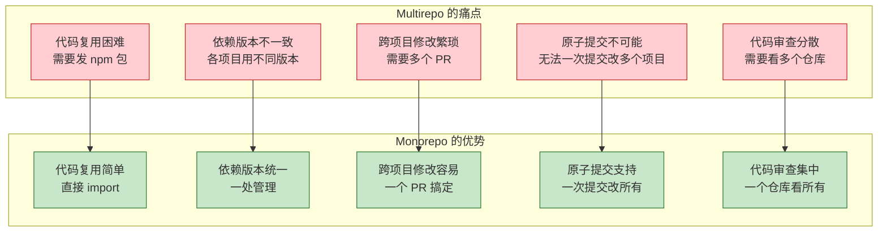
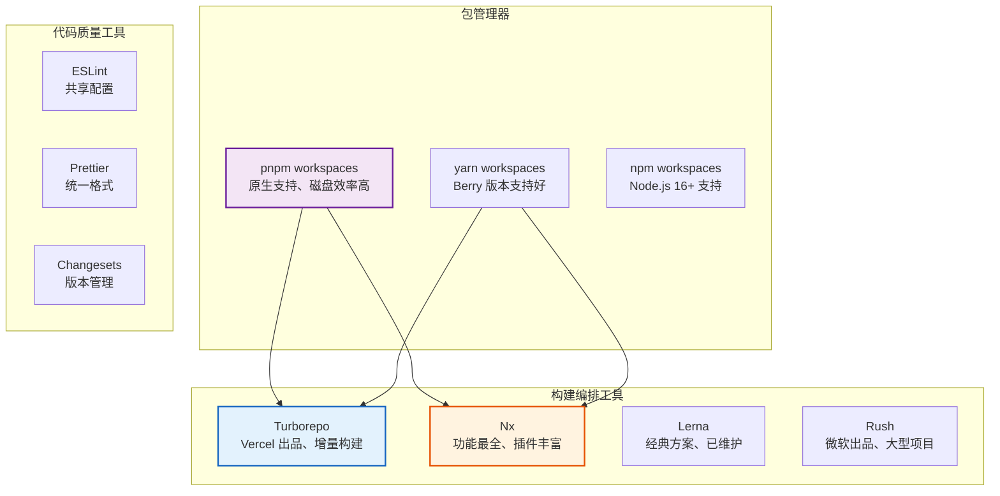
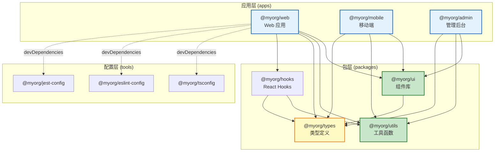
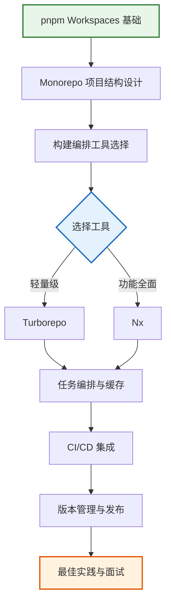

# Monorepo 进阶

> **"Monorepo 不是简单的'把代码放在一起'，而是一套完整的工程管理体系"** —— 当项目规模增长、团队扩张时，Monorepo 是解决代码复用、依赖管理、构建效率的核心方案。

## 什么是 Monorepo？

```
Monorepo vs Multirepo
═══════════════════════════════════════════════════════

Multirepo（多仓库）：
  project-a/     ← 独立 Git 仓库
  project-b/     ← 独立 Git 仓库
  project-c/     ← 独立 Git 仓库
  shared-lib/    ← 独立 Git 仓库

Monorepo（单仓库）：
  my-monorepo/   ← 一个 Git 仓库
  ├── packages/
  │   ├── app-web/        ← Web 应用
  │   ├── app-mobile/     ← 移动端应用
  │   ├── shared-ui/      ← UI 组件库
  │   ├── shared-utils/   ← 工具函数
  │   └── shared-types/   ← TypeScript 类型
  └── tools/
      └── eslint-config/  ← 共享配置

核心区别：
  Multirepo = 每个项目独立仓库、独立版本、独立 CI/CD
  Monorepo  = 所有项目在一个仓库、统一版本、共享 CI/CD
```

## 为什么需要 Monorepo？



## Monorepo 生态全景



## pnpm Workspaces 基础

### 项目结构

```yaml
# pnpm-workspace.yaml
packages:
  - "packages/*"
  - "apps/*"
  - "tools/*"
```

```
my-monorepo/
├── apps/
│   ├── web/                  # Web 应用
│   │   ├── package.json
│   │   └── src/
│   ├── mobile/               # 移动端应用
│   │   ├── package.json
│   │   └── src/
│   └── admin/                # 管理后台
│       ├── package.json
│       └── src/
├── packages/
│   ├── ui/                   # UI 组件库
│   │   ├── package.json
│   │   └── src/
│   ├── utils/                # 工具函数
│   │   ├── package.json
│   │   └── src/
│   ├── types/                # TypeScript 类型
│   │   ├── package.json
│   │   └── src/
│   └── config/               # 共享配置
│       ├── eslint/
│       ├── tsconfig/
│       └── jest/
├── package.json
├── pnpm-workspace.yaml
└── pnpm-lock.yaml
```

### package.json 配置

```json
// 根目录 package.json
{
  "name": "my-monorepo",
  "private": true,
  "scripts": {
    "dev": "turbo dev",
    "build": "turbo build",
    "test": "turbo test",
    "lint": "turbo lint",
    "format": "prettier --write \"**/*.{ts,tsx,md}\""
  },
  "devDependencies": {
    "turbo": "^2.0.0",
    "prettier": "^3.0.0"
  },
  "packageManager": "pnpm@9.0.0"
}
```

```json
// apps/web/package.json
{
  "name": "@myorg/web",
  "version": "0.0.0",
  "private": true,
  "dependencies": {
    "@myorg/ui": "workspace:*",
    "@myorg/utils": "workspace:*",
    "@myorg/types": "workspace:*",
    "react": "^18.2.0",
    "react-dom": "^18.2.0"
  },
  "devDependencies": {
    "@myorg/tsconfig": "workspace:*",
    "@myorg/eslint-config": "workspace:*"
  }
}
```

```json
// packages/ui/package.json
{
  "name": "@myorg/ui",
  "version": "1.0.0",
  "main": "./src/index.ts",
  "types": "./src/index.ts",
  "exports": {
    ".": "./src/index.ts",
    "./button": "./src/button/index.ts",
    "./modal": "./src/modal/index.ts"
  },
  "peerDependencies": {
    "react": "^18.0.0",
    "react-dom": "^18.0.0"
  }
}
```

## Monorepo 依赖关系图



## 工具选型指南

### Turborepo vs Nx 对比

```
Turborepo vs Nx 详细对比
═══════════════════════════════════════════════════════

特性              Turborepo              Nx
─────────────────────────────────────────────────────────
出品方            Vercel                 Nrwl
定位              轻量级构建编排          全功能 Monorepo 平台
配置复杂度        低（turbo.json）       中（nx.json + 插件）
学习曲线          平缓                   较陡
增量构建          ✅ 内置                 ✅ 内置
远程缓存          ✅ Vercel Remote Cache  ✅ Nx Cloud
依赖图分析        ✅ 自动                 ✅ 自动 + 可视化
受影响分析        ✅ --filter             ✅ affected 命令
插件系统          ❌ 无                   ✅ 丰富的插件
代码生成器        ❌ 无                   ✅ 内置
任务编排          ✅ 简单直观              ✅ 灵活强大
CI 集成           ✅ 简单                 ✅ 丰富
社区生态          中等                   活跃
适用规模          中小型项目              中大型项目
─────────────────────────────────────────────────────────

选择建议：
  • 小团队、简单项目 → Turborepo（开箱即用）
  • 大团队、复杂项目 → Nx（功能全面）
  • 已用 pnpm workspaces → Turborepo（集成好）
  • 需要代码生成、迁移 → Nx（插件丰富）
```

## 学习路线图



## 本章内容导航

| 文档 | 内容 |
|------|------|
| [Turborepo 详解](./turborepo.md) | 任务编排、远程缓存、增量构建、与 Lerna/pnpm workspaces 对比 |
| [Nx 详解](./nx.md) | 依赖图分析、受影响分析、插件系统、Monorepo 策略 |

## 面试要点速览

```
Monorepo 高频面试题
═══════════════════════════════════════════════════════

1. Monorepo 和 Multirepo 的区别？各自的优缺点？
2. pnpm workspaces 的工作原理是什么？
3. Turborepo 和 Nx 的区别？如何选择？
4. Monorepo 中如何处理依赖版本不一致的问题？
5. 如何实现 Monorepo 的增量构建和缓存？
6. Monorepo 中如何管理不同项目的发布版本？
7. 如何在 CI/CD 中优化 Monorepo 的构建效率？
8. 大型 Monorepo 的最佳实践有哪些？
```
