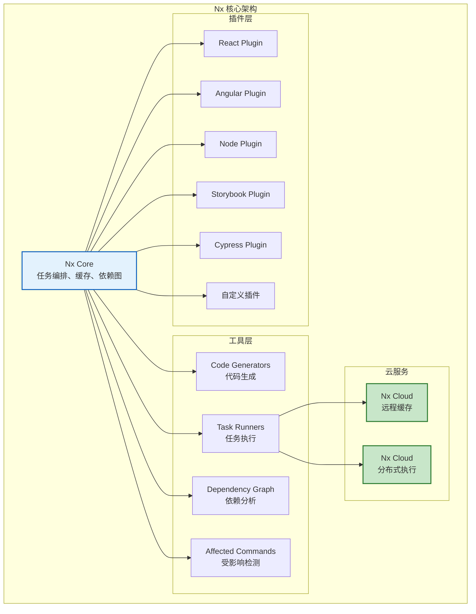
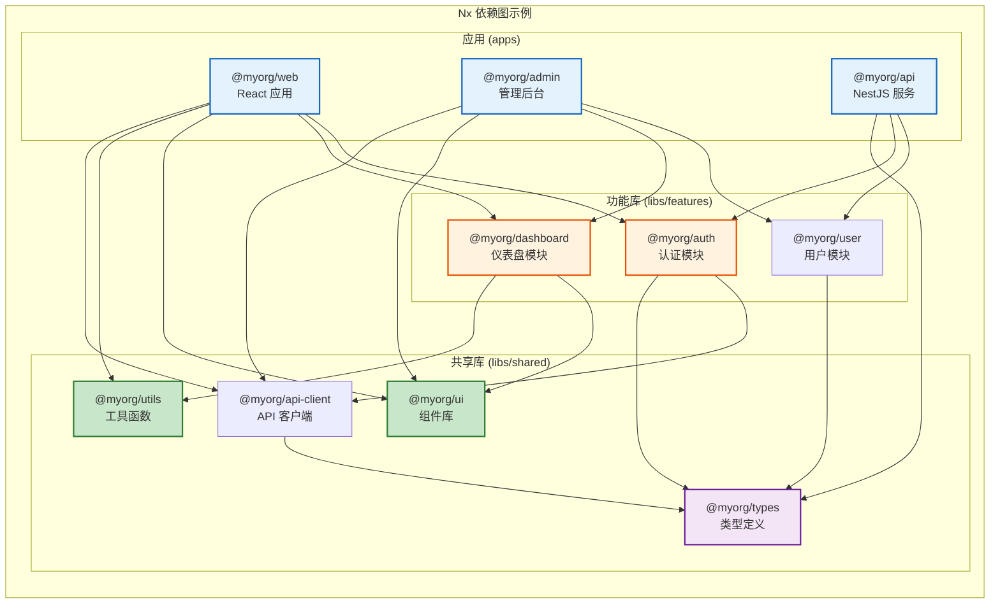
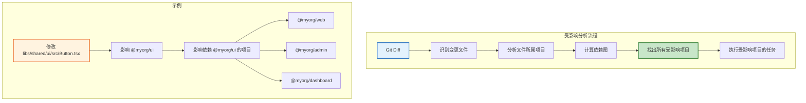
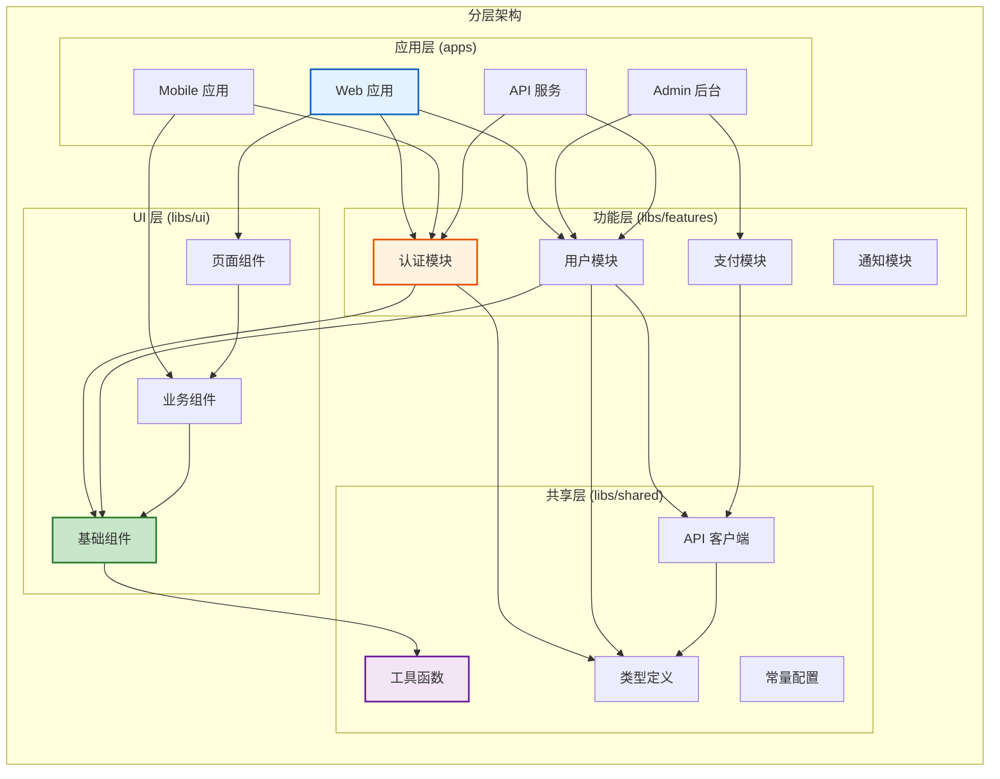

# Nx 详解

> **"Nx 是功能最全面的 Monorepo 开发平台，专注于提升大型项目的开发效率"** —— 它不仅解决构建编排问题，还提供代码生成、依赖分析、受影响检测等完整的工程化能力。

## Nx 核心特性

```
Nx 的核心能力
═══════════════════════════════════════════════════════

1. 依赖图分析
   • 自动分析项目间的依赖关系
   • 可视化依赖图
   • 检测循环依赖

2. 受影响分析
   • 只构建/测试受变更影响的项目
   • 配合 Git diff 实现精准 CI
   • 大幅减少构建时间

3. 任务编排
   • 基于依赖关系自动编排任务
   • 支持并行执行
   • 增量构建 + 缓存

4. 代码生成器
   • 自动生成项目、组件、服务
   • 统一项目结构
   • 减少重复工作

5. 插件系统
   • 丰富的官方插件（React、Angular、Node 等）
   • 社区插件生态
   • 自定义插件扩展

6. 远程缓存
   • Nx Cloud 提供远程缓存
   • 团队和 CI 共享构建结果
   • 分布式任务执行（Nx Agents）
```

## Nx 架构设计



## 快速开始

### 创建 Nx 项目

```bash
# 创建新项目
npx create-nx-workspace@latest my-nx-monorepo

# 选择预设
# ? What to create in the new workspace: apps
# ? Application name: web
# ? Which bundler?: vite
# ? Default stylesheet format: css
# ? Enable distributed caching to make your CI faster: Yes
```

### 项目结构

```
my-nx-monorepo/
├── apps/
│   ├── web/                  # Web 应用
│   │   ├── src/
│   │   ├── project.json      # 项目配置
│   │   └── tsconfig.json
│   ├── api/                  # API 服务
│   │   ├── src/
│   │   ├── project.json
│   │   └── tsconfig.json
│   └── web-e2e/              # E2E 测试
│       ├── src/
│       └── project.json
├── libs/
│   ├── shared/
│   │   ├── ui/               # UI 组件库
│   │   ├── utils/            # 工具函数
│   │   └── types/            # 类型定义
│   └── features/
│       ├── auth/             # 认证模块
│       └── dashboard/        # 仪表盘模块
├── tools/
│   └── generators/           # 自定义生成器
├── nx.json                   # Nx 全局配置
├── package.json
└── tsconfig.base.json
```

### nx.json 配置

```json
{
  "$schema": "./node_modules/nx/schemas/nx-schema.json",
  "namedInputs": {
    "default": ["{projectRoot}/**/*", "sharedGlobals"],
    "sharedGlobals": [],
    "production": [
      "default",
      "!{projectRoot}/**/?(*.)+(spec|test).[jt]s?(x)?(.snap)",
      "!{projectRoot}/tsconfig.spec.json",
      "!{projectRoot}/jest.config.[jt]s",
      "!{projectRoot}/.eslintrc.json"
    ]
  },
  "targetDefaults": {
    "build": {
      "dependsOn": ["^build"],
      "inputs": ["production", "^production"],
      "cache": true
    },
    "test": {
      "inputs": ["default", "^production"],
      "cache": true
    },
    "lint": {
      "inputs": ["default", "{workspaceRoot}/.eslintrc.json"],
      "cache": true
    },
    "e2e": {
      "dependsOn": ["build"],
      "cache": true
    }
  },
  "defaultProject": "web"
}
```

## 依赖图分析

### 依赖图可视化



### 查看依赖图

```bash
# 打开依赖图可视化界面
npx nx graph

# 查看特定项目的依赖
npx nx graph --focus=@myorg/web

# 查看受影响的项目
npx nx affected --graph

# 导出依赖图为 JSON
npx nx graph --file=output.json
```

### project.json 依赖配置

```json
// apps/web/project.json
{
  "name": "web",
  "sourceRoot": "apps/web/src",
  "projectType": "application",
  "targets": {
    "build": {
      "executor": "@nx/vite:build",
      "outputs": ["{options.outputPath}"],
      "options": {
        "outputPath": "dist/apps/web",
        "main": "apps/web/src/main.tsx",
        "tsConfig": "apps/web/tsconfig.app.json"
      }
    },
    "serve": {
      "executor": "@nx/vite:dev-server",
      "options": {
        "buildTarget": "web:build"
      }
    },
    "test": {
      "executor": "@nx/vite:test",
      "outputs": ["{workspaceRoot}/coverage/apps/web"],
      "options": {
        "passWithNoTests": true
      }
    },
    "lint": {
      "executor": "@nx/eslint:lint",
      "outputs": ["{options.outputFile}"],
      "options": {
        "lintFilePatterns": ["apps/web/**/*.{ts,tsx}"]
      }
    }
  },
  "tags": ["scope:web", "type:app"]
}
```

## 受影响分析

### affected 命令原理



### affected 命令使用

```bash
# 构建所有受影响的项目
npx nx affected --target=build

# 测试所有受影响的项目
npx nx affected --target=test

# lint 所有受影响的项目
npx nx affected --target=lint

# 查看受影响的项目列表
npx nx affected --target=build --dry-run

# 与 main 分支对比
npx nx affected --target=build --base=main --head=HEAD

# 与上一次提交对比
npx nx affected --target=build --base=HEAD~1

# 只运行受影响的项目（不包含依赖）
npx nx affected --target=build --exclude=*:build
```

### CI/CD 集成

```yaml
# .github/workflows/ci.yml
name: CI

on:
  push:
    branches: [main]
  pull_request:
    branches: [main]

jobs:
  main:
    runs-on: ubuntu-latest
    steps:
      - uses: actions/checkout@v4
        with:
          fetch-depth: 0

      - uses: nrwl/nx-set-shas@v4

      - run: npm ci

      - run: npx nx affected --target=lint --parallel=3
      - run: npx nx affected --target=test --parallel=3 --ci --code-coverage
      - run: npx nx affected --target=build --parallel=3
```

## 插件系统

### 官方插件列表

```
Nx 官方插件
═══════════════════════════════════════════════════════

前端框架：
  @nx/react          → React 应用和库
  @nx/angular        → Angular 应用和库
  @nx/vue            → Vue 应用和库
  @nx/web            → 通用 Web 应用
  @nx/next           → Next.js 应用

后端框架：
  @nx/node           → Node.js 应用
  @nx/express        → Express 应用
  @nx/nest           → NestJS 应用

构建工具：
  @nx/vite           → Vite 构建
  @nx/webpack        → Webpack 构建
  @nx/esbuild        → esbuild 构建
  @nx/rollup         → Rollup 构建

测试工具：
  @nx/jest           → Jest 测试
  @nx/vite           → Vitest 测试
  @nx/cypress        → Cypress E2E
  @nx/playwright     → Playwright E2E

代码质量：
  @nx/eslint         → ESLint 配置
  @nx/lint           → 通用 lint
  @nx/storybook      → Storybook 集成

其他：
  @nx/docker         → Docker 构建
  @nx/workspace      → 工作区工具
  @nx/js             → 通用 JS/TS 工具
```

### 自定义生成器

```typescript
// tools/generators/component/index.ts
import {
  Tree,
  formatFiles,
  installPackagesTask,
  names,
  generateFiles,
  joinPathFragments,
} from '@nx/devkit';
import * as path from 'path';

interface ComponentGeneratorOptions {
  name: string;
  project: string;
  directory?: string;
  style?: 'css' | 'scss' | 'styled';
  skipTests?: boolean;
}

export default async function (
  tree: Tree,
  options: ComponentGeneratorOptions
) {
  const { className, fileName } = names(options.name);

  const projectRoot = `libs/${options.project}`;
  const componentDir = joinPathFragments(
    projectRoot,
    'src',
    options.directory || '',
    fileName
  );

  // 生成组件文件
  generateFiles(tree, path.join(__dirname, 'files'), componentDir, {
    className,
    fileName,
    styleExt: options.style || 'css',
    skipTests: options.skipTests || false,
    tmpl: '',
  });

  // 更新 index.ts 导出
  const indexPath = joinPathFragments(projectRoot, 'src', 'index.ts');
  if (tree.exists(indexPath)) {
    const indexContent = tree.read(indexPath).toString();
    const exportLine = `export { ${className} } from './${
      options.directory ? options.directory + '/' : ''
    }${fileName}/${fileName}';`;
    tree.write(indexPath, indexContent + '\n' + exportLine);
  }

  await formatFiles(tree);

  return () => {
    installPackagesTask(tree);
  };
}
```

```typescript
// tools/generators/component/schema.json
{
  "$schema": "http://json-schema.org/schema",
  "cli": "nx",
  "id": "component",
  "title": "Generate a component",
  "description": "Generate a React component in a library.",
  "type": "object",
  "properties": {
    "name": {
      "type": "string",
      "description": "Component name",
      "$default": { "$source": "argv", "index": 0 },
      "x-prompt": "What name would you like to use for the component?"
    },
    "project": {
      "type": "string",
      "description": "Project where the component will be created",
      "x-prompt": "Which project should this component belong to?"
    },
    "directory": {
      "type": "string",
      "description": "Subdirectory within the project's src directory"
    },
    "style": {
      "type": "string",
      "enum": ["css", "scss", "styled"],
      "default": "css"
    },
    "skipTests": {
      "type": "boolean",
      "default": false
    }
  },
  "required": ["name", "project"]
}
```

```tsx
// tools/generators/component/files/__className__/__className__.tsx.ejs
import React from 'react';
import styles from './<%= fileName %>.<%= styleExt %>';

export interface <%= className %>Props {
  children?: React.ReactNode;
}

export const <%= className %>: React.FC<<%= className %>Props> = ({ children }) => {
  return (
    <div className={styles['<%= fileName %>']}>
      {children}
    </div>
  );
};

export default <%= className %>;
```

```bash
# 使用自定义生成器
npx nx generate myorg:component Button --project=ui

# 查看可用生成器
npx nx list

# 查看生成器详情
npx nx show component
```

## Monorepo 策略

### 项目分层策略



### 标签系统

```json
// nx.json - 标签配置
{
  "tasksRunnerOptions": {
    "default": {
      "options": {
        "cacheableOperations": ["build", "lint", "test"]
      }
    }
  },
  "namedInputs": {
    "default": ["{projectRoot}/**/*"]
  }
}
```

```json
// libs/shared/ui/project.json
{
  "name": "ui",
  "tags": ["scope:shared", "type:ui"]
}
```

```json
// apps/web/project.json
{
  "name": "web",
  "tags": ["scope:web", "type:app"]
}
```

```javascript
// .eslintrc.js - 使用标签限制依赖
module.exports = {
  rules: {
    '@nx/enforce-module-boundaries': [
      'error',
      {
        depConstraints: [
          {
            sourceTag: 'scope:web',
            onlyDependOnLibsWithTags: ['scope:shared', 'scope:web'],
          },
          {
            sourceTag: 'scope:api',
            onlyDependOnLibsWithTags: ['scope:shared', 'scope:api'],
          },
          {
            sourceTag: 'type:ui',
            onlyDependOnLibsWithTags: ['type:ui', 'type:util'],
          },
          {
            sourceTag: 'type:app',
            onlyDependOnLibsWithTags: ['type:ui', 'type:util', 'type:feature'],
          },
        ],
      },
    ],
  },
};
```

### 远程缓存配置

```bash
# 连接 Nx Cloud
npx nx connect

# 查看缓存统计
npx nx report

# 手动清除缓存
npx nx reset
```

```json
// nx.json - 远程缓存配置
{
  "tasksRunnerOptions": {
    "default": {
      "runner": "nx-cloud",
      "options": {
        "cacheableOperations": ["build", "lint", "test", "e2e"],
        "accessToken": "your-access-token",
        "parallel": 3,
        "cacheDirectory": ".nx/cache"
      }
    }
  }
}
```

## Nx vs Turborepo 深度对比

```
Nx vs Turborepo 深度对比
═══════════════════════════════════════════════════════

维度              Nx                          Turborepo
───────────────────────────────────────────────────────────────────
定位              全功能 Monorepo 平台         轻量级构建编排工具

配置复杂度        中高（nx.json + 插件）       低（turbo.json）
学习曲线          较陡                         平缓
上手难度          需要理解插件、生成器等概念    5 分钟上手

代码生成          ✅ 丰富的生成器               ❌ 无
依赖图可视化      ✅ 交互式 Web 界面            ✅ 基础文本输出
受影响分析        ✅ affected 命令              ✅ --filter
任务编排          ✅ 灵活强大                   ✅ 简单直观
增量构建          ✅ 内置                       ✅ 内置
远程缓存          ✅ Nx Cloud（付费）           ✅ Vercel（免费）
分布式执行        ✅ Nx Agents                 ❌ 无

插件系统          ✅ 丰富的官方和社区插件        ❌ 无
框架支持          React/Angular/Vue/Next/...    通用（无特定框架）
代码迁移          ✅ nx migrate                 ❌ 无

适用规模          中大型项目                    中小型项目
适用团队          大团队、需要标准化             小团队、追求极简
───────────────────────────────────────────────────────────────────

选择建议：
  • 追求极简、快速上手 → Turborepo
  • 需要代码生成、迁移、标准化 → Nx
  • 大型团队、复杂项目 → Nx
  • 小型团队、简单项目 → Turborepo
  • 已有 Nx 经验 → 继续用 Nx
  • 新手入门 → 从 Turborepo 开始
```

## 最佳实践

```
Nx Monorepo 最佳实践
═══════════════════════════════════════════════════════

1. 项目分层清晰
   • apps/：可部署的应用
   • libs/features/：业务功能模块
   • libs/ui/：UI 组件库
   • libs/shared/：共享工具和类型

2. 使用标签限制依赖
   • 为每个项目添加 scope 和 type 标签
   • 使用 eslint-plugin 防止错误的依赖关系
   • 保持依赖关系的单向性

3. 善用受影响分析
   • CI 中只构建/测试受影响的项目
   • 大幅减少构建时间
   • 配合 Git diff 实现精准 CI

4. 远程缓存必须开启
   • 团队协作时节省大量时间
   • CI/CD 构建速度提升 50%+
   • 使用 Nx Cloud 或自建缓存

5. 使用代码生成器
   • 统一项目结构
   • 减少重复工作
   • 新成员快速上手

6. 保持库的独立性
   • 每个库应该有清晰的职责
   • 库之间避免循环依赖
   • 库应该可以独立测试和构建
```

## 面试要点

```
Nx 面试高频题
═══════════════════════════════════════════════════════

Q1: Nx 的依赖图分析是如何工作的？
─────────────────────────────────────
A:
  • 分析每个项目的 package.json、import 语句、project.json
  • 构建有向无环图（DAG）表示项目间依赖关系
  • 支持可视化展示（nx graph 命令）
  • 用于受影响分析、任务编排、依赖约束检查

Q2: Nx 的 affected 命令如何确定哪些项目受影响？
─────────────────────────────────────
A:
  • 通过 Git diff 获取变更文件列表
  • 分析每个文件属于哪个项目
  • 根据依赖图找出所有依赖该项目的项目
  • 返回受影响的项目列表
  • 支持自定义基准分支（--base、--head）

Q3: Nx 的插件系统有什么优势？
─────────────────────────────────────
A:
  • 官方插件提供框架特定的生成器和执行器
  • 自动生成最佳实践的项目结构
  • 内置测试、lint、构建配置
  • 支持自定义插件扩展
  • 社区插件生态丰富

Q4: 如何设计 Monorepo 的项目分层？
─────────────────────────────────────
A:
  • 应用层（apps）：可部署的应用，依赖其他层
  • 功能层（libs/features）：业务功能模块，可被应用层依赖
  • UI 层（libs/ui）：UI 组件库，可被功能层和应用层依赖
  • 共享层（libs/shared）：工具函数、类型定义，被所有层依赖
  • 使用标签系统强制执行依赖规则
```
