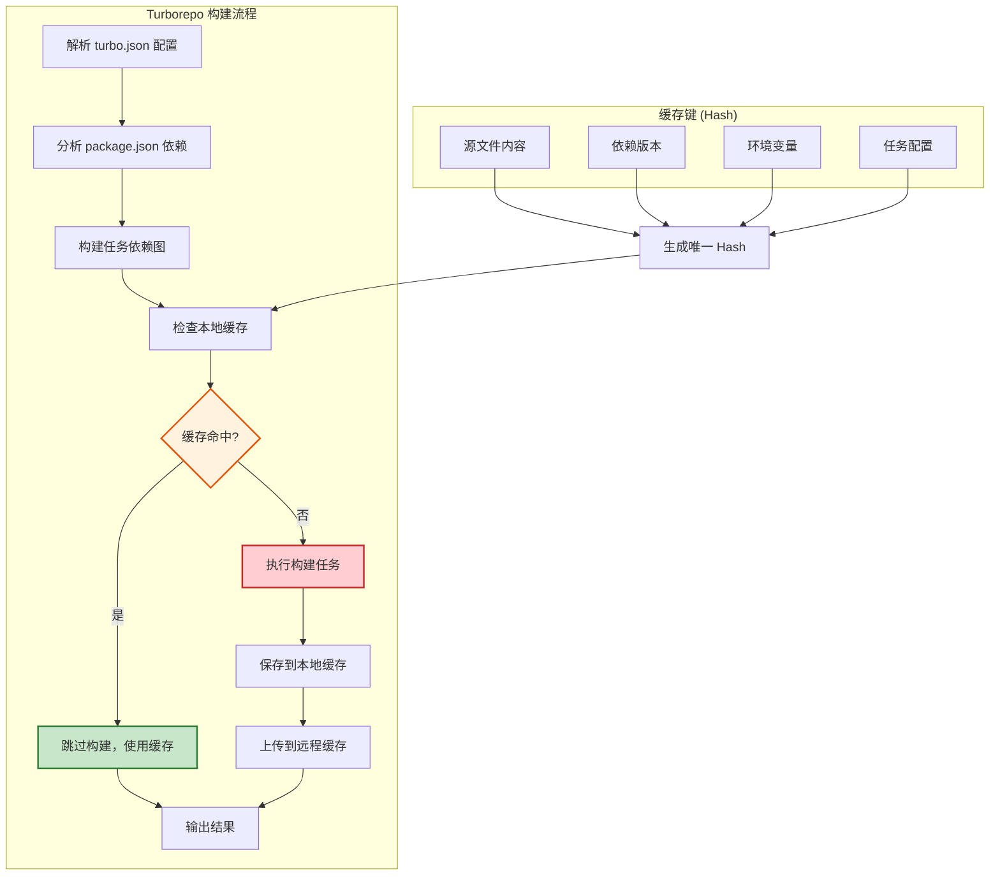
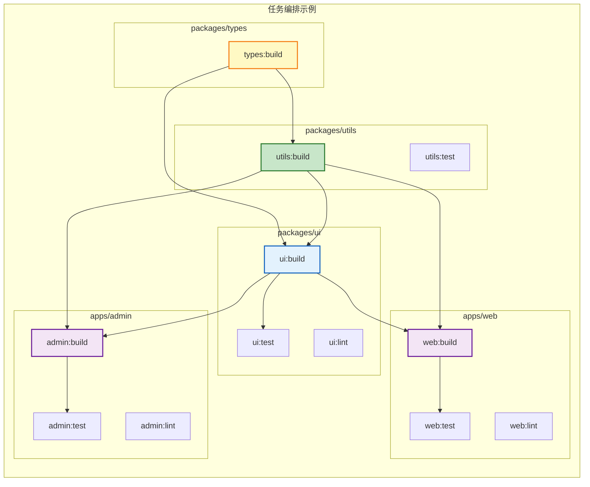
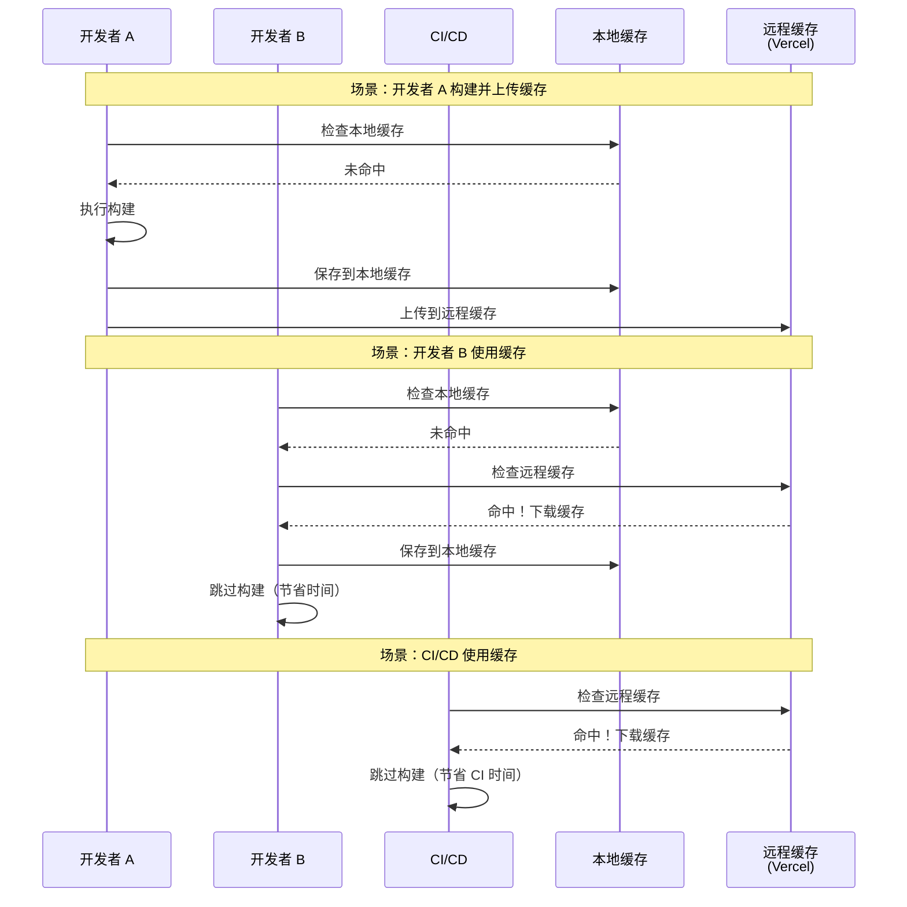
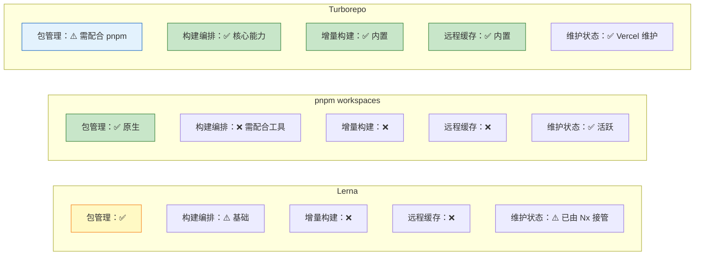

# Turborepo 详解

> **"Turborepo 是 Vercel 出品的 Monorepo 构建编排工具，专注于增量构建和远程缓存"** —— 它用极简的配置解决了 Monorepo 最核心的构建效率问题。

## Turborepo 核心特性

```
Turborepo 解决了什么问题？
═══════════════════════════════════════════════════════

没有 Turborepo 时：
  ❌ 每次构建都重新编译所有包
  ❌ 无法利用之前的构建结果
  ❌ 团队成员重复构建相同的代码
  ❌ CI/CD 构建时间随项目增长线性增加

有了 Turborepo：
  ✅ 增量构建：只构建发生变化的包
  ✅ 本地缓存：同一台机器上复用之前的构建结果
  ✅ 远程缓存：团队和 CI 共享构建缓存
  ✅ 任务编排：自动分析依赖关系，并行执行任务
  ✅ 零运行时开销：纯 CLI 工具，不侵入项目
```

## Turborepo 工作原理



## 快速开始

### 安装配置

```bash
# 创建 Turborepo 项目
npx create-turbo@latest my-turborepo

# 或者在现有项目中添加
cd my-monorepo
pnpm add turbo -Dw
```

### turbo.json 配置

```json
{
  "$schema": "https://turbo.build/schema.json",
  "tasks": {
    "build": {
      "dependsOn": ["^build"],
      "outputs": ["dist/**", ".next/**", "!.next/cache/**"],
      "env": ["NODE_ENV"],
      "cache": true
    },
    "dev": {
      "cache": false,
      "persistent": true
    },
    "test": {
      "dependsOn": ["build"],
      "outputs": ["coverage/**"],
      "inputs": ["src/**", "test/**"],
      "cache": true
    },
    "lint": {
      "outputs": [],
      "cache": true
    },
    "typecheck": {
      "dependsOn": ["^build"],
      "outputs": [],
      "cache": true
    }
  }
}
```

## 任务编排

### 任务依赖关系图



### dependsOn 配置详解

```json
{
  "tasks": {
    // ^build：先构建所有依赖包，再构建当前包
    // 这是最常用的配置，确保依赖关系正确
    "build": {
      "dependsOn": ["^build"],
      "outputs": ["dist/**"]
    },

    // build：只等当前包自己的 build 完成
    "test": {
      "dependsOn": ["build"],
      "outputs": []
    },

    // 无依赖：可以并行执行
    "lint": {
      "dependsOn": [],
      "outputs": []
    },

    // 混合依赖
    "deploy": {
      "dependsOn": ["build", "test", "lint"],
      "outputs": [],
      "cache": false
    }
  }
}
```

### 常用命令

```bash
# 运行所有包的 build 任务
turbo build

# 只运行指定包及其依赖
turbo build --filter=@myorg/web

# 运行指定包，不包含依赖
turbo build --filter=@myorg/web...

# 排除某些包
turbo build --filter=!@myorg/mobile

# 运行多个包
turbo build --filter=@myorg/web --filter=@myorg/admin

# 按依赖顺序运行（从根到叶）
turbo build --graph

# 并行运行（不考虑依赖）
turbo lint --concurrency=100%

# 持续运行（watch 模式）
turbo dev --parallel
```

## 远程缓存

### 远程缓存原理



### 配置远程缓存

```bash
# 登录 Vercel
npx turbo login

# 链接远程缓存
npx turbo link

# 手动推送缓存
turbo build --cache-dir=.turbo

# 环境变量方式配置（CI 中使用）
export TURBO_TOKEN=your_token
export TURBO_TEAM=your_team
```

### 自定义远程缓存

```javascript
// turbo.json - 使用自定义远程缓存
{
  "remoteCache": {
    "apiUrl": "https://your-cache-server.com",
    "signature": true
  }
}
```

```docker
# 自建缓存服务器（基于 Vercel Turborepo Remote Cache）
# 使用 turbo-cache-server 开源实现
FROM node:18-alpine
WORKDIR /app
RUN npm install -g turbo-cache-server
EXPOSE 3000
CMD ["turbo-cache-server"]
```

## 增量构建

### 缓存命中策略

```
Turborepo 缓存键（Hash）计算
═══════════════════════════════════════════════════════

Turborepo 为每个任务计算唯一的 Hash，包含以下因素：

1. 源文件内容
   • 所有匹配 inputs 模式的文件内容
   • 文件的修改时间（mtime）
   • 默认：src/**、*.ts、*.tsx 等

2. 依赖包版本
   • package.json 中的 dependencies
   • package.json 中的 devDependencies
   • lockfile (pnpm-lock.yaml)

3. 环境变量
   • env 配置中列出的环境变量
   • 例：NODE_ENV、API_KEY

4. 任务配置
   • turbo.json 中的任务定义
   • dependsOn、outputs、inputs 等

5. 根配置文件
   • turbo.json
   • package.json（根目录）

任意一个因素变化 → Hash 变化 → 缓存失效 → 重新构建
```

### inputs 配置

```json
{
  "tasks": {
    "build": {
      "dependsOn": ["^build"],
      "outputs": ["dist/**"],
      "inputs": [
        "src/**",
        "tsconfig.json",
        "package.json",
        "!**/__tests__/**",
        "!**/*.test.*",
        "!**/*.spec.*"
      ],
      "env": ["NODE_ENV", "API_URL"]
    }
  }
}
```

## 与 Lerna/pnpm workspaces 对比



### 详细对比

```
Lerna vs pnpm workspaces vs Turborepo 详细对比
═══════════════════════════════════════════════════════

特性                  Lerna          pnpm workspaces   Turborepo
───────────────────────────────────────────────────────────────────
包管理                ✅ npm/yarn      ✅ pnpm            ❌ 需配合 pnpm
任务编排              ⚠️ 基础          ❌ 无              ✅ 核心能力
增量构建              ❌               ❌                 ✅ 内置
远程缓存              ❌               ❌                 ✅ Vercel
依赖图分析            ⚠️ 基础          ✅ 原生            ✅ 自动
受影响分析            ❌               ❌                 ✅ --filter
版本管理              ✅ lerna version ❌                 ❌ 需配合 changesets
发布                  ✅ lerna publish ❌                 ❌ 需配合 changesets
代码生成              ❌               ❌                 ❌
维护状态              ⚠️ Nx 接管       ✅ 活跃            ✅ Vercel 维护
───────────────────────────────────────────────────────────────────

现代推荐方案：
  pnpm workspaces（包管理）+ Turborepo（构建编排）+ changesets（版本管理）
```

## CI/CD 集成

### GitHub Actions 配置

```yaml
# .github/workflows/ci.yml
name: CI

on:
  push:
    branches: [main]
  pull_request:
    branches: [main]

jobs:
  build:
    runs-on: ubuntu-latest

    steps:
      - name: Checkout
        uses: actions/checkout@v4

      - name: Setup pnpm
        uses: pnpm/action-setup@v2
        with:
          version: 9

      - name: Setup Node.js
        uses: actions/setup-node@v4
        with:
          node-version: 20
          cache: "pnpm"

      - name: Install dependencies
        run: pnpm install

      - name: Build
        run: pnpm build
        env:
          TURBO_TOKEN: ${{ secrets.TURBO_TOKEN }}
          TURBO_TEAM: ${{ secrets.TURBO_TEAM }}

      - name: Test
        run: pnpm test

      - name: Lint
        run: pnpm lint
```

### 受影响分析（CI 优化）

```yaml
# 只构建和测试受 PR 影响的包
- name: Build affected
  run: pnpm turbo build --filter=...[origin/main]

- name: Test affected
  run: pnpm turbo test --filter=...[origin/main]

- name: Lint affected
  run: pnpm turbo lint --filter=...[origin/main]
```

## 版本管理与发布

### 配合 Changesets

```bash
# 安装 changesets
pnpm add -Dw @changesets/cli

# 初始化
pnpm changeset init
```

```json
// .changeset/config.json
{
  "$schema": "https://unpkg.com/@changesets/config@3.0.0/schema.json",
  "changelog": "@changesets/cli/changelog",
  "commit": false,
  "fixed": [],
  "linked": [],
  "access": "restricted",
  "baseBranch": "main",
  "updateInternalDependencies": "patch",
  "ignore": ["@myorg/web", "@myorg/admin"]
}
```

```bash
# 创建 changeset
pnpm changeset

# 更新版本
pnpm changeset version

# 发布到 npm
pnpm changeset publish
```

## 最佳实践

```
Turborepo 最佳实践
═══════════════════════════════════════════════════════

1. 合理配置 outputs
   • 只缓存必要的构建产物
   • 排除缓存文件（如 .next/cache）
   • 避免缓存过大的文件

2. 精确配置 inputs
   • 只包含影响构建的文件
   • 排除测试文件、文档、配置
   • 减少缓存失效的频率

3. 善用 --filter
   • CI 中只构建受影响的包
   • 开发时只构建相关包
   • 配合 git diff 实现精准构建

4. 远程缓存必须开启
   • 团队协作时节省大量时间
   • CI/CD 构建速度提升 50%+
   • 使用 Vercel Remote Cache 或自建

5. 环境变量要声明
   • env 字段列出所有影响构建的环境变量
   • 避免因环境变量变化导致缓存失效
   • 敏感变量不要放入缓存键

6. 避免循环依赖
   • 包之间的依赖关系应该是 DAG
   • 循环依赖会导致构建失败
   • 使用 shared 包解决双向依赖
```

## 面试要点

```
Turborepo 面试高频题
═══════════════════════════════════════════════════════

Q1: Turborepo 的增量构建是如何实现的？
─────────────────────────────────────
A:
  • 为每个任务计算唯一的 Hash（基于源文件、依赖、环境变量、配置）
  • 构建前检查本地/远程缓存是否有匹配的 Hash
  • 命中则跳过构建，直接使用缓存
  • 未命中则执行构建，并将结果缓存
  • 支持本地缓存和远程缓存（团队共享）

Q2: ^build 和 build 有什么区别？
─────────────────────────────────────
A:
  ^build（caret 前缀）：
    • 表示先执行所有依赖包的 build
    • 确保依赖关系正确
    • 最常用的配置

  build（无前缀）：
    • 只等当前包自己的 build
    • 用于依赖自己构建结果的任务（如 test）

Q3: 如何在 CI 中优化 Monorepo 构建效率？
─────────────────────────────────────
A:
  • 使用远程缓存（TURBO_TOKEN + TURBO_TEAM）
  • 只构建受影响的包（--filter=...[origin/main]）
  • 并行执行独立任务（--concurrency）
  • 缓存 node_modules（pnpm store）
  • 使用 Turbo 的 GitHub Action

Q4: Turborepo 和 Nx 如何选择？
─────────────────────────────────────
A:
  选 Turborepo：
    • 小团队，简单项目
    • 已用 pnpm workspaces
    • 只需要构建编排和缓存
    • 追求极简配置

  选 Nx：
    • 大团队，复杂项目
    • 需要代码生成、迁移
    • 需要可视化依赖图
    • 需要丰富的插件生态
```
