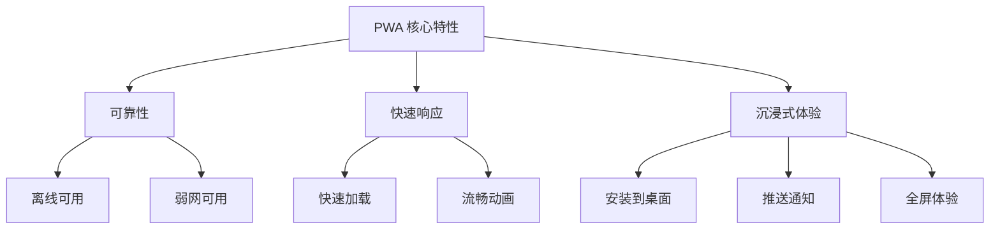
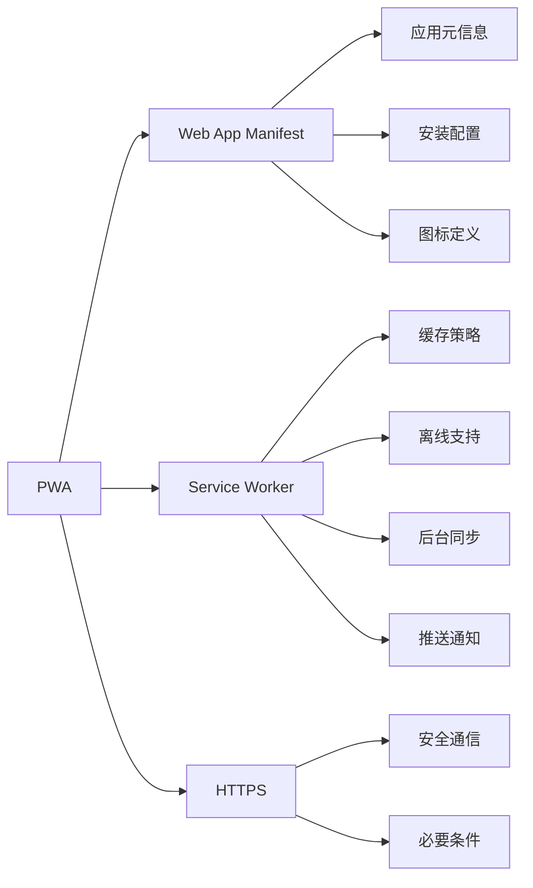
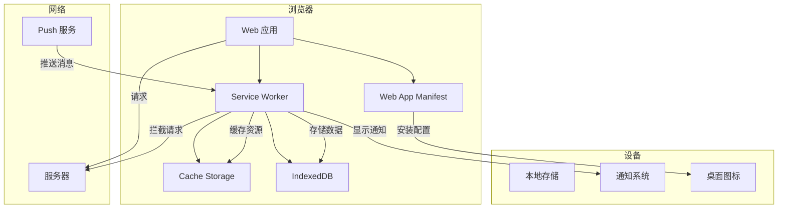
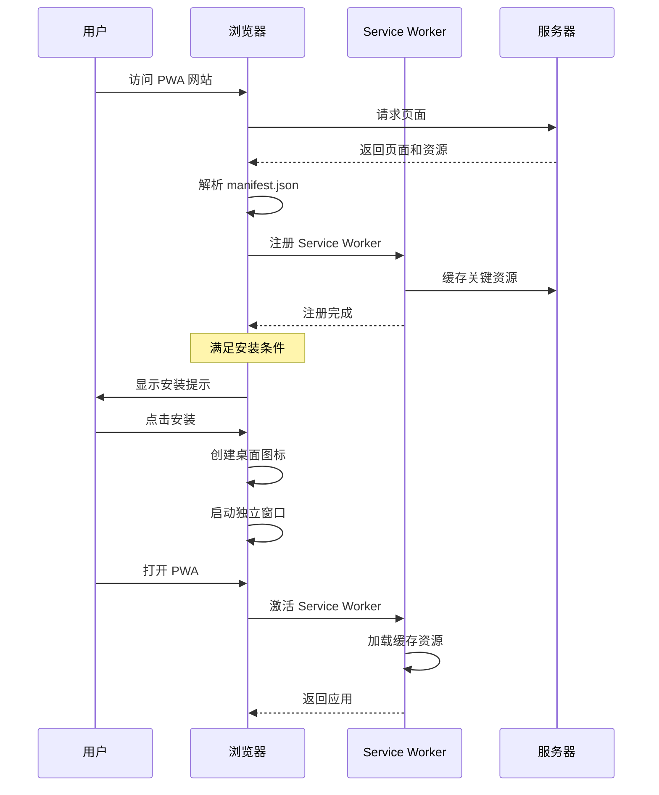
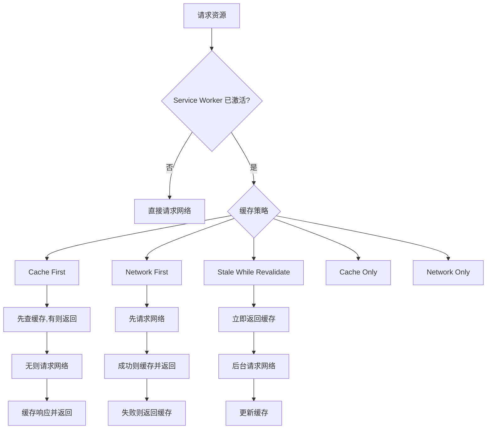

# PWA 实战概述

> **"PWA 是 Web 的未来"** —— 它让 Web 应用拥有原生应用的体验。

## 什么是 PWA？

PWA（Progressive Web App）是一种使用现代 Web 技术构建的应用程序，它具有原生应用的体验，包括离线工作、推送通知和设备硬件访问等功能。



## PWA 与原生应用对比

| 特性 | PWA | 原生应用 | Web 应用 |
|------|-----|----------|----------|
| 安装 | 可选 | 必须 | 不需要 |
| 离线工作 | 支持 | 支持 | 不支持 |
| 推送通知 | 支持 | 支持 | 不支持 |
| 自动更新 | 支持 | 需要用户 | 支持 |
| 跨平台 | 是 | 否 | 是 |
| 开发成本 | 低 | 高 | 低 |
| 应用商店 | 可选 | 必须 | 不需要 |
| 设备访问 | 有限 | 完全 | 有限 |

## PWA 核心技术栈



## PWA 架构图



## 快速开始

### 1. 创建 Web App Manifest

```json
{
  "name": "My PWA App",
  "short_name": "PWA",
  "description": "A Progressive Web App",
  "start_url": "/",
  "display": "standalone",
  "background_color": "#ffffff",
  "theme_color": "#4a90d9",
  "icons": [
    {
      "src": "/icons/icon-192x192.png",
      "sizes": "192x192",
      "type": "image/png"
    },
    {
      "src": "/icons/icon-512x512.png",
      "sizes": "512x512",
      "type": "image/png"
    }
  ]
}
```

### 2. 注册 Service Worker

```javascript
// main.js
if ('serviceWorker' in navigator) {
  window.addEventListener('load', () => {
    navigator.serviceWorker.register('/sw.js')
      .then(registration => {
        console.log('SW registered:', registration.scope);
      })
      .catch(error => {
        console.log('SW registration failed:', error);
      });
  });
}
```

### 3. 编写 Service Worker

```javascript
// sw.js
const CACHE_NAME = 'v1';
const urlsToCache = [
  '/',
  '/styles/main.css',
  '/scripts/main.js',
  '/offline.html',
];

// 安装事件
self.addEventListener('install', event => {
  event.waitUntil(
    caches.open(CACHE_NAME)
      .then(cache => cache.addAll(urlsToCache))
  );
});

// 激活事件
self.addEventListener('activate', event => {
  event.waitUntil(
    caches.keys().then(cacheNames => {
      return Promise.all(
        cacheNames.map(cacheName => {
          if (cacheName !== CACHE_NAME) {
            return caches.delete(cacheName);
          }
        })
      );
    })
  );
});

// 拦截请求
self.addEventListener('fetch', event => {
  event.respondWith(
    caches.match(event.request)
      .then(response => {
        return response || fetch(event.request);
      })
      .catch(() => {
        return caches.match('/offline.html');
      })
  );
});
```

### 4. 在 HTML 中引用

```html
<!DOCTYPE html>
<html lang="zh-CN">
<head>
  <meta charset="UTF-8">
  <meta name="viewport" content="width=device-width, initial-scale=1.0">
  <link rel="manifest" href="/manifest.json">
  <meta name="theme-color" content="#4a90d9">
  <link rel="apple-touch-icon" href="/icons/icon-192x192.png">
</head>
<body>
  <h1>My PWA App</h1>
  <script src="/scripts/main.js"></script>
</body>
</html>
```

## PWA 安装流程



## PWA 缓存策略



## 本专题内容

```
📁 PWA 实战
├── 📄 概述（本页）
├── 📄 Web App Manifest 与 Service Worker
│   ├── Manifest 配置详解
│   ├── Service Worker 生命周期
│   ├── 缓存策略详解
│   └── 离线支持实现
└── 📄 推送通知与后台同步
    ├── Push API
    ├── Notification API
    ├── Background Sync
    └── 消息推送实现
```

## PWA 检查清单

### ✅ 基础要求
- [ ] 使用 HTTPS
- [ ] 配置 Web App Manifest
- [ ] 注册 Service Worker
- [ ] 响应式设计

### ✅ 体验优化
- [ ] 离线可用
- [ ] 快速加载（< 3 秒）
- [ ] 安装到桌面
- [ ] 推送通知

### ✅ 性能指标
- [ ] First Contentful Paint < 1.5s
- [ ] Largest Contentful Paint < 2.5s
- [ ] Time to Interactive < 3.5s
- [ ] Cumulative Layout Shift < 0.1

## 面试要点

### 常见面试题

1. **PWA 和原生应用的区别？**
   - PWA 基于 Web 技术，跨平台
   - 原生应用性能更好，设备访问更完整
   - PWA 无需安装，原生应用需要应用商店

2. **Service Worker 的作用是什么？**
   - 拦截网络请求
   - 缓存资源实现离线
   - 后台同步和推送通知
   - 生命周期独立于页面

3. **PWA 的缓存策略有哪些？**
   - Cache First：优先使用缓存
   - Network First：优先请求网络
   - Stale While Revalidate：先返回缓存，后台更新

4. **如何让 PWA 支持离线？**
   - 使用 Service Worker 缓存关键资源
   - 配置合适的缓存策略
   - 提供离线回退页面

## 开始学习

准备好构建你的第一个 PWA 了吗？让我们从 **Web App Manifest 与 Service Worker** 开始！

import DocCardList from '@theme/DocCardList';

<DocCardList />
