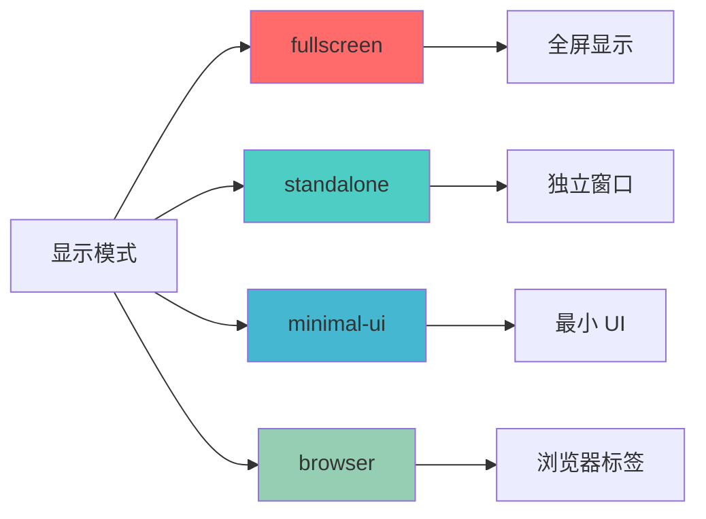
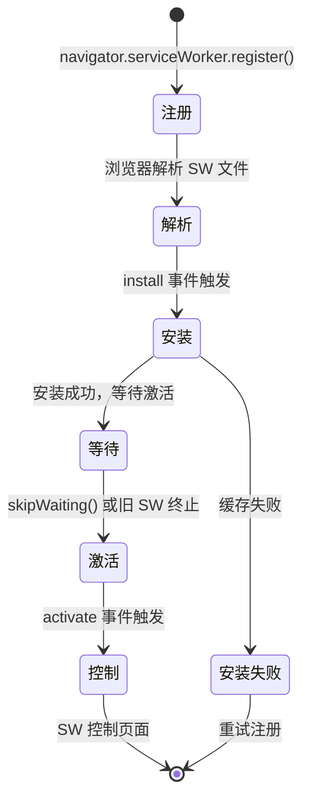
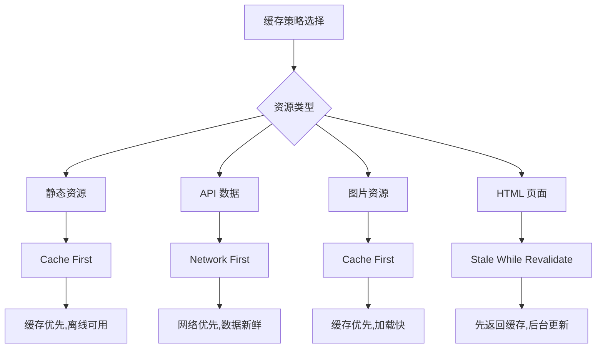
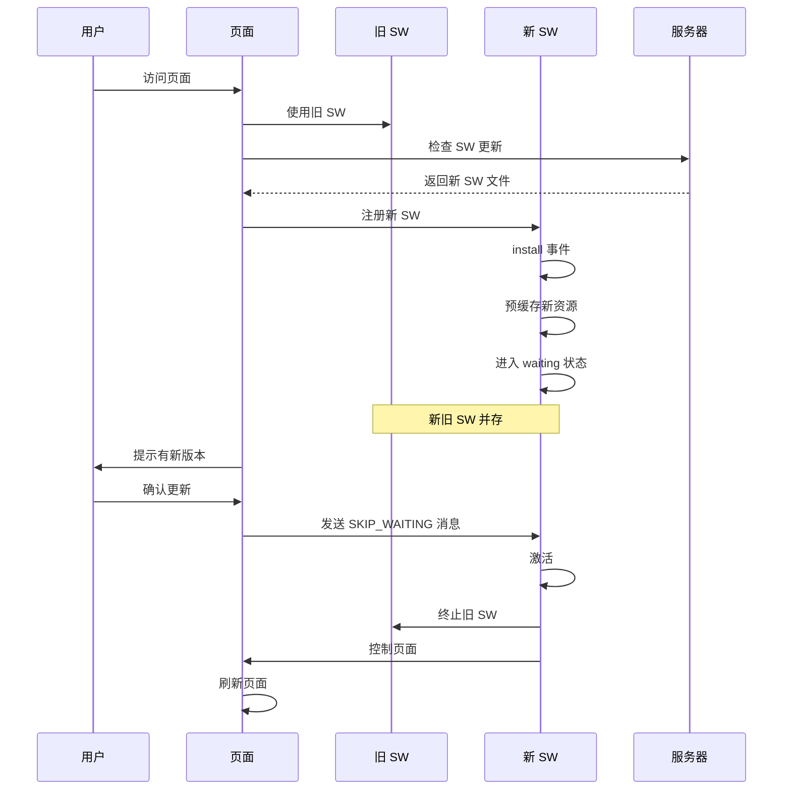

# Web App Manifest 与 Service Worker

> **"Manifest 定义了 PWA 是什么，Service Worker 定义了 PWA 能做什么"**

## Web App Manifest

Web App Manifest 是一个 JSON 文件，它定义了 PWA 的外观和行为。

### 完整配置详解

```json
{
  "name": "我的 PWA 应用",
  "short_name": "PWA",
  "description": "一个示例 PWA 应用",
  "start_url": "/",
  "scope": "/",
  "display": "standalone",
  "orientation": "portrait",
  "background_color": "#ffffff",
  "theme_color": "#4a90d9",
  "lang": "zh-CN",
  "dir": "ltr",
  "categories": ["productivity", "utilities"],
  "icons": [
    {
      "src": "/icons/icon-72x72.png",
      "sizes": "72x72",
      "type": "image/png",
      "purpose": "any"
    },
    {
      "src": "/icons/icon-96x96.png",
      "sizes": "96x96",
      "type": "image/png",
      "purpose": "any"
    },
    {
      "src": "/icons/icon-128x128.png",
      "sizes": "128x128",
      "type": "image/png",
      "purpose": "any"
    },
    {
      "src": "/icons/icon-144x144.png",
      "sizes": "144x144",
      "type": "image/png",
      "purpose": "any"
    },
    {
      "src": "/icons/icon-152x152.png",
      "sizes": "152x152",
      "type": "image/png",
      "purpose": "any"
    },
    {
      "src": "/icons/icon-192x192.png",
      "sizes": "192x192",
      "type": "image/png",
      "purpose": "any maskable"
    },
    {
      "src": "/icons/icon-384x384.png",
      "sizes": "384x384",
      "type": "image/png",
      "purpose": "any"
    },
    {
      "src": "/icons/icon-512x512.png",
      "sizes": "512x512",
      "type": "image/png",
      "purpose": "any maskable"
    }
  ],
  "screenshots": [
    {
      "src": "/screenshots/desktop.png",
      "sizes": "1280x720",
      "type": "image/png",
      "form_factor": "wide",
      "label": "桌面端界面"
    },
    {
      "src": "/screenshots/mobile.png",
      "sizes": "750x1334",
      "type": "image/png",
      "form_factor": "narrow",
      "label": "移动端界面"
    }
  ],
  "shortcuts": [
    {
      "name": "新建文档",
      "short_name": "新建",
      "description": "创建一个新文档",
      "url": "/new",
      "icons": [{ "src": "/icons/new.png", "sizes": "96x96" }]
    },
    {
      "name": "我的文档",
      "short_name": "文档",
      "description": "查看我的文档列表",
      "url": "/documents",
      "icons": [{ "src": "/icons/docs.png", "sizes": "96x96" }]
    }
  ],
  "related_applications": [
    {
      "platform": "play",
      "url": "https://play.google.com/store/apps/details?id=com.example",
      "id": "com.example"
    }
  ],
  "prefer_related_applications": false
}
```

### Manifest 配置说明

| 字段 | 类型 | 说明 | 必填 |
|------|------|------|------|
| name | string | 应用完整名称 | 是 |
| short_name | string | 应用简称（桌面图标下显示） | 是 |
| description | string | 应用描述 | 否 |
| start_url | string | 启动 URL | 是 |
| scope | string | 导航范围 | 否 |
| display | string | 显示模式 | 是 |
| orientation | string | 默认方向 | 否 |
| background_color | string | 背景色 | 是 |
| theme_color | string | 主题色 | 是 |
| icons | array | 应用图标 | 是 |

### 显示模式



| 模式 | 说明 | 适用场景 |
|------|------|----------|
| fullscreen | 全屏显示，无浏览器 UI | 游戏、视频 |
| standalone | 独立窗口，无地址栏 | 大多数 PWA |
| minimal-ui | 最小化浏览器 UI | 简单应用 |
| browser | 普通浏览器标签 | 传统网站 |

## Service Worker 详解

### Service Worker 生命周期



### Service Worker 注册

```javascript
// main.js
class ServiceWorkerManager {
  constructor() {
    this.registration = null;
  }

  async register() {
    if (!('serviceWorker' in navigator)) {
      console.warn('Service Worker 不支持');
      return false;
    }

    try {
      this.registration = await navigator.serviceWorker.register('/sw.js', {
        scope: '/',
      });

      // 监听更新
      this.registration.addEventListener('updatefound', () => {
        const newWorker = this.registration.installing;
        console.log('Service Worker 更新中...');

        newWorker.addEventListener('statechange', () => {
          if (newWorker.state === 'activated') {
            console.log('Service Worker 已更新');
            this.notifyUpdate();
          }
        });
      });

      console.log('Service Worker 注册成功');
      return true;
    } catch (error) {
      console.error('Service Worker 注册失败:', error);
      return false;
    }
  }

  notifyUpdate() {
    // 通知用户有新版本可用
    if (confirm('有新版本可用，是否更新？')) {
      this.skipWaiting();
    }
  }

  skipWaiting() {
    if (this.registration && this.registration.waiting) {
      this.registration.waiting.postMessage({ type: 'SKIP_WAITING' });
    }
  }
}
```

### Service Worker 实现

```javascript
// sw.js
const CACHE_VERSION = 'v1';
const STATIC_CACHE = `static-${CACHE_VERSION}`;
const DYNAMIC_CACHE = `dynamic-${CACHE_VERSION}`;
const STATIC_ASSETS = [
  '/',
  '/index.html',
  '/styles/main.css',
  '/scripts/app.js',
  '/offline.html',
  '/icons/icon-192x192.png',
];

// 安装阶段：预缓存静态资源
self.addEventListener('install', event => {
  console.log('[SW] 安装中...');
  event.waitUntil(
    caches.open(STATIC_CACHE)
      .then(cache => {
        console.log('[SW] 预缓存静态资源');
        return cache.addAll(STATIC_ASSETS);
      })
      .then(() => self.skipWaiting())
  );
});

// 激活阶段：清理旧缓存
self.addEventListener('activate', event => {
  console.log('[SW] 激活中...');
  event.waitUntil(
    caches.keys()
      .then(cacheNames => {
        return Promise.all(
          cacheNames
            .filter(name => name !== STATIC_CACHE && name !== DYNAMIC_CACHE)
            .map(name => {
              console.log('[SW] 删除旧缓存:', name);
              return caches.delete(name);
            })
        );
      })
      .then(() => self.clients.claim())
  );
});

// 拦截请求
self.addEventListener('fetch', event => {
  const { request } = event;
  const url = new URL(request.url);

  // 只处理 GET 请求
  if (request.method !== 'GET') return;

  // 静态资源：Cache First
  if (STATIC_ASSETS.includes(url.pathname)) {
    event.respondWith(cacheFirst(request));
    return;
  }

  // API 请求：Network First
  if (url.pathname.startsWith('/api/')) {
    event.respondWith(networkFirst(request));
    return;
  }

  // 图片：Cache First
  if (request.destination === 'image') {
    event.respondWith(cacheFirst(request));
    return;
  }

  // 其他：Stale While Revalidate
  event.respondWith(staleWhileRevalidate(request));
});

// 缓存策略：Cache First
async function cacheFirst(request) {
  const cached = await caches.match(request);
  if (cached) {
    return cached;
  }

  try {
    const response = await fetch(request);
    if (response.ok) {
      const cache = await caches.open(DYNAMIC_CACHE);
      cache.put(request, response.clone());
    }
    return response;
  } catch (error) {
    return caches.match('/offline.html');
  }
}

// 缓存策略：Network First
async function networkFirst(request) {
  try {
    const response = await fetch(request);
    if (response.ok) {
      const cache = await caches.open(DYNAMIC_CACHE);
      cache.put(request, response.clone());
    }
    return response;
  } catch (error) {
    const cached = await caches.match(request);
    return cached || new Response('Offline', { status: 503 });
  }
}

// 缓存策略：Stale While Revalidate
async function staleWhileRevalidate(request) {
  const cache = await caches.open(DYNAMIC_CACHE);
  const cached = await cache.match(request);

  const fetchPromise = fetch(request).then(response => {
    if (response.ok) {
      cache.put(request, response.clone());
    }
    return response;
  }).catch(() => cached);

  return cached || fetchPromise;
}

// 监听消息
self.addEventListener('message', event => {
  if (event.data && event.data.type === 'SKIP_WAITING') {
    self.skipWaiting();
  }
});
```

## 缓存策略详解

### 缓存策略对比



### 策略实现对比

| 策略 | 优点 | 缺点 | 适用场景 |
|------|------|------|----------|
| Cache First | 加载快，离线可用 | 数据可能过期 | 静态资源 |
| Network First | 数据新鲜 | 离线不可用 | API 数据 |
| Stale While Revalidate | 平衡体验 | 实现复杂 | HTML 页面 |
| Cache Only | 最快 | 无法更新 | 预缓存资源 |
| Network Only | 最新数据 | 离线不可用 | 实时数据 |

## 离线支持实现

### 离线页面检测

```javascript
// 检测网络状态
class NetworkStatus {
  constructor() {
    this.isOnline = navigator.onLine;
    this.listeners = [];

    window.addEventListener('online', () => this.updateStatus(true));
    window.addEventListener('offline', () => this.updateStatus(false));
  }

  updateStatus(isOnline) {
    this.isOnline = isOnline;
    this.listeners.forEach(listener => listener(isOnline));
  }

  onChange(listener) {
    this.listeners.push(listener);
    return () => {
      this.listeners = this.listeners.filter(l => l !== listener);
    };
  }
}

// 使用
const networkStatus = new NetworkStatus();
networkStatus.onChange(isOnline => {
  if (isOnline) {
    console.log('网络已连接');
    // 同步离线数据
  } else {
    console.log('网络已断开');
    // 显示离线提示
  }
});
```

### 离线数据存储

```javascript
// 使用 IndexedDB 存储离线数据
class OfflineStorage {
  constructor(dbName = 'pwa-offline') {
    this.dbName = dbName;
    this.db = null;
  }

  async open() {
    return new Promise((resolve, reject) => {
      const request = indexedDB.open(this.dbName, 1);

      request.onupgradeneeded = event => {
        const db = event.target.result;
        if (!db.objectStoreNames.contains('pending')) {
          db.createObjectStore('pending', { keyPath: 'id', autoIncrement: true });
        }
      };

      request.onsuccess = event => {
        this.db = event.target.result;
        resolve(this.db);
      };

      request.onerror = event => {
        reject(event.target.error);
      };
    });
  }

  async addPendingRequest(request) {
    const db = await this.open();
    return new Promise((resolve, reject) => {
      const transaction = db.transaction(['pending'], 'readwrite');
      const store = transaction.objectStore('pending');
      const request = store.add(request);

      request.onsuccess = () => resolve(request.result);
      request.onerror = () => reject(request.error);
    });
  }

  async getPendingRequests() {
    const db = await this.open();
    return new Promise((resolve, reject) => {
      const transaction = db.transaction(['pending'], 'readonly');
      const store = transaction.objectStore('pending');
      const request = store.getAll();

      request.onsuccess = () => resolve(request.result);
      request.onerror = () => reject(request.error);
    });
  }

  async clearPendingRequests() {
    const db = await this.open();
    return new Promise((resolve, reject) => {
      const transaction = db.transaction(['pending'], 'readwrite');
      const store = transaction.objectStore('pending');
      const request = store.clear();

      request.onsuccess = () => resolve();
      request.onerror = () => reject(request.error);
    });
  }
}
```

## Service Worker 更新流程



## 面试要点

### 常见面试题

1. **Service Worker 和 Web Worker 的区别？**
   - Service Worker：拦截网络请求，实现离线缓存
   - Web Worker：后台计算，不涉及网络
   - Service Worker 生命周期独立于页面

2. **如何实现 PWA 的离线支持？**
   - 使用 Service Worker 缓存关键资源
   - 配置合适的缓存策略
   - 使用 IndexedDB 存储离线数据
   - 提供离线回退页面

3. **Cache First 和 Network First 的区别？**
   - Cache First：优先使用缓存，适合静态资源
   - Network First：优先请求网络，适合动态数据

4. **如何处理 Service Worker 更新？**
   - 监听 updatefound 事件
   - 使用 skipWaiting() 立即激活
   - 使用 clients.claim() 控制所有页面

### 关键概念速查

| 概念 | 说明 | 重要程度 |
|------|------|----------|
| Manifest | PWA 的配置文件 | ⭐⭐⭐⭐⭐ |
| Service Worker | 离线和推送的核心 | ⭐⭐⭐⭐⭐ |
| Cache API | 资源缓存接口 | ⭐⭐⭐⭐ |
| 缓存策略 | 决定资源获取方式 | ⭐⭐⭐⭐ |
| skipWaiting | 立即激活新 SW | ⭐⭐⭐ |

## 总结

- **Web App Manifest** 定义 PWA 的外观和安装行为
- **Service Worker** 是 PWA 的核心，实现离线和推送
- **缓存策略** 根据资源类型选择合适的方式
- **离线支持** 需要结合 Service Worker 和 IndexedDB
- **更新机制** 确保用户始终使用最新版本
