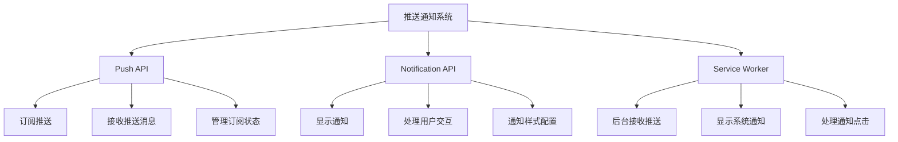
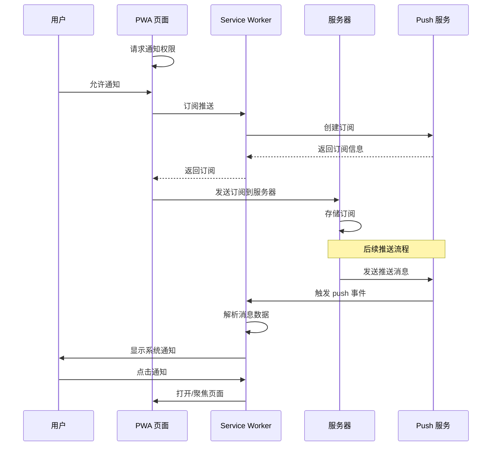
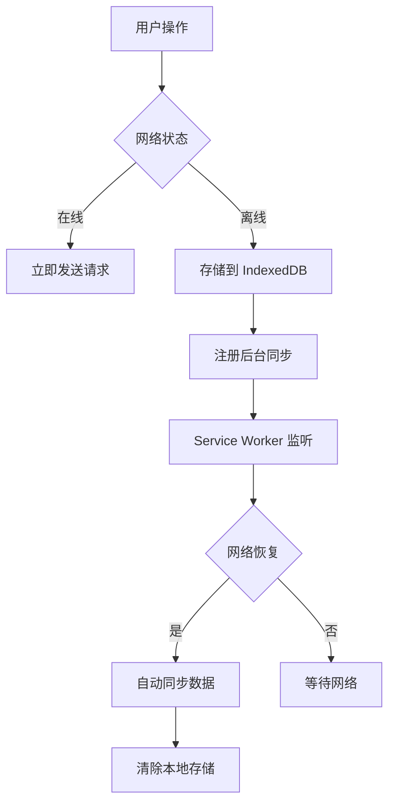
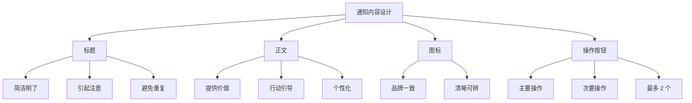
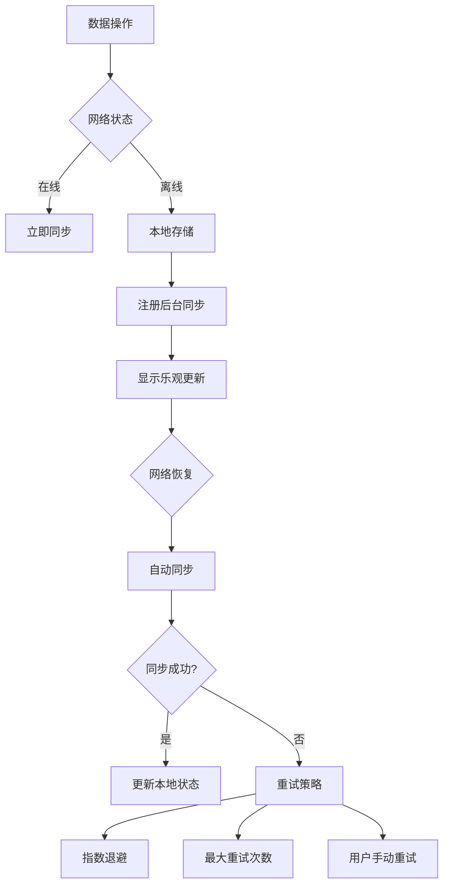

# 推送通知与后台同步

> **"推送通知让用户随时回来，后台同步让数据永不丢失"**

## 推送通知概述

PWA 推送通知基于 Push API 和 Notification API，即使用户没有打开网站，也能接收消息。



## Push API 详解

### 订阅推送

```javascript
class PushManager {
  constructor() {
    this.subscription = null;
    this.vapidPublicKey = 'YOUR_VAPID_PUBLIC_KEY';
  }

  async subscribe() {
    try {
      // 检查权限
      const permission = await Notification.requestPermission();
      if (permission !== 'granted') {
        throw new Error('通知权限被拒绝');
      }

      // 获取 Service Worker 注册
      const registration = await navigator.serviceWorker.ready;

      // 检查是否已订阅
      this.subscription = await registration.pushManager.getSubscription();

      if (!this.subscription) {
        // 创建新订阅
        this.subscription = await registration.pushManager.subscribe({
          userVisibleOnly: true,
          applicationServerKey: this.urlBase64ToUint8Array(this.vapidPublicKey),
        });
      }

      // 发送订阅到服务器
      await this.sendSubscriptionToServer(this.subscription);

      console.log('推送订阅成功');
      return this.subscription;
    } catch (error) {
      console.error('推送订阅失败:', error);
      throw error;
    }
  }

  async unsubscribe() {
    if (!this.subscription) return;

    try {
      await this.subscription.unsubscribe();
      await this.removeSubscriptionFromServer(this.subscription);
      this.subscription = null;
      console.log('取消订阅成功');
    } catch (error) {
      console.error('取消订阅失败:', error);
      throw error;
    }
  }

  async sendSubscriptionToServer(subscription) {
    const response = await fetch('/api/push/subscribe', {
      method: 'POST',
      headers: { 'Content-Type': 'application/json' },
      body: JSON.stringify(subscription),
    });

    if (!response.ok) {
      throw new Error('发送订阅到服务器失败');
    }
  }

  async removeSubscriptionFromServer(subscription) {
    await fetch('/api/push/unsubscribe', {
      method: 'POST',
      headers: { 'Content-Type': 'application/json' },
      body: JSON.stringify({ endpoint: subscription.endpoint }),
    });
  }

  urlBase64ToUint8Array(base64String) {
    const padding = '='.repeat((4 - base64String.length % 4) % 4);
    const base64 = (base64String + padding)
      .replace(/-/g, '+')
      .replace(/_/g, '/');

    const rawData = window.atob(base64);
    const outputArray = new Uint8Array(rawData.length);

    for (let i = 0; i < rawData.length; ++i) {
      outputArray[i] = rawData.charCodeAt(i);
    }

    return outputArray;
  }
}
```

### 订阅数据结构

```json
{
  "endpoint": "https://fcm.googleapis.com/fcm/send/...",
  "expirationTime": null,
  "keys": {
    "p256dh": "BLBx...",
    "auth": "Dc9A..."
  }
}
```

## Notification API 详解

### 显示通知

```javascript
class NotificationManager {
  constructor() {
    this.permission = Notification.permission;
  }

  async requestPermission() {
    if (this.permission === 'granted') {
      return true;
    }

    this.permission = await Notification.requestPermission();
    return this.permission === 'granted';
  }

  async showNotification(title, options = {}) {
    if (this.permission !== 'granted') {
      const granted = await this.requestPermission();
      if (!granted) return;
    }

    const defaultOptions = {
      icon: '/icons/icon-192x192.png',
      badge: '/icons/badge-72x72.png',
      vibrate: [200, 100, 200],
      tag: 'default',
      renotify: false,
      requireInteraction: false,
      silent: false,
      data: {
        url: '/',
        timestamp: Date.now(),
      },
      actions: [
        {
          action: 'open',
          title: '打开',
          icon: '/icons/open.png',
        },
        {
          action: 'close',
          title: '关闭',
          icon: '/icons/close.png',
        },
      ],
    };

    const mergedOptions = { ...defaultOptions, ...options };

    // 使用 Service Worker 显示通知
    const registration = await navigator.serviceWorker.ready;
    await registration.showNotification(title, mergedOptions);
  }
}
```

### 通知选项详解

| 选项 | 类型 | 说明 |
|------|------|------|
| body | string | 通知正文 |
| icon | string | 通知图标 URL |
| badge | string | 小图标（Android） |
| image | string | 大图 URL |
| vibrate | array | 振动模式 |
| tag | string | 通知标签（用于替换） |
| renotify | boolean | 替换时是否重新通知 |
| requireInteraction | boolean | 是否需要用户交互才消失 |
| silent | boolean | 是否静音 |
| actions | array | 通知操作按钮 |
| data | any | 附带数据 |

## Service Worker 处理推送

```javascript
// sw.js

// 接收推送消息
self.addEventListener('push', event => {
  console.log('[SW] 收到推送消息');

  let data = {
    title: '新消息',
    body: '您有一条新消息',
    icon: '/icons/icon-192x192.png',
    url: '/',
  };

  if (event.data) {
    try {
      data = event.data.json();
    } catch (e) {
      data.body = event.data.text();
    }
  }

  const options = {
    body: data.body,
    icon: data.icon || '/icons/icon-192x192.png',
    badge: '/icons/badge-72x72.png',
    vibrate: [200, 100, 200],
    data: {
      url: data.url || '/',
      timestamp: Date.now(),
    },
    actions: [
      { action: 'open', title: '查看' },
      { action: 'close', title: '忽略' },
    ],
    tag: data.tag || 'push-notification',
    renotify: true,
  };

  event.waitUntil(
    self.registration.showNotification(data.title, options)
  );
});

// 处理通知点击
self.addEventListener('notificationclick', event => {
  console.log('[SW] 通知被点击');

  event.notification.close();

  const action = event.action;
  const data = event.notification.data;

  if (action === 'close') {
    return;
  }

  // 打开或聚焦窗口
  event.waitUntil(
    clients.matchAll({ type: 'window', includeUncontrolled: true })
      .then(clientList => {
        // 查找已打开的窗口
        for (const client of clientList) {
          if (client.url === data.url && 'focus' in client) {
            return client.focus();
          }
        }

        // 打开新窗口
        if (clients.openWindow) {
          return clients.openWindow(data.url);
        }
      })
  );
});

// 处理通知关闭
self.addEventListener('notificationclose', event => {
  console.log('[SW] 通知被关闭');

  // 可以发送分析数据
  const data = event.notification.data;
  if (data.trackClose) {
    fetch('/api/analytics/notification-close', {
      method: 'POST',
      body: JSON.stringify({
        tag: event.notification.tag,
        timestamp: Date.now(),
      }),
    });
  }
});
```

## 推送通知流程



## 后台同步（Background Sync）

### 什么是后台同步？

后台同步允许 Service Worker 在网络恢复时自动同步数据，即使用户已经关闭了页面。



### 实现后台同步

```javascript
// main.js
class BackgroundSync {
  constructor() {
    this.db = new OfflineStorage();
  }

  async saveAndSync(data, endpoint) {
    try {
      // 尝试直接发送
      if (navigator.onLine) {
        const response = await fetch(endpoint, {
          method: 'POST',
          headers: { 'Content-Type': 'application/json' },
          body: JSON.stringify(data),
        });

        if (response.ok) {
          return { success: true, online: true };
        }
      }
    } catch (error) {
      console.log('直接发送失败，准备离线存储');
    }

    // 存储到本地
    await this.db.addPendingRequest({
      endpoint,
      data,
      timestamp: Date.now(),
    });

    // 注册后台同步
    if ('serviceWorker' in navigator && 'SyncManager' in window) {
      const registration = await navigator.serviceWorker.ready;
      await registration.sync.register('sync-data');
      console.log('后台同步已注册');
    }

    return { success: true, online: false, pending: true };
  }
}
```

### Service Worker 处理后台同步

```javascript
// sw.js

// 监听后台同步事件
self.addEventListener('sync', event => {
  console.log('[SW] 后台同步触发:', event.tag);

  if (event.tag === 'sync-data') {
    event.waitUntil(syncPendingRequests());
  }
});

// 同步待处理的请求
async function syncPendingRequests() {
  const db = new OfflineStorage();
  await db.open();

  const pendingRequests = await db.getPendingRequests();
  console.log(`[SW] 待同步请求数量: ${pendingRequests.length}`);

  const results = [];

  for (const request of pendingRequests) {
    try {
      const response = await fetch(request.endpoint, {
        method: 'POST',
        headers: { 'Content-Type': 'application/json' },
        body: JSON.stringify(request.data),
      });

      if (response.ok) {
        results.push({ id: request.id, success: true });
      } else {
        results.push({ id: request.id, success: false, error: response.status });
      }
    } catch (error) {
      results.push({ id: request.id, success: false, error: error.message });
    }
  }

  // 清除已同步的请求
  const successfulIds = results.filter(r => r.success).map(r => r.id);
  if (successfulIds.length > 0) {
    await db.removeByIds(successfulIds);
  }

  // 显示同步结果通知
  if (results.some(r => r.success)) {
    self.registration.showNotification('同步完成', {
      body: `成功同步 ${successfulIds.length} 条数据`,
      icon: '/icons/icon-192x192.png',
      tag: 'sync-complete',
    });
  }

  return results;
}
```

## 完整的推送通知实现

### 服务器端（Node.js）

```javascript
// server.js
const webPush = require('web-push');

// 配置 VAPID 密钥
const vapidKeys = {
  publicKey: 'YOUR_VAPID_PUBLIC_KEY',
  privateKey: 'YOUR_VAPID_PRIVATE_KEY',
};

webPush.setVapidDetails(
  'mailto:your@email.com',
  vapidKeys.publicKey,
  vapidKeys.privateKey
);

// 存储订阅（实际项目中使用数据库）
const subscriptions = new Map();

// 订阅接口
app.post('/api/push/subscribe', (req, res) => {
  const subscription = req.body;
  const endpoint = subscription.endpoint;

  subscriptions.set(endpoint, subscription);
  console.log('新订阅:', endpoint);

  res.json({ success: true });
});

// 取消订阅接口
app.post('/api/push/unsubscribe', (req, res) => {
  const { endpoint } = req.body;
  subscriptions.delete(endpoint);
  console.log('取消订阅:', endpoint);

  res.json({ success: true });
});

// 发送推送通知
async function sendPushNotification(payload, targetEndpoint = null) {
  const promises = [];

  for (const [endpoint, subscription] of subscriptions) {
    if (targetEndpoint && endpoint !== targetEndpoint) continue;

    promises.push(
      webPush.sendNotification(subscription, JSON.stringify(payload))
        .catch(error => {
          console.error('推送失败:', endpoint, error);
          // 如果订阅失效，删除它
          if (error.statusCode === 410) {
            subscriptions.delete(endpoint);
          }
        })
    );
  }

  return Promise.all(promises);
}

// 推送接口
app.post('/api/push/send', async (req, res) => {
  const { title, body, url, tag } = req.body;

  try {
    await sendPushNotification({
      title,
      body,
      url,
      tag,
      icon: '/icons/icon-192x192.png',
    });

    res.json({ success: true });
  } catch (error) {
    res.status(500).json({ error: error.message });
  }
});
```

### 客户端完整实现

```javascript
// push-notification.js
class PushNotificationClient {
  constructor() {
    this.pushManager = new PushManager();
    this.notificationManager = new NotificationManager();
    this.backgroundSync = new BackgroundSync();
    this.isSubscribed = false;
  }

  async init() {
    // 检查支持
    if (!this.isSupported()) {
      console.warn('推送通知不支持');
      return false;
    }

    // 检查权限
    const hasPermission = await this.notificationManager.requestPermission();
    if (!hasPermission) {
      console.warn('通知权限被拒绝');
      return false;
    }

    // 检查订阅状态
    await this.checkSubscription();

    return true;
  }

  isSupported() {
    return (
      'serviceWorker' in navigator &&
      'PushManager' in window &&
      'Notification' in window
    );
  }

  async checkSubscription() {
    const registration = await navigator.serviceWorker.ready;
    const subscription = await registration.pushManager.getSubscription();
    this.isSubscribed = !!subscription;
    return this.isSubscribed;
  }

  async subscribe() {
    try {
      await this.pushManager.subscribe();
      this.isSubscribed = true;
      return true;
    } catch (error) {
      console.error('订阅失败:', error);
      return false;
    }
  }

  async unsubscribe() {
    try {
      await this.pushManager.unsubscribe();
      this.isSubscribed = false;
      return true;
    } catch (error) {
      console.error('取消订阅失败:', error);
      return false;
    }
  }

  async sendTestNotification() {
    await this.notificationManager.showNotification('测试通知', {
      body: '这是一条测试推送通知',
      tag: 'test',
      data: { url: '/' },
    });
  }
}
```

## 推送通知最佳实践

### 通知内容设计



### 通知频率控制

```javascript
class NotificationThrottle {
  constructor() {
    this.lastNotificationTime = {};
    this.minInterval = 60 * 60 * 1000; // 1 小时
  }

  canSend(tag) {
    const lastTime = this.lastNotificationTime[tag] || 0;
    const now = Date.now();

    if (now - lastTime < this.minInterval) {
      console.log(`通知 "${tag}" 被节流`);
      return false;
    }

    this.lastNotificationTime[tag] = now;
    return true;
  }
}
```

### 通知权限管理

```javascript
class PermissionManager {
  constructor() {
    this.permission = Notification.permission;
    this.denialCount = 0;
    this.lastDenialTime = null;
  }

  async requestWithBackoff() {
    // 如果之前被拒绝，等待一段时间再请求
    if (this.denialCount > 0) {
      const waitTime = Math.min(this.denialCount * 24 * 60 * 60 * 1000, 7 * 24 * 60 * 60 * 1000);
      const timeSinceDenial = Date.now() - (this.lastDenialTime || 0);

      if (timeSinceDenial < waitTime) {
        console.log('等待足够时间后再请求权限');
        return false;
      }
    }

    const permission = await Notification.requestPermission();

    if (permission === 'denied') {
      this.denialCount++;
      this.lastDenialTime = Date.now();
    } else if (permission === 'granted') {
      this.denialCount = 0;
    }

    this.permission = permission;
    return permission === 'granted';
  }

  shouldShowPrompt() {
    if (this.permission === 'granted') return false;
    if (this.permission === 'denied' && this.denialCount >= 3) return false;
    return true;
  }
}
```

## 后台同步最佳实践

### 同步策略



### 冲突解决

```javascript
class ConflictResolver {
  constructor() {
    this.strategies = {
      'last-write-wins': this.lastWriteWins.bind(this),
      'merge': this.merge.bind(this),
      'manual': this.manualResolve.bind(this),
    };
  }

  async resolve(localData, serverData, strategy = 'last-write-wins') {
    return this.strategies[strategy](localData, serverData);
  }

  lastWriteWins(localData, serverData) {
    return localData.timestamp > serverData.timestamp ? localData : serverData;
  }

  merge(localData, serverData) {
    return {
      ...serverData,
      ...localData,
      mergedAt: Date.now(),
    };
  }

  manualResolve(localData, serverData) {
    // 返回冲突数据，由用户决定
    return {
      conflict: true,
      local: localData,
      server: serverData,
    };
  }
}
```

## 面试要点

### 常见面试题

1. **Push API 和 Notification API 的区别？**
   - Push API：接收服务器推送的消息（后台）
   - Notification API：显示系统通知（前台/后台）
   - 通常配合使用

2. **VAPID 密钥的作用是什么？**
   - 验证应用身份
   - 防止其他应用发送推送
   - 服务器和推送服务之间的认证

3. **后台同步的限制有哪些？**
   - 需要 Service Worker 支持
   - 不保证立即执行
   - 有重试次数限制
   - 用户可能禁用

4. **如何处理推送通知的权限？**
   - 在合适的时机请求权限
   - 解释通知的价值
   - 处理拒绝情况
   - 提供设置入口

### 关键概念速查

| 概念 | 说明 | 重要程度 |
|------|------|----------|
| Push API | 接收服务器推送 | ⭐⭐⭐⭐⭐ |
| Notification API | 显示系统通知 | ⭐⭐⭐⭐⭐ |
| VAPID 密钥 | 应用身份验证 | ⭐⭐⭐⭐ |
| Background Sync | 后台数据同步 | ⭐⭐⭐⭐ |
| 订阅管理 | 推送订阅生命周期 | ⭐⭐⭐ |

## 总结

- **Push API** 实现服务器到客户端的消息推送
- **Notification API** 显示系统级通知
- **后台同步** 保证离线数据不丢失
- **VAPID 密钥** 确保推送安全性
- 实际项目中需要考虑权限管理、频率控制和冲突解决
