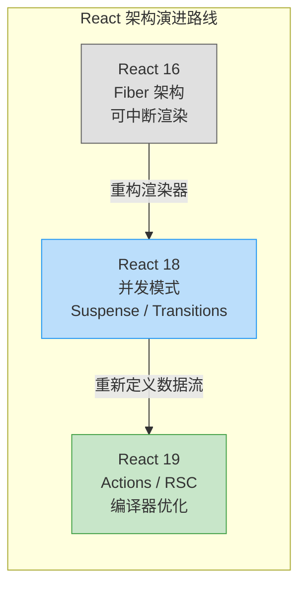
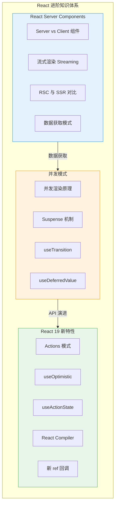
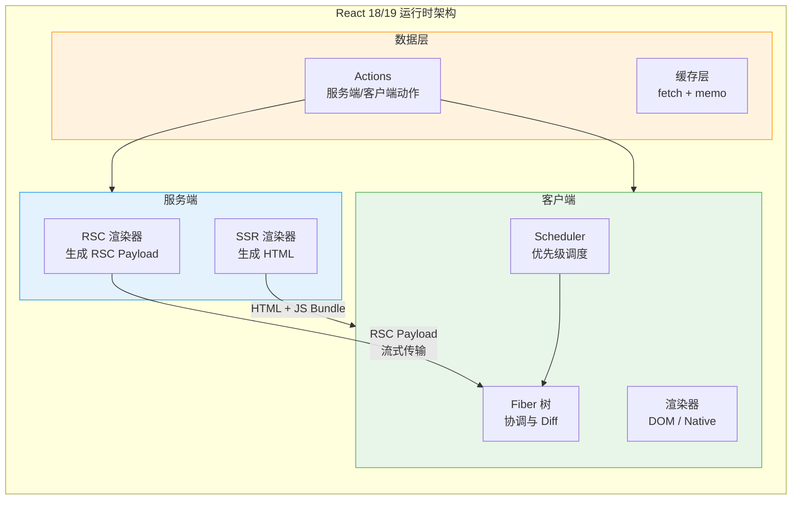
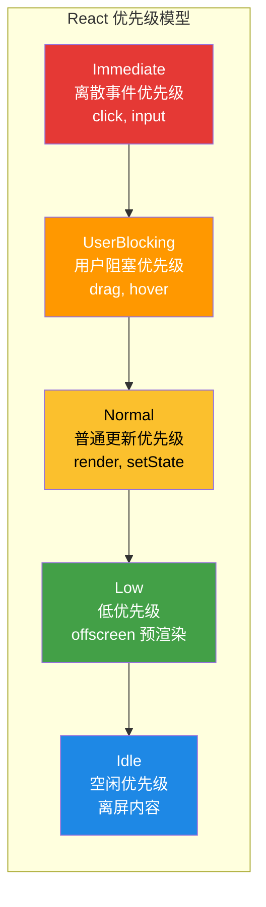
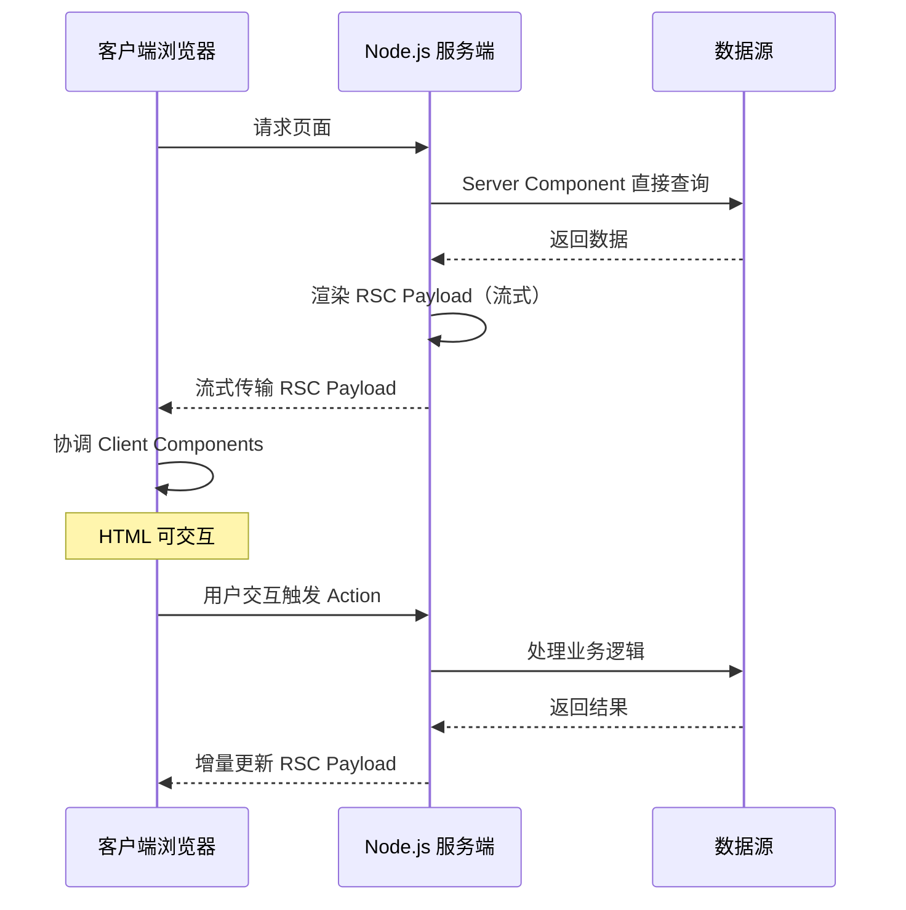
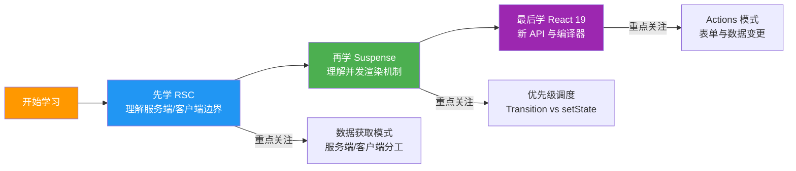

# React 进阶概述

React 在 18/19 版本中引入了革命性的架构变化：Server Components、并发渲染、新的数据处理模式。掌握这些进阶知识是现代 React 开发的必备能力。

## React 架构演进

## 核心知识图谱

## React 18/19 核心架构

## 并发渲染优先级模型

## RSC 数据流总览

## 本模块内容导航

| 章节 | 核心内容 | 关键知识点 |
|------|----------|------------|
| [React Server Components](./server-components.md) | RSC 架构与流式渲染 | Server/Client 组件、RSC Payload、SSR 对比 |
| [Suspense 与并发模式](./suspense-concurrent.md) | 并发渲染原理与实践 | Suspense 原理、Transition、useDeferredValue |
| [React 19 新特性](./react-19.md) | Actions 与编译器优化 | useOptimistic、useActionState、React Compiler |

## 学习路线建议

## 面试高频问题预览

1. **Server Components 和 Client Components 的区别是什么？** — 运行环境、能力边界、打包方式
2. **Suspense 的工作原理？** — 捕获 Promise、挂起树、fallback UI
3. **useTransition 和 useState 的区别？** — 优先级不同，Transition 不阻塞 UI
4. **React Compiler 做了什么？** — 自动 memo、自动优化重渲染
5. **RSC Payload 是什么格式？** — 类 JSON 的流式协议，描述组件树的序列化表示

---

> **下一步**：从 [React Server Components](./server-components.md) 开始，理解 React 的服务端渲染新范式。
