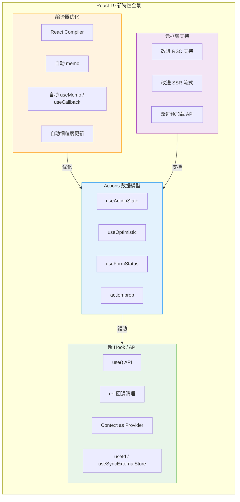
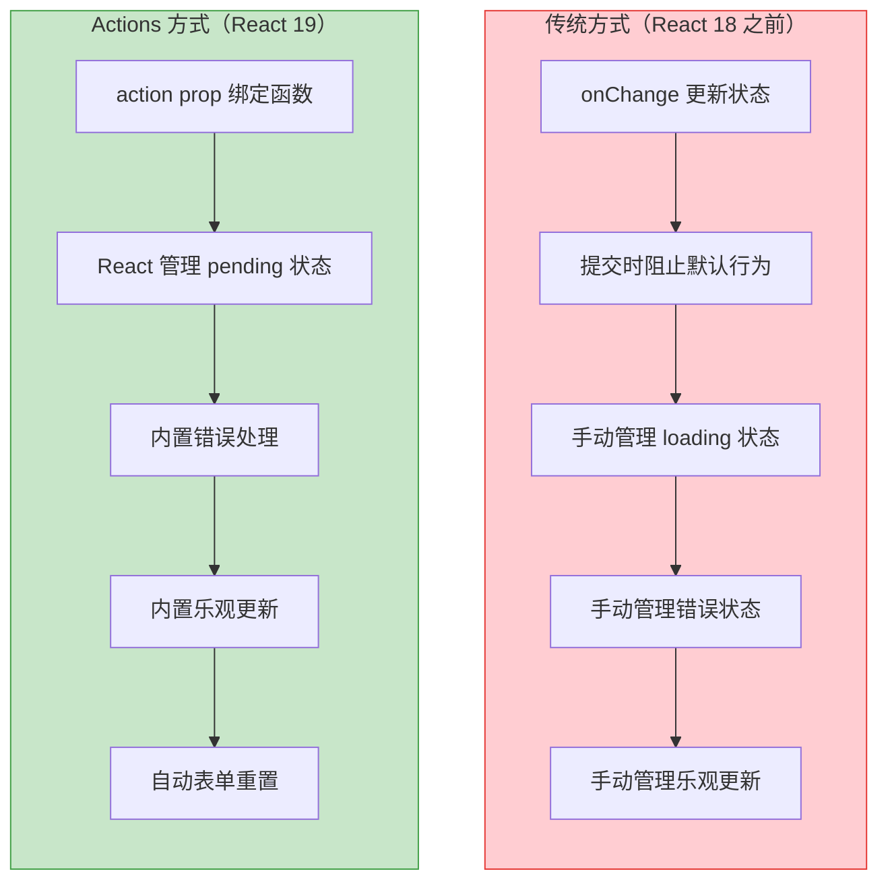
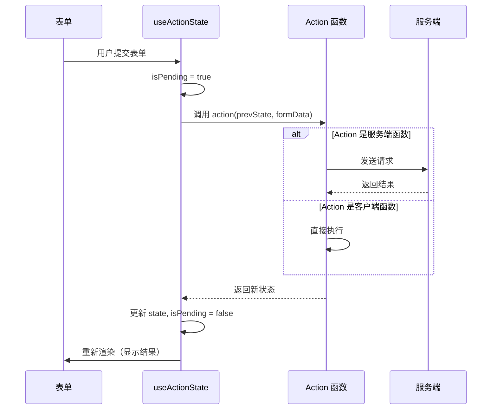
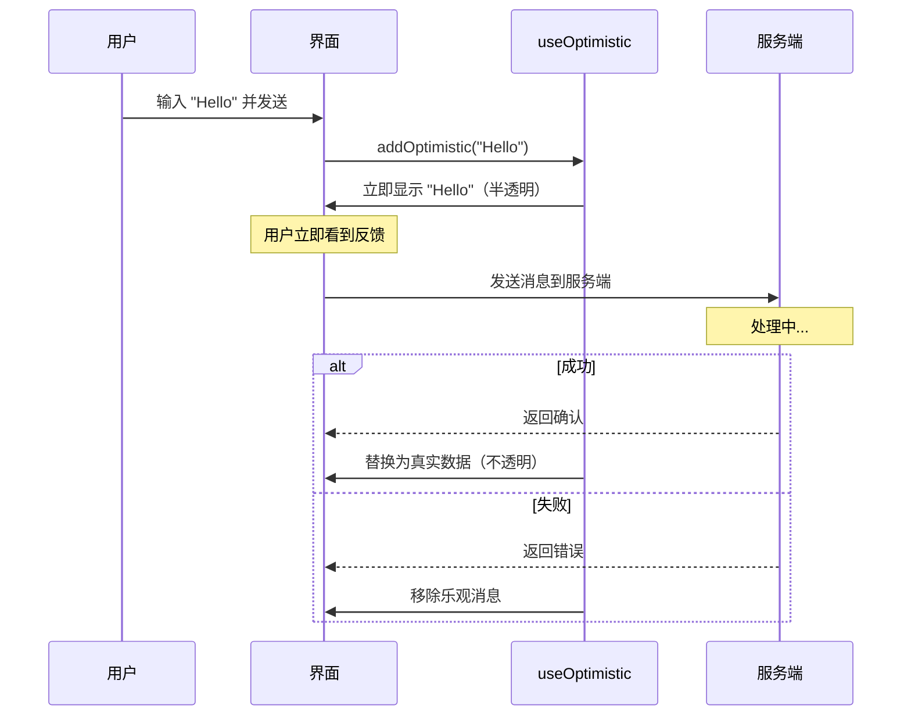
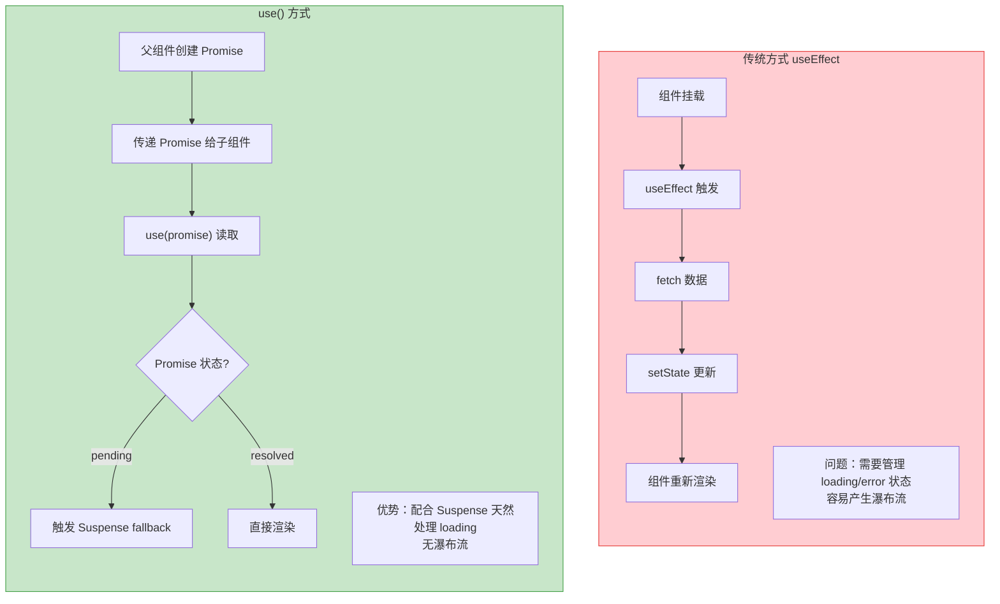
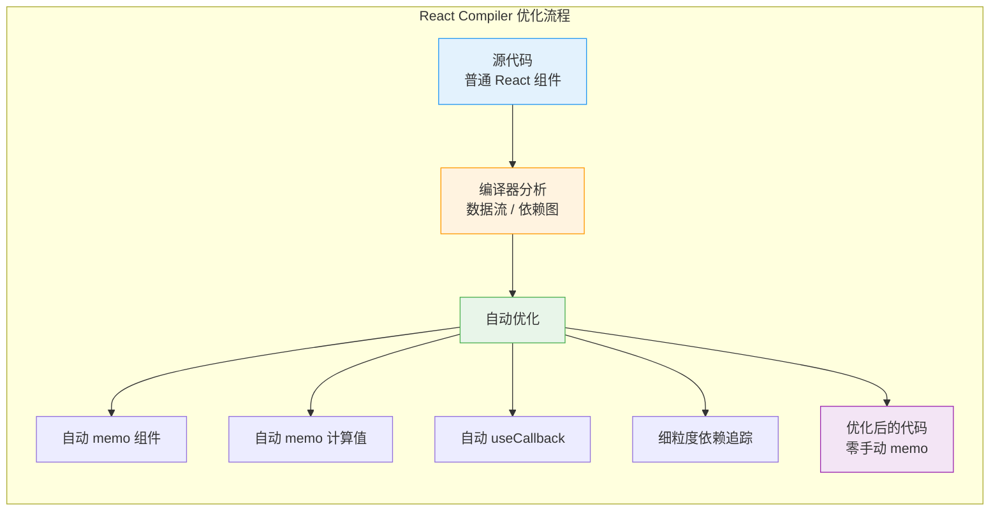
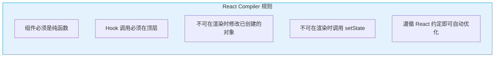
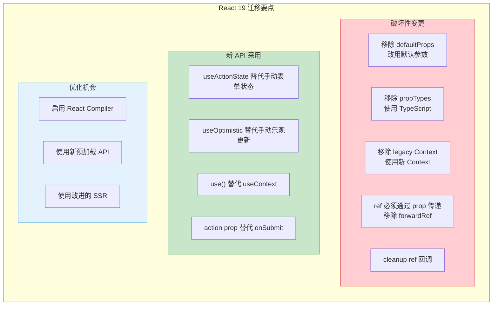

# React 19 新特性

React 19 是 React 的重大版本更新，引入了 Actions 数据模型、新的 Hook、编译器优化等革命性变化，重新定义了 React 应用的数据流和开发方式。

## React 19 新特性全景



## Actions 数据模型

### 传统表单处理 vs Actions



### useActionState

`useActionState` 是 React 19 中处理表单提交和状态管理的核心 Hook。

```tsx
import { useActionState } from 'react';

interface FormState {
  success?: boolean;
  error?: string;
  data?: { id: string; name: string };
}

// Action 函数 — 可以在服务端或客户端运行
async function addUserAction(
  prevState: FormState,
  formData: FormData
): Promise<FormState> {
  const name = formData.get('name') as string;
  const email = formData.get('email') as string;

  try {
    const user = await createUser({ name, email });
    return { success: true, data: user };
  } catch (err) {
    return { error: 'Failed to create user' };
  }
}

export function CreateUserForm() {
  const [state, formAction, isPending] = useActionState(addUserAction, {});

  return (
    <form action={formAction}>
      <input name="name" placeholder="Name" required />
      <input name="email" placeholder="Email" required />

      <button type="submit" disabled={isPending}>
        {isPending ? 'Creating...' : 'Create User'}
      </button>

      {state.error && <p className="error">{state.error}</p>}
      {state.success && <p className="success">Created: {state.data?.name}</p>}
    </form>
  );
}
```

### useActionState 执行流程



### useOptimistic

`useOptimistic` 实现乐观更新 — 在服务端响应前立即显示预期结果。

```tsx
import { useOptimistic, useTransition } from 'react';

interface Message {
  id: string;
  text: string;
  sending?: boolean;
}

export function MessageList({ messages }: { messages: Message[] }) {
  const [optimisticMessages, addOptimisticMessage] = useOptimistic(
    messages,
    (state, newMessage: string) => [
      ...state,
      {
        id: crypto.randomUUID(),
        text: newMessage,
        sending: true, // 标记为乐观状态
      },
    ]
  );

  const [isPending, startTransition] = useTransition();

  const handleSend = async (formData: FormData) => {
    const text = formData.get('message') as string;

    startTransition(async () => {
      // 立即显示消息（乐观更新）
      addOptimisticMessage(text);

      // 发送到服务端
      await sendMessage(text);
      // 服务端成功后，optimisticMessages 自动替换为真实数据
    });
  };

  return (
    <div>
      <ul>
        {optimisticMessages.map(msg => (
          <li
            key={msg.id}
            style={{ opacity: msg.sending ? 0.6 : 1 }}
          >
            {msg.text}
            {msg.sending && <span> (发送中...)</span>}
          </li>
        ))}
      </ul>

      <form action={handleSend}>
        <input name="message" placeholder="Type a message..." />
        <button type="submit" disabled={isPending}>Send</button>
      </form>
    </div>
  );
}
```

### useOptimistic 执行流程



### useFormStatus

`useFormStatus` 在表单组件内部获取表单提交状态。

```tsx
import { useFormStatus } from 'react-dom';

function SubmitButton() {
  // 必须在 <form> 内部的组件中使用
  const { pending, data, method, action } = useFormStatus();

  return (
    <button type="submit" disabled={pending}>
      {pending ? 'Submitting...' : 'Submit'}
    </button>
  );
}

function StatusDisplay() {
  const { pending, data } = useFormStatus();

  if (!data) return null;

  return (
    <p>
      {pending ? 'Processing...' : `Submitted: ${data.get('name')}`}
    </p>
  );
}

export function Form() {
  return (
    <form action={submitForm}>
      <input name="name" />
      <StatusDisplay />
      <SubmitButton />
    </form>
  );
}
```

## use() API

`use()` 是 React 19 引入的新 API，可以在渲染时读取 Promise 和 Context。

```tsx
import { use } from 'react';

// 读取 Promise — 配合 Suspense 使用
function UserProfile({ userPromise }: { userPromise: Promise<User> }) {
  const user = use(userPromise); // 如果未 resolve，触发 Suspense
  return <h1>{user.name}</h1>;
}

// 读取 Context — 可以在条件语句中使用
function ThemedButton() {
  const theme = use(ThemeContext); // 可以在 if/循环中调用
  return <button style={{ color: theme.primary }}>Click</button>;
}

// 父组件中传递 Promise
export function Page() {
  const userPromise = fetchUser(); // 创建 Promise

  return (
    <Suspense fallback={<Loading />}>
      <UserProfile userPromise={userPromise} />
    </Suspense>
  );
}
```

### use() vs useEffect 获取数据



## 新 Context API — Context as Provider

```tsx
import { createContext } from 'react';

// React 19: 直接使用 Context 作为 Provider
const ThemeContext = createContext('light');

function App() {
  return (
    // 不再需要 ThemeContext.Provider
    <ThemeContext value="dark">
      <ChildComponent />
    </ThemeContext>
  );
}

function ChildComponent() {
  const theme = use(ThemeContext); // 使用新 use() API
  return <div className={theme}>Content</div>;
}
```

## ref 回调清理函数

```tsx
// React 19: ref 回调可以返回清理函数
function TextInput() {
  return (
    <input
      ref={(node) => {
        // 挂载时：聚焦输入框
        if (node) {
          node.focus();
        }

        // 返回清理函数（卸载时执行）
        return () => {
          console.log('Input unmounted');
        };
      }}
    />
  );
}

// 对比 React 18 的方式（需要 useEffect）
function TextInputOld() {
  const ref = useRef<HTMLInputElement>(null);

  useEffect(() => {
    ref.current?.focus();
    return () => console.log('unmounted');
  }, []);

  return <input ref={ref} />;
}
```

## React Compiler

React Compiler（原 React Forget）是 React 19 生态中的革命性工具，自动优化组件重渲染。

### React Compiler 做了什么



### 编译器优化对比

```tsx
// ❌ 手动优化（React 18）
const ExpensiveComponent = memo(function ExpensiveComponent({ data, onAction }) {
  const sorted = useMemo(() => data.sort(compareFn), [data]);
  const handleClick = useCallback(() => onAction(data.id), [onAction, data.id]);

  return (
    <div onClick={handleClick}>
      {sorted.map(item => <Item key={item.id} {...item} />)}
    </div>
  );
});

// ✅ 自动优化（React Compiler）
// 编译器自动添加 memo、useMemo、useCallback
function ExpensiveComponent({ data, onAction }) {
  const sorted = data.sort(compareFn);
  const handleClick = () => onAction(data.id);

  return (
    <div onClick={handleClick}>
      {sorted.map(item => <Item key={item.id} {...item} />)}
    </div>
  );
}

// 编译器输出（简化）：
// - ExpensiveComponent 自动 memo
// - sorted 自动 useMemo
// - handleClick 自动 useCallback
// - 组件只在实际依赖变化时重渲染
```

### 编译器规则



## 改进的预加载 API

```tsx
// React 19 新增的资源预加载 API
import { prefetchDNS, preconnect, preload, preinit } from 'react-dom';

function Page() {
  // 预解析 DNS
  prefetchDNS('https://api.example.com');

  // 预建立连接
  preconnect('https://fonts.googleapis.com');

  // 预加载资源
  preload('/fonts/inter.woff2', { as: 'font', type: 'font/woff2' });
  preload('/hero.webp', { as: 'image' });

  // 预初始化（加载并执行）
  preinit('/scripts/analytics.js', { as: 'script' });

  return <div>...</div>;
}
```

## React 19 迁移清单



### forwardRef 的变化

```tsx
// React 18: 需要 forwardRef
const Input = forwardRef<HTMLInputElement, InputProps>((props, ref) => {
  return <input ref={ref} {...props} />;
});

// React 19: ref 作为普通 prop
function Input({ ref, ...props }: InputProps & { ref?: Ref<HTMLInputElement> }) {
  return <input ref={ref} {...props} />;
}
```

## 综合实战：React 19 表单

```tsx
'use client';

import { useActionState, useOptimistic, useFormStatus } from 'react';
import { submitComment } from './actions';

interface Comment {
  id: string;
  text: string;
  author: string;
  pending?: boolean;
}

function SubmitButton() {
  const { pending } = useFormStatus();
  return (
    <button type="submit" disabled={pending}>
      {pending ? 'Posting...' : 'Post Comment'}
    </button>
  );
}

export function CommentSection({ comments }: { comments: Comment[] }) {
  const [optimisticComments, addOptimisticComment] = useOptimistic(
    comments,
    (state, newComment: { text: string; author: string }) => [
      ...state,
      {
        id: crypto.randomUUID(),
        ...newComment,
        pending: true,
      },
    ]
  );

  const [state, formAction] = useActionState(
    async (prevState: any, formData: FormData) => {
      const text = formData.get('text') as string;
      const author = formData.get('author') as string;

      // 乐观更新
      addOptimisticComment({ text, author });

      try {
        await submitComment({ text, author });
        return { success: true };
      } catch {
        return { error: 'Failed to post comment' };
      }
    },
    {}
  );

  return (
    <div>
      <ul>
        {optimisticComments.map(comment => (
          <li key={comment.id} style={{ opacity: comment.pending ? 0.5 : 1 }}>
            <strong>{comment.author}</strong>: {comment.text}
          </li>
        ))}
      </ul>

      <form action={formAction}>
        <input name="author" placeholder="Your name" required />
        <textarea name="text" placeholder="Write a comment..." required />
        <SubmitButton />
      </form>

      {state.error && <p className="error">{state.error}</p>}
    </div>
  );
}
```

## 面试要点

1. **Actions 是什么？** — React 19 的数据变更模型，将异步操作（表单提交、数据变更）统一为 action 函数
2. **useActionState 和 useState 的区别？** — useActionState 接收 action 函数，自动管理 pending 状态和错误处理
3. **useOptimistic 的工作原理？** — 在 action 执行期间显示乐观状态，成功后替换为真实数据，失败后回滚
4. **React Compiler 的作用？** — 自动 memo 化组件和计算值，无需手动 useMemo/useCallback/memo
5. **use() API 的用途？** — 在渲染时读取 Promise（配合 Suspense）和 Context（可在条件中使用）
6. **React 19 为什么移除 forwardRef？** — ref 作为普通 prop 传递，简化了 API，减少了嵌套层级
7. **useFormStatus 的使用限制？** — 必须在 `<form>` 内部的子组件中调用，用于获取父表单的提交状态

---

> **相关章节**：[React Server Components](./server-components.md) | [Suspense 与并发模式](./suspense-concurrent.md)
